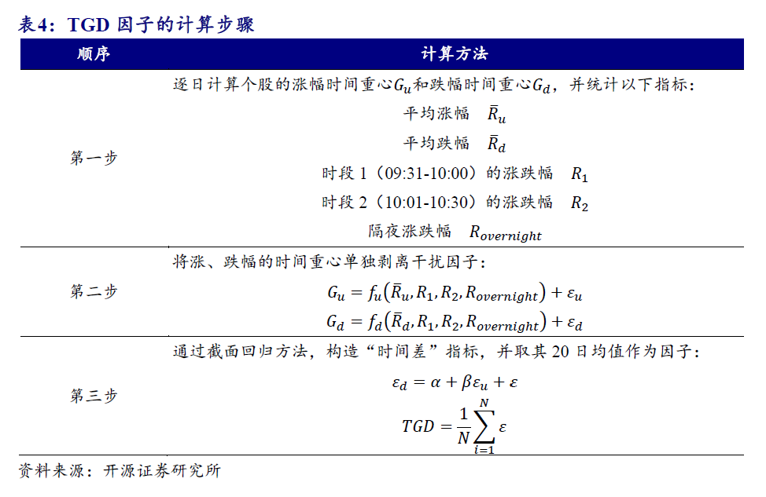

# Broker Report

## Alternative Data

- [开源金工 | 量化私募行为的蛛丝马迹：龙虎榜营业部的新视角](https://mp.weixin.qq.com/s/OZINfbw0R7swg0RYkjxHmw)

  - 通过筛选量化私募进入前十大流通股东的个股，并与季末对应有龙虎榜股票的营业部买入情况进行匹配。识别量化私募席位营业部。
  - 量化私募营业部异常净流入（出）具有正（负）向超额收益
- [开源金工 | 识别假外资：内地营业部与北上经纪商的共振](https://mp.weixin.qq.com/s/M7wcZGd_1Esn9pg8z26Csg)
- 北上经纪商托管数据+龙虎榜数据，识别北上券商和内地已经识别出的量化私募营业部的共振行为，识别假外资
- [开源金工 | 机构行为alpha的细分结构：龙虎榜、机构调研、大宗交易](https://mp.weixin.qq.com/s/ct3B77Pa_7ATgdXipli_dw)
  - 龙虎榜机构专用席位细分：单向上榜为不换手机构专用，双向上榜为换手机构专用

  - 不换手机构专用的alpha更强，不换手机构专用事件超额收益随净流入金额单调变化

  - 在不换手机构专用净流入样本中，随着机构持仓占比提升，超额收益逐渐增加。

  - 机构专用买卖席位数量衡量机构买卖强度，机构专用买卖数量能够很好的衡量机构买卖强度。
- [开源金工 | 机构调研个股的潜在超额收益](https://mp.weixin.qq.com/s/ct3B77Pa_7ATgdXipli_dw)

  - 机构调研事前超额收益显著，事后超额收益有一定幅度下滑，即机构调研的多是已经上涨的股票
  - 将机构调研事件作为conditioner，考察月内被调研的个股股票池，构造以下因子的多空组合表现良好
    - 根据上市公司财报数据和分析师一致预期数据构建的业绩超预期因子 SUE
- [华泰金工 | 利用文本和反转改进机构调研选股](https://mp.weixin.qq.com/s/G-mTLEd6WcOQ8RlSl6OKsg)
  - 有些情况下，可能是由于股价前期已出现上涨从而吸引了机构投资者的注意力，才会发生针对该股票的调研事件，此时股票的上涨预期已部分兑现，调研后是否会延续上涨存在较大不确定性。因此在发生机构调研的股票中，可能需要规避前期上涨过多的股票，而更多关注股价还在低位的股票。可以取过去60日收益率的相反数在机构调研股票池内构造反转因子。
- [开源金工 | 高频股东数据的隐含信息量](https://mp.weixin.qq.com/s?__biz=MzI1NTYxMjE1Mw==&mid=2247488808&idx=1&sn=0f0bca8380fb56d6e2187e2587ba904f)
  - 低频股东数据：用季报股东数的变化量做因子
  - 高频股东数据：用深交所互动易(irm.cninfo.com.cn)上股东数问答结果对季报股东数数据进行补充，选取回答比较频繁的几百家股票做universe，高频股东变化量因子效果更好
- [ 开源金工 | 扎堆效应的识别：以股东户数变动为例](https://mp.weixin.qq.com/s/ouDcV77WFHawYgvjroyggg)
  - 股东变动数因子效果不错
  - 人均持股占比在时序上的变动 (PerCapitaRatioChange 因子) 比股东变动数因子更稳健
- [开源金工 | 投资者结构与因子收益](https://mp.weixin.qq.com/s/4maNQUaNNjIuBbavcqJ_Sw)
  - 投资者结构可以作为一个condi，量价因子和基本面因子在不同group投资者比例中的IC均单调
  - 基本面因子：单季度营收同比、单季度营业利润同比、单季度净利润环比、分析师预期（SUE）
- UBS | Can we trade on company visits in China?
  - company visits attracts investor attention and positive money flow
  - can trade on these events or take as interactor
  - Wind Institution's Field Research Dataset
- UBS | Collaborative Intelligence: How to combine human and machine insights to generate alpha?
  - On short horizon, analyst view generate significant excess returns while does not load systematically on any quant factors. Therefore, we can aggregate analyst short term insights with quant factors.
  - How to do: long the intersection of top names from both quant factors and analyst views, and short the intersection of the bottom names.
- UBS | A Definitive Approach to Crowding
  - Comprehensive crowding factor using
    - Prime brokerage position data: long/short
    - 13F regulatory filings: long
    - Stock loan data: short
    - UBS internal data: short
- UBS | Collaborative Intelligence: Can Crowding data Enhance Alpha?
  - Combining the crowding data in **UBS | A Definitive Approach to Crowding** with quant factors using the approach in **UBS | Collaborative Intelligence: How to combine human and machine insights to generate alpha?**.
  - **Question**: if a stock is long crowded, this info can enhance alpha if the quant signal is also long, meaning that we should bet more, this is confirmed using backtest. However, from a risk model perspective, shouldn't we sell if a stock is long crowded to avoid excess risk?
- ExtractAlpha | Transcripts Model
  - Transcript data: Earnings Call, Conference, Investor Meeting, etc. 
    - Model1: Word embedding -> BERT -> Sentence sentiment -> company sentiment score
    - Model2: Word embedding -> Bag of Words -> Machine Learning predict return

  -  The Model has non-trivial correlation to common risk factors, but alpha still remains after removing its factor exposures
- ExtractAlpha | EPS and Revenues Prediction
  - A combination of the following three parts

  - Experts: 
    - proprietary metrics of individual analyst ability
    - a simple measure for the age of the estimate provided by the analyst
    - analyst expertise can differ across different items – for example, some analysts are better at estimating Revenues and worse at estimating EPS

  - Trend:
    - The company’s time series of prior earnings and revenue surprises contains valuable information on how efficiently the firm has been able to beat expectations in the past
    - The experience of a firm’s competitors is also important, as earnings surprises in a particular industry tend to cluster in time

  - Management:
    - the presence of recent management guidance
    - the stock’s historical beats and misses relative to guidance
    - the timing of earnings announcements and whether they are later than anticipated (Companies which are late in announcing, or which announces on days with high news volume, or near weekends and holidays, tend to miss their numbers)
    - the expectation of an earnings loss
    - and the variance of estimates
- [开源金工 | 雪球大V用户的选股行为alpha](https://mp.weixin.qq.com/s/yWXtqa9gR2Bfzchj16ktfA)
- [开源金工 | 雪球大V用户发帖行为深度挖掘](https://mp.weixin.qq.com/s/yQ0WMdJIZRJjvqyJpIlOJw)
  - 数据概览：
    - **用户基本信息：**超5成用户粉丝数量在2000以下，粉丝数量1万以上用户占比20%；未认证用户占57%，实名认证用户占31%，分析师、基金经理占4%。
    - **用户自选股：**雪球大V用户加入自选股样本数量多，月均数量约为2.5万个样本。自选股事件收益随用户粉丝数量单调增加，研究达人自选股事件收益优异。
    - **用户模拟组合**：雪球大V用户模拟组合调仓样本数量多，月均组合调仓样本数量约为2.1万次。研究达人模拟组合买入个股事件收益优异；模拟组合增仓买入幅度越大，事件收益越高。

  - **自选股事件组合**：选择粉丝1万以上的雪球大V用户，按照粉丝数量将自选股样本划分为三个样本：粉丝数量5万以上、粉丝数量2万-5万、粉丝数量1万-2万，并分别构建事件组合。从组合表现上看（图23、表6）：雪球大V用户自选股事件组合收益表现显著优于主要指数，不同粉丝数量的3个组合年化收益率分别为21.0%、17.8%、11.1%，粉丝数量与组合收益呈现正相关。
  - **模拟组合买入事件**：按照粉丝数量和用户类型等基本指标进行分类，并构建基本事件组合。整体收益表现一般。
  - **自选股事件组合改进**：选择自选股超额收益波动比（自选股超额收益均值/自选股超额收益标准差）指标来衡量用户的自选股潜在收益水平。我们使用自选股超额收益波动比指标，每期在横截面上排序，并根据用户自选股历史绩效，分别筛选出前20%前40%的样本，构建得到自选股绩效Top20%组合和自选股绩效Top40%组合。
  - **模拟组合买入事件组合改进**：选择模拟组合收益波动比（模拟组合年化收益/模拟组合年化波动率）指标来衡量用户的自选股潜在收益水平。我们使用模拟组合收益波动比指标，每期在横截面上排序，并根据用户模拟组合历史绩效，分别筛选出前20%前40%的样本，构建得到模拟组合绩效Top20%组合和模拟组合绩效Top40%组合。
  - **雪球大V用户发帖情感分析**
    - **多空关键词判断发帖多空情感**。“预增”、“扭亏为盈”、“低估”、“量价齐升”等30个看多个股的关键词，判断发帖情感效果优异，其中14个看多关键词样本事件收益超过2%，2个看多关键词样本事件收益超过3%。
    - **个股关注度影响发帖个股收益**。单只股票发帖样本事件收益0.9%，多只股票样本事件收益0.5%。发帖个股日内关注度上升，事件收益水平整体下降。日内关注1次样本事件收益为1.2%，10次以上关注样本事件收益降为负值。
    - **发帖情感分析：结合自选股与模拟组合行为**。发帖前用户曾将发帖个股加入自选的样本，事件收益提升至2.0%。发帖前用户曾调仓买入或增仓的个股样本，事件收益提升至2.8%。

## Event-driven

- UBS | Japanese shareholder return events: dividend revisions and buybacks
  - Feature
    - Capability: company's financial flexibility to further improve returns
    - Willingness: companies that have an established track record of shareholder returns
  - Buyback prediction
    - Months Since Last Event (Time, Willingness): This feature describes the number of months since the company's latest announced shareholder return event.
    - Event Net Count - 36 months (Event, Willingness): This is the number of shareholder return events over the last 3 years.
      ts over the lasty latest announced shareholder return
    - Net Debt / Equity (Balance Sheet, Capability): A company's leverage should play a strong role in dictating its capability to conduct future buybacks.
    - 12m Trailing Net Income (Profitability, Capability): The stronger net income a company reports, it increases the likelihood of an announcement.
    - Retained Earnings to Equity (Balance Sheet, Capability): The relationship between a company's retained earnings to equity and buyback probability exhibits strong downside skewness.
    - Price to Book 1-year Z-score (Valuation, Willingness): Price to book 1-year Z-score shows that companies that have seen their P/B valuation decline over the last year are more inclined to announce a buyback in the coming 6 months.
  - Dividend Guidance Revision prediction
    - Months Since Last Event (Time, Willingness)
    - Event Net Count - 36months (Event, Willingness)
    - Composite Momentum (Momentum, Willingness): Unlike buybacks, which are more associated with poor stock performance, this factor confirms what we see in our event window: dividend revisions are associated with strong stock price momentum. We believe that many companies may be more likely to announce a dividend boost following strong stock performance. Dividends are "stickier" than buybacks given the recurring nature and may require a higher bar of confidence from management.
    - EBIT Margin (Profitability, Capability): EBIT margins exhibit a positive, logarithmic-type relationship with dividend guidance revision probability.
    - Months Until Next Report (Time, Willingness): Similar to the Months Since Last Event factor, we find that the number of months until next reporting period displays a downward-sloping shape.
    - Sustainable Income (Quality, Capability): Similar to EBIT Margin, we find that Sustainable Income factor shows a skewed distribution in probability, with companies that have low Sustainable Income scores being extremely unlikely to hike dividend guidance.
    - Price to Book 3-year Z-score (Valuation, Willingness)
  - Buyback drift
    - EBIT Margin (Profitability, Capability): EBIT margin has a largely positive contribution towards indicating strong post buyback announcement drift.
    - Sales / EV (Valuation, Willingness): Generally, more expensive stocks based on Sales / EV see stronger likelihood of post-announcement drift. This may be due to higher quality (and therefore more expensive) stocks showing continued outperformance. That said, at the tail of the cheaper side (left-hand side), we also see a pick-up in likelihood. This may be due to re-rating of discounted stocks following a buyback announcement.
    - Distance to Default (Balance Sheet, Capability): Merton Distance to Default measure is helpful in assessing the quality of post-buyback drift.
    - Months Since Last Down Event (Time, Willingness): Post-announcement drift performance is strongly inversely related to the time since the last event announcement. There is a trade-off in identifying the most recent post-announcement targets relative to the size of the opportunity set.
    - Price Relative to 52-Week Low (Price, Willingness): Stocks that are closer to their 52-week lows historically show stronger post-announcement drift performance. we believe this may be due to more scope for positive re-rating following an announcement.
  - Dividend Guidance Revision drift
    - Dividend Yield (Valuation, Willingness)
    - EBIT Margin (Profitability, Capability): This may be related to ongoing expectations of future dividend strength (signalling effect).
    - Distance to Default (Balance Sheet, Capability): Since part of the drift phenomenon comes from the positive signalling value of an event (implying future events are more likely), investors may discount announcements from companies that are closer to financial distress.
    - Months Since Last Event (Time, Willingness)
    - Financial Statement Strength for Income Score (Quality, Capability): It shows a negative relationship with performance, which may be related to re-rating for weaker quality companies that announce a dividend and could represent a positive signaling effect.
    - Payout Ratio (Dividend, Willingness)

## Fundamental

- 业绩超预期因子

  - [开源金工 | 业绩超预期 Plus 组合的构建](https://mp.weixin.qq.com/s/mpoPRS8l-ZO5agisePLJxA)

  - [开源金工 | 盈利预期调整优选组合的构建](https://mp.weixin.qq.com/s/0zGmUywJjn_dGH9yeDt3gg)

  - [开源金工 | 业绩超预期Plus组合2.0：基于预期调整的修正](https://mp.weixin.qq.com/s/cjjW8D1If7E4nowrA5_OHQ)

  - 披露时间最早的业绩预告未来超额收益表现最好，其次是业绩快报，公布时间最靠后的定期报告未来超额收益水平最低。

  - 超预期股票池：

    - 业绩超预期的判断标准为:上市公司发布的财报数据超过了最新一期券商分析师对该公司一致预期归母净利润的均值。
    - 业绩超预期的计算：以Q3为例

    

  - 超预期股票池内进一步区分的因子

    - **SUE 因子在超预期股票池内的分组表现较好，其适合用来对超预期标的进行进一步的区分。**

    $$
    S U E=\frac{R_t-E_t}{\left.\sigma\left(R_t-E_t\right)\right)}
    $$

    其中 $$R_t$$ 表示财报披露的净利润水平, $$E_t$$ 表示预期的净利闰水平, $$\sigma\left(R_t-E_t\right)$$ 表示 预测偏差的波动率水平。

    - 对于业绩超预期个股，市场的表现也呈现出不同的模式，一种是业绩公布后股价反应并不强烈，表明当前股价已经提前反映了业绩超预期表现，其可能的解释是市场中总有一些知情交易者在交易;另一种是业绩公布后的次日股价发生向上跳空，表明业绩超出市场预期尚未被市场完全定价。**我们选取公告日前后一个交易 **$$[T-1, T+1]$$ **的超额收益之和构建超预期收益因子 OER(Over Expectation Return)**
    - 报告发布后的下一个交易日股价是否出现跳空现象。一般而言，股价跳空幅度越大，表明个股业绩超预期幅度越高。
    - 理想反转因子 [开源金工 | 长端动量2.0：长期、低换手、多头显著的量价因子](https://mp.weixin.qq.com/s?__biz=MzI1NTYxMjE1Mw==&mid=2247547796&idx=1&sn=99898719dc33b997ed06f53ad1eaa785&chksm=ea313e02dd46b714298b28246acfa296a74de58203c8d02b65d6672b33891aa746996a41ff04&cur_album_id=1428197421624180736&scene=190#rd)
    - 大单残差因子 [开源金工 | 大单与小单资金流的alpha能力](https://mp.weixin.qq.com/s?__biz=MzI1NTYxMjE1Mw==&mid=2247499023&idx=1&sn=24dbad4491cbe6be1452b86848d829ab)

  - 改进超预期股票池

    - 分析师行为：若为真正超预期股票，当其发布财报后，分析师往往会上调盈利预期以匹配真实盈利。
    - 交易行为：利用跳空因子和超预期收益OER因子进行区分

  - 盈利预期调整因子：

    - 盈利预测调整横截面标准差，即分歧度

    

    - 分析师盈利预期上调往往能够获得更大超额收益，且上调的分层效果比下调的效果更好。下调分层效果较差的原因即:时效性更低，上调报告间隔的时间要小于下调。

    - FYR_DISP 的改进

      - 按照时效性对于分析师预期进行半衰期加权
      - 股价跟随性：对于盈利预期调整而言，往往会受到前期市场涨跌的影响，比如当某只股票处于强势的上涨趋势中，分析师更大概率会积极上调盈利预测。**对于跟随市场涨跌的盈利预期调整而言，我们认为其跟风效应强、创新性不足，对于这类预测，我们赋予更低权重。**而那些与市场走势不同的观点可能更有参考价值。
      - 预测准确度：分析师打分

    - 分析师羊群效应：我们参照用于刻画交易羊群效应的CSAD指标，则对于股票i，t时刻的分析师的羊群效应因子为
      $$
      C S A D_{-} F R_{i, t}=\frac{1}{m} \sum_{j=1}^m\left|f r_{i, j, t}-f r_{i, c o n, t}\right|
      $$
      使用本月CSAD与过去N月 CSAD 均值进行比较, 定义羊群效应变动因子
      $$
      \Delta C S A D_{-} F R_{i, t}=\left(C S A D_{-} F R_{i, t}-\frac{1}{N} \sum_{k=0}^{N-1} C S A D_{-} F R_{i, t-k}\right) /\left(\frac{1}{N} \sum_{k=0}^{N-1} C S A D_{-} F R_{i, t-k}\right)
      $$
      在盈利预期上调的样本池中，$$\Delta C S A D_{FR}$$ 呈现明显的正向选 股能力，而在盈利预期下调的样本池中，$$\Delta C S A D_{FR}$$呈现明显的负向选股能力。

- MS Research | Dividend Stock Ideas

  - Two aspects to predict future dividend:
    - Dividend Policy Resilience: low payout ratio, high dividend growth consistency in the past five years, high free cash flow yield
    - Balance Sheet Strength: high earnings stability, low accruals, low leverage, no major consensus EPS downgrades.

- UBS Research | What Information is in Analyst Upside Rankings?

  - analyst top upside stock/top downside stock, long-short

- UBS Research | How to pick stocks using quantamental signals?

  - CTA momentum
    - EMA + MACD type score, normalized by 1-year rolling volatility
    - stock, industry/sector aggregation

  - Regime probability
    - break the OECD CLI index into four states, predict state probability + stock historic performance in each state
    - stock, industry/sector aggregation

  - Crowding; EPS growth (ML vs Consensus); Extreme bond rate momentum (CTA on 10-year treasury yield); Risk targeting; Up/Down Volatility; Options volumes; Adjusted Forward PE ratio; Sector PMI (New orders); Earnings revisions

## Linkage

- [DB Research | The Logistic of Supply Chain Alpha](https://www.longfinance.net/programmes/sustainable-futures/london-accord/reports/the-logistics-of-supply-chain-alpha/)

  - **Supply chain networks is Incomplete**: It tends to have a bias toward larger-cap companies as they are less apt to protect such information, and also because they are under constant market scrutiny.

  - **FactSet data**: According to SEC’s Statement of Financial Accounting Standards No. 14 (SFAS 14), “if 10% or more of the revenue of an enterprise is derived from sales to any single customer, that fact and the amount of revenue from each such customer shall be disclosed” in interim financial reports issued to shareholders. However, 10% is a very high threshold, and the majority of supply chains do not exceed that threshold. A better and more complete picture of the actual supply chain network can be obtained using relationships without the actual sales. For those relationships, FactSet captures them from much wider sources, e.g., companies’ conference call transcripts, capital market presentations, company press releases, company websites, etc.

  - **Industry Bias**: most supplier companies are related to manufacturing, and most customer companies are related to manufacturing and logistics. We need to account for this natural industry bias.

  - **Voluntary Disclosure and Data Asymmetry:** the subject companies can choose whichever supply chain partners they desire to disclose. For example, managers may want to disclose a reliable, large and well-known customer in order to send a positive signal to the capital market.

  - Alphas:
    - Return momentum: one, six or twelve-month return with equal/sales weighted/COGS weighted/BV weighted/market cap weighted supplier and customer relationships.

    - Fundamental flow: a company’s suppliers ROE (return on equity), ROA (return on assets), earnings yield and gross profit margin to test if these metrics can predict the company’s share price performance. **Companies whose customers have higher profit margins underperform those firms with less profitable customers. This is fairly intuitive because if a company’s customers are fairly profitable with high gross margins, this would entail that its customers have superior pricing power, as opposed to the subject company**

    - Link interactions: Number of total/inward/outward degrees (can be normalized by Sales/COGS/Market Cap/BV etc.)

    -  Social networks factors
      - Bridge/chokepoints: These companies play a central role in the supply chain, i.e., if they were to be removed from the network, the average length between suppliers and customers would be greatly increased. 

      - Core and Periphery: the cores can reach every other company on the graph within the minimum number of links. The opposite of the core is the periphery.

- Fund 13F linkage

  - [开源金工 | 从基金持仓行为到股票关联网络](https://mp.weixin.qq.com/s/LToZyqOselgySavoxIvFIQ)

    - 数据范围：所有公募基金持仓，基金持仓数据选取基金季报披露的前十大持仓数据，将各季度所有公募基金权益持仓前十大股票汇总去重得到基金持仓股票池。
    - **关联度指标构建方式**：
      - 分别取A基金最新季报，取共同持有的股票a与股票b持仓市值数据，记作$$H_a$$、$$H_b$$；
      - 计算股票a过去20个交易日成交额均值 ，记作$$AMT_a$$，股票b记作$$AMT_b$$；
      - 计算$$H_a / AMT_a$$，作为股票a的机构拥挤度，记作$$I_a$$，股票b记作$$I_b$$；
      - 定义A基金共同持仓股票a与股票b的关联度指标为：$$J_{ab}=\min(I_a，I_b)$$；
      - 将所有共同持仓股票a与股票b的基金得到的关联度指标求和，得到股票a与股票b的关联度指标$$K_{ab}$$

    

  - [开源金工 | 北向关联持仓中的Alpha](https://mp.weixin.qq.com/s/Y1I_Clyeg0G1DH5MexgThQ)

    - 类似的，可以用北上数据进行类似的关联度计算，可以使用市值替代20日成交额均值。如果网络过于稠密，可以通过设置threshold 或者取top N% linkage的方式稀疏化网络。

- [开源金工 | 从小单资金流行为到股票关联网络](https://mp.weixin.qq.com/s/mdXxUMeiTbJIrTvDyTIUPA)

  -  根据每日小单净流入/净流出数据，计算过去N交易日小单同向比例，构造关联度指标。
  -  优化：
    - 稀疏网络
    - 平滑处理
    - 考虑规模协同：N日daily flow vector的 cosine distance

- [华泰金工 | 深挖分析师共同覆盖中的关联因子](https://mp.weixin.qq.com/s/1pQF-vUz-LW3_veEpiANSA)

- [华泰金工 | 分析师共同覆盖因子和图神经网络](https://mp.weixin.qq.com/s/8rFJDL7yCAsqENDllDzSVQ)

  - 分析师共同覆盖间接关联可对直接关联信息进行补充，具有较大挖掘潜力

    - 间接关联计算
      $$
      \mathrm{m}_{\mathrm{ij}}=\sum_{\mathrm{k}=1}^{\mathrm{N}} \log \left(\mathrm{n}_{\mathrm{ik}}+1\right) \times \log \left(\mathrm{n}_{\mathrm{kj}}+1\right)
      $$
      其中, $$m_{ij}$$ 表示公司 i 和公司 j 的间接关联强度 $$(i \neq j) ， N$$ 表示所有的上市公司数量, $$n_{ik}$$表示公司 i 和公司 k 之间共同覆盖的分析师数量。

    - Ali and Hirshleifer (2019)从三个方面讨论了间接关联可能产生的效应：

      - 间接关联较为隐蔽，不容易被投资者察觉，并且间接关联的数量远超直接关联，想要完全覆盖和利用间接关联公司的信息也存在困难，这意味着间接关联具有较大的挖掘潜力。
      - 对于那些分析师覆盖数量较少(或直接关联较少)的公司，间接关联造成的股价领先滞后效应可能会更显著。
      - 间接关联经过多层连接，其领先滞后效应有所衰减，可能不如直接关联那么显著。

    - 如果一家公司有很多直接关联公司，市场难以迅速整合所有关联公司的信息，这种情况下直接关联具有显著的领先滞后效应，而间接关联效果较弱。相反，如果一家公司的直接关联公司很少，那么信息传播效率较高，直接关联公司的信息会快速反映到股价上，此时进一步挖掘间接关联信息可能更有效。因此，我们可以对间接关联强度加以改进
      $$
      \begin{gathered}
      \mathrm{m}_{\mathrm{ij}}=\sum_{\mathrm{k}=1}^{\mathrm{N}} \log \left(\mathrm{n}_{\mathrm{ik}}+1\right) \times \log \left(\mathrm{n}_{\mathrm{kj}}+1\right) \\
      \mathrm{m}_{\mathrm{ij}}=\frac{\mathrm{m}_{\mathrm{ij}}}{\log \left(\mathrm{num}_{\mathrm{i}}+1\right)}
      \end{gathered}
      $$

  - 间接关联和多层关联改进反转因子：在考虑股票自身反转效应的基础上，进一步考虑与之直接关联股票的动量效应，即前期自身跌幅较大，但关联股票涨幅较大的股票，因子取值较大

  - 基于关联事件驱动的逻辑，可利用分析师共同覆盖改进事件因子。股票市场中，A公司发生事件，可能会沿着关联关系将事件的影响传导到其关联的公司，从而对关联公司的股价产生影响

- [兴业金工 | 弱关联关系下的特异性Alpha因子挖掘](https://mp.weixin.qq.com/s/LdY-D0OuhVV2dBNcaG2Pdg)

  - 相似矩阵探索：
    - 对相似矩阵尾部进行降噪，去掉尾部低相似性的pair，以提升因子的纯度
    - 直接利用相似矩阵构造因子 (行相加？)

- [兴业金工 | 基于专利分类的科技动量因子选股研究](https://finance.sina.com.cn/stock/hyyj/2019-06-26/doc-ihytcitk7704952.shtml)

  - 专利数据库 -> 构造专利选股因子
  - 专利分类 -> 公司专利向量 -> Linkage 科技关联度 -> 信号

- [兴业金工 | 产业链视角下的Alpha传导研究](https://mp.weixin.qq.com/s/nSgeTbVuBtsALxcSYPrcYw)

  - 产业链数据可将上市公司财报中数以万计的产品标准化为超千个产品节点，并细分为多个不同的层级。除了最高等级和最低等级之外，每个产品节点均有其对应的父层级（上一层级）与子层级（下一层级）
  - 可以根据上游->下游 关系图；下游->上游关系图；上游 <-> 下游关系图 分别构造Linkage alpha
  - 产业链优势地位因子：对于不同的上市公司而言，其主营产品所关联的产品（如上游产品）个数的多少，或许可以度量其在产业链中风险的高低。在跨行业贸易网络中，处于更中心地位的行业比不处于中心地位的行业更容易获得更高的股票收益；同时，中心行业的股票市场风险更大，因为它们更容易受到其他行业冲击的影响

- [兴业金工 | 基本面量化 家电行业景气度模型构建](https://mp.weixin.qq.com/s/6EIQ_7VGJIDpld-pAUb1zg)

- [开源金工 | 从隔夜价格行为到股票关联网络](https://mp.weixin.qq.com/s/Bg6B-c0tORyqi22nRlP1hA)

  - 隔夜价格因子构建

    

  - 将股票开盘价与昨天收盘价对比，可将隔夜价格形态分为隔夜高开、隔夜低开与隔夜平开三种。其中，将股票开盘价与昨天最高价对比，可进一步将隔夜高开分为隔夜跳空高开与隔夜非跳空高开；将股票开盘价与昨天最低价对比，可进一步将隔夜低开分为隔夜跳空低开与隔夜非跳空低开。A股市场中，“缺口回补”现象较为普遍。考虑到本文构建关联网络的前提假设在于隔夜涨跌反映隔夜信息，若当天高低开主要受昨天的跳空缺口影响而非隔夜信息，则应剔除此类隔夜涨跌幅，从而提纯隔夜涨跌样本。因此，在过去80个交易日的隔夜涨跌幅样本中，我们剔除昨天形成向上跳空缺口而今天低开的样本点，以及剔除昨天形成向下跳空缺口而今天高开的样本点，从而剔除非隔夜信息主导的隔夜涨跌样本，对Traction_OR因子进行有效增强，构建Traction_ORE因子。

## Machine Learning

- [华泰金工 | 人工智能选股之特征选择](https://mp.weixin.qq.com/s/p4VutHWsqKMk_65YPCWouw)

  - 单变量特征选择：有监督 可以根据FDR选择

- [华泰金工 | 人工智能选股之损失函数的改进](https://mp.weixin.qq.com/s/22rJ0xRGhGlIlSR3U0feLA)

  - 加权损失函数更加适合样本不均衡的分类问题
  - 广义损失函数能降低机器学习模型的换手率 (punish $$T+1$$ 期预测值和$$T$$ 期预测值的差)
  - XgBoost/LGBM 上自定义损失函数：定义梯度和hessian

- [华泰金工 | 基于遗传规划的选股因子挖掘](https://mp.weixin.qq.com/s/KaGBU_adFl6VrqkG8GundA)

  - 遗传规划：公式的表示方式 - > 适应度定义 -> 公式的进化方法
  - gplearn改进：定义多种时间序列算子；对待挖掘因子进行传统风格因子中性化

- [华泰金工 | 再探基于遗传规划的选股因子挖掘](https://mp.weixin.qq.com/s/PV-A26tH79ua4watVI2wzA)

  - 非线性因子：三次方回归残差法 (regress X^3 on X, take residual, similar to Barra SizeNL factor construction)
  - 多项式拟合法构造因子

- [华泰金工 | 基于遗传规划的一致预期因子](https://mp.weixin.qq.com/s/Ea0woJPw1Nn0TRL5VErBng)

  - 设计了一个三位数据结构来存储一致预期数据：第一维是股票，第二维是交易日，第三维是预测年份。该数据结构具有以下优点：
    - 解决了年度财务报表公布前后一致预期数据预测年份变动的问题。 
    - 适配了遗传规划中的矩阵运算算法，算法可在三维数据结构上快速运算得出因子值使得短时间内进行

- [华泰金工 | AlphaNet：因子挖掘神经网络](https://mp.weixin.qq.com/s/NWghDHfqKPTzenDzxnMuGw)

  - 个股量价数据图片 -> 特征提取 时间序列“卷积”算子 -> pooling -> fully connected -> target

- [华泰金工 | 再探AlphaNet：结构和特征优化](https://mp.weixin.qq.com/s/PtVvBTw1qfYfd35Ec1X6ag)

  - 增加一些比率特征，双层特征提取层 (不同lookback window)，增加LSTM/GRU结构

- [华泰金工 | AlphaNet改进：结构和损失函数](https://mp.weixin.qq.com/s/JabWT9xwdmVs8dL8ns9fWg)

  - 自定义Dropout加在二元时间序列操作上，减少计算二元组合数量

- [华泰金工 | 舆情因子和 BERT 情感分类模型](https://mp.weixin.qq.com/s/TMRYqMnBr_be5ZhpDXvdvg)

  - 基于金融新闻的舆情因子：wind部分新闻数据是有标注正面负面的
  - BERT句头的 [CLS] 起始符 embedding 用于储存和分类有关的信息，在上面接小网络softmax 分类1/0，微调BERT
  - 用正面新闻数 - 负面新闻数/总数，再在window内做decay构造舆情因子

- [华泰金工 | 基于 BERT 的分析师研报情感因子](https://mp.weixin.qq.com/s/brVT1tkfr3p_Ll3q4_81jw)

  - 研报评分因子：朝阳永续整理的研报评级 （卖出、减持、中性、增持、买入）
  - 研报数量因子
  - 研报情感因子：BERT + 微调 + 分类 + decay
  - 研报情感调整因子：分析师正面研报更多，给负面研报更大权重

- [华泰金工 | 因子观点融入机器学习](https://mp.weixin.qq.com/s/cMLqAua01HLqLSQEkzwnjA)

  - 随机森林模型改进：修改XgBoost 使得可指定优先分裂的因子，前K层只用某类因子，这样使得最后训练得到的model更接近这类因子的风格。

  - 思考：前K层指定用interactor/conditioner

- [华泰金工 | 文本 PEAD 选股策略](https://mp.weixin.qq.com/s/Jk9Mter9gyjU8yddc2Q-Kw)

  - 盈余后价格漂移效应(PEAD)：市场反应不足
  - 传统 SUE 因子基于公告财务数据来衡量 PEAD 效应并预测股票的异常收益
  - 本文使用的公告为业绩预告，相关文本为**分析师点评业绩预告研报文本标题 和摘要**
  - SUE.txt 使用纯文本，高频词构建标题和摘要词频向量，然后接XGBoost等模型进行预测，将模型预测的上涨和下跌类别的 log-odds 值之差，在进行指数衰减后，作为最终的 SUE.txt 因子。

- [华泰金工 | 文本FADT选股](https://mp.weixin.qq.com/s/GwJV5kBMctpmkevVg6Ci0A)

  - 对分析师**盈利预测调整**研报文本进行挖掘，找出对股价有重要影响的“催化剂”事件，通过分析师盈利预测及评级调整等间接的方式可以对“催化剂”事件进行分析，对盈利预测调整的文本进行识别，找出分析师情感偏正向的调整事件。
  - 文本 -> 分词 -> 词频向量 -> XGBoost 预测上涨下跌概率
  - 该因子与系列51 SUE_txt 因子相关性较高，但是residualize之后还有比较好的多头ic
  - **无论是业绩发布还是盈利预测调整，我们所选择的都是个股发生了较为明显边际变化的场景，而没有选择全部研究报告。前者带来的增量信息使得点评研报信噪比较高；后者并不一定具有增量信息因而部分研报信噪比较低**

- [华泰金工 | 再探文本FADT选股](https://mp.weixin.qq.com/s/GwJV5kBMctpmkevVg6Ci0A)

  - 熵简科技FinBERT：一款在大规模金融领域语料上预训练的中文BERT模型（https://github.com/valuesimplex/FinBERT）。
  - FinBERT采用的预训练语料主要包括金融财经类新闻、研报或上市公司公告、金融类百科词条，经预处理之后得到约30亿Tokens
    - 金融财经类新闻：从公开渠道采集的最近十年的金融财经类新闻资讯，约100万篇
    - 研报/上市公司公告：从公开渠道收集的各类研报和公司公告，来自500多家境内外研究机构，涉及9000家上市公司，包含150多种不同类型的研报，共约200万篇
    - 金融类百科词条：从Wiki等渠道收集的金融类中文百科词条，约100万条。
  - FinBERT进行了以下预训练任务：
    - Financial Whole Word Mask：随机遮住部分字词，让模型预测。这里进一步采用了全词Mask的方法，即对组成同一个词语的汉字全部进行Mask，从而使模型学习到领域内的先验知识，例如金融学概念之间的相关性等
    - Next Sentence Prediction：引入预测下一句的任务，使模型理解句子间的关系。
    - 研报行业分类：利用公司点评、行业点评类的研报自动生成了大量带有行业标签的语料，并构建了行业分类的文档级有监督任务。每个行业拥有5k~20k条语料，共计约40万条文档级语料。
    - 财经新闻的金融实体识别：利用已有的企业工商信息库和公开可查的上市公司董监高信息，基于金融财经新闻构建了命名实体识别类的有监督任务语料，共计约50万条。
  - 在FinBERT基础上进行微调，采用了2019年发表于机器学习顶级会议ICML的adapter-BERT（http://proceedings.mlr.press/v97/houlsby19a.html），在几乎不影响模型性能的情况下，将需要微调的参数减少到约三百万。
  - 预训练好的BERT不进行特定场景的微调操作，其CLS层难以对整段文本进行向量编码，这是因为BERT在训练时的两个任务MLM和NSP都不是为了对句子进行编码而设计的，CLS蕴含的信息不一定是充分的文本上下文信息，常规做法是会对BERT进行微调。此处使用带情感标注的万得新闻舆情数据对FinBERT进行微调，使得CLS层能更好地表征文本上下文信息。

- [中金金工 | 如何优化新闻文本因子](https://mp.weixin.qq.com/s/AQMQBNbEE8yG8fAIj0En0Q)

  - 数库科技新闻四级分类
  - 选取非噪音+有信息增量的新闻
  - 计入预期 sentiment signal / (sign align sentiment & ret mom) * ( 1 + prev 1 month return)
  - 行业level聚合

- MS Research | How LLMs can Boost Earnings Call Signals

  - Use LLM to label each earnings call paragraph as relevant or irrelevant, then generate sentiment score only on relevant paragraphs

- [华泰金工 | 九坤Kaggle量化大赛有哪些启示？](https://mp.weixin.qq.com/s/VKLWLJMy6xg38oddvTO2pQ)

  - 特征工程引入均值因子对神经网络有效；

  - CCC损失优于MSE损失和IC损失；

    - IC loss: 不受量纲影响从而在模型间可比。缺点是非凸不保证收敛，可能导致训练不稳定。

    - MSE loss: 优点是易于计算和求导，具有凸性从而保证收敛，缺点是受数据量纲影响。

    - 一致性相关系数CCC loss:
      $$
      CCC = \frac{2 \sigma_{x y}}{M S E+2 \sigma_{x y}}
      $$

  - 时序交叉验证作用不明显；

  - 集成神经网络和决策树类模型提升较稳定

- Citi Research | From Machine Learning to Stock Screens: a Rulefit Model

  - 提出解释性更好的随机森林模型：将叶节点的分拆当做dummy variable，总结随机森林的全部dummy variable 进行再一次lasso regression

- [华泰金工 | 新闻舆情分析的HAN网络选股](https://mp.weixin.qq.com/s/5AGgGpTNol9qDItU20zZPQ)

  - word-to-vec -> 词语注意力，加权平均到每条新闻level -> 新闻注意力，加权平均到每天每只股票level -> 新闻时间序列做bi-directional GRU -> 隐藏层注意力加权平均 -> MLP -> signal

- [华泰金工 | 图神经网络选股与Qlib实践](https://mp.weixin.qq.com/s/w5fDB6oAv9dO6vlhf1kmhA)

  - GraphSAGE sample neighbour: 对第k层的每个节点固定采样数量为S_k, 当neighbour数量小于S_k时，采取有放回抽样，否则就无放回抽样

- [华泰金工 | 注意力机制应用于量化选股的多类场景](https://mp.weixin.qq.com/s/DdY3NnuTm7fN_3YEsf3yIQ)

- [华泰金工 | 量化如何追求模糊的正确：有序回归](https://mp.weixin.qq.com/s/k_vXrrZzgZJe4YakVCB7KQ)

- MS Research | Systematic Stock and Sector Selection using Text Sentiment

  - Filter news that are related to detected events associated with earnings, revenues, and dividends. Focus on those news that provide factual/guiding information.
  - Consider sentiment change signals: short-term - long-term average

- [开源金工 | 遗传算法赋能交易行为因子](https://mp.weixin.qq.com/s/RNibl2W1CjK4tr7KlMWBbw)

  - 算子定义

    

  - 因子的精细化讨论

    - 主动超大单强度而言，我们可以发现其5分组年化收益并不单调，而且还是负IC，其也说明在拆单现象存在的基础下，对于某只股票而言，划分过于极端的超大单的买卖强度并不能直接代表机构看好程度。
    - 小单切割是解锁主动超大单强度的正确方式。由于拆单现象的存在，小单中充斥着超大单的拆单产物，当机构看好某只股票时，其往往会以小单进货，再用具备足够市场关注度的超大单来抬升市场情绪，从而达到抬升股价收获利润的目的，所以在小单强度较高处的超大单强度有正向选股效果；相反，若机构不看好某只股票时，其往往会以小单出货，为了防止市场恐慌，机构往往会用超大单来稳住情绪来完成平稳出货，所以在小单强度较低处的超大单强度有负向选股效果

- [华泰金工 | 基于全频段量价特征的选股模型](https://mp.weixin.qq.com/s/qCDaqHSpS_ABiaatW0FC2Q)

  - 低频多任务学习模型 + 参数共享网络

    

- [华泰金工 | 自适应网络：从削足适履到量体裁衣](https://mp.weixin.qq.com/s/UBLTFwS3fakXCmv2MPucqQ)

- [兴业金工 | 机器学习模型在交易限制下能否有效预测股票收益？](https://mp.weixin.qq.com/s/5jkoOpYKxK9-3KclSWTXPA)
  - 在投资者情绪高涨、市场波动性大和市场流动性低的时期， 基于机器学习信号的投资策略（跨所有股票）的盈利能力要高得多。
  - 深度学习信号为选股而非行业轮动提供了信息。这与识别难以套利股票的错误定价的机器学习信号是一致的
  - 机器学习策略的多头股票通常是小盘、价值、流动性差的股票，以及价格低、贝塔系数低、过去一个月收益率低（短期输家）、11 个月回报率高（中期赢家）、资产增长率低、股票发行量低、经营业绩高、信用评级覆盖率低、分析师覆盖率低、盈余惊喜高的股票。

- [华泰金工 | 如何捕捉长时间序列量价数据的规律](https://mp.weixin.qq.com/s/Jyzrf_lyuriq9TduwKjYcQ)

  

  

- MS Research | Insights from Using NLP on Corporate Disclosures
  - Risk Factor section of 10-K and 10-Q filings. Quantify cosine similarity or Jaccard Index over time.

## Macro

- MS Research | Navigating Systematic Alpha in Japan and Trade Implementation

  - USD/JPY and US Treasury Bond yields are the top two global macro that track Value & Growth rotation in Japan.
  - JPY OIS rate is signal to classify market expectation on the outlook of Japan government bond yields.
  - JP equities are dominated by price reversal factor over long term, but momentum factor is strong in pre-dividend seasons: March and September. Long momentum in Mar. and Sep. and Short in Apr. and Oct.
  - Avoiding dividend cut is top priority for all investors in JP equities; historical buyback tracking record is a simple and relevant signal to predict future outperformance.
  - JP companies with past share buybacks tend to keep outperforming market despite a buyback suspension in the future.
  - Statistical arbitrary alpha is the most profitable in JP via weekly or daily rebalancing.

  

## Momentum & Reversal

- 动量因子

  - [开源金工 | A股市场中如何构造动量因子？](https://mp.weixin.qq.com/s/vx9YWJ5-exUymp1w5Sb9qA) 
  - [开源金工 | 长端动量2.0：长期、低换手、多头显著的量价因子](https://mp.weixin.qq.com/s?__biz=MzI1NTYxMjE1Mw==&mid=2247547796&idx=1&sn=99898719dc33b997ed06f53ad1eaa785&chksm=ea313e02dd46b714298b28246acfa296a74de58203c8d02b65d6672b33891aa746996a41ff04&cur_album_id=1428197421624180736&scene=190#rd)
    - A股动量因子效果不好，因为存在比较显著的反转效应，传统改进方式：$$Ret_{t \, month} - Ret_{t-1 \, month} $$
    - 对动量因子按照振幅进行切割：高振幅区域存在反转效应，低振幅区域存在动量效应。
      - **切割指标：**振幅选用（最高价-最低价）/前收盘价的定义方式；
      - **切割对象：**个股alpha收益（股票日收益-市场日收益均值）。股票日收益受市场beta影响，在横截面对比时，若股票日收益对应时点一致，则市场beta不影响股票间相对排序，若股票日收益对应时点不一致，则两股票日收益时点重合度越低，市场beta对股票间相对排序影响越大；
      - **计算方式**：计算最近N日股票振幅，和每日idiosyncratic return，将振幅低的N/2交易日涨跌幅相加得到低振幅动量因子。
      - **中性化**: 将动量因子orthogonal 20日反转因子

- 反转因子

  - [开源金工 | A股反转之力的微观来源](https://mp.weixin.qq.com/s/Z4GsSj0kGM5mXxZnl1xs3g)
  - [开源金工 | 理想反转因子的四年总结](https://mp.weixin.qq.com/s/PnAvQL5gKT3r-qMSdoXZbg)
  - 理想反转因子的底层逻辑：大单成交。当日单笔成交额越高，涨跌幅反转效应越强 ；当日单笔成交额越低，涨跌幅动量效应越强。
  - 计算方法：
    - 对选定股票，回溯取其过去 20日的数据
    - 计算该股票每日的平均单笔成交额（成交额 /成交笔数），记作TS
    - TS高的 10个交易日，涨跌幅加总，记作 $$M_{high}$$
    - TS低的 10个交易日，涨跌幅加总，记作 $$M_{low}$$
    - 理想反转因子 $$M = M_{high} - M_{low}$$
  - 改进：
    - TS计算：用日内逐笔成交额分布的13/16分位
    - TS计算：原始TS的一阶差分
    - 理想反转因子计算：20日涨跌幅用TS进行加权平均
    - 理想反转因子计算：20日涨跌幅序列和20日TS序列的相关性

- [开源金工 | 日内极端收益前后的反转特性与因子构建](https://mp.weixin.qq.com/s/lAFPZTEZJe6E-_ncer0LPg)

  - 计算方法：

    - 日内1分钟收益率序列
    - 计算 S = | ret - median(ret) |
    - 取最极端收益率的S和其前一分钟的S，分别排序相加
    - 取过去20日平均

  - 变种：top 10 最大S的分钟收益率+前一分钟S的排序相加

    

- [开源金工 | APM因子模型的进阶版](https://mp.weixin.qq.com/s/XL7oawd4EwRpl5we4T3oPw)

  - 原始APM因子计算：20日上午、下午市场中性/Barra中性return累计值的差的t-statstics 再residualize 动量因子

    

  - 改进：用20日隔夜市场中性/Barra中性return累计值替代上午收益。

- [开源金工 | 日内分钟收益率的时序特征](https://mp.weixin.qq.com/s/Mk_DPiWAiCw_5OeYYS0uQg)

  - 计算方式：

    

    

- [石川量化 | 美股上一个跨越时间尺度的趋势因子](https://zhuanlan.zhihu.com/p/51043407)

  - [Han, Y., Zhou, G., Y. Zhu (2016 JFE). A trend factor: any economic gains from using information over investment horizons?](https://papers.ssrn.com/sol3/papers.cfm?abstract_id=2182667)

  - 首先在每个月 t 的最后一个交易日（月频）计算每支股票（用 j 表示）在不同时间尺度 L 的移动平均：
    $$
    A_{jt,L} = \text{last L day return for stock j on time t}
    $$

  - 在每期使用股票最新的移动平均指标和下一期的收益率进行截面回归，得到这些移动均线因子的收益率
    $$
    r_{j, t}=\beta_{0, t}+\sum_i \beta_{i, t} A_{j t-1, L_i}+\epsilon_{j, t}, \quad j=1, \cdots, n.
    $$

  - 时序上取过去12个月的均值来预测下一个选股窗口内各均线因子的预期收益率
    $$
    \mathrm{E}_t\left[\beta_{i, t+1}\right]=\frac{1}{12} \sum_{m=1}^{12} \beta_{i, t+1-m}.
    $$

  - 最终，使用对 $$t + 1$$ 的均线预期收益率 $$\mathrm{E}_t\left[\beta_{i, t+1}\right]$$ 和个股 j 在 t 期的最新均线指标取值就可以计算出每支股票在 $$t + 1$$ 的收益率预测，并以此对股票排序构建趋势因子
    $$
    \mathrm{E}\left[r_{j, t+1}\right]=\sum_i \mathrm{E}_t\left[\beta_{i, t+1}\right] A_{j t, L_i}.
    $$

- [华泰金工 | A股市场及行业的农历月份效应](https://mp.weixin.qq.com/s/_m30IkGwBpvanixIZrmOzA)

  - 前期报告：华泰金工 | A股市场及行业的月份效应
  - A股市场存在明显的农历月份效应，农历1月上涨、农历5月下跌比较显著，报告特别统计了腊月十八到正月十八这一时间段内各个指数的平均收益和显著性p值，结果表明春节前后各大指数显著上涨。

- [开源金工 | 从涨跌停效应到行业反转](https://mp.weixin.qq.com/s/hfROBiuUkkvx1-cBx3A35Q)

  - 行业内的龙头股对非龙头股有着较强的牵引作用，并最终体现为对行业的动量效应

    

  - 行业内涨跌停反转效应：、

    - 每月底，在各一级行业内，回溯取过去T日的成分股数据，并划分出过去T日内的涨跌停股票；
    - 计算涨跌停股票的T日平均涨跌幅，得到因子R_limit(T)，同时计算剩余股票的T日平均涨跌幅，得到因子R_nolimit(T)。R_nolimit总体呈弱动量效应，回看周期较短时，动量效应更强；R_limit整体呈强反转效应，回看周期在20天~40天时，反转效应更为显著。
    - 采取回归的方法，以R_limit因子为因变量，回归剔除R_nolimit因子，把得到的残差因子作为新的涨跌停股票行业因子NL。

## Order Flow

- [开源金工 | 主动买卖因子的正确用法](https://mp.weixin.qq.com/s?__biz=MzI1NTYxMjE1Mw==&mid=2247486802&idx=1&sn=c60f0d7c790513358d7e8cc55d6673e2)

  - 改进主动买卖因子
  $$
    \mathrm{ACT}=\frac{\text { 主动买入金额 }-\text { 主动卖出金额 }}{\text { 主动买入金额 }+\text { 主动卖出金额 }}.
  $$

  - ACT因子切割：**大中单ACT因子，在高收益端呈现正向选股效应，小单ACT因子，在低收益端呈现负向选股效应。**

    - 取过去20交易日收益率最高的$$\lambda$$日的大中单ACT因子平均值，和过去20交易日收益率最低的$$\lambda$$日的小单ACT因子平均值。

- [开源金工 | 大单与小单资金流的alpha能力](https://mp.weixin.qq.com/s?__biz=MzI1NTYxMjE1Mw==&mid=2247499023&idx=1&sn=24dbad4491cbe6be1452b86848d829ab)

  - 成交额标准化衡量资金流入强度，净流入金额绝对值标准化表现最优，IR明显高于成交额标准化和“买入金额+卖出金额”标准化。

    

  - 资金流强度和同时段的涨跌幅会存在一定相关性，为了剥离资金流强度因子中涨跌幅的影响，使用横截面回归，得到残差资金流强度因子$$\varepsilon_t$$，残差资金流强度因子$$\varepsilon_t$$表现显著优于资金流强度因子$$S_t$$。
    $$
    S_t=a+b * \operatorname{Ret} 20_t+\varepsilon_t.
    $$

  - 大单资金流强度因子具有正向alpha，可以将整体alpha切分为正向alpha和负向alpha两部分：正向alpha部分来自于大单的正向预见性；负向alpha部分：大单资金流强度因子的多头组合对应大单的净流入，伴随股票上涨，从而暴露反转因子，获得负向alpha。

  - 类似的，可以改进传统反转因子，得到残差反转因子。20日return与大单净流入正相关，而大单净流入强度更高的股票的上涨更有持续性，将这部分正向alpha剥离出去，可以使得20日return构造的反转因子的负向alpha部分更为纯粹。
    $$
    \operatorname{Ret} 20_t = a+b * S_t+\varepsilon_t.
    $$

  - 因子改进（[开源金工 | 大小单资金流alpha探究2.0：变量精筛与高频测算](https://mp.weixin.qq.com/s?__biz=MzI1NTYxMjE1Mw==&mid=2247550740&idx=1&sn=b6da8dfb0107c66ec284c3751ec61676)）：
    - 大单残差因子改进成 主动大中单残差rank+非主动大单强度rank
    - 小单残差因子改进成非主动小单残差

- [开源金工 | 新型因子：资金流动力学与散户羊群效应](https://mp.weixin.qq.com/s?__biz=MzI1NTYxMjE1Mw==&mid=2247535580&idx=1&sn=87841fc7d5f5c792e9f33b535f263df8)

  - 考虑flow的秩相关性 (spearman correlation)，用单股过去N日的X变量序列和Y变量序列的秩相关性作为signal
  - 超大单和小单的同步相关性 $$RankCorr(EL_t, S_t)$$有一定选股能力，但资金流同步相关性因子，是“伪动力学”因子，其底层alpha来源仍是资金流强度。
  - **散户的羊群效应因子：$$RankCorr(R_t, S_{t+1})$$ 即收益率与未来一日小单净流入序列的rankcorr，具有很强的负向alpha。**
  - 小单资金流错位因子 $$RankCorr(S_t, S_{t+1})$$ 也有不错的选股能力，但主要来自$$S_t, R_t$$的强相关性，该因子基本能被散户羊群效应因子解释。
  - 此外，一阶差分 $$RankCorr(\delta R_t, \delta S_{t+1})$$ 也有比较强的IC，（需要考虑跟羊群效应因子的相关性）。
  - 因子改进（[开源金工 | 大小单资金流alpha探究2.0：变量精筛与高频测算](https://mp.weixin.qq.com/s?__biz=MzI1NTYxMjE1Mw==&mid=2247550740&idx=1&sn=b6da8dfb0107c66ec284c3751ec61676)）：
    - 用日内收益率代替close-to-close衡量$$R_t$$
    - 用非主动小单净流入衡量$$S_t$$ （2017年后，A股机构拆单更细更频繁，主动小单净流入负向alpha消失）
    - 用开盘到10:00/10:30的非主动小单净流入代替全天非主动小单净流入

- [开源金工 | 大小单资金流alpha探究2.0：变量精筛与高频测算](https://mp.weixin.qq.com/s?__biz=MzI1NTYxMjE1Mw==&mid=2247550740&idx=1&sn=b6da8dfb0107c66ec284c3751ec61676)

  - 通过变量精筛和日内指标测算改进 资金流因子 （[开源金工 | 大单与小单资金流的alpha能力](https://mp.weixin.qq.com/s?__biz=MzI1NTYxMjE1Mw==&mid=2247499023&idx=1&sn=24dbad4491cbe6be1452b86848d829ab)）和散户羊群效应因子 （[开源金工 | 新型因子：资金流动力学与散户羊群效应](https://mp.weixin.qq.com/s?__biz=MzI1NTYxMjE1Mw==&mid=2247535580&idx=1&sn=87841fc7d5f5c792e9f33b535f263df8)）。具体见前两部分的补充。

- [开源金工 | 大小单重定标与资金流因子改进](https://mp.weixin.qq.com/s?__biz=MzI1NTYxMjE1Mw==&mid=2247544291&idx=1&sn=edd13ea12f84cc445a75f34d833cb079)

  - A股关于成交委托单金额的划分

    - 超大单：挂单金额大于100万元，定义为“机构”
    - 大单：挂单金额介于20万元至100万元之间，定义为“主力”
    - 中单：挂单金额介于4万元至20万元之间，定义为“大户”
    - 小单：挂单金额小于4万元，定义为“散户”

  - 上交所的逐笔数据并未包含委托信息，将在**深交所范围通过逐笔成交数据**重新划定大、小单资金的范围。基于**大单买入金额计算的资金流因子**（NI、NIR、NIPCT）表现较好。

    

  - 优化资金流因子，将大单/小单的买入卖出金额比作为代理变量衡量不平衡，
    $$
    IMB = \ln (B / S).
    $$
    每个交易日进行回归，取残差进行修正：
    $$
    \ln (B / S) = \alpha + \beta \times Ret + \varepsilon
    $$
    基于修正系数反算大单买入和大单卖出的比例关系
    $$
    \begin{array}{r}
    \hat{B}=\frac{e^{\varepsilon}}{1+e^{\varepsilon}} \times(B+S) \\
    \hat{S}=\frac{1}{1+e^{\varepsilon}} \times(B+S)
    \end{array}
    $$
    将修正后的因子记为NI_MOD、NIR_MOD和NIPCT_MOD。

  - 机构在大票上（中证300）交易更多，这些股票的大单划分阈值更高，小票上主力资金划分阈值明显偏低。由于小票的流动性不足，主力资金会把委托单拆得更细。

  - 通过逐笔交易数据进行测试，大单的划分阈值在2-10万元得到的NIR_MOD因子效果最好。实际中逐笔交易数据计算繁琐，考虑用传统定义中的中单+大单+超大单作为广义主力资金proxy。

  - 大额委托单的交易对手方主要以小额委托单为主，市场上的流动性主要由数量更多、报价更为频繁的小额委托单提供。

- [开源金工 | 分钟单笔金额序列中的主力行为刻画](https://mp.weixin.qq.com/s/aXTPzkmOTMWCEPYhLyEXUw)

  - 内在逻辑：
    - 大单相对小单的成交金额偏离越大，说明主力相对大单对于该股票的关注度越高，未来股价表现会越好。
    - 在每只股票的挂单结构中，小单金额受到最小成交单位（ 100股×股价）的限制，因此通常是一个比较稳定的参照基准。所谓“相对大单“，是指将大单的判别标准建立在与小单的相对比较而非绝对金额的大小之上。

  - 基本计算：
    - 选定股票，逐个交易日回顾分钟单笔成交金额序列，记为 A
    - 将A从小到大排序, 剔除最大的 10 个样本值 (极端值)
    - 因子1：$$\left(A_{10 \%}-A_{\min }\right) /\left(A_{\max }-A_{\min }\right)$$
    - 因子2：$$A_{90 \%} / A_{10 \%}$$
    - 因子3：取每日最小的10\% A，计算标准差
    - 因子4：取每日最小的50\% A，计算偏度
    - 因子5：取每日最小的50\% A，计算峰度
    - 因子6：主力交易强度因子，计算每日A序列和每分钟成交额序列的相关性
    - 因子7：主力交易情绪因子，计算每日A序列和每分钟收盘价的相关性
    - 对每个因子取20日平均

- [开源金工 | 知情交易者背后的择时信息](https://mp.weixin.qq.com/s/I73gzCvF_LhpckbBGgaSLA)

  - 定义超大单和大单为知情交易者：计算每天全市场知情交易者净流入均值，若其超过过去 120 日均值+0.5 倍标准差，则认为是异常净流入，若低于过去 120 日均值+0.5 倍标准差，则认为是异常净流出。
  - 定义密集度 D 指标，具体定义方式为：每个交易日往前回溯 K=20 个交易日，并使用异常净流入的个数减去异常净流出的个数，作为D。
  - 用异常净流入+D>0作为择时信号。

- [开源金工 | 交易者行为与市值风格](https://mp.weixin.qq.com/s/NR3-n4ogruuHAKKIOfHJIg)

  - 回看过去20天，计算超大单、大单、中单、小单各自的成交额占比。从各占比因子与对数市值的相关性可以看出，市值越小，超大单与大单成交占比越低，中单与小单成交占比越高。这与我们通常的印象也相符：机构投资者倾向于交 易流动性较好的大盘股，而散户则更热衷于小盘股。
  - 成交占比因子和市值因子有较高相关性，但是剔除市值后的因子ICIR并不理想。解决：用成交占比因子两两回归，得到残差成交占比因子。超大单占比因子剔除大、中、小单因子后都有比较稳定的ICIR。

- [华泰金工 | 神经网络多频率因子挖掘模型](https://mp.weixin.qq.com/s/9h1-l6g2SPQI3OBc2xvoqA)
  - 针对多频率数据混合模型，我们引入因子增量贡献的思想，设计了一个两阶段训练的增量学习模型。
    - 第一阶段：只使用日频量价数据训练对应的神经网络分支，即先让网络学习日频级别的量价信息，第一阶段训练直到模型的loss收敛为止。
    - 第二阶段：将日频量价数据分支网络结构的参数冻结，只前向传播，然后引入15分钟频数据学习残差，即再让网络学习分钟频量价数据能够贡献的增量信息。

- UBS | Identifying Human versus Algo Trading in the China Market

  - Retail Trading Proportion (RTP) = % of retail order/total order number
    - retail order identification: if only machines are trading in the market, the last digit of any limit order price should be evenly distributed from '0' to '9'. Retail investors prefer to end a price quote with the digit '0',followed by '5', due to the level of rounding up. In the opening call auction, nearly 30% of the order placements end with '0', which indicates it is most likely the retail investor orders dominating the market in this section of the day. We assume this is the natural distribution of number preference for human investors.
  - Retail Trading Imbalance (RTI) = (B - S)/(B + S) among retail orders, where retail orders are identified by order size <
    10K rmb, excluding algo trading, whose order size is exact 1 lot size (100 share per order).
  - Algo Trading Proportion (ATP) = % of algo/all cancellation.
    - We calculate the time lag between order submission and the corresponding cancellation. We see significantly higher number of cancellations at certain time points:
      - < 0.25s: cancellation by co-location or high-frequency trading investors
      - 0.25s; time lag in the SSE order book
      - 1s, 3s, 5s, 1min, 3min, 5min, 10min: snapshot data time lag
    - Based on this distribution, we document the number of cancellations with an accurate time lag (0.01s around the above time points, since 0,01s is the minimum time variance unit in the order data time stamp from SSE and SZSE).

- UBS | Extracting idiosyncratic ideas from prime brokerage data

  - We explore a dataset that captures aggregate prime brokerage positions. This is a daily data feed, providing hedge fund activities on both the long and short side. We then feed both the level of positions and corresponding changes at various horizons into a gradient boosting regression model.

- [开源金工 | 订单流系列：撤单行为规律初探](https://mp.weixin.qq.com/s/HFpWtE8t2Y0qpThxiZMvhQ)

  - 根据订单的特点，将委托划分成交、全撤、部撤和废单四类。部分撤单的委托金额通常比全部撤单要大，而废单相比全撤的报价更消极。卖出委托的挂单金额通常比买入委托的更大，这是因为交易者倾向于分笔买入建仓以隐藏交易意图，或是降低持仓成本。
  - 基于早盘集合竞价阶段撤单数据 （在9:15至9:20期间，委托的交易订单可以被撤销），我们筛选三类卖方撤单率 (撤单量/自由流通股本) 指标，并将其等权合成得到三小将_TRI因子。
  - 毒流动性因子：5秒内撤单数量 / 30秒内撤单数量。

## Smart Money

- UBS | Identifying fund managers' skills using peer cohort
  - Cluster fund managers based on return correlation
  - Identify fund manager skills by cohort alpha - idiosyncratic outperformance against cohort benchmark
  - construct portfolio using top fund managers from each group, to diversify style exposure

- UBS | Where is the onshore smart money positioned in China?
  - regress fund returns on sector returns to estimate sector exposure
  - obtain active position from sector exposure and benchmark weights
  - construct long-short based on that

- UBS | Who is the smart money in China?
  - Mutual funds: investors that clear and settle with custodians; 
  - Hedge funds: investors who prefer to settle their security holdings through their brokers 
  - among all Stock Connect Northbound investors, hedge fund investors are likely more skilled at capturing stock-specific returns
  - **built a composite trading signal based on hedge funds' positioning (active weights: investors' weights minus index weights) and trading (weekly change in active weights)**
  - hedge funds have brought greater information advantage in sectors with higher idiosyncratic risk (By regressing out sector and factor exposures from investor positions, we can extract idiosyncratic stock-specific views)
  - double sort traditional quant factors with composite hedge fund signals, yields better factors

- [开源金工 | 聪明钱因子模型的2.0版本](https://mp.weixin.qq.com/s?__biz=MzI1NTYxMjE1Mw==&mid=2247483960&idx=1&sn=ce495ee32c8b6a3ce3ae6887c9b39465)

  - 聪明钱因子如下，其中20%交易量的选取是因为A股机构历史交易量占比在10-20%之间

    

  - 改进：

    - $$S_t = |R_t| / V_t^\beta$$, $$\beta = 0.1 \sim 0.5$$ 效果比较好
    - $$S_t = |R_t| / \ln V_t$$
    - $$S_t = Rank(|R_t|) + Rank(V_t)$$

- [兴业金工 | 如何提升机构仓位测算和宏观数据预测精准度？](https://mp.weixin.qq.com/s/pDqVdbiS1a0mZ9MJShqEgA)

  - 用机构每期收益率，以及行业指数收益率 计算机构在每个行业上的实时仓位

  - 传统方法：Lasso 回归

    

  - 卡尔曼滤波：将 仓位当做隐含变量，假设仓位和基金收益率的联合正态分布，得到仓位的后验分布

    

- [兴业金工 | 再论如何提升行业仓位测算精准度](https://mp.weixin.qq.com/s/TGlDvHlj2yFmLcj9MXN8Bg)
  - 问题：已有的行业指数未必能反应机构的正确持仓，尤其是对于偏好小市值风格的基金。针对这个问题，可以使用基金在各行业的历史持仓来构建该基金customized的行业指数，再在此基础上做Lasso回归或者卡尔曼滤波。

- 北上资金交易因子

  - 开源金工 | 北上资金行业配置的双轮驱动力

  - [开源金工 | 北上资金攻守兼顾因子的构造](https://mp.weixin.qq.com/s/HB3YV9Zj3W3mQvsqJ7lN6w)

    - 北上资金交易行为因子可以从历史偏好、定价权和边际变化三大维度展开，基本因子构造方式如下：

    

    - 其中成交金额占比、净流入因子表现较为稳定
    - 协同因子控制回撤计算：
    
      - 每个月底计算所有活跃交易机构在每只股票上的仓位变化，计算得到每只股票的t 统计量 (mean / std)
      - 该值越高，表明不同托管机构的行为越趋一致，因此称为协同性因子。

- [海通量化 | 从优秀基金经理的投资风格到因子组合](https://mp.weixin.qq.com/s/b7sA6rTyyq2GhN1YmIC6rA)

  - 估计方法

  

  - 一方面，可以选择基金选股偏好 (RHS factor above) 中，权重最高的部分股票构建多头组合。该多头组合也反映了基金经理的风格特征，因此与实际收益也具有较高的可比性和相关性。
  - 另一方面，也可将回归系数当作因子权重构建复合因子，选择复合因子得分最高的股票构建组合。

- [国信金工 | 券商金股全解析—数据、建模与实践](https://mp.weixin.qq.com/s/f87j4BSTlT9qRMAknlj-BA)

  

- [开源金工 | 885001指数：优势、复制与超越](https://mp.weixin.qq.com/s/su4H03UIwgNQQnAYJQUmSA)

  - 公募基金在一个完整的自然年需要披露六次持仓信息，分别为四次季报、一次半年报和一次年报。在每个季报期，公募基金仅披露前十大重仓股的持仓占比，而在半年报和年报，公募基金会披露全部的持仓信息。除此之外，公募基金在每个报告期会披露其在证监会和GICS行业的配置比例以及股票和债券的持仓比例。

    虽然半年报和年报在披露信息上更加全面，但同时其也拥有更长的时滞。根据监管要求，公募基金需在季度结束后15个工作日内披露季报，需要在2个月内披露半年报，需要在3个月内披露年报。

    除此之外，上市公司定期披露的十大流通股东提供了基金的隐藏重仓股信息。上市公司的定期报告亦存在一定的时滞，一季报和三季报要求在每个季度结束后的一个月内披露完成，半年报则需在两个月内披露完成，年报则要求最迟在次年四月底前披露完成。

  - 公募基金的仓位测算：二次规划

    - 备选股票通常来源于当期的十大重仓股和最新一期披露的全部持仓的并集。我们根据行业配置信息，对备选股票池进行拓宽。为了避免所选股票在行业内分布不均，我们在每个行业中按照市值排序，选取前3%的个股作为备选标的。这意味着对于权重占比较高的行业，其备选标的亦会相应增加。

    - 在每个季报发布节点，我们回看过去20个交易日，通过最小化跟踪误差来对基金持仓进行拟合。为了简便处理，在拟合期内，假设个股权重不变。

    - **季报持仓补全**

      

    - **持仓高频监测**

      

  - 公募基金的仓位测算：卡尔曼滤波

## Style Rotation

- UBS | Timing sector rotations in China from a Quant perspective
  - propose a comprehensive model to forecast sector rotations in China, three aspects of signals: 
    - fundamental drivers; smart-money positioning; news sentiment
  - Methodology: 
    1. give each stock a Fundamental Drivers score and sort the universe into
       deciles accordingly.
    2. calculate the sector weights within the top and bottom decile.
    3. subtract the weights from the top decile minus the bottom decile to arrive
       at implied sector weights.
    4. Repeat step 1 to 3 for Northbound Positioning and News Sentiment scores.

- MS Research | Rotation with Traction: Systematic Sector Rotation Framework
  - 风格轮动
    - 宏观数据：将以下数据time series z-score 之后加总，市场环境可以被分成四类：above/below the rolling long-term average, and on a rising/falling trend
      - 经济数据：通胀 (PCE-US)，就业率数据 (private payrolls-US)
      - 调查问卷：消费者信心指数 (CCI-US)，Purchasing Manager Index (ISM-US)，
      - 宏观价格：
        - 黄金、铜
        - Options-adjusted spread (OAS) of investment-grade bonds. Growing OAS suggests more risk premium demanded by fixed income investors, i.e., more risk averse.
        - 10年美债、10年-2年美债利差
        - Cyclicality (long-short return of 36 month beta equity factor. High return suggests that the market is in a risk-on environment. This is related to market preferred exposures to cyclical sectors)
    - 微观数据
      - Value: Free cash flow yield; dividend yield
      - Quality: Gross profit-to-assets; change in long-term debt-to-assets
      - Momentum: Earnings revision breadth (FY2); residual momentum (12x1M)

- [海通金工 | 宏观数据在板块轮动中的应用](https://mp.weixin.qq.com/s/1G0sErkSogu_FS-3gJAq-g)
  - 经济增长类指标：PMI变动指标
    - 经济上行时期金融、能源以及资源类板块（周期）表现优异；下行时期防御性板块表现优异，包括刚需消费品、消费服务、电子通信等
  - 流动性指标：期限利差月度变化、M1-M2同比增速月度变化、社会融资规模增速
  - 国际贸易指标：出口金额同比增速月度变化
  - 经济不确定指数
  - 模型：序数回归，只考虑相对排序，每个月从金融、周期、成长和消费中4选2

- [开源金工 | 高频宏观因子构建与资产配置应用](https://mp.weixin.qq.com/s/IX_7h8hBHSv9Ke3891CzyA)

  - 以主成分分析的方式确定影响大类资产的底层宏观因子，并构建资产组合模拟出一套高频宏观因子体系，包括高频经济增长、高频通货膨胀（消费端、生产端）、高频利率因子、高频汇率因子、高频信用因子、高频期限利差。

  - 对于利率因子、汇率因子、信用因子和期限利差，使用市面上已有的相关指数以做多或者做空的方式构造投资组合即可。

  - 对于高频经济增长和高频通货膨胀，构造方式可以分为三步

    1. 真实宏观指标合成低频宏观因子

       

    2. 筛选领先于低频宏观因子的资产

       

    3. 以资产同比收益率为自变量，低频宏观因子同比为因变量，通过滚动多元领先回归确定资产权重，构建投资组合模拟宏观因子走势。

## Volatility

- [开源金工 | 振幅因子的隐藏结构](https://mp.weixin.qq.com/s?__biz=MzI1NTYxMjE1Mw==&mid=2247484599&idx=1&sn=f688f2d8adcabac3c41cbbb00b0a023b)

  - 按照股价维度将传统振幅因子（daily $$high/low - 1$$）切割为：高价态振幅因子和低价态振幅因子。

  - 将振幅加大视为多空博弈强烈的信号，进而视为该价格状态的不稳定性加大，这意味着该价格状态后续将难以维持。相比于低价态，高价态下的“振荡加大-状态跃迁”效应更为强烈。

  - 理想振幅因子：$$V_{high}(\lambda) - V_{low}(\lambda)$$, 具有比较好的负向选股能力，$$\lambda$$ 取20%效果较好。

    

- [开源金工 | A股分层效应的普适规律与底层逻辑](https://mp.weixin.qq.com/s/i0jLU7hmwSLMHEcO7_iTPw)

  - AMP = 过去20日日内振幅平均
  - 根据AMP将股票分成高中低三组，对于technical alpha的分层作用明显，对于fundamental alpha在高低组的效果很好
  - 短期交易行为对基本面因子的逻辑而言属于干扰项，对价量类因子的逻辑而言则属于加强项。因此, 振幅水平越高，短期交易越活跃，则对基本面因子的削弱越多，而对价量类因子的增强越多。
  - 从预测机制视角出发。高振幅股票的信噪比更高，噪声信息难以改变股票的原有排序，因此，在高振幅股票上的收益预测效果 (IC 均值) 具有天然优势。

- [开源金工 | 关于市场微观结构变迁的故事](https://mp.weixin.qq.com/s/EAGesrPvaBtCUH_HfZI9lA)

  - 市场微观结构变迁的三大特征
    - 委托交易速度提升：小市值股票的委托平均执行时间缩短最为明显。市场微观结构变迁对主动暴露小市值风格的因子影响会更加显著。
    - 平均挂单金额缩小
    - 开盘成交占比增加: 
      - 日内反转Alpha主要在捕捉市场上的短期错误定价，这部分由投资者的不理智交易的行为导致。早盘主要是机构在主导交易定价，反转逻辑在早盘较难演绎，因子早盘的反转效应最弱，而随着机构交易时段结束，由个人投资者贡献的错误定价Alpha逐渐显现。
      - 随着交易向早盘集中，错误定价行为也在往前移动，日内的反转Alpha结构在逐渐淡化。然而，机构投资者占据着早盘时段，错误定价转移的方向并不理想，可以设想日内反转效果还会进一步减弱。
      - 隔夜涨跌幅呈现弱动量效应，而日内涨跌幅则呈现不同程度的反转效应。那么在此基础上，构造反转因子的思路可以是，**将弱动量的隔夜部分剔除而仅保留日内部分，经测试有效**

