# Quant Finance Notes

## Alternative Data

- [另类数据与分析师盈利预测](https://zhuanlan.zhihu.com/p/621054463)
  
  - Dessaint, O., T. Foucault, and L. Fresard (2022). Does alternative data improve financial forecasting? The horizon effect. Working paper.
  - 假设分析师在进行盈利预测时，需要最优地分配其投入到不同时间尺度预测的精力，从而最小化预测误差以及获取不同时间尺度预测信息的成本这二者之和。另类数据的出现降低了获取短期预测数据的成本，并同时提高了短期预测数据的准确度。因此，它促使分析师将更多的精力投入到获取和分析短期预测信息上，以此来提高短期预测的准确度。然而顾此失彼，由于分析师的精力是有限的，这造成的后果是降低了他们长期预测的准确度。
  
- Wolfe Research | Global Stock Selection with Proprietary Global Trademark Data

  - USPTO, foreign applications, Madrid filing, international registration
  - Trademark is not a proxy of advertising spending. Firms with very high advertising spending may over-spend and suffer from agency problem. 
  - Signal transformations: growth rate, vintage ratio (long term number / short term number), long/short lookback window; residualizing size (log revenue) and sector.
  - Use life cycle of trademark to construct signals: applications, success rate of application, renewal ratio, trademark age, age dispersion, dispersion in trademark category, secretive foreign priority application (to keep trademark information under protection, and re-file in US using international registration)
  - Trademark category to construct linkage.

- Wolfe Research | The Intangible Asset Premia

  - KC (Knowledge Capital): accumulate past R&D spending with discount (perpetual inventory method)

  - OC (Organizational Capital): accumulate 30% of past SG&A expenses.

  - IAI (Intangible Asset Intensity), KCI, OCI:
    $$
    \begin{aligned}
    IAI &= \frac{KC + OC}{KC + OC + \text{total asset} - \text{goodwill}}, \\
    KCI &= \frac{KC}{KC + OC + \text{total asset} - \text{goodwill}}, \\ 
    OCI &= \frac{OC}{KC + OC + \text{total asset} - \text{goodwill}}.
    \end{aligned}
    $$
    
  - OCI+KCI combined has consistently more relevant than growth factor (as risk factor).

  - Firm with higher IAI score has higher momentum scores. 

- Wolfe Research | Patent, Innovation, and Alpha

  - Innovation industry: all industries where at least 50% firms have patent grants. High R&D spending (log R&D residualized by log market cap) is negatively correlated to future return, but is positively correlated to future return in innovation industry group. 
  - Signals: 
    - number of unique patent class / number of patent
    - Inward citation number, unique inward citation assignee; Outward citation number, unique outward citation assignee
    - Citation as linkage; patent class as linkage.
    - Patent maintenance.

- Wolfe Research | Innovation Relevance

  - Total citations for all patents that a firm has cited to form a firm i's knowledge base (**we can normalize within each patent class for citation**)
    $$
    \mathrm{Cit}^i_{t} = \sum_{k=1}^{K_t} \mathbb{I}^i_{p_k}  \mathrm{Cit}_t(p_k)
    $$
    where indicator of $$p_k$$ indicates whether a patent $$p_k$$ has been cited by firm i, and $$\mathrm{Cit}_t(p_k)$$ is the total number of citations of patent $$p_k$$ at time $$t$$. Then technological obsolescence is defined as the rate of change over a window $$w$$.
    $$
    \log \mathrm{Cit}^i_{t} - \ln \mathrm{Cit}^i_{t-w}
    $$

  - Investors disagree most on high innovation relevance firms, we can assign higher risk budget to these firms.

- [Lerner, Josh, and Amit Seru. "The use and misuse of patent data: Issues for finance and beyond." *The Review of Financial Studies* 35.6 (2022): 2667-2704.](https://academic.oup.com/rfs/article-abstract/35/6/2667/6324822)

  - **Patent Data Challenges**: Patent data is valuable but can be problematic due to truncation (not all patents are granted by the end of the study period) and changes in inventor composition over time. (Both patent grants and patent citations).
  - **Biases in Aggregation**: When patent data is aggregated at the firm level, biases can persist even after common adjustment methods are applied.
  - **Correlation with Firm Characteristics**: Patent and citation biases are correlated with firm characteristics such as size, market-to-book ratio, and R&D intensity.	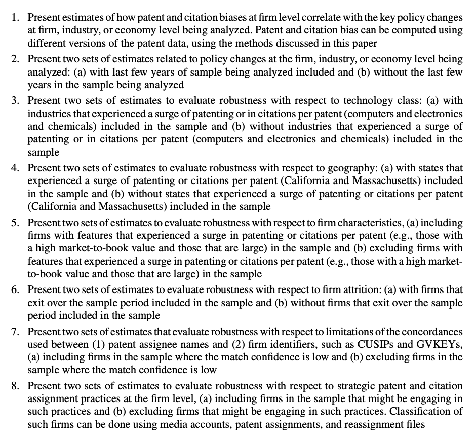

- [Shu, Tao, Xuan Tian, and Xintong Zhan. "Patent quality, firm value, and investor underreaction: Evidence from patent examiner busyness." *Journal of Financial Economics* 143.3 (2022): 1043-1069.](https://www.sciencedirect.com/science/article/pii/S0304405X21004785)
  - This paper attempts to study the causal effect of examiner busyness on patent quality and firm value. Using a broad set of patent quality measures, we find strong evidence that patents allowed by busy examiners exhibit significantly lower quality.

- [Bekkerman, Ron, Eliezer M. Fich, and Natalya V. Khimich. "The effect of innovation similarity on asset prices: Evidence from patents’ big data." *The Review of Asset Pricing Studies* 13.1 (2023): 99-145.](https://academic.oup.com/raps/article-abstract/13/1/99/6656364)

  - [科技关联度 (II)](https://zhuanlan.zhihu.com/p/577519685)
  - Methodology: 
    - Patent text analysis: use external sources such as Wikipedia and professional dictionaries to establish the professional termi- nology for every patent in our sample. This process enables us to define two patents as similar if they share the same professional terminology.
    - Remove “boilerplates” (i.e., long lists of terminology used in patent texts to illus- trate the invention generality).
    - Patent similarity: Two patents' distance is represented as a vector of their common terms weighted by a TFIDF (term frequency– inverse document frequency) variant.
    - Firm similarity: log of the sum of similar patent pairs discounted by the age of the newer patent in each pair and normalize it by the log of the product of the total number of patents for each firm in the pair.

  - 基本面解释：For R&D-to-Total Assets and ROA terms, peer firms have both contemporaneous correlation and prediction power.
  - **信息扩散缓慢的原因是投资者注意力不足，而不是投资者完全完全意识不到关联。**注意力不足意味着投资者未来能认识到关联，因而会有信息的进一步扩散和关联动量。而后者意味着投资者压根就看不到关联的存在，因此也就没关联动量效应了。

- [Narrative Momentum](https://papers.ssrn.com/sol3/papers.cfm?abstract_id=4912496)

  - Data
    - The collected news articles are classified into media reservoirs: General, Corporate, FX, and Country Equity.
    - Articles are classified into 347 narratives: including 53 pre-specified Journal of Economic Literature (JEL) narratives and around 300 additional narratives. The 347 narratives are classified into 14 narrative tags including Geopolitics, Macro, Micro, etc. The narrative series are provided by MKT MediaStats, LLC.

  - Construction
    - **Narrative Intensities**: Negative (positive) intensity is the fraction of negative (positive) sentiment articles pertaining to a narrative out of the overall discussion, with a value in [0,1].
    - **Narrative market beta**: whether narratives can explain excess market returns. univariate regressions of the one-month market excess returns on contemporaneous one-month intensity changes.
    - **stock-level narrative betas**: univariate regression of stock return and intensity changes.

  - Conclusion:
    - Financial analysts also tend to underreact to narrative-sensitive stocks
    - Narrative momentum is different from price momentum.

- [Goldman, Eitan, Jordan Martel, and Jan Schneemeier. "A theory of financial media." *Journal of Financial Economics* 145.1 (2022): 239-258.](https://www.sciencedirect.com/science/article/pii/S0304405X21003081)

  - Firms are more likely to manipulate their announcements when media coverage is more extensive.
  - Negative news is more likely to be reported than positive news.
  - The presence of financial journalists can lead to more efficient pricing.

- [Froot, Kenneth, et al. "Predicting Performance Using Consumer Big Data." *Journal of Portfolio Management* 48.3 (2022).](https://scholar.harvard.edu/files/kenfroot/files/Predicting_Performance_Using_Consumer_Big_Data-Aug18.2021.pdf)
  - **Proxies for Corporate Sales**: The authors construct three proxies for real-time corporate sales using distinct information sources: in-store foot traffic (IN-STORE), web traffic to companies' websites (WEB), and consumers' interest level in corporate brands and products (BRAND).
  - Predict SUE, SUR, Analyst forecast error.
  - Check analyst coverage and media exposure, and market attention level to see if the market consensus really matters, whether we want to trade the surprise from consensus or just the quarterly change. 

- Wolfe Research | Global shipping and supply chain alpha

  - S&P global panjiva supply chain intelleigence (US, Brazil, India, Mexico); FactSet (US only)
  - BOL: bill of lading form.
  - Features: 
    - shipping volume (predict sales), (level/growth)
    - supplier, product, country of origin (diversity)
    - supply-chain network (company's position in supply chain)
    - shipping network momentum

- Wolfe Research | Alpha insights from global job postings data

  - RavenPack dataset (most likely use LinkUp)
  - Term construction: job postings level/growth (we can use SOC median salary as importance weight); technical skill intensity, level/growth, uniqueness in skills, adoption of new technical skills, skill importance (TF-IDF).

- DB Research | Macro and Micro JobEconomics

  - LinkUp job posting dataset: scrape from company website. Data since 2007, description data since 2014. Includes SOC job classification, geolocation data, and technical skills data. Most coverage in the USA.
  - Term construction similar for micro.
  - Macro: use to predict employment, PMI index, CPI, retail, consumer sentiment.

- The Use and Usefulness of Big Data in Finance: Evidence from Financial Analysts

  - The paper offers robust evidence that the integration of alternative data into analyst reports is both increasing and economically valuable. 
  - By improving earnings forecast accuracy and bolstering the trading commission revenue (**as a proxy for Sell-side analysts’ value, data from ANcerno's institutional investor trade data **) of brokerages, alternative data serves as a tool to enhance the relevance of sell-side research in a rapidly evolving data landscape. 

- [Armstrong, Chris, Yaniv Konchitchki, and Biwen Zhang. "Digital traffic, financial performance, and stock valuation." (2023).](https://papers.ssrn.com/sol3/papers.cfm?abstract_id=4416683)
  - Digital traffic (website pageview, visit, **visit duration**, other statistics) can predict quarterly earnings KPIs. It provides additional information to analyst consensus and market consensus (positive stock return). 
  - All these effects only apply to firms with consumer-oriented websites. A website is defined as consumer-oriented if it satisfies at least one of the following conditions: (i) it allows direct transactions by customers. Examples include amazon.com, nike.com, and bestbuy.com; (ii) the website itself is the product, and visits to these websites are de facto consumption of products. Examples include nytimes.com, google.com, facebook.com, netflix.com; (iii) while the website is not directly geared towards customer transactions, the website hosts detailed product information and is likely to attract visits from existing and prospective customers. Examples include nissanusa.com and bmwusa.com.
  - The Authors define a alternative value measure: market-to-visits, market-to-pageviews.
  - **Data from SimilarWeb.**

## Analyst

- Analyst Forecast Bundling Intensity and Earnings Surprise

  - [Barth, Mary E., et al. "Analyst Forecast Bundling Intensity and Earnings Surprise." *Available at SSRN 4839739* (2024).](https://papers.ssrn.com/sol3/papers.cfm?abstract_id=4839739)

  - The authors explore how financial analysts convey information about a company's earnings without necessarily making full revisions to their earnings forecasts. They achieve this by increasing what they term 'bundling intensity,' which refers to the extent to which an analyst's report that includes an earnings forecast revision also includes revisions to price targets and/or recommendations that have the same direction as the earnings forecast revision.

  - The researchers have developed a measure called BF_Score at the firm level to quantify bundling intensity. Their findings suggest that BF_Score is a significant predictor of earnings surprises based on analyst forecasts. These surprises often result from biases in consensus earnings forecasts, which are influenced by the information analysts communicate through bundling intensity. Below is definition of BR score, where TP is target price.

    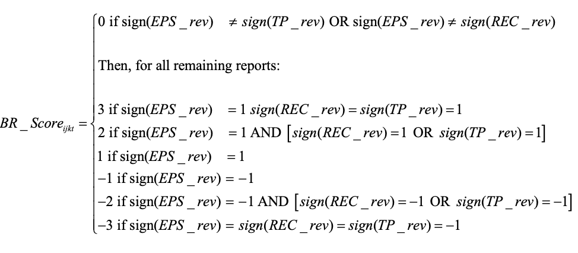

  - The use of bundling and the predictive power of BF_Score increase during times of higher macroeconomic uncertainty, when analysts have greater incentives to avoid bold revisions to their earnings forecasts. 

- [He, Jie Jack, and Xuan Tian. "The dark side of analyst coverage: The case of innovation." *Journal of financial economics* 109.3 (2013): 856-878.](https://www.sciencedirect.com/science/article/pii/S0304405X13001086)

  - Firms covered by a larger number of analysts generate fewer patents and patents with lower impact. 
  - The evidence is consistent with the hypothesis that analysts exert too much pressure on managers to meet short-term goals, impeding firms' investment in long-term innovative projects.

- [Kumar, Alok, Ville Rantala, and Rosy Xu. "Social learning and analyst behavior." *Journal of financial economics* 143.1 (2022): 434-461.](https://www.sciencedirect.com/science/article/pii/S0304405X21002774)

  - The paper extends the literature on analyst herding by demonstrating that sell-side analysts not only mimic peers’ forecasts for the same firm but also update their beliefs based on information gleaned from peers covering different firms within their portfolio.

- [Alpha in Analysts](https://papers.ssrn.com/sol3/papers.cfm?abstract_id=5171848)

  - Our empirical analysis shows that while the average analyst does not generate statistically significant alpha relative to the returns of a long-only portfolio benchmark, a subset of analysts exhibits persistent alpha. Motivated by this heterogeneity, we introduce a "fund-of-analysts" framework that first predicts analyst performance and then dynamically allocates weights across analysts based on predicted analyst performances.

## Anomalies

- [Crowdsourced employer reviews and stock returns](../notes/green_2019_jfe.html)
- [Extrapolative beliefs in the cross-section: What can we learn from the crowds?](../notes/Da_2021_jfe.html)
- [Chinese Stock Market Shell Value](../notes/cn_shell.html)
- [Size and Value in China](../notes/cn_ff3.html)
- [Time Series Momentum](../notes/TSM.html)
- [Tracking Retail Investor Activity](../notes/retail.html)
- [Overnight Return Reserval](../notes/overnight.html)
- [Idiosyncratic Volatility](../notes/ivol.html)
- [Volume](../notes/volume.html)
- [ESG](../notes/ESG.html)
- [Loughran, Tim, and Bill McDonald. "Measuring firm complexity." *Journal of Financial and Quantitative Analysis* (2023): 1-28.](https://www.cambridge.org/core/journals/journal-of-financial-and-quantitative-analysis/article/measuring-firm-complexity/D737FD0A697AF699C5AADD62842ACAB8)
  - Measure firm complexity: use 10-K filing text data. 
    - RHS: 374 pre-defined words related to firm complexity.
    - LHS: use audit fees (adjusted by size and industry) as complexity proxy.
    - Run lasso regression -> identify 50+ words as final firm complexity related set.
    - Complexity = percentage of complexity word set in 10-K filiing corpus length. 
- [Cohen, Lauren, and Dong Lou. "Complicated firms." *Journal of financial economics* 104.2 (2012): 383-400.](https://www.sciencedirect.com/science/article/pii/S0304405X11001899)
  - Complication of a firm is measured by income segment. 
  - The more complicated the firm, the more pronounced the return predictability. In addition, we find that sell-side analysts are subject to these same information processing constraints, as their forecast revisions of easy-to-analyze firms predict their future revisions of more complicated firms.

## Asset Pricing

- [Q-Factor Model](../notes/q-factor.html)

- [Which Beta?](../notes/whichbeta.html)

- [Stambaugh-Yuan Four Factors](../notes/Stambaugh-Yuan-2017.html)

- [P-hacking](../notes/phack.html)

- [Chan, Kam Fong, and Terry Marsh. "Asset pricing on earnings announcement days." *Journal of Financial Economics* 144.3 (2022): 1022-1042.](https://www.sciencedirect.com/science/article/pii/S0304405X21002920)
  - The paper provides evidence that the capital asset pricing model (CAPM) seems to hold on days when influential firms announce earnings, challenging the conventional wisdom that the beta-return relationship is generally flat in the market. The findings have implications for investors, suggesting that strategic trading around earnings announcements could yield significant returns.

- [Hu, Xiaolu, Malick O. Sy, and Liuren Wu. "A factor model of company relative valuation." *Available at SSRN 3706995* (2020).](https://papers.ssrn.com/sol3/papers.cfm?abstract_id=3706995)

  - **Relative Value Metric**

    The paper defines the company’s relative value as:
    $$
    q = \ln\left(\frac{MV}{TA}\right)
    $$
    where MV is the market value of the company (constructed from total assets adjusted by replacing book equity with market capitalization for the common stock component) and TA is total assets. 

  - The authors collect 23 descriptive measures (or “descriptors”) of firm characteristics covering eight broad categories:

    - **Profitability:** e.g., realized return on assets (RoA) and analyst forecast RoA.
    - **Growth:** e.g., long-term growth (LTG) forecasts, one-year and five-year historical growth rates.
    - **Investment:** e.g., capital expenditure ratios, R&D spending, retained earnings.
    - **Liquidity:** e.g., working capital ratio, slack ratio, various liquidity ratios, and trading liquidity.
    - **Leverage:** Measured by book debt-to-equity ratio.
    - **Market Risk:** Captured by the firm’s stock beta.
    - **Size:** Usually expressed as the natural logarithm of total assets.
    - **Momentum:** Measured by stock return momentum over six- and 12-month horizons.

  - The authors combine similar descriptors within each category into single valuation factors. They do this by first standardizing each descriptor (using winsorization and z-score transformation) and then averaging them to form a factor. When multiple descriptors exist within a category, a Bayesian weighted approach is implemented: Weights are estimated via a constrained regression (imposing that weights sum to one) with an equal-weighting prior.

  - Once the eight factors are constructed, the relative value of each company is modeled through a cross-sectional contemporaneous regression at each date 
    $$
    q_t = G_t d_t + F_t c_t + e_t
    $$
    where:

    - q_t is the vector of standardized logarithmic relative value across companies.
    - G_t is a matrix of industry dummy variables (based on 49 industry groups from SIC codes) to serve as a local bias correction.
    - F_t represents the matrix of valuation factors.
    - c_t contains the cross-sectional slope estimates (i.e., the market pricing of each valuation factor).
    - e_t is the regression residual that represents the temporary misvaluation (mispricing) of individual companies.

  - The regression residuals (e_t) from the model, which capture the deviation of a company’s actual relative value from the “fair” value predicted by the model, are interpreted as temporary mispricing. A long-short portfolio that goes long on companies with the lowest residuals (undervalued) and short on those with the highest residuals (overvalued) delivers strong performance

    

## Behavorial Finance

- [Behavioral Finance: an Introduction](../notes/behave.html)
- [Short- and Long-Horizon Behavioral Factors](../notes/DHS-4-factors.html)
- [Nominal Price Ilusion](../notes/nominal_illusion.html)
- [PEAD](../notes/PEAD.html)
- [Financial Statement Related](../notes/fin_stat.html)
- Wolfe Research | Seeking alpha from insider transactions
  - Form 4 fillings from EDGAR database
  - Findings:
    - Insider purchases are more effective than sales (might be personal liquidity needs)
    - Insider purchases after positive earnings surprise is a strong confirmatory signal
    - Collective insider purchases by multiple executives is strong
    - Infrequent insider transactions are more informative than reoccurring trades. 
- [Wang, Feifei, Xuemin Sterling Yan, and Lingling Zheng. "Institutional trading, news, and accounting anomalies." *Journal of Accounting and Economics* 78.1 (2024): 101686.](https://www.sciencedirect.com/science/article/pii/S0165410124000168)
  - Institutional investors' trading behavior is influenced more by news sentiment than by the anomalies themselves. Institutions tend to trade “in the wrong direction.” In the sample of overreaction anomalies, they are net sellers of the long leg relative to the short leg

## Crypto

* [Decentralized mining in centralized pools](../notes/defi_RFS.html)
* [Majority is not enough: Bitcoin mining is vulnerable](../notes/ES_2014_majority.html)
* [Blockchain without waste: Proof-of-stake](../notes/PoS.html)
* [A Survey of Attacks on Ethereum Smart Contracts](../notes/SoK.html)
* [Multi-factor in Cryptocurrency](../notes/FF3_cryoto.html)
* [Kogan, Shimon, et al. "Are cryptos different? evidence from retail trading." *Journal of Financial Economics* 159 (2024): 103897.](https://www.sciencedirect.com/science/article/pii/S0304405X2400120X)
  * While investors exhibit contrarian behavior in stocks and gold, they follow a momentum-like strategy with cryptocurrencies, holding onto their investments even after large price movements.
  * Retail investors may view cryptocurrency price changes as indicators of the likelihood of future widespread adoption, leading them to update their price expectations in the direction of the price change.

## Event

- [Lottery-like Stocks](../notes/miscell.html)
- [Bargeron, Leonce, and Alice Bonaime. "Why do firms disagree with short sellers? Managerial myopia versus private information." *Journal of Financial and Quantitative Analysis* 55.8 (2020): 2431-2465.](https://www.cambridge.org/core/journals/journal-of-financial-and-quantitative-analysis/article/why-do-firms-disagree-with-short-sellers-managerial-myopia-versus-private-information/4CF658C5427FB1B762F47DEF17D2BBA6)
  - **Disagreement Definition**: The paper defines disagreement as situations where firms engage in significant share repurchases while short interest increases.
  - The authors explore whether such repurchases are driven by managerial myopia (an attempt to defend inflated stock prices for short-term gains) or by private information (managers possessing positive, value-relevant information that the market is not yet aware of).
  - The paper finds that repurchases are more likely motivated by managers' private information rather than agency issues or a defense of overvalued stock.
- [Boudoukh, Jacob, et al. "Information, trading, and volatility: Evidence from firm-specific news." *The Review of Financial Studies* 32.3 (2019): 992-1033.](https://academic.oup.com/rfs/article-abstract/32/3/992/5061375)
  - Identified news (relevant to firm events) explains approximately 20%-40% of overnight volatility and 6% during trading hours

## Fundamental

- [Valuing Stocks With Earnings](https://papers.ssrn.com/sol3/papers.cfm?abstract_id=4892475)

  - Traditional earnings like GAAP earnings: high transitory volatility
  - Use Street Earnings:
    - Adjusts a company’s reported earnings to exclude non-recurring, non-operational, or one-time items. It aims to reflect the underlying, sustainable profitability of a business by filtering out short-term noise, providing investors and analysts with a clearer picture of long-term value creation.
    - Derived from analyst adjustments (e.g., I/B/E/S consensus estimates from Thomas Reuters)

- PE / PB / PS

  - PE（市盈率）：核心逻辑：PE反映企业盈利能力的定价效率，适用于盈利稳定、可预测性强的行业。

    1. 消费行业（食品饮料、家电、零售）
       - 需求刚性，现金流稳定，盈利波动小（如伊利股份、贵州茅台）
       - 例如：消费行业PE通常基于长期稳定的净利润计算，适合用PE判断估值高低。
    2. 医药医疗行业
       - 老龄化趋势下需求持续增长，创新药企业成熟期盈利稳定（如恒瑞医药）
       - 注意：研发阶段的生物医药企业可能亏损，需结合其他指标（如PS）。
    3. 传统制造业（机械、汽车零部件）
       - 技术成熟，竞争格局清晰，盈利增长平稳（如三一重工）
    4. 公用事业（电力、燃气）
       - 垄断性强，盈利受政策调控，PE可反映长期现金流价值

  - PB（市净率）核心逻辑：PB衡量企业净资产价值，适用于资产密集或盈利波动大的行业。

    1. 强周期行业（有色金属、钢铁、化工）
       - 盈利受大宗商品价格影响大，PE在周期低谷时失效，PB更稳定（如中国神华）

    2. 金融行业（银行、券商、保险）
       - 资产规模大且易量化（如银行信贷资产），PB反映资产质量与安全边际（如工商银行）

    3. 重资产行业（房地产、航空、航运）
       - 固定资产占比高，PB可评估清算价值（如万科A）

    4. 科技硬件制造（半导体、消费电子）
       - 设备和专利等资产价值显著，但需注意技术迭代风险（如中芯国际）

  - PS（市销率）核心逻辑：PS关注营收增长潜力，适用于高投入、高增长但盈利滞后的行业。

    1. 新兴科技行业（人工智能、云计算、半导体）
       - 初期研发投入大，盈利周期长，营收增速替代盈利成为核心指标（如英伟达、特斯拉）
    2. 生物医药与医疗器械
       - 创新药研发阶段亏损，但市场潜力大，PS反映管线价值（如Moderna）
    3. 新能源与高端制造（锂电池、光伏）
       - 行业扩张期需大量资本开支，PS衡量市场份额争夺能力（如宁德时代）

    4. 互联网与平台经济（电商、社交媒体）
       - 用户增长优先于盈利，PS结合用户价值评估（如亚马逊、字节跳动）

- [Blankespoor, Elizabeth, et al. "Real-time revenue and firm disclosure." *Review of Accounting Studies* 27.3 (2022): 1079-1116.](https://link.springer.com/article/10.1007/s11142-022-09703-2)

  - Disclosure Patterns and Timing:

    - Withholding of Negative News Early in the Quarter:

      Managers are less likely to issue a revenue forecast (i.e., voluntary disclosure) when real-time abnormal revenue is negative during the early part of the fiscal quarter.

    - Increased Disclosure as the Quarter Progresses:

      As the quarter moves closer to the mandatory earnings announcement, the withholding of negative news diminishes. This change is likely driven by an increase in litigation risk, heightened analyst scrutiny, and the expectation that the impending public revelation will force managers to disclose bad news.

    - Asymmetry in Disclosure:

      The analysis shows that it is primarily the “bad news” (i.e., weeks with abnormal revenues in the bottom quartile) that is withheld early, whereas there is no significant increase in the voluntary disclosure of good news. This finding is consistent with classic disclosure models where economic incentives lead firms to delay negative information until external disciplinary mechanisms (like investor reaction or legal risk) compel disclosure.

  - Market Reaction and Insider Trading:

    - Delayed Incorporation into Stock Prices:

      Although the real-time revenue measure is strongly informative—as evidenced by its positive correlation with future abnormal returns—the market does not fully and immediately price in the information. The gradual “leakage” of performance signals over the quarter suggests a dynamic process of information disclosure.

    - Insider Trading Behavior:

      The paper documents that in weeks where there is significant abnormally negative real-time revenue and no corresponding public disclosure, insider managers are more likely to sell their shares. This behavior implies that managers might use their private information for personal gain when they choose not to disclose.

  - Role of Disciplinary Mechanisms:
    - The withholding and subsequent release of information are found to be more pronounced in firms characterized by:
      - High Analyst Coverage: Greater monitoring by equity analysts increases pressure on managers to eventually release negative information.
      - High Institutional Ownership: With more sophisticated investors monitoring performance, non-disclosure becomes costlier.
      - High Litigation Risk: The prospect of legal or reputational consequences forces managers to disclose adverse information as the quarter’s end nears.

- [Froot, Kenneth, et al. "What do measures of real-time corporate sales say about earnings surprises and post-announcement returns?." *Journal of Financial Economics* 125.1 (2017): 143-162.](https://www.sciencedirect.com/science/article/pii/S0304405X17300776)

  - Managerial Disclosure Behavior:The behavior captured by the PQS (Post‐quarter Sales (PQS): Sales activity occurring after quarter-end but before the earnings announcement) measure indicates that managers do not fully disclose all privately held post-quarter performance information at the earnings announcement. Instead, they understate positive signals—resulting in lower-than-expected announcement returns and delayed price adjustments in the post-announcement period. This may be driven, in part, by personal trading motivations.

    

## Linkage

* [Geographic Lead-Lag Effects](../notes/Parsons_2020_rfs.html)

* [Technological Links and Predictable Returns](../notes/Lee_2019_jfe.html)

* [Shared Analyst Coverage: Unifying Momentum Spillover Effects](../notes/Ali_2020_jfe.html)

* [Lazy Prices](../notes/lazy-prices.html)

* Market data linkage
  * [Sarmento, Simão Moraes, and Nuno Horta. "Enhancing a pairs trading strategy with the application of machine learning." *Expert Systems with Applications* 158 (2020): 113490.](https://github.com/simaomsarmento/PairsTrading/blob/master/Thesis.pdf)
    * Stock mktdata -> dimension reduction -> clustering -> within each cluster: 
      * The pair’s constituents are cointegrated. 
      * The pair’s spread Hurst exponent reveals a mean-reverting character. ($$H < 0.5$$)
      * The pair’s spread diverges and converges within convenient periods. (1 < half life < 12)
      * The pair’s spread reverts to the mean with enough frequency. (yearly mean-cross >= 12)

* [Co-trade Network](../notes/co-trade.html)

* [Papenkov, Maksim, et al. "Multi-Industry Simplex: A Probabilistic Extension of GICS." *arXiv preprint arXiv:2310.04280* (2023).](https://arxiv.org/pdf/2310.04280.pdf)
  * Multi-industry classification using business description (10K + broker report + earnings call) + Bag of Words + LDA

* [Bagnara, Matteo, and Milad Goodarzi. "Clustering-based sector investing." (2023).](https://papers.ssrn.com/sol3/Delivery.cfm/SSRN_ID4528879_code1661302.pdf?abstractid=4528879&mirid=1)
  
  * Data: 94 firm characteristics for CRSP from Dacheng Xiu's Paper (Empirical Asset Pricing with Machine Learning)
  * Bisecting K-means clustering
  * Clustering feature importance: rank feature variation/PCA on cluster-centroid vector
  
* [TT Shi et al. (2023) Production Complementarity and Information Transmission Across Industries](https://papers.ssrn.com/sol3/papers.cfm?abstract_id=4190096)

  * Sales segment + industry input-output relation to construct linkage (Benchmark Input-Output Surveys of the Bureau of Economic Analysis to identify product complementary relationships)

    

- Linkage and information discreteness: 

  - [Da, Zhi, Umit G. Gurun, and Mitch Warachka. "Frog in the pan: Continuous information and momentum." *The review of financial studies* 27, no. 7 (2014): 2171-2218.](https://academic.oup.com/rfs/article-abstract/27/7/2171/1578455)

  - [Huang, Shiyang, et al. "A frog in every pan: Information discreteness and the lead-lag returns puzzle." *Journal of Financial Economics* 145.2 (2022): 83-102.](https://www.sciencedirect.com/science/article/pii/S0304405X21004761)

  - 行为金融学中的温水煮青蛙：人的这种缺陷叫做limited attention（有限注意力）。由于人们的认知资源是有限的，在任何给定的时刻，我们的大脑都偏好去处理那些最显著、最重要的信息，而忽视那些不显著的、经济效应微弱的因素。一系列频繁但微小的变化对于人的吸引力远不如少数却显著的变化；因此投资者对于连续信息造成的股价变化反应不足。

  - 信息离散性（information discreteness，ID）：ID 低（说明信息连续性强）的动量才是高质量动量

  $$
  ID = \text{sign(过去一段时间的收益率) × (这段时间内下跌交易日\% - 这段时间内上涨收益日\%)}
  $$

  - Da et al. (2014) 说明，与传统动量相比，通过 ID 因子筛选找到的高质量动量能够获得更高的超额收益，且该收益在样本外的持续性更强（这有助于我们降低调仓频率、减少换手率、节约交易成本）。

  - Information discreteness (ID) serves as a cognitive trigger that reduces investor inattention and improves inter-firm news transmission.

- [Yan, Jingda, and Jialin Yu. "Cross-stock momentum and factor momentum." *Journal of Financial Economics* 150.2 (2023): 103716.](https://www.sciencedirect.com/science/article/pii/S0304405X23001563)

  - **Cross-stock momentum:** Based on asymmetry in lead-lag linkages and differences between long-run and short-run co-movements.

  - **Factor momentum:** The phenomenon where returns of certain factors (like size, value, or industry factors) exhibit momentum.

  - The asymmetry in cross-stock linkages is a key differentiator from factor momentum. The paper shows that cross-stock momentum is not entirely driven by factor momentum.

  - The author used **Principal Portfolio (PP) Methodology**  invented in [Kelly (JoF 2023) Principal Portfolios](https://onlinelibrary.wiley.com/doi/abs/10.1111/jofi.13199). The Principal Portfolio (PP) methodology optimizes portfolio returns by leveraging cross-stock predictability captured in the **Prediction Matrix**. This approach extends traditional asset pricing by incorporating cross-stock signals.

  - The **Prediction Matrix**, $$\hat{\Phi}_t$$, aggregates the relationship between lagged signals ($$S_{\tau-1}$$) and returns ($$R_\tau$$) over a rolling window $$T$$:
    $$
    \hat{\Phi}_t = \frac{1}{T} \sum_{\tau=t-T+1}^{t} R_{\tau} S_{\tau-1}^\top
    $$
    Diagonal Elements: Capture own-stock predictability, $$E[R_{i,t+1} S_{i,t}]$$.

    Off-Diagonal Elements: Represent cross-stock predictability, $$E[R_{i,t+1} S_{j,t}]$$.

    Signals ($$S_{t-1}$$) are normalized within $$[-0.5, 0.5]$$ to reduce noise and manage outliers. The matrix is lagged by one period to ensure independence between returns and predictors.

  - **SVD**: The Prediction Matrix is decomposed via SVD:
    $$
    \hat{\Phi}_t = U \Sigma V^\top = \sum_{k=1}^n \lambda_k u_k v_k^\top
    $$
    **$$U$$, $$V$$**: Orthogonal matrices with left ($$u_k$$) and right ($$v_k$$) singular vectors.

    **$$\Sigma$$**: Diagonal matrix of singular values ($$\lambda_k$$) ranked by importance.

    This decomposition simplifies identifying key patterns in cross-stock return predictability.

  - **Portfolio Construction**: Portfolio weights ($$w_t$$) are derived by combining signals and the prediction matrix. Optimal weights maximize return subject to a constraint on matrix norm:
    $$
    w_t = L^\top S_t \quad \text{with} \quad L = \sum_{k=1}^K v_k u_k^\top
    $$
    **$$K$$**: Number of leading components retained for dimensionality reduction. Usually $$K < T$$.

    Principal Portfolios (PPs): Constructed by linear combinations of $$v_k$$ and $$u_k$$, balancing computational simplicity and predictive power.

    The PP return is:

    $$
    w_t^\top R_{t+1} = S_t^\top \left( \sum_{k=1}^K v_k u_k^\top \right) R_{t+1}
    $$

  

- [Chen, Xin, et al. "Attention spillover in asset pricing." *The Journal of Finance* 78.6 (2023): 3515-3559.](https://onlinelibrary.wiley.com/doi/abs/10.1111/jofi.13281)

  - The paper leverages a unique feature of stock display on trading platforms in China, where the order of stock display is determined by the stock's listing code. This feature creates an attention spillover effect, where investors are more likely to notice and trade stocks with listing codes adjacent to those of stocks they currently hold.
  - The authors propose that overconfident investors, following positive investment experiences, are likely to increase their trading activities and are more likely to direct their attention to neighboring stocks on the display.

- [Jin, Zuben. "Business aspects in focus, investor underreaction and return predictability." *Journal of Corporate Finance* 84 (2024): 102525.](https://www.sciencedirect.com/science/article/pii/S0929119923001748)

  - Conference call transcripts -> topic model -> firm similarity -> linkage signals

- [Zhang, Zhiyu, et al. "Uncovering interfirm links through textual topic similarity: A comomentum analysis in financial markets." *The British Accounting Review* (2024): 101446.](https://www.sciencedirect.com/science/article/pii/S0890838924002105)

  - cross-firm similarity measure based on the various topics extracted from Management Discussion and Analysis texts

- [Feng, Jian, et al. "Economic Links from Bonds and Cross-Stock Return Predictability." *Available at SSRN 4047776* (2022).](https://papers.ssrn.com/sol3/papers.cfm?abstract_id=4047776)
  - **Main idea: linkage from bond market credit-rating comovements.**
  - This study identifies a "market segmentation" effect between the equity and bond markets, showing that information from bond markets is often not incorporated promptly by equity market investors.
  - Firms are connected through "credit-rating comovements," defined as instances when two firms' bond ratings are updated in the same direction within a ±10-day window. 

- [Chen, Xin, and Huaixin Wang. "News Links and Predictable Returns." *Available at SSRN 4458612* (2023).](https://papers.ssrn.com/sol3/papers.cfm?abstract_id=4458612)
  - **Main idea: news-implied linkages in China where firms are connected based on shared media coverage.**
  - News-based links were established by identifying instances where two firms were mentioned in the same article within a 12-month window. 
  - The authors perform robustness checks to validate these results, including a placebo test using shared media platforms, demonstrating that only specific news stories—not general media coverage—predict future returns. 
  - They explore linkage complexity, showing stronger predictability when linkages are more complex (e.g., higher numbers of shared stories or connections).

- [Wang, Huaixin. "The Day and Night Tale of Momentum Spillover Effects." *Available at SSRN 4179413* (2022).](https://papers.ssrn.com/sol3/papers.cfm?abstract_id=4262645)
  - **Main idea: high overnight returns for peer stocks predict elevated opening prices for focal stocks, followed by intraday reversals, while peer intraday returns consistently predict positive future intraday returns for focal stocks.**
  - Retail investors, who trade primarily on overnight information due to news salience, and professional investors, who engage in intraday trading, correcting the market.
  - Predictable patterns arise not only from underreaction but from a systematic interplay between the different investor types. Retail-driven overnight price distortions are followed by intraday reversals managed by professionals

- Data-driven graph learning

  - [Pu et al. (2023) Network Momentum across Asset Classes](https://arxiv.org/abs/2308.11294)

  - features: 8 in total, MOM and MACD. 

    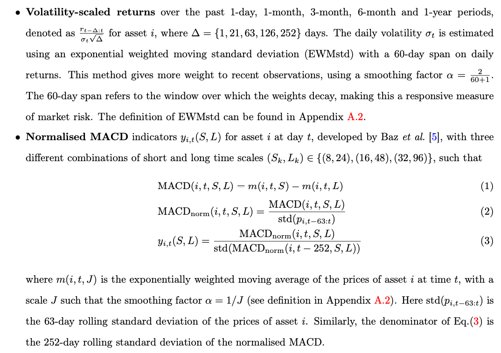

  - From [Kalofolias (AAAI 2016) How to learn a graph from smooth signals](http://proceedings.mlr.press/v51/kalofolias16.html), we can define a convex optimization problem:
    $$
    \begin{aligned} \label{L2G}
    \min_{\mathbf{A}_t} \; \; & \operatorname{tr}\left(\mathbf{V}_t^{\top}\left(\mathbf{D}_t-\mathbf{A}_t\right) \mathbf{V}_t\right)-\alpha \mathbf{1}^{\top} \log \left(\mathbf{A}_t \mathbf{1}\right)+\beta\left\|\mathbf{A}_t\right\|_F^2 \\
    \text { s.t. } & \mathbf{A}_{i j, t}=\mathbf{A}_{j i, t}, \quad \mathbf{A}_{i j, t} \geq 0 \quad \forall i \neq j
    \end{aligned}
    $$
    where $$V_t \in \mathbb{R}^{N \times 8\delta}$$ is the feature matrix with $$\delta$$-days lookback window, where $$\mathbf{D}_t$$ is a diagonal matrix with $$\mathbf{D}_{i i, t}=\sum_j \mathbf{A}_{i j, t}$$. The graph adjacency matrix $$\mathbf{A}_t$$ we want to estimate represents the network at day t for constructing network momentum, with the $$i j$$-th entry $$\mathbf{A}_{i j, t}$$ measuring the strength of similarity of individual momentum between asset i and asset j. In the objective function, the first trace term measures the spectral variations of $$V_t$$ on the learned graph adjacency matrix $$A_t$$, encouraging connections between nodes with similar features. It is derived from Laplacian smoothness under the mild assumption that each column of $$V_t$$​​ is a low-pass graph signal.

  - The above is derived from: Consider a matrix $$X \in \mathbb{R}^{m \times n}=\left[x_1, \ldots, x_m\right]^{\top}$$, where each row $$x_i \in \mathbb{R}^n$$ resides on one of m nodes of an undirected graph G. In this way, each of the n columns of X can be seen as a signal on the same graph. A simple assumption about data residing on graphs, but also the most widely used one is that it changes smoothly between connected nodes. An easy way to quantify how smooth is a set of vectors $$x_1, \ldots, x_m \in \mathbb{R}^n$$ on a given weighted undirected graph is through the function
    $$
    \frac{1}{2} \sum_{i, j} W_{i j}\left\|x_i-x_j\right\|^2=\operatorname{tr}\left(X^{\top} L X\right),
    $$

    where $$W_{i j} \in \mathbb{R}_{+}$$ denotes the weight of the edge between nodes i and j and $$L=D-W$$ is the graph Laplacian, $$D_{i i}=\sum_j W i j$$ being the diagonal weighted degree matrix. In words, if two vectors $$x_i$$ and $$x_j$$ from a smooth set reside on two well connected nodes (i.e. $$W_{i j}$$ is large), they are expected to have a small distance $$\left\|x_i-x_j\right\|$$ so that $$\operatorname{tr}\left(X^{\top} L X\right)$$ is small.

  - In our empirical analysis, we combine $$K=5$$ distinct graphs learned from $$\mathbf{V}_t$$ from five different lookback windows such that $$\delta \in\{252,504,756,1008,1260\}$$ trading days as follows:
    (graph ensemble) $$\; \; \overline{\mathbf{A}}_t=\frac{1}{K} \sum_{k=1}^K \mathbf{A}_t^{(k)}$$.

    To mitigate the effects of scale differences in constructing network momentum, which may arise due to the difference in the number of connections certain assets have - with some connected to numerous other assets and others only to a few - we also apply a graph normalisation as follows: 

    (graph normalisation) $$\; \; \tilde{\mathbf{A}}_t=\overline{\mathbf{D}}_t^{-1 / 2} \overline{\mathbf{A}}_t \overline{\mathbf{D}}_t^{-1 / 2}$$, where $$\overline{\mathbf{D}}_t$$ is a diagonal matrix with $$\overline{\mathbf{D}}_{i i, t}=\sum_j \overline{\mathbf{A}}_{i j, t}$$​​.

  - Another way to solve above equation (\#mjx-eqn-<L2G>) is described in [Pu et al. (2023) Learning to Learn Financial Networks for Optimising Momentum Strategies](https://arxiv.org/abs/2308.12212). 

    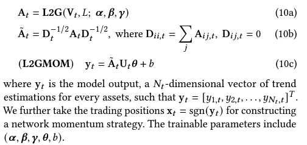

    The Algo L2G reformulates optimisationbased graph learning into an unrolling neural network. By leveraging the inherent modularity of neural networks, where different layers can be easily stacked for forward propagation, we propose to incorporate an additional layer into L2G for directly constructing network momentum. 

    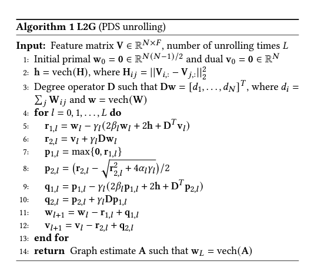

    A upgrade version of L2G algorithm is described in [Pu et al. (NIPS 2021) Learning to learn graph topologies](https://proceedings.neurips.cc/paper/2021/hash/21e4ef94f2a6b23597efabaec584b504-Abstract.html)

- [de Bodt, Eric, B. Espen Eckbo, and Richard Roll. "Competition shocks, rival reactions, and stock return comovement." *Journal of Financial and Quantitative Analysis, forthcoming, Tuck School of Business Working Paper* 3218544 (2024).](https://papers.ssrn.com/sol3/papers.cfm?abstract_id=4209543)

  - **Methodology**: The authors use a novel test statistic to discriminate between two hypotheses: increased product differentiation (H1) or increased standardization (leading to decreased return comovement) and cost-cutting (leading to increased return comovement) (H2). They exploit changes in stock return comovement following tariff cuts to infer strategic reactions.
  - **Empirical Findings**: The study finds that tariff cuts lead to a significant increase in return comovement, particularly among "followers" within an industry, suggesting a move towards greater standardization and cost-cutting strategies (H2) rather than increased product differentiation (H1).
  - **Leader definition**: sales-based market shares, financial ratios and R&D.

- [Eisdorfer, Assaf, et al. "Competition links and stock returns." *The Review of Financial Studies* 35.9 (2022): 4300-4340.](https://academic.oup.com/rfs/article-abstract/35/9/4300/6470574)

  - Consider a firm’s competitiveness based on the manner by which other firms mention it on their 10-K filings.
  - C-Rank: 10-K cross-mention graph + page-rank algo -> preferred measure of firm-level competition rank
  - A firm’s effective competition status stems mostly from competing with companies outside of its sector.
  - C-Rank might identify an element of a firm’s risk profile. If the firm is “targeted” by strong competitors, it can increase the uncertainty about the firm’s future performance and value, then the outperformance of high C-Rank firms might manifest compensation for risk.

- [Yamamoto, Rei, Naoya Kawadai, and Hiroki Miyahara. "Momentum information propagation through global supply chain networks." *Journal of Portfolio Management* 47.8 (2021): 197-211.](https://search.proquest.com/openview/e7341d6a32f04d45d47b962642ed963d/1?pq-origsite=gscholar&cbl=49137)

  - Use factset supply chain data

  - **Customer Momentum**:  Here we assume that a company has N customers, and let $$w_{i j}^{\text {sales }}$$ be the sales ratio; thus, customer momentum is defined by the following:
    $$
    \operatorname{cmom}_i^{1 M}=\sum_{j=1}^{N_i} w_{i j}^{\text {sales }} \operatorname{mom}_j^{1 M}, i=1,2, \ldots, N
    $$

  - **Weighting Method Based on Network Centrality**: almost all of the sales ratios are unavailable. Thus, we use network centrality in network theory as the weight of customer momentum. Let $$c_{ij}$$ be the [edge betweenness centrality](https://networkx.org/documentation/stable/reference/algorithms/generated/networkx.algorithms.centrality.edge_betweenness_centrality.html) between supplier i and customer j.
    $$
    \begin{aligned}
    \operatorname{cmom}_i^{1 M}&=\sum_{j=1}^{N_i} w_{i j}^{\text {centrality }} \operatorname{mom}_j^{1 M}, i=1,2, \ldots, N \\
    w_{i j}^{\text {centrality }} &= c_{ij} / \sum_{j=1}^{N_i} c_{ij}
    \end{aligned}
    $$

  - **Multilayer Customer Information**

    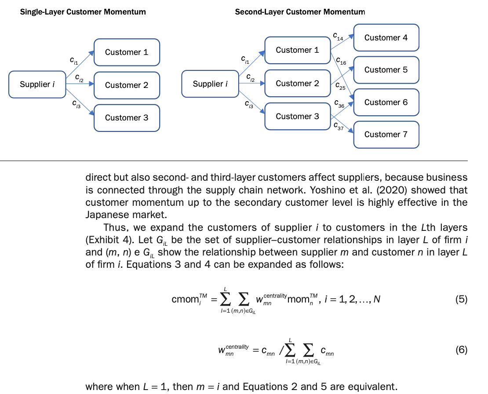

- [Earnings Propagation Effects through the Global Supply Chain Network](https://www.saa.or.jp/english/professional/pdf/2020_Tsuchiya.pdf)

  - In this paper, we separate the regression model that examines propagation from customers and the regression model that examines propagation from suppliers and then estimate the coefficients of the following two regression models:

  $$
  P_{i, t}=\alpha_{0, t}+\alpha_{1, t} P_{i, t-1}+\alpha_{2, t} M_{i, t-1}+\alpha_{3, t} D_i+\alpha_{4, t} C_{i, t-1}+\alpha_{5, t} C C_{i, t-1}+\varepsilon_{i, t}
  $$

  

$$
P_{i, t}=\alpha_{0, t}+\alpha_{1, t} P_{i, t-1}+\alpha_{2, t} M_{i, t-1}+\alpha_{3, t} D_i+\alpha_{4, t} S_{i, t-1}+\alpha_{5, t} S S_{i, t-1}+\varepsilon_{i, t}
$$

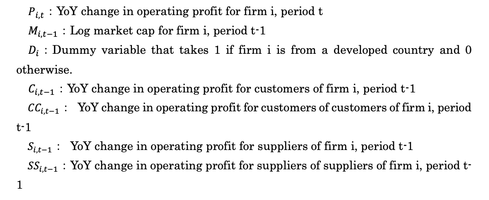

- Deep GNN methods

  - [Wu, Mian, et al. "Firm connection and equity return predictability–Graph-based machine learning methods." *The British Accounting Review* (2024): 101436.](https://www.sciencedirect.com/science/article/pii/S0890838924002002)
    - Four types of linkage: analyst co-coverage, geographical, industrial, and technological linkage.
    - GAT for each linkage type and only through connected firms under each linkage -> aggregate all four linkage output -> LSTM -> output
  - [Cheng, Rui, and Qing Li. "Modeling the momentum spillover effect for stock prediction via attribute-driven graph attention networks." *Proceedings of the AAAI Conference on artificial intelligence*. Vol. 35. No. 1. 2021.](https://ojs.aaai.org/index.php/AAAI/article/view/16077)
    - merge technical indicators and textual media features preserving their interactions -> RNN -> GAT -> Output
  - [FinHGNN: A conditional heterogeneous graph learning to address relational attributes for stock predictions](https://www.sciencedirect.com/science/article/pii/S0020025522012853)
    - Node type: firm (fundamentals on LSTM embedding), analyst (CBOW embedding), news theme (CBOW embedding)
    - Edge type: firm-firm, theme-theme, analyst-analyst, theme-firm, analyst-firm
    - GAT on different link type then aggregate
  - [Graph representation learning for similarity stocks analysis](https://idp.springer.com/authorize/casa?redirect_uri=https://link.springer.com/article/10.1007/s11265-022-01755-6)
    - knowledge graph construction -> graph representation learning -> stock embedding, similarity, momentum spillover

- [Zhang, Chao, et al. "Graph-based methods for forecasting realized covariances." *Journal of Financial Econometrics* (2024): nbae026.](https://academic.oup.com/jfec/advance-article-abstract/doi/10.1093/jjfinec/nbae026/7889003)

  - Previous HAR-DRD method: decomposing the return covariance matrix into the diagonal matrix of realized volatilities and the correlation matrix:
    $$
    \boldsymbol{H}_t=\boldsymbol{D}_t \boldsymbol{R}_t \boldsymbol{D}_t,
    $$

    where $$D_t$$ is the diagonal matrix with the elements of the square roots of $$\boldsymbol{v}_t$$ on the main diagonal, that is, $$\boldsymbol{D}_t[i, i]=\sqrt{v_{i, t}}, \forall i$$, and $$\boldsymbol{D}_t[i, j]=0, \forall i \neq j$$ . $$\boldsymbol{R}_t$$ is the correlation matrix. We can estimate above using
    $$
    \begin{aligned}
    & \boldsymbol{v}_t=\boldsymbol{\alpha}^{(D)}+\beta_d^{(D)} \boldsymbol{v}_{t-1}+\beta_w^{(D)} \boldsymbol{v}_{t-5: t-2}+\beta_m^{(D)} \boldsymbol{v}_{t-22: t-6}+\boldsymbol{u}_t^{(D)} \\
    & \boldsymbol{x}_t=\boldsymbol{\alpha}^{(R)}+\beta_d^{(R)} \boldsymbol{x}_{t-1}+\beta_w^{(R)} \boldsymbol{x}_{t-5: t-2}+\beta_m^{(R)} \boldsymbol{x}_{t-22: t-6}+\boldsymbol{u}_t^{(R)}
    \end{aligned}
    $$

    where $$\boldsymbol{x}_t=\operatorname{vech}\left(\boldsymbol{R}_t\right)$$ is the $$N^{\#}=N(N-1) / 2$$ dimensional vectorized version of the lower triangular part of $$\boldsymbol{R}_t$$ and $$\boldsymbol{x}_{t-5: t-2}$$ (resp. $$\boldsymbol{x}_{t-22: t-6}$$ ) is computed as $$\frac{1}{4} \sum_{k=2}^5 x_{t-k}$$ (resp. $$\frac{1}{17} \sum_{k=6}^{22} x_{t-k}$$ ).

  - Using graph information, we can estimate variance and correlation as follows,
    $$
    \begin{aligned}
    \boldsymbol{v}_t= & \boldsymbol{\alpha}^{(D)}+\underbrace{\beta_d^{(D)} \boldsymbol{v}_{t-1}+\beta_w^{(D)} \boldsymbol{v}_{t-5: t-2}+\boldsymbol{\beta}_m^{(D)} \boldsymbol{v}_{t-22: t-6}}_{\text {Self }} \\
    & +\underbrace{\gamma_d^{(D)} \boldsymbol{W} \cdot \boldsymbol{v}_{t-1}+\gamma_w^{(D)} \boldsymbol{W} \cdot \boldsymbol{v}_{t-5: t-2}+\gamma_m^{(D)} \boldsymbol{W} \cdot \boldsymbol{v}_{t-22: t-6}}_{\text {Graph }}+\boldsymbol{u}_t^{(D)}
    \end{aligned}
    $$

    where $$\boldsymbol{W}=\boldsymbol{O}^{-\frac{1}{2}} \boldsymbol{A} \boldsymbol{O}^{-\frac{1}{2}}$$ is the normalized adjacency matrix. Specifically, $$\boldsymbol{A}$$ is a $$N \times N$$ adjacency matrix indicating the connections between assets with diagonal elements as 0 , and $$\boldsymbol{O}=\operatorname{diag}\left\{n_1, \ldots, n_N\right\}$$, where $$n_i=\sum_j \boldsymbol{A}[i, j], \forall i$$. Therefore $$\boldsymbol{W} \cdot \boldsymbol{v}_{t-1}, \boldsymbol{W} \cdot \boldsymbol{v}_{t-5: t-2}$$, $$\boldsymbol{W} \cdot \boldsymbol{v}_{t-22: t-6}$$ represent the neighborhood aggregation over daily, weekly, and monthly horizons. $$\gamma_d, \gamma_w, \gamma_m$$ represent the effects from connected neighbors over different horizons. Moreover, we apply the idea of the graph effect to modeling correlations according to the model

    $$
    \begin{aligned}
     \boldsymbol{x}_t= & \boldsymbol{\alpha}^{(R)}+\underbrace{\beta_d^{(R)} \boldsymbol{x}_{t-1}+\beta_w^{(R)} \boldsymbol{x}_{t-5: t-2}+\beta_m^{(R)} \boldsymbol{x}_{t-22: t-6}}_{\text {Self }} \\
    & +\underbrace{\gamma_d^{(R)} \widetilde{\boldsymbol{W}} \boldsymbol{x}_{t-1}+\gamma_w^{(R)} \widetilde{\boldsymbol{W}} \boldsymbol{x}_{t-5: t-2}+\gamma_m^{(R)} \widetilde{\boldsymbol{W}} \boldsymbol{x}_{t-22: t-6}}_{\text {Graph }}+\boldsymbol{u}_t^{(R)},
    \end{aligned}
    $$
  
    where $$\widetilde{\boldsymbol{W}}=\widetilde{\boldsymbol{O}}^{-\frac{1}{2}} \tilde{\boldsymbol{A}} \tilde{\boldsymbol{O}}^{-\frac{1}{2}}$$ is the normalized adjacency matrix. Specifically, $$\tilde{\boldsymbol{A}}$$ is a $$N^{\#} \times N^{\#}$$ $$\left(N^{\#}=N(N-1) / 2\right)$$ adjacency matrix indicating the connections between pairwise correlations with diagonal elements as 0 , and $$\widetilde{O}=\operatorname{diag}\left\{\widetilde{n}_1, \ldots, \widetilde{n}_H\right\}$$, where $$\widetilde{n}_i=\sum_i \widetilde{A}[i, j], \forall i$$​.
  
  - Choices of graphs
  
    - Variance: Complete, Sector, Graph-Lasso
    - Correlation: Complete, Line graph

    Given a graph $$\mathcal{G}$$, its line graph $$L(\mathcal{G})$$ is a graph such that
    - each node of $$L(\mathcal{G})$$ represents an edge of $$\mathcal{G}$$;
    - two nodes of $$L(\mathcal{G})$$ are adjacent if and only if their corresponding edges share a common endpoint in $$\mathcal{G}$$​.
  
  - Extension: [Graph neural networks for forecasting multivariate realized volatility with spillover effects](https://arxiv.org/abs/2308.01419)
  
- [He, Wei, et al. "Similar stocks." *Available at SSRN 3815595* (2021).](https://papers.ssrn.com/sol3/papers.cfm?abstract_id=3815595)

  - Similarity between two stocks is measured by the distance between their characteristics such as price, size, book-to-market, operating profitability, and investment-to-assets. 
  - Retail investor behavior, including attention spillover and categorical trading, plays a significant role. Retail order imbalance increases for high similar-stock return portfolios, reflecting stronger demand from individual investors.
  - The similarity effect is stronger among firms with low institutional ownership, suggesting retail investors are primary drivers.

- [Guo, Li, et al. "Joint news, attention spillover, and market returns." *arXiv preprint arXiv:1703.02715* (2017).](https://arxiv.org/abs/1703.02715)

  - Joint news has a higher degree of attention spillover than self-mentioned news. Measured by increase in Google search activity and EDGAR filings for connected firms, more so than self news.
  - Define the degree of investor attention spillover to a given firm *i*, from firms connected to *i* through joint coverage, $$\text{JointNews}^i$$, as the centrality-weighted (node centrality) sum of abnormal joint news coverage across the connected firms.
  - Both JointNews and Market-JointNews (aggregation to market level) istrongly and negatively predicts the one-month-ahead (market) return. It increases the overall attention to the firms and resulting in high valuation and low future stock returns.

- [Huang, Shiyang, Tse-Chun Lin, and Hong Xiang. "Psychological barrier and cross-firm return predictability." *Journal of Financial Economics* 142.1 (2021): 338-356.](https://www.sciencedirect.com/science/article/pii/S0304405X21002725)

  - When a firm’s economically linked firms have good (bad) news, and its stock price is near (far from) the 52-week high, it has an underreaction to the good (bad) news about economically linked firms.
  - The nearness to the 52-week high significantly moderates the predictability of supplier returns based on customer returns. **Long-term returns for firms close to their 52-week high are higher when customers exhibit strong performance.**

- [Menzly, Lior, and Oguzhan Ozbas. "Market segmentation and cross‐predictability of returns." *The Journal of Finance* 65.4 (2010): 1555-1580.](https://onlinelibrary.wiley.com/doi/abs/10.1111/j.1540-6261.2010.01578.x)

  - The extent of cross-predictability is negatively related to the level of information in the market, measured by the level of analyst coverage or by the level of institutional ownership.
  - Analyst coverage measure: analyst is considered actively engaged in a stock for a 12-month period after making an EPS forecast on that stock.
  - Institutional ownership measure: sum the holdings of institutional investors in the stock at a given quarter-end report date and then divide by the number of outstanding shares. An alternative proxy is the number of different institutional investors in the stock.

## Machine Learning

* [Out of Sample Predictability](../notes/OOS.html)

* [Quant Machine Learning](../notes/quant_ml.html)

* [Time Seris Machine Learning](../notes/mlts.html)

* [NLP in Finance](../notes/nlp_fin.html)

* [Remlinger, Carl, et al. "Expert aggregation for financial forecasting." *arXiv preprint arXiv:2111.15365* (2021).](https://arxiv.org/pdf/2111.15365.pdf)

* [Liu, Quan, et al. "PREDICTION OF EARNING SURPRISE USING DEEP LEARNING TECHNIQUE."](https://assets.bbhub.io/professional/sites/10/earning_surprise_prediction_china.pdf)

* [Cong, Lin William, Tengyuan Liang, and Xiao Zhang. "Textual factors: A scalable, interpretable, and data-driven approach to analyzing unstructured information." (2019).](https://papers.ssrn.com/sol3/papers.cfm?abstract_id=3307057)
  * **Textual Factor (TF) Generation**: The authors generate TFs through three main steps:
    - Representing text using vector word embedding (Word2Vec).
    - Clustering these vectors using Locality-Sensitive Hashing (LSH) to identify topics.
    - Applying topic modeling to identify interpretable textual factors. (Use topic exposure as latent factors, apply standard factor analysis framework)

* Detecting Misreported Accounting A Machine Learning Approach using Text Data
  * 10-K filing MD&A part -> extract text -> train on SEC AAERs misreported identifier

* Global and local fitting

  * [Hellum, Oliver, Lasse Heje Pedersen, and Anders Rønn-Nielsen. "How Global Is Predictability? The Power of Financial Transfer Learning." *The Power of Financial Transfer Learning (November 1, 2023)* (2023).](https://papers.ssrn.com/sol3/papers.cfm?abstract_id=4620157)

    * Combine local model with global model, either using two stage hard transfer where global model is in the first stage and local model is in the second stage with L2 penalty on value away from global value
    * This can be a one-stage soft transfer learning as well (P21 in paper)

  * [Hanauer, Matthias X., et al. "Do Machine Learning Models Need to Be Sector Experts?." *Available at SSRN* (2025).](https://papers.ssrn.com/sol3/papers.cfm?abstract_id=5224253)

    * Hybrid model that incorporates uniform models with industry-specific ideas is the best.
    * Hybrid models are trained on returns in excess of industry medians, and features are normalized within industries, which reduces noise along the cross industry dimension. And unlike the industry-specific Specialist models, the Hybrid approach avoids partitioning the cross-section of stocks into small subsamples. 

    

## Macro

- [He, Wei, Zhiwei Su, and Jianfeng Yu. "Macroeconomic perceptions, financial constraints, and anomalies." *Journal of Financial Economics* 162 (2024): 103952.](https://www.sciencedirect.com/science/article/pii/S0304405X24001752)

  - [石川：主观宏观经济感知、财务约束和股票收益](https://mp.weixin.qq.com/s/4xnEeeYvEOw68pPdzSXuYg)

  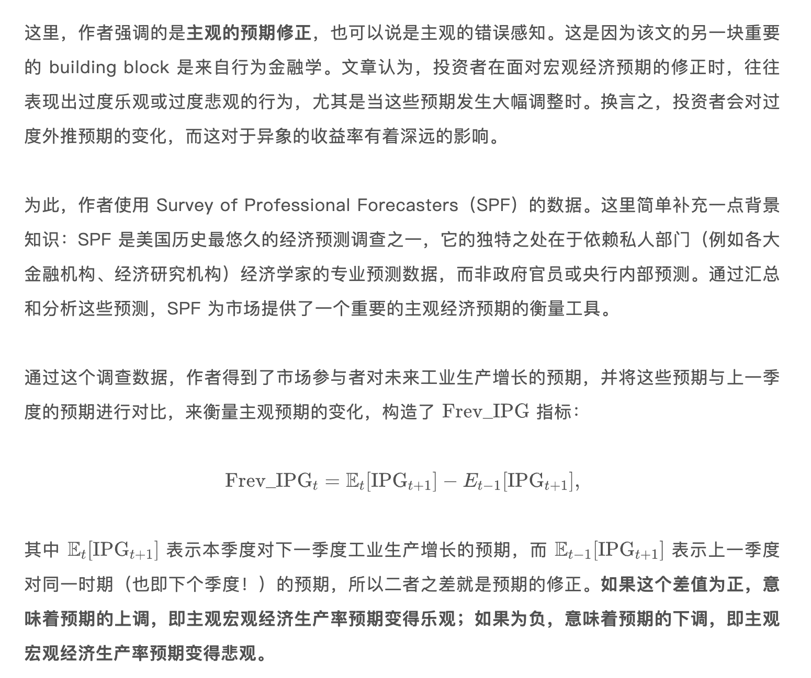

  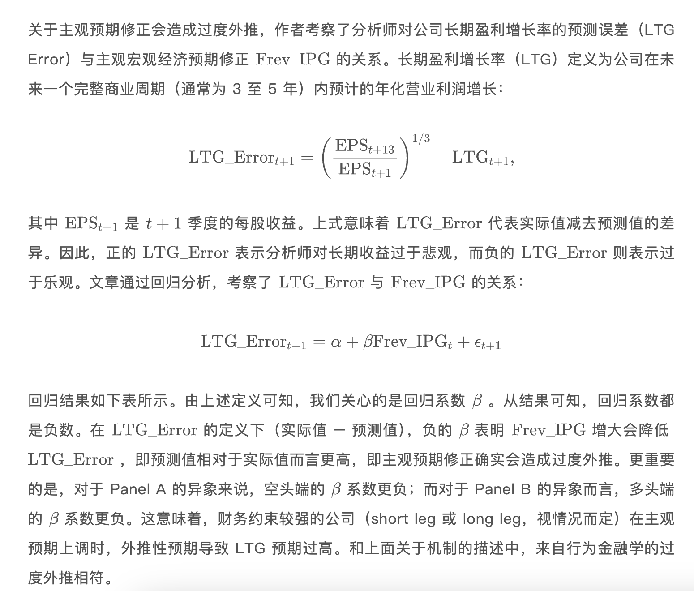

  - 当主观预期上调的时候，财务约束更大的公司未来的预期收益率更低。当主观预期下调的时候，财务约束更大的公司未来的预期收益率更高。
  - Factor timing

- BAB beta factor

  - [Campbell, John Y., and Tuomo Vuolteenaho. "Bad beta, good beta." *American Economic Review* 94.5 (2004): 1249-1275.](https://www.aeaweb.org/articles?id=10.1257/0002828043052240)

    - CAPM贝塔分解为两个组成部分：一个反映市场对未来现金流的新闻，另一个反映市场对折现率的新闻。
    - 现金流Beta衡量股票收益与公司基本面现金流冲击的相关性。这类冲击反映企业盈利、分红政策或行业前景等长期、永久性变化对股票价值的影响。衡量股票对基本面长期风险的暴露，对应“坏Beta”，需高溢价补偿。
    - 折现率Beta衡量股票收益与市场折现率冲击的相关性。这类冲击反映投资者对未来现金流预期风险的短期调整（如利率变化、风险偏好波动），导致股价的暂时性波动。例如，美联储加息（提高贴现率）可能短期内压低所有股票估值，但长期影响有限。衡量股票对市场短期情绪或政策风险的暴露，对应“好Beta”，溢价较低。

    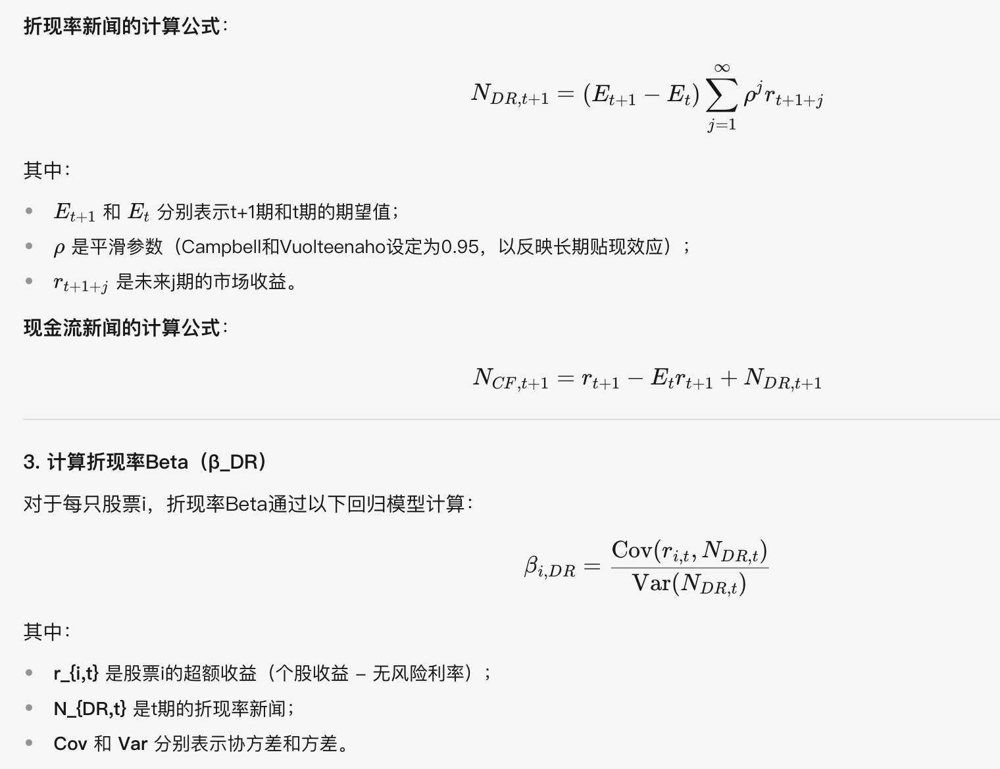

  - [Frazzini, Andrea, and Lasse Heje Pedersen. "Betting against beta." *Journal of financial economics* 111.1 (2014): 1-25.](https://www.sciencedirect.com/science/article/pii/S0304405X13002675)

    - 杠杆约束
      - 机构投资者的限制：共同基金、养老基金等机构常面临严格的杠杆限制（如监管要求或内部风控规则），无法自由借贷以放大投资规模。
      - 个人投资者的限制：普通投资者可能因保证金要求、信用额度或风险厌恶心理而难以有效使用杠杆。杠杆约束的现实背景

    - 当杠杆受限时，投资者无法直接通过借贷放大风险，转而通过调整资产配置比例间接实现类似效果：
      - 超配高Beta资产：高Beta资产（如小盘股、高波动股票）在市场上涨时涨幅更大，下跌时跌幅更深。投资者通过增持这些资产，可以在不借贷的情况下“模拟”杠杆效果，追求更高的收益潜力。
      - 低配低Beta资产：低Beta资产（如大盘蓝筹股、债券）风险较低，但收益弹性不足。
    - 需求推动高Beta资产价格虚高：当大量投资者涌入高Beta资产时，其价格被推高，导致预期收益下降。低Beta资产被低估：低Beta资产因需求不足而被抛售，价格被低估，预期收益上升。
    - BAB因子与小盘股效应并不矛盾：规模因子SMB和价值因子HML (在控制市场Beta后) 独立于市场Beta。
    - BAB因子通过做空高beta股票，做多低beta股票 (带杠杆)，来构造零beta投资组合。

  - Herculano, Miguel C. "Betting Against (Bad) Beta." *arXiv preprint arXiv:2409.00416* (2024).

    - 结合以上两文，构造BABB因子。
    - 通过双重排序（Double-Sorting），同时筛选低Beta和低现金流Beta的股票：
      1. 第一层排序：按市场Beta（β）将股票分为高、中、低三组；
      2. 第二层排序：在每组内按现金流Beta（β_CF）再次排序，构建3×3组合；
      3. 最终策略：做多低Beta/低现金流Beta组合，做空高Beta/高现金流Beta组合。

## Microstructure

* [Realized Variance and Market Microstructure Noise](../notes/realized_var.html)
* [Order Imbalance with Trade Flow Decomposition](../notes/COI_flow_decomp.html)

## Miscellaneous

- Information Aggregation
  - [更有效的信息聚合方法?](https://zhuanlan.zhihu.com/p/529605892)
  - [Light, Nathaniel, Denys Maslov, and Oleg Rytchkov. "Aggregation of information about the cross section of stock returns: A latent variable approach." *The Review of Financial Studies* 30, no. 4 (2017): 1339-1381.](https://academic.oup.com/rfs/article-abstract/30/4/1339/2756101)

- Missing Financial Data
  - [Missing Financial Data](https://zhuanlan.zhihu.com/p/517848480)
  - [Bryzgalov, S., S. Lerner, M. Lettau, and M. Pelger (2022). Missing financial data. Working paper.](https://papers.ssrn.com/sol3/papers.cfm?abstract_id=4106794)

- Interest Rate
  - [van Binsbergen, Jules H. Liang Ma, and Michael  Schwert. "The Factor Multiverse: The Role of Interest Rates in Factor Discovery." *SSRN Working Paper* (2022).](https://papers.ssrn.com/sol3/papers.cfm?abstract_id=4231626)
  - [当利率不再下降，异象还成其为异象吗？](https://mp.weixin.qq.com/s/ymE-bTz4aWgVOA6Qz5Vyow)

- Information Search

  - [Xu, Yongxin, Yuhao Xuan, and Gaoping Zheng. "Internet searching and stock price crash risk: Evidence from a quasi-natural experiment." *Journal of Financial Economics* 141, no. 1 (2021): 255-275.](https://www.sciencedirect.com/science/article/pii/S0304405X21000933)

  - [【JFE论文速递】网络搜索和股票价格崩盘风险:准自然实验的证据](https://mp.weixin.qq.com/s/aP_RwZzJNNuc35Gw-YDvLQ)
- Fund Research

  - [抄基金作业可以随随便便成功吗？](https://zhuanlan.zhihu.com/p/582989958)
  - [Cao, Sean Shun, Kai Du, Baozhong Yang, and Alan Zhang. (JAR 2021) Copycat skills and disclosure costs: Evidence from peer companies’ digital footprints.](https://papers.ssrn.com/sol3/papers.cfm?abstract_id=3280744)
- [George, Thomas J., Chuan-Yang Hwang, and Yuan Li. "February, Share Turnover, and Momentum in China." *Available at SSRN 4541025* (2023).](https://papers.ssrn.com/sol3/papers.cfm?abstract_id=4541025)

  - A strong Seasonal February reversal exists. The reversal is associated with a spike in turnover for recent loser stocks, which we attribute to an appetite for lottery-like stocks by retail investors around the Chinese New Year season.
  - Excluding February, there is a strong mid-to-long term momentum signal in China stock market.
  - Momentum construction: at beginning of month T+1, calculate signal as closing price at the end of month T-1 divide by the highest price in the past 52 weeks. Skip one month due to strong short-term reversal in China.
- [Du, Qianqian, et al. "Concept links and return momentum." *Journal of Banking & Finance* 134 (2022): 106329.](https://www.sciencedirect.com/science/article/pii/S0378426621002806)

  - China theme/concept linkage.
- [Brogaard, Jonathan, et al. "What moves stock prices? The roles of news, noise, and information." *The Review of Financial Studies* 35.9 (2022): 4341-4386.](https://academic.oup.com/rfs/article-abstract/35/9/4341/6493385)

  - **Main idea: This study introduces a decomposition model to quantify these effects, aiming to clarify the contributions of each component to stock price movements.**
  - The authors develop a return variance decomposition model that categorizes stock price variance into four components:
    - **Noise**: Non-informational price movements due to liquidity issues, overreaction, and other trading frictions.
    - **Private Firm-Specific Information**: Informed trading that reveals proprietary insights about a firm.
    - **Public Firm-Specific Information**: Information from publicly available sources, such as news and announcements.
    - **Market-Wide Information**: Broad economic or market news that impacts all firms.

## Momentum and Factor Timing

- [Momentum](../notes/moment.html)

- [Regime Modeling](../notes/regime.html)

- [Factor Timing](../notes/timing.html)

- Structural Breaks: Advances in Financial Machine Learning Chapter 17
  - **CUSUM tests**: These test whether the cumulative forecasting errors significantly deviate from white noise.
  - **Explosiveness tests:** Beyond deviation from white noise, these test whether the process exhibits exponential growth or collapse, as this is inconsistent with a random walk or stationary process, and it is unsustainable in the long run.
  - **Right-tail unit-root tests:** These tests evaluate the presence of exponential growth or collapse, while assuming an autoregressive specification.
  - **Sub/super-martingale tests:** These tests evaluate the presence of exponential growth or collapse under a variety of functional forms.

- A tug of war
  - [Lou, Dong, Christopher Polk, and Spyros Skouras. "A tug of war: Overnight versus intraday expected returns." *Journal of Financial Economics* 134.1 (2019): 192-213.](https://www.sciencedirect.com/science/article/pii/S0304405X19300650)
  - [Lou, Dong, Christopher Polk, and Spyros Skouras. "The day destroys the night, night extends the day: A clientele perspective on equity premium variation." *London School of Economics Working Paper* (2022).](https://www.carloalberto.org/wp-content/uploads/2023/01/Day-Destroys-The-Night-Night-Extends-The-Day.pdf)
  - **Main idea: overnight momentum and intraday reversal.**
  - High overnight returns tend to continue overnight in future months but exhibit a reversal during the intraday period, suggesting a “tug of war” effect. 
  - Clientele Hypothesis: The study attributes these effects to different types of investors. This segmentation results in a predictable pattern where:
    - Retail Investors drive demand at the open, impacting overnight returns.
    - Institutional Investors provide liquidity intraday, which causes reversal effects.
  - The study reveals a robust negative relation between past overnight returns and future intraday returns, a pattern they describe as "the day destroys the night." Conversely, intraday returns positively forecast overnight returns ("night extends the day"), reflecting a continuation effect. 

- [Jiang, Jingwen, Bryan Kelly, and Dacheng Xiu. "(Re‐) Imag (in) ing price trends." *The Journal of Finance* 78.6 (2023): 3193-3249.](https://onlinelibrary.wiley.com/doi/abs/10.1111/jofi.13268)
  - **CNN on OCHL charts**: open, close, high, and low prices, trading volume, and moving average price over the past 5, 20, and 60 days to forecast short (five-day), medium (20-day), and long (60-day) horizons return.
  - **Transfer learning**: they show that the predictive patterns identified by the CNN from daily U.S. stock data transfer well to international markets and to other time scales. 

- [Han, Yufeng, Guofu Zhou, and Yingzi Zhu. "A trend factor: Any economic gains from using information over investment horizons?." *Journal of Financial Economics* 122.2 (2016): 352-375.](https://www.sciencedirect.com/science/article/pii/S0304405X16301271)
  - Construct various lag lengths moving average to cover different time horizons, ranging from short-term (3–20 days) to long-term (up to 1000 days).
  - Each month, the expected return for each stock is predicted using a cross-sectional regression of returns on the normalized MA signals.
  - Then use the estimated coefficients for next month return prediction.

- Momentum with ML/DL

  - [Lim, Bryan, Stefan Zohren, and Stephen Roberts. "Enhancing time series momentum strategies using deep neural networks." *arXiv preprint arXiv:1904.04912* (2019).](https://arxiv.org/abs/1904.04912)
    - Using 8 MOM + MACD features with some look-back window, train DNN to optimize Sharpe/expected return.

- [Daniel, Kent, Alexander Klos, and Simon Rottke. "The dynamics of disagreement." *The Review of Financial Studies* 36.6 (2023): 2431-2467.](https://academic.oup.com/rfs/article-abstract/36/6/2431/6760882)

  - This paper investigates how differences in investor beliefs (disagreement) evolve in response to large information shocks. The authors use a unique dataset and focus on securities constrained by short selling.

  - Example

    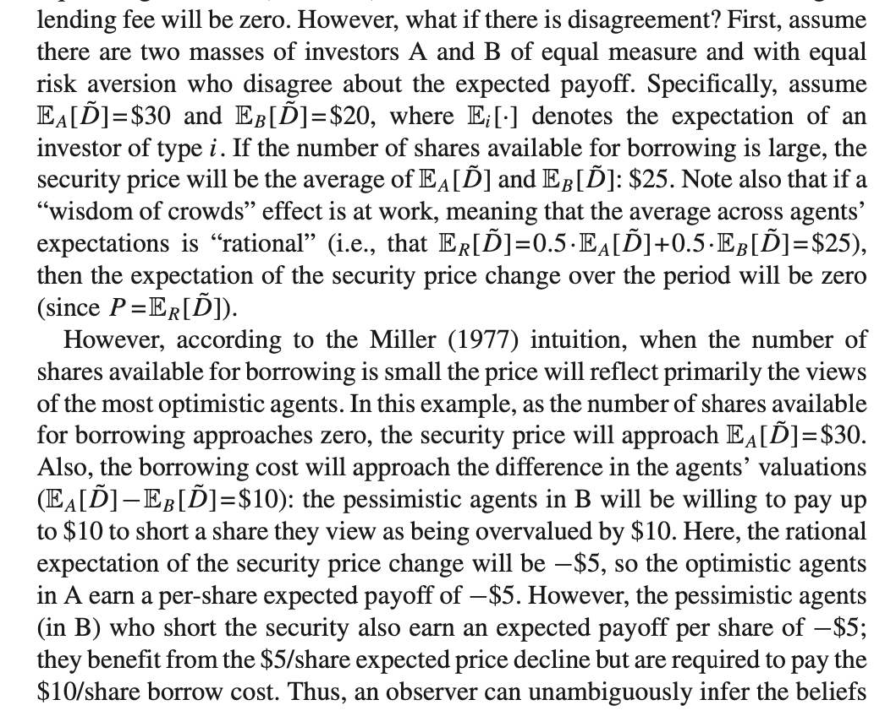

  - Therefore, with short-sell restriction, the price at t0 will always reveal the view of optimistic agents.

  - After a positive price shock, the beliefs of the most optimistic agents are too optimistic at time 0 and decay towards rational beliefs over a roughly 5-year period which results in a strong, persistent negative abnormal returns.

  - After a negative price shocks, the beliefs of the most optimistic agents are also too optimistic, suggesting these agents initially underreact to the new negative information, but that this underreaction is resolved after only 1 year which results in the shorter-lived negative abnormal returns.

    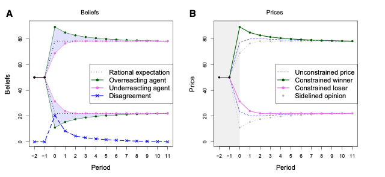

- [Kelly, Bryan T., Tobias J. Moskowitz, and Seth Pruitt. "Understanding momentum and reversal." *Journal of financial economics* 140.3 (2021): 726-743.](https://www.sciencedirect.com/science/article/pii/S0304405X21000878)

  - Momentum is strongly linked to time-varying risk exposure. The conditional factor model explains a significant portion of the momentum premium.

  - Candidate models are residual momentum, traditional momentum and conditional factor model defined by IPCA. IPCA estimator is defined as the conditional expectation of the factor component of returns, $$\beta_{i, t}^{\prime} \lambda_t$$, where $$\lambda_t=E_t\left[f_{t+1}\right]$$. To focus squarely on the role of time-varying risk exposures, our analysis treats the expected factor return as constant: $$E_t\left(f_{t+1}\right)=\lambda$$. 

  - IPCA [Kelly, Pruitt, and Su (JFE 2019)](https://www.sciencedirect.com/science/article/pii/S0304405X19301151) explain: 
    $$
    r_{i, t+1}=\underbrace{\left(z_{i, t}^{\prime} \Gamma\right)}_{\beta_{i, t}} f_{t+1}+\epsilon_{i, t+1}
    $$
    where $$r_{i, t+1}$$ is the future asset $$i$$ return in period $$t+1$$, $$z_{i, t} \in \R^{L}$$ is time-varying observable asset characteristics (instrument vector), $$\Gamma \in \R^{L \times K}$$ is a fixed mapping from observable characteristics to  latent risk factors, $$f_{t+1} \in \R^K$$ is the latent factor return. This esti

    - In traditional asset pricing, $$\beta_{i, t}$$ is factor exposure for asset i estimated by Fama-Macbeth and $$f_{t+1}$$​ is the (double-sorted) factor (portfolio) return (FF 3/5 factors). 
    - IPCA allows time-varying observable characteristics, inference from not only return-covariance, and parameter efficient (no need to estimate $$\mathcal{O}(N \times K)$$ factor exposure, but $$\mathcal{O}(L \times K)$$ mapping). It is similar to BARRA model but maps to low-dimentional latent risk factor space.
    - Kelly, Pruitt, and Su (JFE 2019) propose to estimate $$\Gamma, f_{t+1}$$​​ recursively

    

    - The linear form IPCA has been extended to DNN in [Gu, Shihao, Bryan Kelly, and Dacheng Xiu. "Autoencoder asset pricing models." *Journal of Econometrics* 222.1 (2021): 429-450.](https://www.sciencedirect.com/science/article/pii/S0304407620301998)

- [Della Vedova, Joshua, Andrew Grant, and P. Joakim Westerholm. "Investor behavior at the 52-Week high." *Journal of Financial and Quantitative Analysis* 58.7 (2023): 2852-2889.](https://www.cambridge.org/core/journals/journal-of-financial-and-quantitative-analysis/article/investor-behavior-at-the-52week-high/5D1C7CA21396521F3B41D91B06A25BE1)
  - Individual investors are more likely to sell stocks near the 52WH due to the **disposition effect** (a tendency to sell assets that have increased in value) and **anchoring bias** (relying too heavily on the 52WH as a reference point).
  - Stocks that experience high levels of limit order selling by individual investors at and around the 52WH tend to have abnormally high returns in the period following the 52WH.

- [Murray, Scott, Yusen Xia, and Houping Xiao. "Charting by machines." *Journal of Financial Economics* 153 (2024): 103791.](https://www.sciencedirect.com/science/article/pii/S0304405X2400014X)

  - The ML models inputs: 12 monthly cumulative return, LHS: the upcoming month excess return.
  - ML model prediction is signigicantly positive even after controlling for popular risk factors.

## NLP

- Wolfe Research | Text mining unstructured corporate filing data
  - EDGAR 10-K and 10-Q filings (by section comparison)
  - Features:
    - Sentiment and tone analysis
    - chanes in sentiment
    - distance measures (YoY embedding/BoW)
- [Learning Fundamentals from Text](https://papers.ssrn.com/sol3/papers.cfm?abstract_id=5047947)
  - Use attention machenism to weigh the importance of different paragraphs in a document, focusing on those that are most relevant to market reactions.  The document-level aggregated vector is then used to predict the target variable, which is the direction of stock returns around the filing date.

- [Lee, Charles MC, and Qinlin Zhong. "Shall we talk? The role of interactive investor platforms in corporate communication." *Journal of Accounting and Economics* 74.2-3 (2022): 101524.](https://www.sciencedirect.com/science/article/pii/S0165410122000477)

  - Investor interactive platforms (IIPs) in China

  - random sample of around 50,000 questions and then employed a state-of-the-art BERT-based algorithm to classify the remaining 2.45 million postings.

    - **Findings:** About 80% of questions seek clarification or explanation about specific items in financial reports or company operations, 16.6% are comments or suggestions to management, and the remaining questions pertain to verifying rumors or addressing misunderstandings.

  - These platforms alleviate common investor challenges, stimulate trading, improve market liquidity, and enhance the informativeness of stock prices.

    

## Portfolio Construction

- [Risk Parity](../notes/risk_parity.html)

## General Knowledge

- [The Element of Financial Econometrics](../notes/Fin_Fan_Book.html)