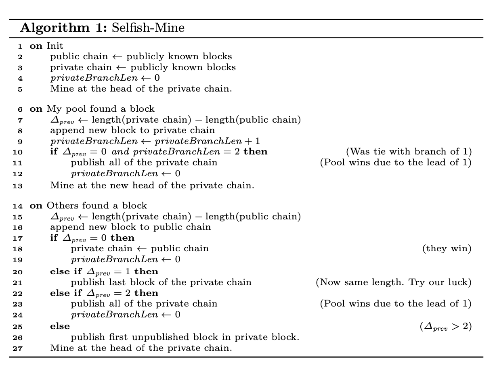

# Majority is not enough: Bitcoin mining is vulnerable

- [Eyal, Ittay, and Emin Gün Sirer. "Majority is not enough: Bitcoin mining is vulnerable." In *International conference on financial cryptography and data security*, pp. 436-454. Springer, Berlin, Heidelberg, 2014.](https://link.springer.com/chapter/10.1007/978-3-662-45472-5_28)

## Summary

1. Selfish Mining strategy: a pool keeps its discovered blocks private, thereby intentionally forks the chain. The honest nodes continue to mine on the public chain, while the pool mines on its own private branch. If the pool discovers more blocks, it develops a longer lead on the public chain, and continues to keep these new blocks private. When the public branch approaches the pool’s private branch in length, the selfish miners reveal blocks from their private chain to the public.
2. This strategy leads honest miners that follow the Bitcoin protocol to waste resources on mining cryptopuzzles that end up serving no purpose. While both honest and selfish parties waste some resources, the honest miners waste proportionally more, and the selfish pool’s rewards exceed its share of the network’s mining power, conferring it a competitive advantage and incentivizing rational miners to join the selfish mining pool.
3. Above a certain threshold size, the revenue of a selfish pool rises superlinearly with pool size above its revenue with the honest strategy.
4. This strategy shows that Bitcoin’s mining algorithm is not incentive compatible.

