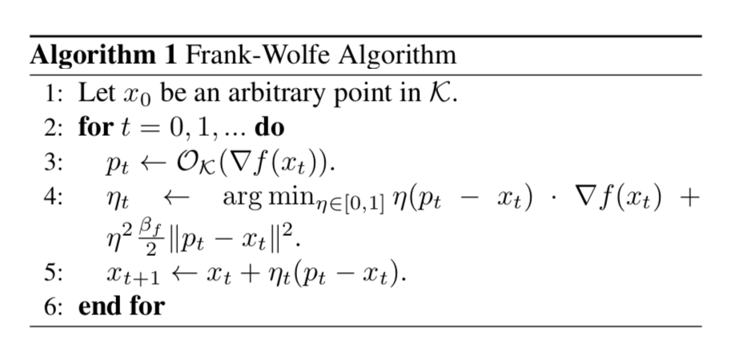

# Faster Rates for the Frank-Wolfe Method over Strongly-Convex Sets

- [Garber, D., & Hazan, E. (2015). Faster rates for the frank-wolfe method over strongly-convex sets. In 32nd International Conference on Machine Learning, ICML 2015.](http://proceedings.mlr.press/v37/garbera15-supp.pdf)

- [Yuxin Chen's lecture notes for Frank-Wolfe method](http://www.princeton.edu/~yc5/ele522_optimization/lectures/grad_descent_constrained.pdf)

## Summary

This paper consider the special case of optimization over strongly convex sets, for which the authors prove a convergence rate of $$\frac{1}{t^2}$$ for Frank-Wolfe method. They also show that various balls induced by $$l_p$$ norms, Schatten norms and group norms are strongly convex on one hand and on the other hand, linear optimization over these sets is straightforward and admits a closed-form solution.

## Frank-Wolfe method

The Frank-Wolfe method, originally introduced by Frank and Wolfe in the 1950's, is a first order method for the minimization of a smooth convex function over a convex set. Compared to projection method, which is also a first order method on convex set, Frank-Wolfe method is projection free. Its main advantage in large-scale problems is that this projection-free characteristic makes computation efficient. First order and projection-free features enabled the derivation of algorithms that are practical on one hand and come with provable convergence rates on the other.

Above is the general Frank-Wolfe method, where $$\mathcal{K} \subset E$$ is the convex feasible set and $$\mathcal{O}_{\mathcal{K}}(c), c \in E$$ returns a point $$x=\mathcal{O}_{\mathcal{K}}(c) \in \mathcal{K}$$ such that $$x \in \arg \min _{y \in \mathcal{K}} \langle y, c \rangle$$. Step 4 does the exact line search for Frank-Wolfe method. In fact, the RHS is a upper bound for the exact line search object $$\min_{\eta_t} f(x_{t}+\eta_{t}\left(p_{t}-x_{t}\right))$$ and is a easy-to-solve quadratic form.

## Previous result

**Theorem.** *If $$f$$ is a $$\beta_f$$-smooth function, let $$x^{*} \in \arg \min _{x \in \mathcal{K}} f(x)$$ and denote $$D_{\mathcal{K}} = \max _{x, y \in \mathcal{K}}\|x-y\|$$  (the diameter of the set with respect to $$\|\cdot\|$$). For every $$t \geq 1$$, the iterate $$x_t$$ of the above Algorithm satisfies*
$$
f\left(x_{t}\right)-f\left(x^{*}\right) \leq \frac{8 \beta_{f} D_{\mathcal{K}}^{2}}{t}=O\left(\frac{1}{t}\right)
$$

## New result

**Theorem.** *If $$f$$ is a $$\beta_f$$-smooth and $$\alpha_f$$-strongly convex function with respect to $$\|\cdot\|$$, and the feasible set $$\mathcal{K}$$ is $$\alpha_{\mathcal{K}}$$-strongly convex with respect to $$\|\cdot\|$$. Let $$x^{*} \in \arg \min _{x \in \mathcal{K}} f(x)$$, let $$M = \frac{\sqrt{\alpha_{f}} \alpha_{K}}{8 \sqrt{2} \beta_{f}}$$ and denote $$D_{\mathcal{K}} = \max _{x, y \in \mathcal{K}}\|x-y\|$$  (the diameter of the set with respect to $$\|\cdot\|$$). For every $$t \geq 1$$, the iterate $$x_t$$ of the above Algorithm satisfies*
$$
f\left(x_{t}\right)-f\left(x^{*}\right) \leq \frac{\max \left\{\frac{9}{2} \beta_{f} D_{\mathcal{K}}^{2}, 18 M^{-2}\right\}}{(t+2)^{2}}=O\left(\frac{1}{t^{2}}\right)
$$

