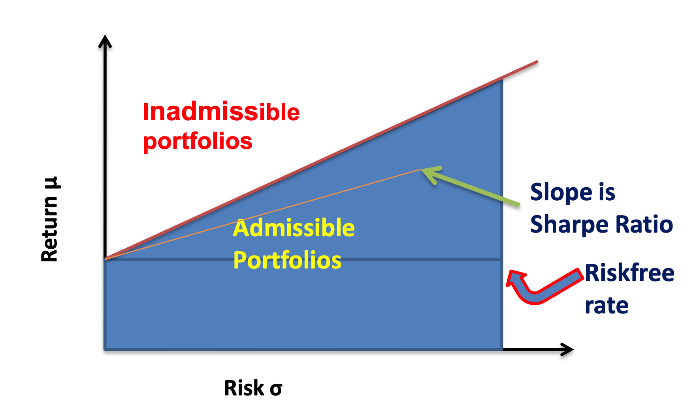

# The Element of Financial Econometrics

- [Fan, Jianqing, Yuan Liao, and Martina Mincheva. "Large covariance estimation by thresholding principal orthogonal complements." Journal of the Royal Statistical Society: Series B (Statistical Methodology) 75.4 (2013): 603-680.](https://rss.onlinelibrary.wiley.com/doi/full/10.1111/rssb.12016)

- [Fan, Jianqing, Yuan Liao, and Xiaofeng Shi. "Risks of large portfolios." Journal of econometrics 186.2 (2015): 367-387.](https://www.sciencedirect.com/science/article/pii/S0304407615000391)

- [Fan, Jianqing, and Runze Li. "Variable selection via nonconcave penalized likelihood and its oracle properties." Journal of the American statistical Association 96.456 (2001): 1348-1360.](https://amstat.tandfonline.com/doi/pdf/10.1198/016214501753382273?needAccess=true)

- [Zou, Hui, and Runze Li. "One-step sparse estimates in nonconcave penalized likelihood models." Annals of statistics 36.4 (2008): 1509.](https://projecteuclid.org/download/pdfview_1/euclid.aos/1216237287)

- [Fan, Jianqing, Jingjin Zhang, and Ke Yu. "Vast portfolio selection with gross-exposure constraints." Journal of the American Statistical Association 107.498 (2012): 592-606.](https://orfe.princeton.edu/~jqfan/papers/12/Portfolio-JASA.pdf)

## Chapter 5 The Efficient Portfolios and CAPM

### With Risk-free asset

Optimize allocation factor using Markowitz's mean-variance optimization, which is equivalent to optimize the expected utility under exponential utility. Notice that the risk-free asset here can be used to eliminate the constraint of weights sum to one.

For any optimal solutions, they have the same Sharpe ratio, therefore the efficient frontier is a line with slope=optimal Sharpe ratio and intercept the risk-free rate.

It can be shown that the market portfolio (with market value-weighted allocation vector) is on the efficient frontier and by two fund separation theorem, any efficient portfolio can be decomposed into the market portfolio and the risk-free one.

**CAPM**: For the excess return $$Y$$ of any portfolio, denote $$Y^m$$ as the excess return of market portfolio, we have

$$
Y = \beta Y^m + \epsilon, \; \; \beta = \frac{\mathrm{Cov}(Y, Y^m)}{\mathrm{Var}(Y^m)}
$$

and $$\epsilon$$ is the external noise.

The CAPM model can be validated using

- Econometrics: regression and hypothesis testing
- Maximum likelihood estimation with Wald test or likelihood ratio test.

### Without Risk-free asset

We need to solve a constraint version of Markowitz's mean-variance optimization problem. It is also not hard using Lagrangian. This time, the efficient frontier is a parabola.

For any portfolio on the frontier, you can find another one on the frontier that has zero beta with the previous one. The CAPM model is similarly formulated using one portfolio (as market portfolio) and its excess return is compared using its zero-beta counterparts (as risk-free one).

## Chapter 6 Factor Pricing Models

### Multi-factor models

The **multi-factor model** with return $$\boldsymbol{R}$$, factor loading matrix $$\boldsymbol{B}$$, factor $$\boldsymbol{f}$$ and external noise $$\epsilon$$,

$$
\boldsymbol{R} = \boldsymbol{a} + \boldsymbol{B} \boldsymbol{f} + \boldsymbol{\epsilon}
$$

The **multi-factor pricing model** with expected return $$\boldsymbol{\mu} = \mathbb{E}[\boldsymbol{R}]$$, risk-free return $$\gamma_0$$,

$$
\boldsymbol{R} = \gamma_0 \boldsymbol{1} + \boldsymbol{B} (\boldsymbol{f} - \gamma_0 \boldsymbol{1}) + \boldsymbol{\epsilon}, \; \; \boldsymbol{\mu} = \gamma_0 \boldsymbol{1} + \boldsymbol{B} \boldsymbol{\lambda}_k
$$

where $$\boldsymbol{\lambda}_k = \mathbb{E}[\boldsymbol{f}] - \gamma_0 \boldsymbol{1}$$ is the excess return of factors. Using multi-factor pricing model, we can estimate the covariance matrix of return $$\boldsymbol{R}$$ with fewer parameters:

$$
\mathrm{var}(\boldsymbol{R}) = \boldsymbol{B}\mathrm{var}(\boldsymbol{f}) \boldsymbol{B}^\top + \mathrm{var}(\boldsymbol{\epsilon})
$$

Notice that multi-factor model is always valid since this is a statistical decomposition (P245) but multi-factor pricing model needs to be validated.

### Validate multi-factor pricing model

If there is a risk-free asset, the multi-factor pricing model can be formed as

$$
\boldsymbol{Y} = \boldsymbol{a} + \boldsymbol{B} (\boldsymbol{f} - \gamma_0 \boldsymbol{1}) + \boldsymbol{\epsilon}
$$

where $$\boldsymbol{Y}$$ is the excess return of all asset and the hypothesis test is simply,

$$
H_0: \boldsymbol{\alpha} = 0
$$

If there is not a risk-free asset, we need to compare multi-factor model with multi-factor pricing model and the hypothesis test is,

$$
H_0: \boldsymbol{\alpha} = \gamma_0 \left(\boldsymbol{1} - \boldsymbol{B} \boldsymbol{1}\right)
$$

Both test can be done using a likelihood ratio test where $$\boldsymbol{B}, \boldsymbol{\lambda}_k$$ (and $$\gamma_0$$ in the risk-free absence case) can be estimated using maximum likelihood estimation iteratively if we assume the residual $$\boldsymbol{\epsilon}$$ has a normal distribution.

If we use macroeconomic factors, whose excess return cannot be observed, we can estimate $$\boldsymbol{\lambda}_k$$ using MLE and change the hypothesis test accordingly.

### PCA and factor analysis

For the multi-factor pricing model, if we assume the residual covariance matrix is identity matrix, then it can be shown that the solution of MLE is the same as PCA results. $$\boldsymbol{B}$$ and the first $$K$$ principal component of sample covariance matrix of return $$\boldsymbol{R}$$ span the same subspace.

When the portfolio size is large, the PCA and factor analysis are approximately the same. See [Fan, Liao and Mincheva (2013)](https://rss.onlinelibrary.wiley.com/doi/full/10.1111/rssb.12016).

## Chapter 7 Portfolio Allocation and Risk Assessment

### Risk approximation

For any portfolio allocation vector $$\boldsymbol{w}$$, we define the gross exposure $$c$$ of the portfolio as $$c = \| \boldsymbol{w} \|_1$$. Therefore,

$$
\boldsymbol{w}^+ = \sum_{w_i \geq 0} w_i = \frac{c+1}{2}, \; \; \boldsymbol{w}^- = \sum_{w_i < 0} w_i = \frac{c-1}{2}
$$

The variance of this portfolio is

$$
R(\boldsymbol{w}) = w^\top \boldsymbol{\Sigma} =  \boldsymbol{w}, \; \; \boldsymbol{\Sigma} = \mathrm{var}(\boldsymbol{R})
$$

with estimated covariance matrix $$\widehat{\boldsymbol{\Sigma}}$$, the empirical risk is

$$
\widehat{R}(\boldsymbol{w}) = \boldsymbol{w}^\top \widehat{\boldsymbol{\Sigma}} \boldsymbol{w}
$$

For any portfolio with allocation vector $$\boldsymbol{w}$$,

$$
| R(\boldsymbol{w}) - \widehat{R}(\boldsymbol{w}) | \leq e_{\mathrm{max}} c^2
$$

where $$e_{\mathrm{max}} = \max_{i,j} |\sigma_{ij} - \widehat{\sigma}_{ij}| = \|\widehat{\boldsymbol{\Sigma}} - \boldsymbol{\Sigma} \|_{\infty}$$.

[Fan, Liao and Shi (2015)](https://www.sciencedirect.com/science/article/pii/S0304407615000391) use the concept of high confidence level upper bound (H-CLUB),

$$
\mathbb{P} \left[| R(\boldsymbol{w}) - \widehat{R}(\boldsymbol{w}) | \geq \widehat{U}(\tau) \right] \rightarrow 1 - \tau, \; \; \tau \in (0,1)
$$

### Estimation of a large volatility matrix

#### Exponential Smoothing

Denote $$\mathrm{var}_t(\boldsymbol{R}_{t+1}) = \boldsymbol{\Sigma}_t$$ the conditional covariance matrix of return on time $$t+1$$. The traditional way to estimate is using the return matrix from time $$t$$ to time $$1$$ and compute the sample covariance matrix as

$$
\widehat{\boldsymbol{\Sigma}}_t = \frac{1}{t} \sum_{i=0}^{t-1} \boldsymbol{R}_{t-i} \boldsymbol{R}^\top_{t-i}
$$

If we consider to localize the data, one naive way is to define a window $$h \ll t$$ and

$$
\widehat{\boldsymbol{\Sigma}}_t = \frac{1}{h} \sum_{i=0}^{h-1} \boldsymbol{R}_{t-i} \boldsymbol{R}^\top_{t-i}
$$

A better way is using **Exponential Smoothing** method, with a smoothing parameter $$\lambda$$,

$$
\widehat{\boldsymbol{\Sigma}}_t = (1-\lambda) \frac{1}{t} \sum_{i=0}^{t-1} \lambda^i \boldsymbol{R}_{t-i} \boldsymbol{R}^\top_{t-i}
$$

and the estimated volatility matrix can be computed recursively as

$$
\widehat{\boldsymbol{\Sigma}}_t = \lambda \widehat{\boldsymbol{\Sigma}}_{t-1} + (1 - \lambda) \boldsymbol{R}_{t} \boldsymbol{R}^\top_{t}
$$

#### Thresholding regularization

When the portfolio size is large, to deal with the ill-conditioned problem in estimation of volatility matrix, we can use a thresholding method. Given our estimated matrix $$\widehat{\boldsymbol{\Sigma}}$$ and a thresholding parameter $$\lambda$$,

$$
\widehat{\boldsymbol{\Sigma}}_\lambda = \left(\widehat{\sigma}_{ij} I\left(|\widehat{\sigma}_{ij}| \geq \lambda\right)\right)_{(ij)}
$$

or using a adaptive thresholding estimator,

$$
\widehat{\boldsymbol{\Sigma}}_\lambda = \left(\widehat{\sigma}_{ij} I\left(|\widehat{\sigma}_{ij} / \mathrm{SE}(\widehat{\sigma}_{ij})| \geq \lambda\right)\right)_{(ij)}
$$

where $$\mathrm{SE}(\widehat{\sigma}_{ij})$$ is the estimated standard error of $$\widehat{\sigma}_{ij}$$.

#### Projection onto positive definite matrix space

To make our estimated covariance matrix $$\widehat{\boldsymbol{\Sigma}}_\lambda$$ a valid covariance matrix after thresholding, we can use

$$
\widehat{\boldsymbol{\Sigma}}_\lambda = \boldsymbol{\Gamma}^\top \mathrm{diag}(\lambda_1, \cdots, \lambda_p) \boldsymbol{\Gamma}, \; \; \widehat{\boldsymbol{\Sigma}}_\lambda^+ = \boldsymbol{\Gamma}^\top \mathrm{diag}(\lambda_1^+, \cdots, \lambda_p^+) \boldsymbol{\Gamma}
$$

or we can solve a optimization problem, for any symmetric matrix $$\boldsymbol{A}$$,

$$
\min_{\boldsymbol{R}} \| \boldsymbol{A} - \boldsymbol{R} \|_F^2, \; \; \mathrm{s.t.} \; \boldsymbol{R} \succeq 0, \mathrm{diag}(\boldsymbol{R}) = \boldsymbol{I}_p
$$

Here $$\boldsymbol{A}$$ is set to

$$
\mathrm{diag}(\widehat{\boldsymbol{\Sigma}}_\lambda)^{-1/2} \widehat{\boldsymbol{\Sigma}}_\lambda \mathrm{diag}(\widehat{\boldsymbol{\Sigma}}_\lambda)^{-1/2}
$$

and for the solution to the optimization problem $$\widehat{\boldsymbol{R}}_\lambda$$, the corrected covariance matrix is

$$
\mathrm{diag}(\widehat{\boldsymbol{\Sigma}}_\lambda)^{1/2} \widehat{\boldsymbol{R}}_\lambda \mathrm{diag}(\widehat{\boldsymbol{\Sigma}}_\lambda)^{1/2}
$$

#### Regularization by penalized likelihood

Penalized likelihood is useful to explore the sparsity. Denote $$l_T(\boldsymbol{\theta})$$ be the log-likelihood function, we assume $$\boldsymbol{\theta}$$ is sparse and the penalized likelihood is

$$
\arg \min_{\boldsymbol{\theta}} \left\{-\frac{2}{T}l_T(\boldsymbol{\theta}) + \sum_{i=1}^p p_\lambda(|\theta_j|)\right\}
$$

where $$p_\lambda$$ is a penalty function. Usually we set $$p_\lambda(|\theta|) = \lambda I(\theta \neq 0)$$, the $$L_0$$ penalty, which results in the best subset selection. However, it is computationally expensive. The LASSO estimator, which uses $$L_1$$-penalty, is a convex relaxation but introduces biases due to the shrinkage of LASSO.

[Fan and Li (2001)](https://amstat.tandfonline.com/doi/pdf/10.1198/016214501753382273?needAccess=true) introduced a family of folded-concave penalty functions such as the smoothly clipped absolute deviation (SCAD) whose derivative is

$$
p_\lambda^\prime(t) = \lambda \left\{I(t \leq \lambda) + \frac{(a \lambda - t)_+}{(a - 1)\lambda} I(t > \lambda) \right\}
$$

The penalized likelihood with SCAD as penalty function can be solved by an iterated re-weighted LASSO using a local linear approximation ([Zou and Li (2008)](https://projecteuclid.org/download/pdfview_1/euclid.aos/1216237287)). For any estimate at $$k$$, $$\widehat{\boldsymbol{\theta}}^{(k)}$$, the target is

$$
Q_{k+1}(\boldsymbol{\theta}) = -\frac{2}{T}l_T(\boldsymbol{\theta}) + \sum_{i=1}^p w_{k,j} |\theta_j| + c
$$

where $$w_{k,j} = p_\lambda^\prime\left(|\widehat{\theta}_j^{(k)}| \right)$$ and

$$
c = \sum_{j=1}^p \left[p_\lambda\left(|\widehat{\theta}_j^{(k)}|\right)- p_\lambda^\prime \left(|\widehat{\theta}_j^{(k)}| \right) |\widehat{\theta}_j^{(k)}| \right]
$$

It can be shown that this algorithm is a majorization-minimization algorithm where the target value is decreasing with respect to sequence $$\widehat{\boldsymbol{\theta}}^{(k)}$$.

#### Estimate volatility matrix using factor model

Given factor model

$$
\boldsymbol{R} = \boldsymbol{a} + \boldsymbol{B} \boldsymbol{f} + \boldsymbol{\epsilon}
$$

We can run a regression to obtain $$\widehat{\boldsymbol{B}}$$ and the regression residuals $$\hat{\sigma}_1^2, \cdots, \hat{\sigma}_p^2$$. And we can compute sample covariance matrix $$\boldsymbol{\Sigma}_f$$ of $$\boldsymbol{f}$$. If we assume noise terms are independent of each other, we have the strict factor model based estimator,

$$
\widehat{\boldsymbol{\Sigma}}^S = \widehat{\boldsymbol{B}} \widehat{\boldsymbol{\Sigma}}_f \widehat{\boldsymbol{B}}^\top + \mathrm{diag}(\hat{\sigma}_1^2, \cdots, \hat{\sigma}_p^2)
$$

This estimator has a better rate for estimating $$\boldsymbol{\Sigma}^{-1}$$ and the same rate for estimating $$\boldsymbol{\Sigma}$$ compared to the sample covariance matrix of $$\boldsymbol{R}$$.

If instead we do not assume the uncorrelatedness of noise term, but explore the sparsity instead. We will have the following approximate factor model estimator,

$$
\widehat{\boldsymbol{\Sigma}}^A = \widehat{\boldsymbol{B}} \widehat{\boldsymbol{\Sigma}}_f \widehat{\boldsymbol{B}}^\top + \widehat{\boldsymbol{\Sigma}}_{\boldsymbol{\epsilon}, \lambda}^*
$$

where $$\widehat{\boldsymbol{\Sigma}}_{\boldsymbol{\epsilon}, \lambda}^*$$ is the estimated error covariance matrix applied thresholding on correlation matrix with parameter $$\lambda$$.

Notice that if $$\lambda=1$$, then $$\widehat{\boldsymbol{\Sigma}}^A = \widehat{\boldsymbol{\Sigma}}^S$$ and if $$\lambda=0$$, $$\widehat{\boldsymbol{\Sigma}}^A$$ is the sample covariance matrix of $$\boldsymbol{R}$$.

Now consider the approximate factor model with unobserved factors, we can use Principal Orthogonal complEment Thresholding (POET) by [Fan, Liao and Mincheva (2013)](https://rss.onlinelibrary.wiley.com/doi/full/10.1111/rssb.12016).

1. Obtain the sample covariance matrix $$\boldsymbol{S}$$ based on $$T$$ returns.
2. Run a singular value decomposition: $$\boldsymbol{S}=\sum_{j=1}^{p} \widehat{\lambda}_{j} \widehat{\boldsymbol{\xi}}_{j} \widehat{\boldsymbol{\xi}}_{j}^{T}$$.
3. Compute the residual covariance matrix $$\widehat{\boldsymbol{Q}}=\sum_{j=K+1}^{p} \widehat{\lambda}_{j} \widehat{\boldsymbol{\xi}}_{j} \widehat{\boldsymbol{\xi}}_{j}^{\top}$$.
4. Regularize $$Q$$ to obtain $$\widehat{Q}_{\lambda},$$ e.g. correlation matrix thresholding.
5. Compute the POET estimator as

$$
\widehat{\boldsymbol{\Sigma}}_{\lambda}^{P}=\sum_{j=1}^{K} \widehat{\lambda}_{j} \widehat{\boldsymbol{\xi}}_{j} \widehat{\boldsymbol{\xi}}_{j}^{T}+\widehat{\boldsymbol{Q}}_{\lambda}
$$

POET encompasses many methods, when $$\lambda=0$$, it is sample covariance matrix; when $$\lambda=1$$, it is strict factor model with unknown factors; when $$K=0$$, it is thresholded sample covariance matrix.

#### High-dimensional PCA and factor analysis

The factor model

$$
\boldsymbol{R}_t = \boldsymbol{a} + (\boldsymbol{B} \boldsymbol{H}) (\boldsymbol{H}^{-1}\boldsymbol{f}_t) + \boldsymbol{\epsilon}_t
$$

for any non-singular matrix $$\boldsymbol{H}$$. Therefore, we can assume $$\mathrm{var}(\boldsymbol{f}_t) = \boldsymbol{I}_K$$ and columns of $$\boldsymbol{B}$$ are orthogonal. Therefore,

$$
\boldsymbol{\Sigma} = \boldsymbol{B} \boldsymbol{B}^\top + \boldsymbol{\Sigma}_\epsilon
$$

If the factors are strong (pervasive), then we have asymptotically,

$$
\sum_{j=K+1}^{p} \widehat{\lambda}_{j} \widehat{\boldsymbol{\xi}}_{j} \widehat{\boldsymbol{\xi}}_{j}^{\top} \approx \sum_{j=1}^K \boldsymbol{b}_j \boldsymbol{b}_j^\top = \boldsymbol{B} \boldsymbol{B}^\top
$$

and

$$
f_{jt} \approx \boldsymbol{\xi}^\top_j \boldsymbol{R}_t / \lambda_j^{1/2}
$$

where $$\{\boldsymbol{\xi}_j\}, \{\lambda_j\}$$ are the eigenvectors and eigenvalues of covariance matrix of $$\boldsymbol{R}_t$$.

### Portfolio allocation with gross-exposure constraints

Our previous Markowitz’s mean-variance analysis is usually too sensitive on input vectors and their estimation errors and can result in extreme short positions. This problem is more severe for large portfolio.

We consider optimization with gross-exposure constraint:

$$
\begin{aligned}
&\min_{\boldsymbol{w}} R(\boldsymbol{w}) =  \boldsymbol{w}^\top \boldsymbol{\Sigma} \boldsymbol{w}  \\
\text{s,t.} \; \; &\boldsymbol{w}^{\top} \mathbf{1}=1, \; \|\boldsymbol{w}\|_{1} \leq c, \; \boldsymbol{w}^\top \boldsymbol{\mu} = \alpha
\end{aligned}
$$

Now if we only consider the risk profile not the return. We can define actual and perceived risks:

$$
R(\boldsymbol{w})=\boldsymbol{w}^{T} \boldsymbol{\Sigma} \boldsymbol{w}, \quad \widehat{R}(\boldsymbol{w})=\boldsymbol{w}^{T} \widehat{\boldsymbol{\Sigma}} \boldsymbol{w}
$$

and oracle and empirical allocation vectors

$$
\boldsymbol{w}_{o p t}=\operatorname{argmin}_{\boldsymbol{w}^{\top} \mathbf{1}=1, \; \|\boldsymbol{w}\|_{1} \leq c} R(\boldsymbol{w}), \quad \widehat{\boldsymbol{w}}_{o p t}=\operatorname{argmin}_{\boldsymbol{w}^{\top} \mathbf{1}=1, \; \|\boldsymbol{w}\|_{1} \leq c} \widehat{R}(\boldsymbol{w})
$$

Let $$e_{\max}=|\widehat{\boldsymbol{\Sigma}}-\boldsymbol{\Sigma}|_{\infty}$$. Then, we have,

$$
\begin{array}{l}{\left|R\left(\widehat{\boldsymbol{w}}_{o p t}\right)-R\left(\boldsymbol{w}_{o p t}\right)\right| \leq 2 e_{\max } c^{2}} \\ {\left|R\left(\widehat{\boldsymbol{w}}_{o p t}\right)-\widehat{R}\left(\widehat{\boldsymbol{w}}_{o p t}\right)\right| \leq e_{\max } c^{2}} \\ {\left|R\left(\boldsymbol{w}_{o p t}\right)-\widehat{R}\left(\widehat{\boldsymbol{w}}_{o p t}\right)\right| \leq e_{\max } c^{2}}\end{array}
$$

Now we show the convergence rate of $$e_{\max}=|\widehat{\boldsymbol{\Sigma}}-\boldsymbol{\Sigma}|_{\infty}$$. If for a sufficiently large $$x$$,

$$
\max _{i, j} P\left\{b_{T}\left|\sigma_{i j}-\hat{\sigma}_{i j}\right|>x\right\}<\exp \left(-C x^{1 / a}\right)
$$

for some positive constants a and $$C$$ and rate $$b_{T}$$, then

$$
|\Sigma-\hat{\Sigma}|_{\infty}=O_{P}\left(\frac{(\log p)^{a}}{b_{T}}\right)
$$

Moreover, suppose that $$\left\|R_{t}\right\|_{\infty}$$ is bounded and that the returns are weakly dependent in that its $$\alpha$$ mixing coefficient $$\alpha(q)$$ decays exponentially, namely $$\alpha(q)= O\left(\exp \left(-C q^{1 / b}\right)\right)$$ for some $$b<2 a-1$$. If $$\log p=o\left(n^{1 /(2 b+1)}\right)$$, then we have the above convergence rate. (See [Fan, Zhang and Yu (2012)](https://orfe.princeton.edu/~jqfan/papers/12/Portfolio-JASA.pdf))

To better understand why the gross-exposure constraint helps on risk approximation, we make connections with covariance regularization. By the Lagrange multiplier method, our previous risk profile optimization is,

$$
\boldsymbol{w}^{\top} \hat{\boldsymbol{\Sigma}} \boldsymbol{w} / 2+\lambda_{1}\left(\|\boldsymbol{w}\|_{1}-c\right)+\lambda_{2}\left(1-\boldsymbol{w}^{\top} \mathbf{1}\right)
$$

Let $$g$$ be the sub-gradient vector of the function $$\|w\|_{1}$$, whose $$i^{t h}$$ element is $$-1$$, $$1$$ or any values in $$[-1,1]$$ depending on whether $$w_{i}$$ is positive, negative or zero, respectively. Then, the first order condition is

$$
\begin{array}{l}{\hat{\boldsymbol{\Sigma}} \boldsymbol{w}+\lambda_{1} \boldsymbol{g}-\lambda_{2} \mathbf{1}=0} \\ {\lambda_{1}\left(c-\|\boldsymbol{w}\|_{1}\right)=0, \quad \lambda_{1} \geqslant 0}\end{array}
$$

in addition to the constraints $$\boldsymbol{w}^{\top} \mathbf{1}=1$$ and $$\|\boldsymbol{w}\|_{1} \leqslant c$$. Let $$\tilde{\boldsymbol{w}}$$ be the solution. We can show that it is also the solution to the unconstrained portfolio optimization problem

$$
\min _{\boldsymbol{w}^{\top} \mathbf{1}=1} \boldsymbol{w}^{\top} \tilde{\boldsymbol{\Sigma}}_{c} \boldsymbol{w}
$$

in which, with $$\tilde{g}$$ being the gradient evaluated at $$\tilde{\boldsymbol{w}}$$,

$$
\tilde{\boldsymbol{\Sigma}}_{c}=\hat{\boldsymbol{\Sigma}}+\lambda_{1}\left(\tilde{\boldsymbol{g}} \mathbf{1}^{\top}+\mathbf{1} \tilde{\boldsymbol{g}}^{\top}\right)
$$

We now show the link between regression and risk profile optimization. Set $$R_p = Y, X_j = R_j - R_p$$, we have

$$
\begin{aligned}
\mathrm{var}(\boldsymbol{w}^\top \boldsymbol{R})
&= \min_b \mathbb{E} \left(\boldsymbol{w}^\top \boldsymbol{R} - b\right)^2 \\
&= \min_b \mathbb{E} \left(Y - w_1 X_1 - \cdots - w_{p-1} X_{p-1} - b\right)^2 \\
\end{aligned}
$$

and the constraint on gross-exposure can be replaced by a similar $$L_1$$ norm.

## Chapter 8 Consumption based CAPM

### CCAPM

Representative consumer consumes on a representative good with quantity $$C_{t}$$ and price
$$p_{t}$$ at time $$t$$. His income consists of external income $$I_{t}$$ and $$\boldsymbol{\alpha}_{t}$$ shares on stocks with price $$\boldsymbol{S}_{t}$$. Now we have the budget constraint,

$$
p_{t} C_{t}=I_{t}+\left(\boldsymbol{\alpha}_{t-1}-\boldsymbol{\alpha}_{t}\right)^{T} \boldsymbol{S}_{t}
$$

The Intertemporal choice problem: Let $$\delta$$ be the subjective dis- count factor. An individual wants to maximize w.r.t. $$\boldsymbol{\alpha}_t$$ the discounted expect utility, under the budget constraint

$$
\max \mathbb{E}_{t}\left(\sum_{j=0}^{\infty} \delta^{j} U\left(C_{t+j}\right)\right)
$$

The first order condition for time $$t$$ is called Euler condition, with $$M_{t+1}$$ the stochastic discount factor

$$
\boldsymbol{S}_{t}=\mathbb{E}_{t}\left[M_{t+1} \boldsymbol{S}_{t+1}\right], \; \; M_{t+1}=\frac{\delta U^{\prime}\left(C_{t+1}\right) p_{t}}{U^{\prime}\left(C_{t}\right) p_{t+1}}
$$

The same discount factor applies to price each asset:

$$
S_{i, t}=\mathbb{E}_{t}\left[M_{t+1} S_{i, t+1}\right], \quad 1=\mathbb{E}_{t}\left[M_{t+1}\left(1+R_{i, t+1}\right)\right]
$$

The price depends on inflation rate $$p_{t+1}/p_t$$, and intertemporal rate of substitution $$\delta U^{\prime}\left(C_{t+1}\right) / U^{\prime}\left(C_{t}\right)$$.

If there exists a risk-free asset with return $$r_f$$, then

$$
\mathbb{E}_{t} M_{t+1}=\left(1+r_{f, t+1}\right)^{-1}
$$

Notice that,

$$
\begin{aligned}
\boldsymbol{S}_{t} &=\mathbb{E}_{t}\left[M_{t+1} \boldsymbol{S}_{t+1}\right] \\
&=\left(\mathbb{E}_{t} M_{t+1}\right)\left(\mathbb{E}_{t} \boldsymbol{S}_{t+1}\right)+\operatorname{Cov}_{t}\left(M_{t+1}, \boldsymbol{S}_{t+1}\right) \\
&=\left(1+r_{f, t+1}\right)^{-1} \mathbb{E}_{t} \boldsymbol{S}_{t+1}+\operatorname{Cov}\left(M_{t+1}, \boldsymbol{S}_{t+1}\right)
\end{aligned}
$$

### Power utility and normal distribution assumption

Assume the utility function has the following form:

$$
U(C)=\frac{C^{1-\gamma}-1}{1-\gamma}
$$

where $$\gamma$$ is the coefficient of relative risk aversion. Then,

$$
\boldsymbol{S}_{t}=\mathbb{E}_{t}\left[\delta \frac{p_{t}}{p_{t+1}}\left(\frac{C_{t+1}}{C_{t}}\right)^{-\gamma} \boldsymbol{S}_{t+1}\right]
$$

Denote $$\boldsymbol{R}_{t+1}$$ be the vector of the inflation-adjusted log-returns:

$$
\boldsymbol{R}_{t+1}=\log \left(\frac{\boldsymbol{S}_{t+1}}{\boldsymbol{S}_{t}} / \frac{p_{t+1}}{p_{t}}\right)
$$

and assume $$\boldsymbol{Y}_{t+1}=\boldsymbol{R}_{t+1}-\gamma \log \left(C_{t+1} / C_{t}\right)$$ follows a normal distribution, then we have the expected excess return (inflation-adjusted log return)

$$
\begin{aligned}
\mathbb{E}_{t}\left(R_{i, t+1}-r_{f, t+1}\right) &=-\frac{1}{2} \operatorname{var}_{t}\left(R_{i, t+1}-\gamma \Delta C_{t+1}\right)+\frac{\gamma^{2}}{2} \operatorname{var}_{t}\left(\Delta C_{t+1}\right) \\
&= -\frac{1}{2} \operatorname{var}_{t}\left(R_{i, t+1}\right) + \gamma \operatorname{cov}_{t}\left(R_{i, t+1}, \Delta C_{t+1}\right) \\
\end{aligned}
$$

where $$\Delta C_{t+1}=\log C_{t+1} / C_{t}$$.

### Mean-variance frontier

Value of a portfolio: $$W_{t}=\boldsymbol{\alpha}_{t}^{T} \boldsymbol{S}_{t}$$. Let $$W_{t+1}=\boldsymbol{\alpha}_{t}^{T} \boldsymbol{S}_{t+1}$$. Then from CCAPM, $$\boldsymbol{S}_{t}=\mathbb{E}_{t} M_{t+1} \boldsymbol{S}_{t+1}$$ and,

$$
\begin{aligned} W_{t} &=\mathbb{E}_{t} M_{t+1} W_{t+1} \\ &=\operatorname{Cov}_{t}\left(M_{t+1}, W_{t+1}\right)+\left(\mathbb{E}_{t} M_{t+1}\right)\left(\mathbb{E}_{t} W_{t+1}\right) \end{aligned}
$$

Therefore, we have

$$
\mathbb{E}_{t} W_{t+1}-\left(1+r_{f, t+1}\right) W_{t}=\operatorname{Cov}_{t}\left(M_{t+1}, W_{t+1}\right)\left(1+r_{f, t+1}\right)
$$

By the Cauchy-Schwartz inequality,

$$
\frac{\left(\mathbb{E}_{t} W_{t+1}-\left(1+r_{f, t+1}\right) W_{t}\right)^{2}}{\operatorname{var}_{t}\left(W_{t+1}\right)} \leq \frac{\operatorname{var}_{t}\left(M_{t+1}\right)}{\left(\mathbb{E}_{t} M_{t+1}\right)^{2}}
$$

Efficient frontier: Excess gain (return) per unit risk (the Sharpe ratio) is bounded by $$\operatorname{var}_{t}\left(M_{t+1}\right) / \left(\mathbb{E}_{t} M_{t+1}\right)^{2}$$, which is not always achievable. Because $$M_{t+1}=\frac{\delta U^{\prime}\left(C_{t+1}\right) p_{t}}{U^{\prime}\left(C_{t}\right) p_{t+1}}$$ which is not tradable. If we can construct a stochastic discount factor using tradable portfolio, we can assure the efficient frontier can be achieved.

Consider $$M_{t+1}^{*}=\boldsymbol{\alpha}_{t}^{* T} \boldsymbol{S}_{t+1}$$ where $$\boldsymbol{\alpha}_{t}^{*}$$ minimizes

$$
\mathbb{E}_{t}\left(M_{t+1}-\boldsymbol{\alpha}_{t}^{T} \boldsymbol{S}_{t+1}\right)^{2}
$$

The first order condition yields the Euler condition,

$$
\mathbb{E}_{t} M_{t+1}^{*} \boldsymbol{S}_{t+1}=\mathbb{E}_{t} M_{t+1} \boldsymbol{S}_{t+1}=\boldsymbol{S}_{t}
$$

Therefore, we have $$\mathbb{E}_{t} M_{t+1}^{*} \boldsymbol{S}_{t+1} = \boldsymbol{S}_{t}, \mathbb{E}_{t} M_{t+1}^*=\left(1+r_{f, t+1}\right)^{-1}$$ and we can derive the above upper bound for Sharpe ratio again using $$M_{t+1}^*$$,

$$
\frac{\left(\mathbb{E}_{t} W_{t+1}-\left(1+r_{f, t+1}\right) W_{t}\right)^{2}}{\operatorname{var}_{t}\left(W_{t+1}\right)} \leq \frac{\operatorname{var}_{t}\left(M_{t+1}^{*}\right)}{\left(\mathbb{E}_{t} M_{t+1}^{*}\right)^{2}}
$$

Obviously, $$M_{t+1}^*$$ attains the maximum Sharpe ratio, which is called the benchmark portfolio. And the excess gain for any portfolio can be expressed as

$$
\mathbb{E}_{t} R_{t+1}-r_{f, t+1}=\beta_{t}^{*}\left[\mathbb{E}_{t} R_{M, t+1}^{*}-r_{f, t+1}\right], \; \; \beta_t^* = \frac{\operatorname{Cov}_{t}\left(M_{t+1}^{*}, W_{t+1}\right)}{\operatorname{var}_{t}\left(M_{t+1}^{*}\right)}
$$

## Chapter 9 Present-value Models

### Fundamental price

The return of a stock using price and dividend,

$$
R_{t+1}=\frac{S_{t+1}+D_{t+1}}{S_{t}}-1
$$

Assume $$\mathbb{E}[R_{t+1}] = R$$ is a constant, then

$$
\begin{aligned}
S_{t}&=(1+R)^{-1} \mathbb{E}_{t}\left[S_{t+1}+D_{t+1}\right] \\
&= (1+R)^{-1} \mathbb{E}_{t} D_{t+1}+(1+R)^{-2} \mathbb{E}_{t}\left[D_{t+2}+S_{t+2}\right] \\
&\cdots \\
&= \sum_{i=1}^K (1+R)^{-i} \mathbb{E}_t D_{t+i} + (1+R)^{-K} \mathbb{E}_t S_{t+K}
\end{aligned}
$$

Assume the growth condition

$$
\lim_{K \rightarrow \infty} (1+R)^{-K} \mathbb{E}_t S_{t+K} = 0
$$

we have

$$
S_t = \sum_{i=1}^\infty (1+R)^{-i} \mathbb{E}_t D_{t+i}
$$

This is the discounted dividend paid in the life time of a stock and it is called the discounted-cash-flow or present-value model.

If we assume dividends grow at a rate $$G$$,

$$
\mathbb{E}_{t} D_{t+i}=(1+G) \mathbb{E}_{t} D_{t+i-1}=(1+G)^{i} D_{t}
$$

Then the stock price is,

$$
S_{t}=\left[\sum_{i=1}^{\infty}(1+R)^{-i}(1+G)^{i} D_{t}\right]=\frac{(1+G) D_{t}}{R-G}, \quad \text { if } R>G
$$

### Rational bubbles

Recall the price equation,

$$
S_{t}=(1+R)^{-1} \mathbb{E}_{t}\left(S_{t+1}+D_{t+1}\right)
$$

with a unique solution

$$
S_{t}=S_{D, t} \text { if } \lim _{K \rightarrow \infty}(1+R)^{-K} \mathbb{E}_{t} S_{t+K}=0
$$

The general solution is $$S_t = S_{D,t} + B_t$$ where

$$
S_{D, t}+B_{t}=(1+R)^{-1} \mathbb{E}_{t}\left(S_{D, t+1}+B_{t+1}+D_{t+1}\right) \; \; \text{ or } B_{t}=(1+R)^{-1} \mathbb{E}_{t} B_{t+1}
$$

Here $$S_{D,t}$$ is called fundamental value and $$B_t$$ is called rational bubble. The growth condition will rule out this possibility. The word "bubble" recalls some famous episodes in history in which asset price rose higher than could not easily be explained by fundamentals (investors betting other investors would drive prices even higher in the future). Notice that $$E_{t} B_{n+t}=(1+R)^{n} B_{t}$$.

### Time-varying expected returns

How to price an asset if the expected returns are not constant? Let $$s_{t}=\log S_{t}, d_{t}=\log D_{t}, \theta=$$ average dividend-price ratio. The log-return $$r_{t+1}=\log \left(S_{t+1}+D_{t+1}\right) / S_{t}$$, using Taylor’s expansion, we have the approximate present-value model

$$
\boldsymbol{s}_{t}=\kappa+\rho \boldsymbol{s}_{t+1}+(1-\rho) \boldsymbol{d}_{t+1}-\boldsymbol{r}_{t+1}
$$

where $$\rho = \left(1 + \exp(\theta)\right)^{-1}$$ and $$\kappa = - (1 - \rho) \log(1 - \rho)$$. By the condition that

$$
\lim _{j \rightarrow \infty} \rho^{j} s_{t+j}=0
$$

we have the approximate pricing formula,

$$
s_{t}=\frac{\kappa}{1-\rho}+(1-\rho) P_{d t}-P_{r t}, \; \; P_{d t}=\sum_{j=0}^{\infty} \rho^{j} \mathbb{E}_{t} d_{t+1+j}, \; P_{r t}=\sum_{j=0}^{\infty} \rho^{j} \mathbb{E}_{t} r_{t+1+j}
$$
