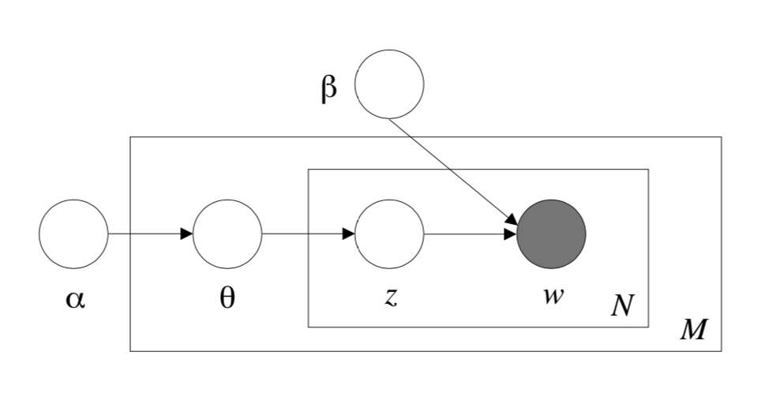

## Latent Dirichlet Allocation

- [Blei, D. M., Ng, A. Y., & Jordan, M. I. (2003). Latent dirichlet allocation. Journal of machine Learning research, 3(Jan), 993-1022.](http://www.jmlr.org/papers/volume3/blei03a/blei03a.pdf)

- Python: ```sklearn.decomposition.LatentDirichletAllocation```.

### Summary

This paper presents a generative probabilistic model for collections of discrete data such as text corpora. LDA is a three-level hierarchical Bayesian model with topics as latent variable. The parameter estimation and inference tasks can be made via a combination of variational method and EM algorithm.


### Structure

We define:

- A word is the basic unit of discrete data, defined to be an item from a vocabulary indexed by $$\{1, .\ldots , V \}$$. We encode words with one-hot coding.
- A document is a sequence of $$N$$ words denoted by $$\mathbf{w} = (w_1,w_2, \ldots ,w_N)$$, where $$w_n$$ is the $$n$$th word in the sequence.
- A corpus is a collection of $$M$$ documents denoted by $$\mathbf{D} = \{\mathbf{w}_1, \mathbf{w}_2, \ldots , \mathbf{w}_M\}$$.

LDA assumes the following generative process for each document $$\mathbf{w}$$ in a corpus $$\mathbf{D}$$:

1. Choose $$N \sim \operatorname{Poisson}(\xi)$$.
2. Choose $$\theta \sim \operatorname{Dir}(\alpha)$$. **The dimension of this Dirichlet distribution is assumed known and fixed.**
3. For each of the $$N$$ words $$w_n$$:
    (a) Choose a topic $$z_{n} \sim \text { Multinomial }(\theta)$$.
    (b) Choose a word $$w_n$$ from $$p\left(w_{n} | z_{n}, \beta\right)$$, a multinomial probability conditioned on the topic $$z_n$$.

Basically, we allocate the multinomial probability of $$k$$ latent topics using hyper-parameter $$\alpha$$ and then sample each word from the sampled multinomial distribution.


*Figure 1: Graphical model representation of LDA. The boxes are "plates" representing replicates. The outer plate represents documents, while the inner plate represents the repeated choice of topics and words within a document.*

Therefore, we can obtain the marginal distribution of a document:

$$
p(\mathbf{w} | \alpha, \beta)=\int p(\theta | \alpha)\left(\prod_{n=1}^{N} \sum_{z_{n}} p\left(z_{n} | \theta\right) p\left(w_{n} | z_{n}, \beta\right)\right) d \theta
$$

The probability of a corpus given parameter $$\alpha, \beta$$ is

$$
p(\mathbf{D} | \alpha, \beta) =\prod_{d=1}^{M} \int p\left(\theta_{d} | \alpha\right)\left(\prod_{n=1}^{N_{d}} \sum_{z_{d n}} p\left(z_{d n} | \theta_{d}\right) p\left(w_{d n} | z_{d n}, \beta\right)\right) d \theta_{d}
$$

### Learning and Inference

The key inferential problem that we need to solve in order to use LDA is that of computing the posterior distribution of the hidden variables given a document:

$$
p(\theta, \mathbf{z} | \mathbf{w}, \alpha, \beta)=\frac{p(\theta, \mathbf{z}, \mathbf{w} | \alpha, \beta)}{p(\mathbf{w} | \alpha, \beta)}
$$

which is intractable because of the intractability of $$p(\mathbf{w} | \alpha, \beta)$$. We consider using a variational inference method to approximate this posterior distribution:

$$
q(\theta, \mathbf{z} | \gamma, \phi)=q(\theta | \gamma) \prod_{n=1}^{N} q\left(z_{n} | \phi_{n}\right)
$$

As for the learning task, we wish to find parameters $$\alpha$$ and $$\beta$$ that maximize the (marginal) log likelihood of the data:

$$
\ell(\alpha, \beta)=\sum_{d=1}^{M} \log p\left(\mathbf{w}_{d} | \alpha, \beta\right)
$$

since $$p(\mathbf{w} | \alpha, \beta)$$ is intractable, We can thus find approximate empirical Bayes estimates for the LDA model via an alternating variational EM procedure that maximizes a lower bound with respect to the variational parameters $$\gamma$$ and $$\phi$$, and then, for fixed values of the variational parameters, maximizes the lower bound with respect to the model parameters $$\alpha$$ and $$\beta$$:

1. (E-step) For each document, find the optimizing values of the variational parameters $$\left\{\gamma_{d}^{*}, \phi_{d}^{*} :d \in \mathbf{D} \right\}$$. This minimization can be achieved via an iterative fixed-point method.

$$
\left(\gamma^{*}, \phi^{*}\right)=\arg \min _{(\gamma, \phi)} \mathrm{D}(q(\theta, \mathbf{z} | \gamma, \phi) \| p(\theta, \mathbf{z} | \mathbf{w}, \alpha, \beta))
$$

2. (M-step) Maximize the resulting lower bound on the log likelihood with respect to the model parameters $$\alpha$$ and $$\beta$$. This corresponds to finding maximum likelihood estimates with expected sufficient statistics for each document under the approximate posterior which is computed in the E-step.


