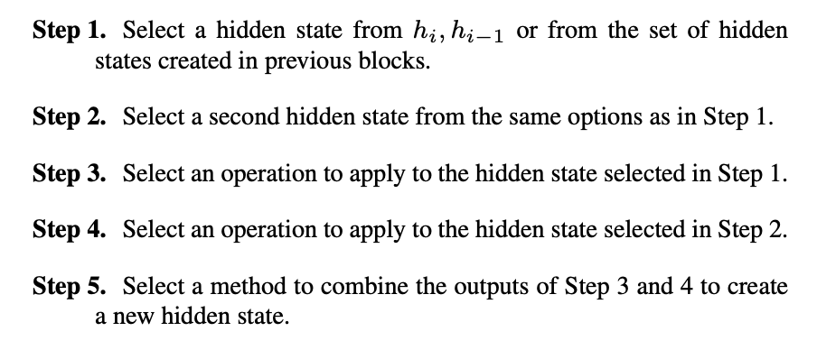
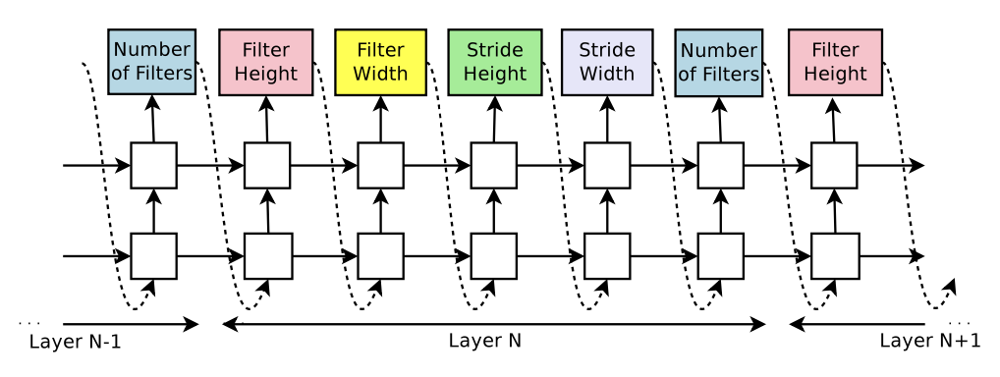
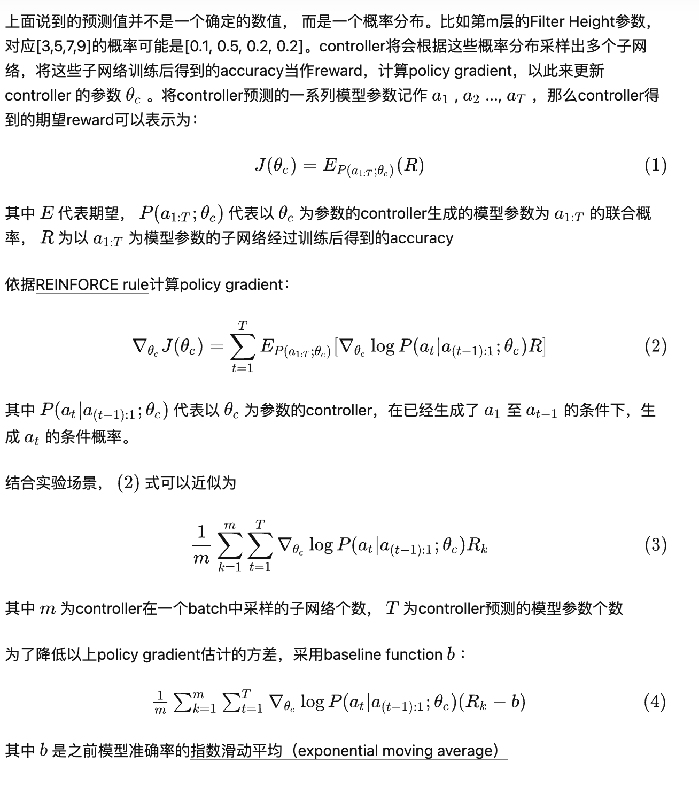

# Neural Architecture Search

- [Neural architecture search: A survey. (Elsken et al., 2019 JMLR)](https://www.jmlr.org/papers/volume20/18-598/18-598.pdf)
- [A Comprehensive Survey of Neural Architecture Search- Challenges and Solutions](https://dl.acm.org/doi/abs/10.1145/3447582)

## Search Space

- chain-structured neural networks: sequence of n layers

- multi-branch networks: incorporates modern design elements, known from hand-crafted architectures, such as skip connections

- Search for cells or blocks, then the final architecture is then built by stacking these cells in a predefined manner (or macro-structure search)
  - [Learning Transferable Architectures for Scalable Image Recognition. (Zoph et al., 2018 CVPR )](https://openaccess.thecvf.com/content_cvpr_2018/papers/Zoph_Learning_Transferable_Architectures_CVPR_2018_paper.pdf)
  
    - Use a controller RNN to predicts the rest of the structure of the convolutional cell, given two initial hidden states
    - The predictions of the controller for each cell are grouped into B blocks, where each block has 5 prediction steps made by 5 distinct softmax classifiers corresponding to discrete choices of the elements of a block
      
      
  
    -  The controller RNN was trained using Proximal Policy Optimization (PPO).
  
      

## Search Strategy

- Random search

- Bayesian optimization

- Evolutionary methods

- Reinforcement learning

  - [Neural architecture search with reinforcement learning. (Zoph and Le, 2017 ICLR)](https://arxiv.org/pdf/1611.01578.pdf)

    - [知乎解读](https://zhuanlan.zhihu.com/p/415057814)

    - Use a controller RNN to predict hyperparameters of the network layers

      

    - Use reinforcement learning to train, ask our controller to maximize its expected reward. Use REINFORCE rule.

      

    - Can add skip connections and attention structure.

- Gradient-based methods

  - [DARTS- Differentiable Architecture Search. (Liu et al., 2019 ICLR)](https://arxiv.org/pdf/1806.09055.pdf)

    - To make the search space continuous, we can relax the categorical choice of a particular operation to a softmax over all possible operations:
      $$
      \bar{o}^{(i, j)}(x)=\sum_{o \in \mathcal{O}} \frac{\exp \left(\alpha_o^{(i, j)}\right)}{\sum_{o^{\prime} \in \mathcal{O}} \exp \left(\alpha_{o^{\prime}}^{(i, j)}\right)} o(x)
      $$

    - This implies a bilevel optimization problem with $$\alpha$$ as the upper-level architecture variable and $$w$$ as the lower-level network parameters:
      $$
      \begin{array}{cl}
      \min _\alpha & \mathcal{L}_{v a l}\left(w^*(\alpha), \alpha\right) \\
      \text { s.t. } & w^*(\alpha)=\operatorname{argmin}_w \mathcal{L}_{\text {train }}(w, \alpha)
      \end{array}
      $$

    - Consider a simple approximation scheme as follows:
      $$
      \nabla_\alpha \mathcal{L}_{\text {val }}\left(w^*(\alpha), \alpha\right)
      \approx \nabla_\alpha \mathcal{L}_{\text {val }}\left(w-\xi \nabla_w \mathcal{L}_{\text {train }}(w, \alpha), \alpha\right)
      $$

    - Applying chain rule to the approximate architecture gradient yields
      $$
      \nabla_\alpha \mathcal{L}_{v a l}\left(w^{\prime}, \alpha\right)-\xi \nabla_{\alpha, w}^2 \mathcal{L}_{\text {train }}(w, \alpha) \nabla_{w^{\prime}} \mathcal{L}_{v a l}\left(w^{\prime}, \alpha\right)
      $$
      and the Hessian can be approximated using finite difference method:
      $$
      \nabla_{\alpha, w}^2 \mathcal{L}_{\text {train }}(w, \alpha) \nabla_{w^{\prime}} \mathcal{L}_{v a l}\left(w^{\prime}, \alpha\right) \approx \frac{\nabla_\alpha \mathcal{L}_{\text {train }}\left(w^{+}, \alpha\right)-\nabla_\alpha \mathcal{L}_{\text {train }}\left(w^{-}, \alpha\right)}{2 \epsilon}
      $$

## Performance Estimation Strategy

- Lower fidelity estimates: Training time reduced by training for fewer epochs, on subset of data, downscaled models, downscaled data
- Learning curve extrapolation: Training time reduced as performance can be extrapolated after just a few epochs of training.
- Weight inheritance: Instead of training models from scratch, they are warm-started by inheriting weights of, e.g., a parent model.
- One-Shot models/ Weight sharing: Only the one-shot model needs to be trained; its weights are then shared across different architectures that are just subgraphs of the one-shot model.