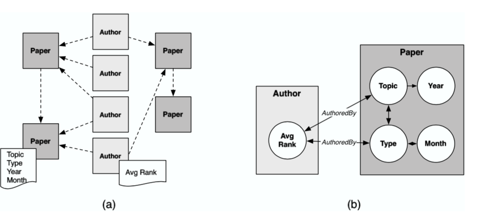

# Relational Dependency Networks

- [Neville, J., & Jensen, D. (2007). Relational dependency networks. Journal of Machine Learning Research, 8(Mar), 653-692.](http://www.jmlr.org/papers/volume8/neville07a/neville07a.pdf)

- [Relational Machine Learning Library (RMLLib)](https://github.com/jpfeiffe/rmllib)

## Summary

Model the data using the idea of relational database and consider the autocorrelation between instances. The learning algorithm is novel, learning the CPDs based on the query that can return local sub-graphs. The learning algorithm can also produce dependency which interprets the relation between attributes. The inference process utilize the Gibbs sampler. However, it does not have the property like Markov network that the product of CPD is indeed the joint distribution, which is a trade-off between theoretical guarantee and cyclical network that describe wider connection between attributes.

## Structure of the network

Instead of consider independent instance case, RDN consider there are dependency (autocorrelation) among instances and therefore construct a whole large graph connected all instances (by connecting their attributes).

The relational data set is represented as a typed, attributed data graph $$G_D = (V_D,E_D)$$. Consider the data graph in Figure 1(a). The nodes $$V_D$$ represent objects in the data (e.g.,
authors, papers) and the edges $$E_D$$ represent relations among the objects (e.g., author-of, cites). Each node $$v_i \in V_D$$ and edge $$e_j \in E_D$$ is associated with a type, $$T(v_i) = t_{v_i}$$ and $$T(e_j) = t_{e_j}$$ (e.g., paper, cited-by). Each item type $$t \in T$$ has a number of associated attributes $$\boldsymbol{X}^t = (X^1_t , ..., X_m^t)$$ (e.g., topic, year). Consequently, each object $$v_i$$ and link $$e_j$$ is associated with a set of attribute values
determined by their type, $$\boldsymbol{X}_{v_i}^{t_{v_i}} = (X_{v_i}^{t_{v_i}1} , \ldots, X_{v_i}^{t_{v_i}m})$$ and $$\boldsymbol{X}_{e_j}^{t_{e_j}} = (X_{e_j}^{t_{e_j}1} , \ldots, X_{e_j}^{t_{e_j}m'})$$. A PRM represents a joint distribution over the values of the attributes in the data graph,

$$
\boldsymbol{x}=\left\{\boldsymbol{x}_{\boldsymbol{v}_{\boldsymbol{i}}}^{\boldsymbol{t}_{\boldsymbol{v}_{\boldsymbol{i}}}}:v_{i} \in V \text{ s.t. }T(v_{i})=t_{v_{i}}\right\} \cup \left\{\boldsymbol{x}_{\boldsymbol{e}_{j}}^{\boldsymbol{t}_{\boldsymbol{e}_{\boldsymbol{j}}}}:e_{j} \in E \text{ s.t. } T(e_{j})=t_{e_{j}} \right\}
$$

The network is represented by the product of conditional probability distributions (CPD) of one node given its parents. There are a few things need to be clarified:

- Since RDN is a cyclical graph, the product of CPD does not necessarily be the joint distribution, but under some conditions, it is quite close to the joint one.

- In practice, the parents of one node is not given exhaustedly, moreover, we use query from relational database to return a local network for each node and condition on them.

- Many machine learning algorithms can reveal the dependency of the variables, i.e. from the local network queried, to select the nodes that are parents of one node.

### RDN learning

The pseudo-likelihood for data graph $$G_D$$ is computed as a product over the item types $$t$$, the attributes of that type $$X_t$$, and the items of that type $$v,e$$:

$$
PL\left(G_{D} ; \theta\right) = \prod_{t \in T} \prod_{X_{i}^{t}\in \mathbf{X}^{t}}\prod_{v:T(v)=t} p\left(x_{v_i}^{t} | pa_{x_{v_i}^{t}};\theta\right)\prod_{e:T(e)=t}p\left(x_{e_i}^{t}|pa_{x_{e_i}^{t}};\theta\right)
$$

here $$\theta$$ may not be an explicit set of parameters, but implicit structure like tree. Therefore, we can maximize CPD for every node to maximize pseudo-likelihood:

$$
\prod_{v:T(v)=t} p\left(x_{v_i}^{t} | pa_{x_{v_i}^{t}};\theta\right) \; \text{and} \; \prod_{e:T(e)=t}p\left(x_{e_i}^{t}|pa_{x_{e_i}^{t}};\theta\right)
$$

using some learners like *Relational Bayesian Classifiers* as well as *Relational Probability Trees*. After we maximize the pseudo-likelihood, we also learn the dependency among the nodes, like model graph in Figure 1(b).

### RDN inference

For some unknown nodes, we can use Gibbs sampling to make the inference. We first assign all unknown nodes a prior probability and draw from this prior distribution. Then, for each unknown node, we can randomly draw one sample from its CPD we have learned above. The empirical marginal and joint distribution can be calculated from the samples we draw from the Gibbs sampler.

