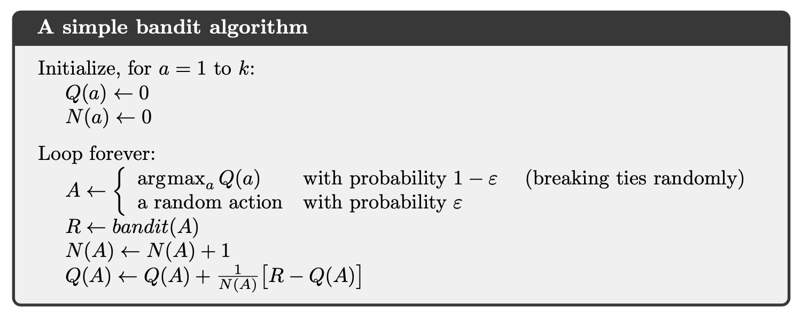
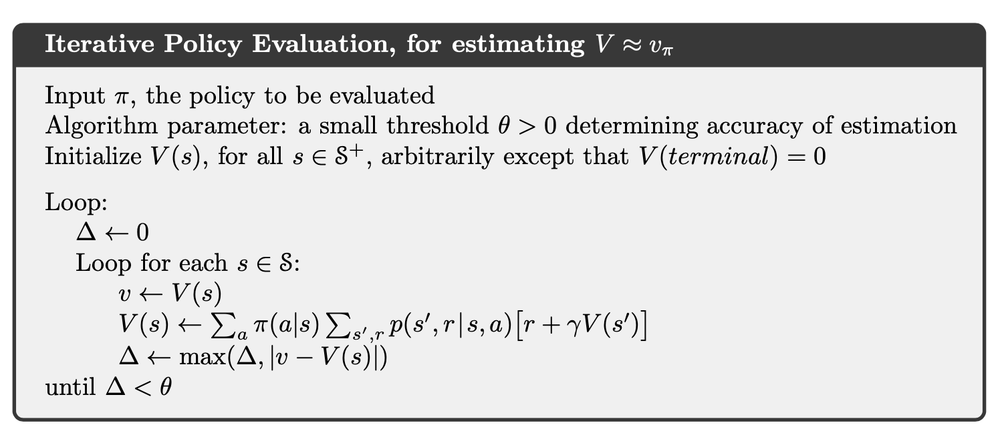
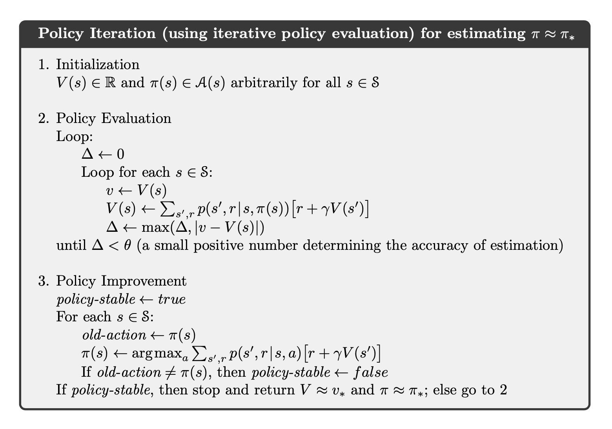
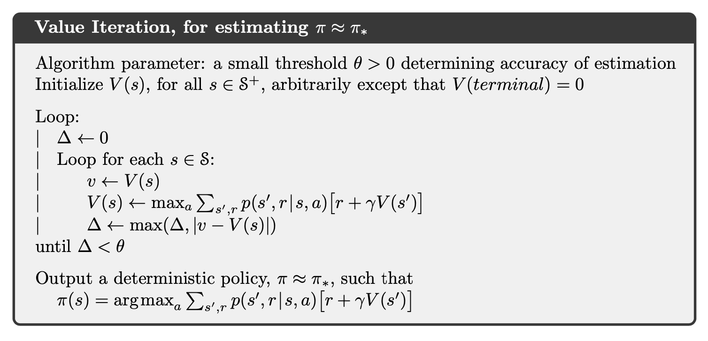
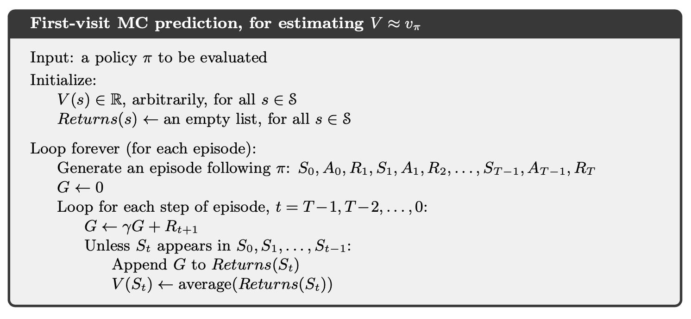
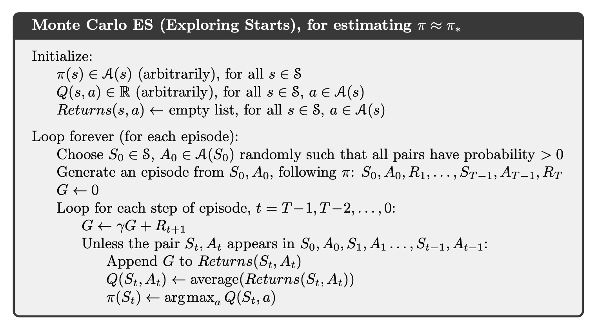
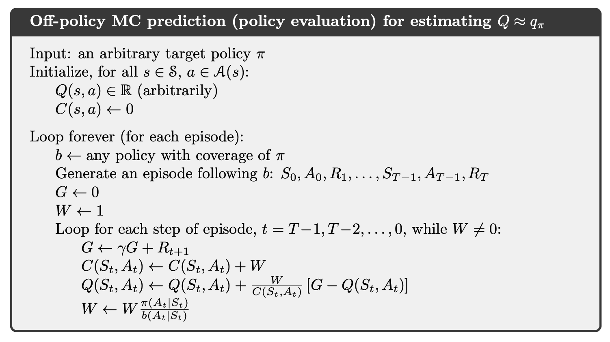
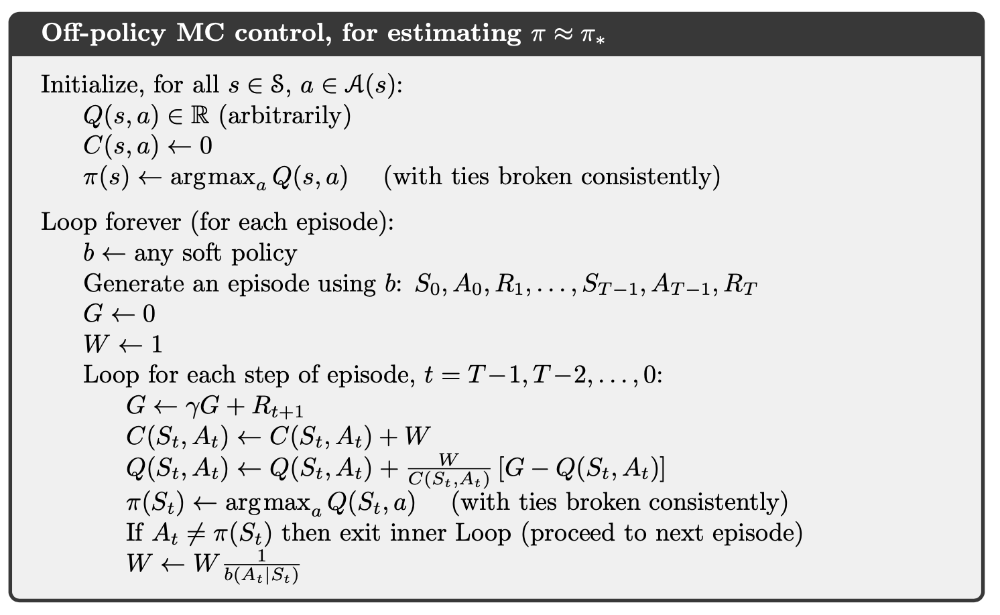

# Reinforcement Learning: An Introduction

## Multi-armed Bandits

Denote $$Q(A)$$ the average reward for arm $$A$$, $$N(A)$$ the number of visits to arm $$A$$.

**$$\epsilon$$-greedy algorithm**

**Upper-Confidence-Bound algorithm**

$$
A_{t} \doteq \underset{a}{\operatorname{argmax}}\left[Q_{t}(a)+c \sqrt{\frac{\ln t}{N_{t}(a)}}\right]
$$

**Gradient bandit algorithms**

$$
\begin{aligned}
\operatorname{Pr}\left\{A_{t}=a\right\} &\doteq \frac{e^{H_{t}(a)}}{\sum_{b=1}^{k} e^{H_{t}(b)}} \doteq \pi_{t}(a) \\
H_{t+1}\left(A_{t}\right) &\doteq H_{t}\left(A_{t}\right)+\alpha\left(R_{t}-\bar{R}_{t}\right)\left(1-\pi_{t}\left(A_{t}\right)\right) \\
H_{t+1}(a) &\doteq H_{t}(a)-\alpha\left(R_{t}-\bar{R}_{t}\right) \pi_{t}(a), \quad \text { for all } a \neq A_{t}
\end{aligned}
$$

## Finite Markov Decision Processes

### Notations

Denote $$S_t, R_t, A_t$$ as state, reward and actions at time $$t$$.

$$
p\left(s^{\prime}, r \; | \; s, a\right) \doteq \operatorname{Pr}\left\{S_{t}=s^{\prime}, R_{t}=r \; | \; S_{t-1}=s, A_{t-1}=a\right\}
$$

$$
r(s, a) \doteq \mathbb{E}\left[R_{t} \; | \; S_{t-1}=s, A_{t-1}=a\right]=\sum_{r \in \mathcal{R}} r \sum_{s^{\prime} \in \mathcal{S}} p\left(s^{\prime}, r \; | \; s, a\right)
$$

discounted return:

$$
G_{t} \doteq R_{t+1}+\gamma R_{t+2}+\gamma^{2} R_{t+3}+\cdots=\sum_{k=0}^{\infty} \gamma^{k} R_{t+k+1} = R_{t+1} + \gamma G_{t+1}
$$

state-value function:

$$
v_{\pi}(s) \doteq \mathbb{E}_{\pi}\left[G_{t} \; | \; S_{t}=s\right]=\mathbb{E}_{\pi}\left[\sum_{k=0}^{\infty} \gamma^{k} R_{t+k+1} \; | \; S_{t}=s\right], \text { for all } s \in \mathcal{S}
$$

action-value function:

$$
q_{\pi}(s, a) \doteq \mathbb{E}_{\pi}\left[G_{t} \; | \; S_{t}=s, A_{t}=a\right]=\mathbb{E}_{\pi}\left[\sum_{k=0}^{\infty} \gamma^{k} R_{t+k+1} \; | \; S_{t}=s, A_{t}=a\right]
$$

optimal state-value function:

$$
v_{*}(s) \doteq \max _{\pi} v_{\pi}(s), \; \; \text { for all } s \in \mathcal{S}
$$

Optimal policies also share the same optimal action-value function:

$$
q_{*}(s, a) \doteq \max _{\pi} q_{\pi}(s, a), \; \; \text { for all } s \in \mathcal{S} \text { and } a \in \mathcal{A}(s)
$$

### Equations

Bellman equation for all $$v_\pi$$:

$$
\begin{aligned}
v_{\pi}(s)
&\doteq \mathbb{E}_{\pi}\left[G_{t} \; | \; S_{t}=s\right] \\
&=\mathbb{E}_{\pi}\left[R_{t+1}+\gamma G_{t+1} \; | \; S_{t}=s\right] \\
&=\sum_{a} \pi(a | s) \sum_{s^{\prime}, r} p\left(s^{\prime}, r \; | \; s, a\right)\left[r+\gamma v_{\pi}\left(s^{\prime}\right)\right], \quad \text { for all } s \in \mathcal{S}
\end{aligned}
$$

relation between $$q_\pi$$ and $$v_\pi$$:

$$
q_{\pi}(s, a)=\mathbb{E}\left[R_{t+1}+\gamma v_{\pi}\left(S_{t+1}\right) \; | \; S_{t}=s, A_{t}=a\right]
$$

Bellman optimality equation:

$$
\begin{aligned}
v_{*}(s)
&=\max _{a \in \mathcal{A}(s)} q_{\pi_{*}}(s, a) \\
&=\max _{a} \mathbb{E}_{\pi_{*}}\left[G_{t} \; | \; S_{t}=s, A_{t}=a\right] \\
&=\max _{a} \mathbb{E}_{\pi_{*}}\left[R_{t+1}+\gamma G_{t+1} \; | \; S_{t}=s, A_{t}=a\right] \\
&=\max _{a} \mathbb{E}\left[R_{t+1}+\gamma v_{*}\left(S_{t+1}\right) \; | \; S_{t}=s, A_{t}=a\right] \\
&=\max _{a} \sum_{s^{\prime}, r} p\left(s^{\prime}, r \; | \; s, a\right)\left[r+\gamma v_{*}\left(s^{\prime}\right)\right]
\end{aligned}
$$

$$
\begin{aligned}
q_{*}(s, a) &=\mathbb{E}\left[R_{t+1}+\gamma \max _{a^{\prime}} q_{*}\left(S_{t+1}, a^{\prime}\right) \; | \; S_{t}=s, A_{t}=a\right] \\
&=\sum_{s^{\prime}, r} p\left(s^{\prime}, r \; | \; s, a\right)\left[r+\gamma \max _{a^{\prime}} q_{*}\left(s^{\prime}, a^{\prime}\right)\right] \end{aligned}
$$

## Dynamic Programming

The term dynamic programming (DP) refers to a collection of algorithms that can be used to compute optimal policies given a perfect model of the environment as a Markov decision process (MDP). In Dynamic Programming, we know exactly what the model is, that is $$p\left(s^{\prime}, r \; | \; s, a\right), \text { for all } s \in \mathcal{S} \text { and } a \in \mathcal{A}(s)$$.

### Policy Evaluation

### Policy Improvement

**Policy improvement theorem**: Let $$\pi$$ and $$\pi^{\prime}$$ be any pair of deterministic policies such that, for all $$s \in \mathcal{S}$$,

$$
q_{\pi}\left(s, \pi^{\prime}(s)\right) \geq v_{\pi}(s)
$$

then for all $$s \in \mathcal{S}$$,

$$
v_{\pi^{\prime}}(s) \geq v_{\pi}(s)
$$

Therefore, the new greedy policy $$\pi^\prime$$ is given by

$$
\begin{aligned}
\pi^{\prime}(s)
& \doteq \underset{a}{\arg \max } q_{\pi}(s, a) \\
&=\underset{a}{\arg \max } \mathbb{E}\left[R_{t+1}+\gamma v_{\pi}\left(S_{t+1}\right) \; | \;  S_{t}=s, A_{t}=a\right] \\
&=\underset{a}{\arg \max } \sum_{s^{\prime}, r} p\left(s^{\prime}, r \; | \;  s, a\right)\left[r+\gamma v_{\pi}\left(s^{\prime}\right)\right]
\end{aligned}
$$

If the new policy $$\pi^\prime$$ is just as good as the old one $$\pi$$, then $$\pi^\prime$$ is the optimal policy (satisfies Bellman optimal equation):

$$
\begin{aligned}
v_{\pi^{\prime}}(s)
&=\max _{a} \mathbb{E}\left[R_{t+1}+\gamma v_{\pi^{\prime}}\left(S_{t+1}\right) \; | \;  S_{t}=s, A_{t}=a\right] \\
&=\max _{a} \sum_{s^{\prime}, r} p\left(s^{\prime}, r \; | \; s, a\right)\left[r+\gamma v_{\pi^{\prime}}\left(s^{\prime}\right)\right]
\end{aligned}
$$

### Policy Iteration

Combine policy evaluation and policy improvement together, we have:

### Value Iteration

One drawback to policy iteration is that each of its iterations involves policy evaluation, which may itself be a protracted iterative computation requiring multiple sweeps through the state set.

We can consider using policy evaluation where it stops after just one sweep (one update of each state). This algorithm is called value iteration.

## Monte Carlo Methods

### Monte Carlo Prediction

**If a model is not available, then it is particularly useful to estimate action values (the values of state–action pairs) rather than state values. With a model (in DP case), state values alone are sufficient to determine a policy; one simply looks ahead one step and chooses whichever action leads to the best combination of reward and next state.**

### Monte Carlo Control

The algorithm is similar with DP case. However, we need to ensure all state-action pairs have a chance to be visited.

We can eliminate the exploring start assumption by using a $$\epsilon$$-soft policy as follows:

It can be shown that

$$
\begin{aligned}
q_{\pi}\left(s, \pi^{\prime}(s)\right)
&=\sum_{a} \pi^{\prime}(a | s) q_{\pi}(s, a) \\
&=\frac{\varepsilon}{|\mathcal{A}(s)|} \sum_{a} q_{\pi}(s, a)+(1-\varepsilon) \max _{a} q_{\pi}(s, a) \\
&\geq \frac{\varepsilon}{|\mathcal{A}(s)|} \sum_{a} q_{\pi}(s, a)+(1-\varepsilon) \sum_{a} \frac{\pi(a | s)-\frac{\varepsilon}{|\mathcal{A}(s)|}}{1-\varepsilon} q_{\pi}(s, a) \\
&= \frac{\varepsilon}{|\mathcal{A}(s)|} \sum_{a} q_{\pi}(s, a)-\frac{\varepsilon}{|\mathcal{A}(s)|} \sum_{a} q_{\pi}(s, a)+\sum_{a} \pi(a | s) q_{\pi}(s, a) \\
&= v_{\pi}(s)
\end{aligned}
$$

where the greater or equal is because the sum is a weighted average with nonnegative weights summing to $$1$$, and as such it must be less than or equal to the largest number averaged.

By the policy improvement theorem $$\pi^\prime$$ is better than $$\pi$$ and equality can hold only when both $$\pi^\prime$$ and $$\pi$$ are optimal among the $$\epsilon$$-soft policies, that is, when they are better than or equal to all other $$\epsilon$$-soft policies.

### Off-policy Prediction and Control via Importance Sampling

A more straightforward approach is to use two policies, one that is learned about and that becomes the optimal policy, and one that is more exploratory and is used to generate behavior. The policy being learned about is called the target policy, and the policy used to generate behavior is called the behavior policy. In this case we say that learning is from data ``off'' the target policy, and the overall process is termed ``off''-policy learning.

Consider the target policy $$\pi$$ and the behavior policy $$b$$, under $$\pi$$, the state-action trajectory start from $$S_t$$ has the probability,

$$
\begin{array}{l}{\operatorname{Pr}\left\{A_{t}, S_{t+1}, A_{t+1}, \ldots, S_{T} \; | \; S_{t}, A_{t: T-1} \sim \pi\right\}} \\ {\quad=\pi\left(A_{t} \; | \; S_{t}\right) p\left(S_{t+1} \; | \; S_{t}, A_{t}\right) \pi\left(A_{t+1} \; | \; S_{t+1}\right) \cdots p\left(S_{T} \; | \; S_{T-1}, A_{T-1}\right)} \\ {\quad=\prod_{k=t}^{T-1} \pi\left(A_{k} \; | \; S_{k}\right) p\left(S_{k+1} \; | \; S_{k}, A_{k}\right)}\end{array}
$$

the relative probability of the trajectory under the target and behavior policies is

$$
\rho_{t: T-1} \doteq \frac{\prod_{k=t}^{T-1} \pi\left(A_{k} \; | \; S_{k}\right) p\left(S_{k+1} \; | \; S_{k}, A_{k}\right)}{\prod_{k=t}^{T-1} b\left(A_{k} \; | \; S_{k}\right) p\left(S_{k+1} \; | \; S_{k}, A_{k}\right)}=\prod_{k=t}^{T-1} \frac{\pi\left(A_{k} \; | \; S_{k}\right)}{b\left(A_{k} \; | \; S_{k}\right)}
$$

Therefore,

$$
\begin{aligned}
\mathbb{E} \left[G_t \; | \; S_t\right] = v_b(s), \; \; \mathbb{E}\left[\rho_{t: T-1} G_{t} | S_{t}=s\right]=v_{\pi}(s)
\end{aligned}
$$

To estimate $$v_\pi(s)$$, we simply scale the returns by the ratios and average the results:

$$
V(s) \doteq \frac{\sum_{t \in \mathcal{T}(s)} \rho_{t: T(t)-1} G_{t}}{|\mathcal{T}(s)|}, \; \text{ or } \; V(s) \doteq \frac{\sum_{t \in \mathcal{T}(s)} \rho_{t: T(t)-1} G_{t}}{\sum_{t \in \mathcal{T}(s)} \rho_{t: T(t)-1}}
$$

where $$\mathcal{T}(s)$$ would only include time steps that were first visits to s within their episodes.

The incremental implementation of off-policy Monte Carlo evaluation is shown below, where $$C(S_t, A_t)$$ is the cumulative weights.

The corresponding off-policy MC control algorithm is as follows.

Notice that $$\pi(S_t)$$ is taken as a greedy policy and only when it coincides with the path of policy $b$, the update will continue within a episode. Therefore, $$\pi(A_t | S_t) = 1$$.

### Optimize the Off-policy Importance Sampling

Define **flat partial returns**:

$$
\bar{G}_{t: h} \doteq R_{t+1}+R_{t+2}+\cdots+R_{h}, \quad 0 \leq t<h \leq T
$$

Therefore,

$$
\begin{aligned} G_{t}
&\doteq R_{t+1}+\gamma R_{t+2}+\gamma^{2} R_{t+3}+\cdots+\gamma^{T-t-1} R_{T} \\
&=(1-\gamma) R_{t+1} \\
&\quad +(1-\gamma) \gamma\left(R_{t+1}+R_{t+2}\right) \\
&\quad +(1-\gamma) \gamma^{2}\left(R_{t+1}+R_{t+2}+R_{t+3}\right) \\
&\quad \vdots \\
&\quad +(1-\gamma) \gamma^{T-t-2}\left(R_{t+1}+R_{t+2}+\cdots+R_{T-1}\right) \\
&\quad +\gamma^{T-t-1}\left(R_{t+1}+R_{t+2}+\cdots+R_{T}\right) \\
&= (1-\gamma) \sum_{h=t+1}^{T-1} \gamma^{h-t-1} \bar{G}_{t: h}+\gamma^{T-t-1} \bar{G}_{t: T} \end{aligned}
$$

And the ordinary importance-sampling estimator and weighted importance-sampling estimator can be written as,

$$
\begin{aligned}
V(s) &\doteq \frac{\sum_{t \in \mathcal{T}(s)}\left((1-\gamma) \sum_{h=t+1}^{T(t)-1} \gamma^{h-t-1} \rho_{t: h-1} \bar{G}_{t: h}+\gamma^{T(t)-t-1} \rho_{t: T(t)-1} \bar{G}_{t: T(t)}\right)}{|\mathcal{T}(s)|} \\
V(s) &\doteq \frac{\sum_{t \in \mathcal{T}(s)}\left((1-\gamma) \sum_{h=t+1}^{T(t)-1} \gamma^{h-t-1} \rho_{t: h-1} \bar{G}_{t: h}+\gamma^{T(t)-t-1} \rho_{t: T(t)-1} \bar{G}_{t: T(t)}\right)}{\sum_{t \in \mathcal{T}(s)}\left((1-\gamma) \sum_{h=t+1}^{T(t)-1} \gamma^{h-t-1} \rho_{t: h-1}+\gamma^{T(t)-t-1} \rho_{t: T(t)-1}\right)}
\end{aligned}
$$

The essence of the idea is to think of discounting as determining a probability of termination or, equivalently, a degree of partial termination. Therefore, the variance of importance sampling can be reduced.

In the off-policy estimators, each term of the sum in the numerator is itself a sum:

$$
\begin{aligned}
\rho_{t: T-1} G_{t}
&=\rho_{t: T-1}\left(R_{t+1}+\gamma R_{t+2}+\cdots+\gamma^{T-t-1} R_{T}\right) \\
&=\rho_{t: T-1} R_{t+1}+\gamma \rho_{t: T-1} R_{t+2}+\cdots+\gamma^{T-t-1} \rho_{t: T-1} R_{T}
\end{aligned}
$$

where

$$
\rho_{t: T-1} R_{t+1}=\frac{\pi\left(A_{t} \; | \; S_{t}\right)}{b\left(A_{t} \; | \; S_{t}\right)} \frac{\pi\left(A_{t+1} \; | \; S_{t+1}\right)}{b\left(A_{t+1} \; | \; S_{t+1}\right)} \frac{\pi\left(A_{t+2} \; | \; S_{t+2}\right)}{b\left(A_{t+2} \; | \; S_{t+2}\right)} \cdots \frac{\pi\left(A_{T-1} \; | \; S_{T-1}\right)}{b\left(A_{T-1} \; | \; S_{T-1}\right)} R_{t+1}
$$

We can show that,

$$
\begin{aligned}
\mathbb{E}\left[\rho_{t: T-1} R_{t+1}\right] &=\mathbb{E}\left[\rho_{t: t} R_{t+1}\right] \\
\mathbb{E}\left[\rho_{t: T-1} R_{t+k}\right] &=\mathbb{E}\left[\rho_{t: t+k-1} R_{t+k}\right]
\end{aligned}
$$

Thus,

$$
\mathbb{E}\left[\rho_{t: T-1} G_{t}\right] = \mathbb{E}\left[\tilde{G}_{t}\right]
$$

where

$$
\tilde{G}_{t} = \rho_{t: t} R_{t+1}+\gamma \rho_{t: t+1} R_{t+2}+\gamma^{2} \rho_{t: t+2} R_{t+3}+\cdots+\gamma^{T-t-1} \rho_{t: T-1} R_{T}
$$

and the ordinary/weighted average of returns can be defined accordingly. This method, known as **Per-decision Importance Sampling**, is useful to reduce the variance of importance sampling.

## Temporal-Difference Learning

### TD(0) Learning
