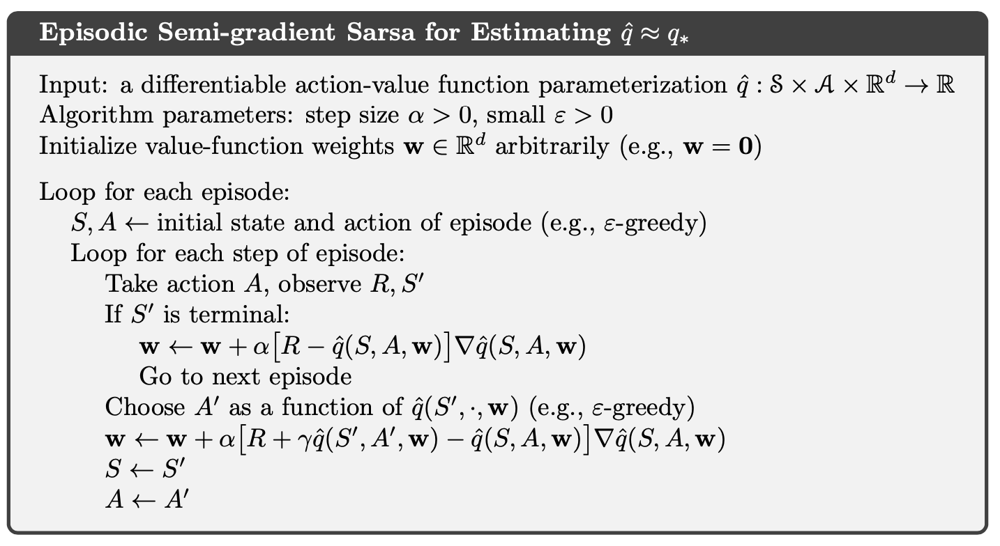
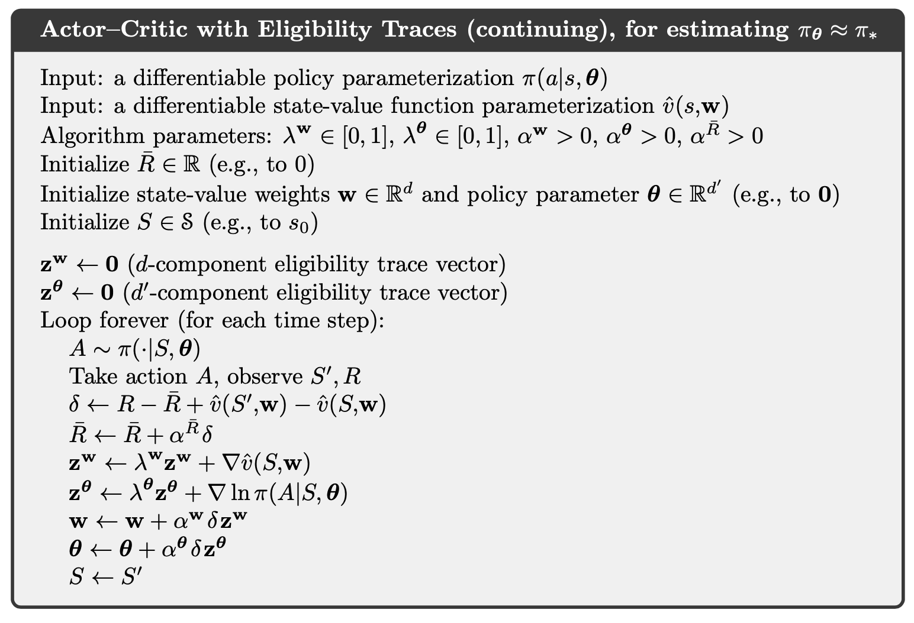

# Reinforcement Learning: An Introduction (2)

## On-policy Prediction with Approximation

### Stochastic-gradient and Semi-gradient Methods for On-policy Approximation

Given a state distribution $$\mu(s) \geq 0, \; \sum \mu(s) = 1$$, we obtain a natural objective function, the *Mean Squared Value Error*, denoted $$\overline{\mathrm{VE}}$$:

$$
\overline{\mathrm{VE}}(\mathbf{w}) \doteq \sum_{s \in \mathcal{S}} \mu(s)\left[v_{\pi}(s)-\hat{v}(s, \mathbf{w})\right]^{2}
$$

Using stochastic gradient-descent (SGD),

$$
\begin{aligned}
\mathbf{w}_{t+1}
&\doteq \mathbf{w}_{t}-\frac{1}{2} \alpha \nabla\left[v_{\pi}\left(S_{t}\right)-\hat{v}\left(S_{t}, \mathbf{w}_{t}\right)\right]^{2} \\
&=\mathbf{w}_{t}+\alpha\left[v_{\pi}\left(S_{t}\right)-\hat{v}\left(S_{t}, \mathbf{w}_{t}\right)\right] \nabla \hat{v}\left(S_{t}, \mathbf{w}_{t}\right)
\end{aligned}
$$

Therefore, the SGD version for Monte Carlo state-value prediction algorithm is as follows.

If we use bootstrapping estimate of $$v_\pi(S_t)$$ such as n-step TD, then this estimate relies on the current weights $$\mathbf{w}_{t}$$ and the expression above is biased and will not produce true gradient descent. We call this kind of methods as semi-gradient methods.

### Linear Methods

Denote $$\boldsymbol{x}(s)$$ as the feature vector for state $$s \in \mathcal{S}$$. Linear methods approximate state-value function by the inner product between $$\mathbf{w}$$ and $$\mathbf{x}(s)$$:

$$
\hat{v}(s, \mathbf{w}) \doteq \mathbf{w}^{\top} \mathbf{x}(s) \doteq \sum_{i=1}^{d} w_{i} x_{i}(s)
$$

Thus, in the linear case the general SGD update reduces to a particularly simple form:

$$
\mathbf{w}_{t+1} \doteq \mathbf{w}_{t}+\alpha\left[U_{t}-\hat{v}\left(S_{t}, \mathbf{w}_{t}\right)\right] \mathbf{x}\left(S_{t}\right)
$$

The semi-gradient TD(0) algorithm presented in the previous section also converges under linear function approximation, but this does not follow from general results on SGD; a separate theorem is necessary. The weight vector converged to is also not the global optimum, but rather a point near the local optimum.

$$
\begin{aligned}
\mathbf{w}_{t+1}
&\doteq \mathbf{w}_{t}+\alpha\left(R_{t+1}+\gamma \mathbf{w}_{t}^{\top} \mathbf{x}_{t+1}-\mathbf{w}_{t}^{\top} \mathbf{x}_{t}\right) \mathbf{x}_{t} \\
&=\mathbf{w}_{t}+\alpha\left(R_{t+1} \mathbf{x}_{t}-\mathbf{x}_{t}\left(\mathbf{x}_{t}-\gamma \mathbf{x}_{t+1}\right)^{\top} \mathbf{w}_{t}\right) \end{aligned}
$$

Once the system has reached steady state, for any given $$\mathbf{w}_{t}$$, the expected next weight vector can be written

$$
\mathbb{E}\left[\mathbf{w}_{t+1} \; | \; \mathbf{w}_{t}\right]=\mathbf{w}_{t}+\alpha\left(\mathbf{b}-\mathbf{A} \mathbf{w}_{t}\right)
$$

where

$$
\mathbf{b} \doteq \mathbb{E}\left[R_{t+1} \mathbf{x}_{t}\right] \in \mathbb{R}^{d} \quad \text { and } \quad \mathbf{A} \doteq \mathbb{E}\left[\mathbf{x}_{t}\left(\mathbf{x}_{t}-\gamma \mathbf{x}_{t+1}\right)^{\top}\right] \in \mathbb{R}^{d} \times \mathbb{R}^{d}
$$

if the system converges, it must converge to the weight vector $$\mathbf{w}_{\mathrm{TD}} \doteq \mathbf{A}^{-1} \mathbf{b}$$ which is called the TD fixed point. In fact linear semi-gradient TD(0) converges to this point.

At the TD fixed point, it has also been proven (in the continuing case) that the $$\overline{\mathrm{VE}}$$ is within a bounded expansion of the lowest possible error:

$$
\overline{\mathrm{VE}}\left(\mathbf{w}_{\mathrm{TD}}\right) \leq \frac{1}{1-\gamma} \min _{\mathbf{w}} \overline{\mathrm{VE}}(\mathbf{w})
$$

The semi-gradient $$n$$-step TD algorithm is the natural extension of the tabular $$n$$-step TD algorithm presented to semi-gradient function approximation.

where the $$n$$-step return is generalized as

$$
G_{t: t+n} \doteq R_{t+1}+\gamma R_{t+2}+\cdots+\gamma^{n-1} R_{t+n}+\gamma^{n} \hat{v}\left(S_{t+n}, \mathbf{w}_{t+n-1}\right), \quad 0 \leq t \leq T-n
$$

### Feature Construction for Linear Methods

**Polynomials**

**Fourier Basis**

**Radial Basis Functions**

$$
x_{i}(s) \doteq \exp \left(-\frac{\left\|s-c_{i}\right\|^{2}}{2 \sigma_{i}^{2}}\right)
$$

**Kernel-based Function**

**Coarse Coding**：

Consider a task in which the natural representation of the state set is a continuous two- dimensional space. One kind of representation for this case is made up of features corresponding to circles in state space, as shown to the right. If the state is inside a circle, then the corresponding feature has the value 1 and is said to be present; otherwise the feature is 0 and is said to be absent. This kind of $$1–0$$-valued feature is called a binary feature. Given a state, which binary features are present indicate within which circles the state lies, and thus coarsely code for its location. Representing a state with features that overlap in this way (although they need not be circles or binary) is known as coarse coding.

**Tile Coding**

Tile coding is a form of coarse coding for multi-dimensional continuous spaces that is
flexible and computationally efficient. It may be the most practical feature representation
for modern sequential digital computers. In tile coding the receptive fields of the features are grouped into partitions of the state space. Each such partition is called a tiling, and each element of the partition is called a tile.

### Nonlinear Function Approximation: Artificial Neural Networks

### Least-Squares TD

Recall TD fixed point

$$
\mathbf{w}_{\mathrm{TD}} \doteq \mathbf{A}^{-1} \mathbf{b}
$$

where

$$
\mathbf{b} \doteq \mathbb{E}\left[R_{t+1} \mathbf{x}_{t}\right] \in \mathbb{R}^{d} \quad \text { and } \quad \mathbf{A} \doteq \mathbb{E}\left[\mathbf{x}_{t}\left(\mathbf{x}_{t}-\gamma \mathbf{x}_{t+1}\right)^{\top}\right] \in \mathbb{R}^{d} \times \mathbb{R}^{d}
$$

The Least-Squares TD algorithm, commonly known as LSTD, forms the natural estimates

$$
\widehat{\mathbf{A}}_{t} \doteq \sum_{k=0}^{t-1} \mathbf{x}_{k}\left(\mathbf{x}_{k}-\gamma \mathbf{x}_{k+1}\right)^{\top}+\varepsilon \mathbf{I} \quad \text { and } \quad \widehat{\mathbf{b}}_{t} \doteq \sum_{k=0}^{t-1} R_{k+1} \mathbf{x}_{k}
$$

where LSTD uses these estimates to estimate the TD fixed point as

$$
\mathbf{w}_{t} \doteq \widehat{\mathbf{A}}_{t}^{-1} \widehat{\mathbf{b}}_{t}
$$

In LSTD, the inverse of $$\widehat{\mathbf{A}}_{t}$$, and the computational complexity of a general inverse computation is $$O\left(d^{3}\right)$$. Fortunately, an inverse of a matrix of our special form - a sum of outer products - can also be updated incrementally with only $$O\left(d^{2}\right)$$ computations, as

$$
\begin{aligned}
\widehat{\mathbf{A}}_{t}^{-1}
&=\left(\widehat{\mathbf{A}}_{t-1}+\mathbf{x}_{t}\left(\mathbf{x}_{t}-\gamma \mathbf{x}_{t+1}\right)^{\top}\right)^{-1} \\
&=\widehat{\mathbf{A}}_{t-1}^{-1}-\frac{\widehat{\mathbf{A}}_{t-1}^{-1} \mathbf{x}_{t}\left(\mathbf{x}_{t}-\gamma \mathbf{x}_{t+1}\right)^{\top} \widehat{\mathbf{A}}_{t-1}^{-1}}{1+\left(\mathbf{x}_{t}-\gamma \mathbf{x}_{t+1}\right)^{\top} \widehat{\mathbf{A}}_{t-1}^{-1} \mathbf{x}_{t}} \end{aligned}
$$

for $$t>0$$, with $$\widehat{\mathbf{A}}_{0} \doteq \varepsilon \mathbf{I}$$. Although the identity known as the ***Sherman-Morrison formula***, is superficially complicated, it involves only vector-matrix and vector-vector multiplications and thus is only $$O\left(d^{2}\right)$$. Thus we can store the inverse matrix $$\widehat{\mathbf{A}}_{t}^{-1}$$
maintain it and use it all with only $$O\left(d^{2}\right)$$ memory and per-step computation. The complete algorithm is given below.

## On-policy Control with Approximation

### Episodic Semi-gradient Control

The update for the one-step Sarsa method is

$$
\mathbf{w}_{t+1} \doteq \mathbf{w}_{t}+\alpha\left[R_{t+1}+\gamma \hat{q}\left(S_{t+1}, A_{t+1}, \mathbf{w}_{t}\right)-\hat{q}\left(S_{t}, A_{t}, \mathbf{w}_{t}\right)\right] \nabla \hat{q}\left(S_{t}, A_{t}, \mathbf{w}_{t}\right)
$$

We can obtain an $$n$$-step version of episodic semi-gradient Sarsa by using an $$n$$-step return as the update target in the semi-gradient one-step Sarsa update equation

$$
\mathbf{w}_{t+n} \doteq \mathbf{w}_{t+n-1}+\alpha\left[G_{t: t+n}-\hat{q}\left(S_{t}, A_{t}, \mathbf{w}_{t+n-1}\right)\right] \nabla \hat{q}\left(S_{t}, A_{t}, \mathbf{w}_{t+n-1}\right), \quad 0 \leq t<T
$$

where

$$
G_{t: t+n} \doteq R_{t+1}+\gamma R_{t+2}+\cdots+\gamma^{n-1} R_{t+n}+\gamma^{n} \hat{q}\left(S_{t+n}, A_{t+n}, \mathbf{w}_{t+n-1}\right), \quad t+n<T
$$

### Average Reward: A New Problem Setting for Continuing Tasks

In the average-reward setting, the quality of a policy $$\pi$$ is defined as the average rate of
reward, or simply average reward, while following that policy, which we denote as $$r(\pi)$$:

$$
\begin{aligned}
r(\pi)
& \doteq \lim _{h \rightarrow \infty} \frac{1}{h} \sum_{t=1}^{h} \mathbb{E}\left[R_{t}  \; | \; S_{0}, A_{0: t-1} \sim \pi\right] \\
&=\lim _{t \rightarrow \infty} \mathbb{E}\left[R_{t} \; | \; S_{0}, A_{0: t-1} \sim \pi\right] \\
&=\sum_{s} \mu_{\pi}(s) \sum_{a} \pi(a \; | \; s) \sum_{s^{\prime}, r} p\left(s^{\prime}, r \; | \; s, a\right) r \end{aligned}
$$

where the expectations are conditioned on the initial state, $$S_{0}$$, and on the subsequent
actions, $$A_{0}, A_{1}, \ldots, A_{t-1}$$, being taken according to $$\pi$$. $$\mu_{\pi}$$ is the steady-state distribution, $$\mu_{\pi}(s) \doteq \lim _{t \rightarrow \infty} \operatorname{Pr}\left\{S_{t}=s \; | \; A_{0: t-1} \sim \pi\right\}$$, which is assumed to exist for any $$\pi$$ and to be independent of $$S_{0}$$. This assumption about the MDP is known as ergodicity.

Note that the steady state distribution is the special distribution under which, if you select actions according to $$\pi$$, you remain in the same distribution. That is, for which

$$
\sum_{s} \mu_{\pi}(s) \sum_{a} \pi(a \; | \; s) p\left(s^{\prime} \; | \; s, a\right)=\mu_{\pi}\left(s^{\prime}\right)
$$

In the average-reward setting, returns are defined in terms of differences between rewards and the average reward:

$$
G_{t} \doteq R_{t+1}-r(\pi)+R_{t+2}-r(\pi)+R_{t+3}-r(\pi)+\cdots
$$

We simply remove all $$\gamma$$s and replace all rewards by the difference between the reward and the true average reward:

$$
\begin{array}{l}{v_{\pi}(s)=\sum_{a} \pi(a | s) \sum_{r, s^{\prime}} p\left(s^{\prime}, r | s, a\right)\left[r-r(\pi)+v_{\pi}\left(s^{\prime}\right)\right]} \\ {q_{\pi}(s, a)=\sum_{r, s^{\prime}} p\left(s^{\prime}, r | s, a\right)\left[r-r(\pi)+\sum_{a^{\prime}} \pi\left(a^{\prime} | s^{\prime}\right) q_{\pi}\left(s^{\prime}, a^{\prime}\right)\right]} \\ {v_{*}(s)=\max _{a} \sum_{r, s^{\prime}} p\left(s^{\prime}, r | s, a\right)\left[r-\max _{\pi} r(\pi)+v_{*}\left(s^{\prime}\right)\right]} \\ {q_{*}(s, a)=\sum_{r, s^{\prime}} p\left(s^{\prime}, r | s, a\right)\left[r-\max _{\pi} r(\pi)+\max _{a^{\prime}} q_{*}\left(s^{\prime}, a^{\prime}\right)\right]}\end{array}
$$

### Differential Semi-gradient n-step Sarsa

We begin by generalizing the n-step return to its differential form, with function approximation:

$$
G_{t: t+n} \doteq R_{t+1}-\bar{R}_{t+1}+R_{t+2}-\bar{R}_{t+2}+\cdots+R_{t+n}-\bar{R}_{t+n}+\hat{q}\left(S_{t+n}, A_{t+n}, \mathbf{w}_{t+n-1}\right)
$$

where $$\bar{R}$$ is an estimate of $$r(\pi), n \geq 1$$. Pseudocode for the complete algorithm is given in the box.

where

$$
\delta_{t} \doteq G_{t: t+n}-\hat{q}\left(S_{t}, A_{t}, \mathbf{w}\right)
$$

## Off-policy Methods with Approximation

### Semi-gradient Methods

The one-step, state-value algorithm is semi-gradient off-policy TD(0)

$$
\mathbf{w}_{t+1} \doteq \mathbf{w}_{t}+\alpha \rho_{t} \delta_{t} \nabla \hat{v}\left(S_{t}, \mathbf{w}_{t}\right)
$$

where $$\delta_{t}$$ is defined appropriately depending on whether the problem is episodic and
discounted, or continuing and undiscounted using average reward:

$$
\begin{array}{l}{\delta_{t} \doteq R_{t+1}+\gamma \hat{v}\left(S_{t+1}, \mathbf{w}_{t}\right)-\hat{v}\left(S_{t}, \mathbf{w}_{t}\right), \text { or }} \\ {\delta_{t} \doteq R_{t+1}-\bar{R}_{t}+\hat{v}\left(S_{t+1}, \mathbf{w}_{t}\right)-\hat{v}\left(S_{t}, \mathbf{w}_{t}\right)}\end{array}
$$

For action values, the one-step algorithm is semi-gradient Expected Sarsa:

$$
\mathbf{w}_{t+n} \doteq \mathbf{w}_{t+n-1}+\alpha \rho_{t+1} \cdots \rho_{t+n-1}\left[G_{t: t+n}-\hat{q}\left(S_{t}, A_{t}, \mathbf{w}_{t+n-1}\right)\right] \nabla \hat{q}\left(S_{t}, A_{t}, \mathbf{w}_{t+n-1}\right)
$$

where

$$
\begin{aligned} \delta_{t} & \doteq R_{t+1}+\gamma \sum_{a} \pi\left(a | S_{t+1}\right) \hat{q}\left(S_{t+1}, a, \mathbf{w}_{t}\right)-\hat{q}\left(S_{t}, A_{t}, \mathbf{w}_{t}\right), & \text { or } & \text { (episodic) } \\ \delta_{t} & \doteq R_{t+1}-\bar{R}_{t}+\sum \pi\left(a | S_{t+1}\right) \hat{q}\left(S_{t+1}, a, \mathbf{w}_{t}\right)-\hat{q}\left(S_{t}, A_{t}, \mathbf{w}_{t}\right) & & \text { (continuing) } \end{aligned}
$$

You can find the multi-step generalizations of these algorithms in a similar manner.

### Examples of Off-policy Divergence

Consider estimating the state-value under the linear parameterization indicated by
the expression shown in each state circle. For example, the estimated value of the
leftmost state is $$2 w_{1}+w_{8}$$, where the subscript corresponds to the component of the overall weight vector $$\mathbf{w} \in \mathbb{R}^{8}$$; this corresponds to a feature vector for the first state being $$\mathbf{x}(1)=(2,0,0,0,0,0,0,1)^{\top}$$. The reward is zero on all transitions, so the true value function is $$v_{\pi}(s)=0$$, for all $$s$$, which can be exactly approximated if $$\mathbf{w}=\mathbf{0}$$. In fact, there are many solutions, as there are more components to the weight vector ( 8) than there are nonterminal states (7). Moreover, the set of feature vectors, $$\{\mathbf{x}(s): s \in \mathcal{S}\}$$, is a linearly independent set. In all these ways this task seems a favorable case for linear function approximation.

If we apply semi-gradient TD(0) to this problem, then the weights diverge to infinity. The instability occurs for any positive step size, no matter how small. In fact, it even occurs if an expected update is done as in dynamic programming (DP).

If we alter just the distribution of DP updates in Baird’s counterexample, from the uniform distribution to the on-policy distribution (which generally requires asynchronous updating), then convergence is guaranteed. The example shows that even the simplest combination of bootstrapping and function approximation can be unstable if the updates are not done according to the on-policy distribution.

There are also counterexamples similar to Baird’s showing divergence for Q-learning.

Our discussion so far can be summarized by saying that the danger of instability and divergence arises whenever we combine all of the following three elements, making up what we call ***the deadly triad***:

- **Function approximation** A powerful, scalable way of generalizing from a state space much larger than the memory and computational resources;

- **Bootstrapping** Update targets that include existing estimates (as in dynamic programming or TD methods) rather than relying exclusively on actual rewards and complete returns (as in MC methods).

- **Off-policy training** Training on a distribution of transitions other than that produced by the target policy. Sweeping through the state space and updating all states uniformly, as in dynamic programming, does not respect the target policy and is an example of off-policy training.

### Linear Value-function Geometry

We can define the distance between value functions using the norm

$$
\|v\|_{\mu}^{2} \doteq \sum_{s \in \mathcal{S}} \mu(s) v(s)^{2}
$$

Notice that $$\overline{\mathrm{VE}}$$ we use for semi-gradient method is,

$$
\overline{\mathrm{VE}}(\mathbf{w}) \doteq \sum_{s \in S} \mu(s)\left[v_{\pi}(s)-\hat{v}(s, \mathbf{w})\right]^{2} = \left\|v_{\mathbf{w}}-v_{\pi}\right\|_{\mu}^{2}
$$

We define a projection operator $$\Pi$$ that takes an arbitrary value function to the representable function that is closest in our norm:

$$
\Pi v \doteq v_{\mathrm{w}} \quad \text { where } \quad \mathrm{w}=\underset{\mathrm{w} \in \mathbb{R}^{d}}{\arg \min }\left\|v-v_{\mathrm{w}}\right\|_{\mu}^{2}
$$

For a linear function approximator, the projection operation is linear, which implies that it can be represented as an $$|\mathcal{S}| \times |\mathcal{S}|$$ matrix:

$$
\Pi \doteq \mathbf{X}\left(\mathbf{X}^{\top} \mathbf{D} \mathbf{X}\right)^{-1} \mathbf{X}^{\top} \mathbf{D}
$$

where $$\mathbf{D}$$ is the $$|\mathcal{S}| \times |\mathcal{S}|$$ matrix with $$\mu(s)$$ the diagonal element, and $$\mathbf{X}$$ denotes the $$|\mathcal{S}| \times d$$ matrix whose rows are the feature vectors $$\mathbf{x}(s)^{\top},$$ one for each state $$s$$.

Recall the Bellman equation for value function, we define Bellman error at state $$s$$,

$$
\begin{aligned}
\bar{\delta}_{\mathbf{w}}(s)
& \doteq\left(\sum_{a} \pi(a | s) \sum_{s^{\prime}, r} p\left(s^{\prime}, r \; | \; s, a\right)\left[r+\gamma v_{\mathbf{w}}\left(s^{\prime}\right)\right]\right)-v_{\mathbf{w}}(s) \\
&=\mathbb{E}_{\pi}\left[R_{t+1}+\gamma v_{\mathbf{w}}\left(S_{t+1}\right)-v_{\mathbf{w}}\left(S_{t}\right) \; | \; S_{t}=s, A_{t} \sim \pi\right]
\end{aligned}
$$

Therefore, the Mean Squared Bellman Error is,

$$
\overline{\mathrm{BE}}(\mathbf{w})=\left\|\bar{\delta}_{\mathbf{w}}\right\|_{\mu}^{2}
$$

The Bellman error vector is a result of applying the Bellman operator $$B_{\pi}: \mathbb{R}^{|\mathcal{S}|} \rightarrow \mathbb{R}^{|\mathcal{S}|}$$ to the approximate value function. The Bellman operator is,

$$
\left(B_{\pi} v\right)(s) \doteq \sum_{a} \pi(a \; | \; s) \sum_{s^{\prime}, r} p\left(s^{\prime}, r \; | \; s, a\right)\left[r+\gamma v\left(s^{\prime}\right)\right]
$$

The Bellman error vector for $$v$$ can be written $$\bar{\delta}_{\mathbf{w}}=B_{\pi} v_{\mathbf{w}}-v_{\mathbf{w}}$$.

If the Bellman operator is applied to a value function in the representable subspace, then, in general, it will produce a new value function that is outside the subspace. In dynamic programming (without function approximation), this operator is applied repeatedly to the points outside the representable space. Eventually that process converges to the true value function $$v_\pi$$, the only fixed point for the Bellman operator.

With function approximation, however, the intermediate value functions lying outside the subspace cannot be represented. In this case we are interested in the projection of the Bellman error vector back into the representable space. This is the projected Bellman error vector $$\Pi \bar{\delta}_{v_{\mathrm{w}}}$$. Thus, we define the Mean Square Projected Bellman Error,

$$
\overline{\operatorname{PBE}}(\mathbf{w})=\left\|\Pi \bar{\delta}_{\mathbf{w}}\right\|_{\mu}^{2}
$$

### Gradient Descent in the Bellman Error

The one-step TD error with discounting is

$$
\delta_{t}=R_{t+1}+\gamma \hat{v}\left(S_{t+1}, \mathbf{w}_{t}\right)-\hat{v}\left(S_{t}, \mathbf{w}_{t}\right)
$$

Therefore,

$$
\begin{aligned} \mathbf{w}_{t+1} &=\mathbf{w}_{t}-\frac{1}{2} \alpha \nabla\left(\mathbb{E}_{\pi}\left[\delta_{t}\right]^{2}\right) \\ &=\mathbf{w}_{t}-\frac{1}{2} \alpha \nabla\left(\mathbb{E}_{b}\left[\rho_{t} \delta_{t}\right]^{2}\right) \\ &\left.=\mathbf{w}_{t}-\alpha \mathbb{E}_{b}\left[\rho_{t} \delta_{t}\right] \nabla \mathbb{E}_{b}\left[\rho_{t+1}, \mathbf{w}\right)-\hat{v}\left(S_{t}, \mathbf{w}\right)\right] \mathbb{E}_{b}\left[\rho_{t} \nabla \delta_{t}\right] \\ &=\mathbf{w}_{t}+\alpha\left[\mathbb{E}_{b}\left[\rho_{t}\left(R_{t+1}+\gamma \hat{v}\left(S_{t+1}, \mathbf{w}\right)\right)\right]-\hat{v}\left(S_{t}, \mathbf{w}\right)\right]\left[\nabla \hat{v}\left(S_{t}, \mathbf{w}\right)-\gamma \mathbb{E}_{b}\left[\rho_{t} \nabla \hat{v}\left(S_{t+1}, \mathbf{w}\right)\right]\right] \end{aligned}
$$

This update and various ways of sampling it are referred to as the residual-gradient algorithm. If you simply used the sample values in all the expectations, the equation above involves the next state, $$S_{t+1}$$, appearing in two expectations that are multiplied together. To get an unbiased sample of the product, two independent samples of the next state are required, but during normal interaction with an external environment only one is obtained. One expectation or the other can be sampled, but not both.

### The Bellman Error is Not Learnable

In reinforcement learning, a hypothesis is said to be ``learnable'' if it can be learned with any amount of experience. It turns out many quantities of apparent interest in reinforcement learning cannot be learned even from an infinite amount of experiential data. These quantities are well defined and can be computed given knowledge of the internal structure of the environment, but cannot be computed or estimated from the observed sequence of feature vectors, actions, and rewards.

There are counterexamples where the optimal parameter vector of $$\overline{BE}$$ is not a function of the data and thus cannot be learned from it. However, another bootstrapping objective that we have considered, the $$\overline{\mathrm{PBE}}$$, can be determined from data (are learnable) and determine optimal solution that is in general different from the $\overline{\mathrm{BE}}$ minimums.

### Gradient-TD Methods

Remember that in the linear case there is always an exact solution, the TD fixed point $$w_{TD}$$, at which the $$\overline{\mathrm{PBE}}$$ is zero. This solution could be found by least-squares methods but only by methods of quadratic $$O\left(d^{2}\right)$$ complexity in the number of parameters. We seek instead an SGD method.

$$
\begin{aligned}
\overline{\operatorname{PBE}}(\mathbf{w})
&=\left\|\Pi \bar{\delta}_{\mathbf{w}}\right\|_{\mu}^{2} \\
&=\left(\Pi \bar{\delta}_{\mathbf{w}}\right)^{\top} \mathbf{D} \Pi \bar{\delta}_{\mathbf{w}} \\ &=\bar{\delta}_{\mathbf{w}}^{\top} \Pi^{\top} \mathbf{D} \Pi \bar{\delta}_{\mathbf{w}} \\
&=\bar{\delta}_{\mathbf{w}}^{\top} \mathbf{D} \mathbf{X}\left(\mathbf{X}^{\top} \mathbf{D} \mathbf{X}\right)^{-1} \mathbf{X}^{\top} \mathbf{D} \bar{\delta}_{\mathbf{w}} \\
&=\left(\mathbf{X}^{\top} \mathbf{D} \bar{\delta}_{\mathbf{w}}\right)^{\top}\left(\mathbf{X}^{\top} \mathbf{D} \mathbf{X}\right)^{-1}\left(\mathbf{X}^{\top} \mathbf{D} \bar{\delta}_{\mathbf{w}}\right)
\end{aligned}
$$

The gradient with respect to $$\mathbf{w}$$ is

$$
\nabla \overline{\mathrm{PBE}}(\mathbf{w})=2 \nabla\left[\mathbf{X}^{\top} \mathbf{D} \bar{\delta}_{\mathbf{w}}\right]^{\top}\left(\mathbf{X}^{\top} \mathbf{D} \mathbf{X}\right)^{-1}\left(\mathbf{X}^{\top} \mathbf{D} \bar{\delta}_{\mathbf{w}}\right)
$$

To turn this into an SGD method, we have to sample something on every time step that has this quantity as its expected value. Notice that

$$
\mathbf{X}^{\top} \mathbf{D} \bar{\delta}_{\mathbf{w}}=\sum_{s} \mu(s) \mathbf{x}(s) \bar{\delta}_{\mathbf{w}}(s)=\mathbb{E}\left[\rho_{t} \delta_{t} \mathbf{x}_{t}\right]
$$

and

$$
\begin{aligned} \nabla \mathbb{E}\left[\rho_{t} \delta_{t} \mathbf{x}_{t}\right]^{\top} &=\mathbb{E}\left[\rho_{t} \nabla \delta_{t}^{\top} \mathbf{x}_{t}^{\top}\right] \\ &=\mathbb{E}\left[\rho_{t} \nabla\left(R_{t+1}+\gamma \mathbf{w}^{\top} \mathbf{x}_{t+1}-\mathbf{w}^{\top} \mathbf{x}_{t}\right)^{\top} \mathbf{x}_{t}^{\top}\right] \\ &=\mathbb{E}\left[\rho_{t}\left(\gamma \mathbf{x}_{t+1}-\mathbf{x}_{t}\right) \mathbf{x}_{t}^{\top}\right] \end{aligned}
$$

Finally,

$$
\mathbf{X}^{\top} \mathbf{D} \mathbf{X}=\sum_{s} \mu(s) \mathbf{x}_{s} \mathbf{x}_{s}^{\top}=\mathbb{E}\left[\mathbf{x}_{t} \mathbf{x}_{t}^{\top}\right]
$$

Substituting these expectations for the three factors in our expression,

$$
\nabla \overline{\mathrm{PBE}}(\mathbf{w})=2 \mathbb{E}\left[\rho_{t}\left(\gamma \mathbf{x}_{t+1}-\mathbf{x}_{t}\right) \mathbf{x}_{t}^{\top}\right] \mathbb{E}\left[\mathbf{x}_{t} \mathbf{x}_{t}^{\top}\right]^{-1} \mathbb{E}\left[\rho_{t} \delta_{t} \mathbf{x}_{t}\right]
$$

Gradient-TD methods estimate and store the product of the second two factors above, denote as $$\mathbf{v}$$,

$$
\mathbf{v} \approx \mathbb{E}\left[\mathbf{x}_{t} \mathbf{x}_{t}^{\top}\right]^{-1} \mathbb{E}\left[\rho_{t} \delta_{t} \mathbf{x}_{t}\right]
$$

This form is familiar to students of linear supervised learning. It is the solution to a linear
least-squares problem that tries to approximate $$\rho_{t} \delta_{t}$$ from the features. The standard SGD method for incrementally finding the vector $$\mathbf{v}$$ that minimizes the expected squared
error $$\left(\mathbf{v}^{\top} \mathbf{x}_{t}-\rho_{t} \delta_{t}\right)^{2}$$ is known as the Least Mean Square (LMS) rule:

$$
\mathbf{v}_{t+1} \doteq \mathbf{v}_{t}+\beta \rho_{t}\left(\delta_{t}-\mathbf{v}_{t}^{\top} \mathbf{x}_{t}\right) \mathbf{x}_{t}
$$

Therefore, the GTD2 algorithm is,

$$
\begin{aligned}
\mathbf{w}_{t+1}
&=\mathbf{w}_{t}-\frac{1}{2} \alpha \nabla \overline{\operatorname{PBE}}\left(\mathbf{w}_{t}\right) \\
&=\mathbf{w}_{t}-\frac{1}{2} \alpha 2 \mathbb{E}\left[\rho_{t}\left(\gamma \mathbf{x}_{t+1}-\mathbf{x}_{t}\right) \mathbf{x}_{t}^{\top}\right] \mathbb{E}\left[\mathbf{x}_{t} \mathbf{x}_{t}^{\top}\right]^{-1} \mathbb{E}\left[\rho_{t} \delta_{t} \mathbf{x}_{t}\right] \\
&=\mathbf{w}_{t}+\alpha \mathbb{E}\left[\rho_{t}\left(\mathbf{x}_{t}-\gamma \mathbf{x}_{t+1}\right) \mathbf{x}_{t}^{\top}\right] \mathbb{E}\left[\mathbf{x}_{t} \mathbf{x}_{t}^{\top}\right]^{-1} \mathbb{E}\left[\rho_{t} \delta_{t} \mathbf{x}_{t}\right] \\
&\approx \mathbf{w}_{t}+\alpha \mathbb{E}\left[\rho_{t}\left(\mathbf{x}_{t}-\gamma \mathbf{x}_{t+1}\right) \mathbf{x}_{t}^{\top}\right] \mathbf{v}_{t} \\
& \approx \mathbf{w}_{t}+\alpha \rho_{t}\left(\mathbf{x}_{t}-\gamma \mathbf{x}_{t+1}\right) \mathbf{x}_{t}^{\top} \mathbf{v}_{t}
\end{aligned}
$$

A slightly better algorithm can be derived by doing a few more analytic steps before substituting in $$\mathbf{v}_t$$, which is called GTD(0) algorithm:

$$
\begin{aligned}
\mathbf{w}_{t+1}
&=\mathbf{w}_{t}+\alpha \mathbb{E}\left[\rho_{t}\left(\mathbf{x}_{t}-\gamma \mathbf{x}_{t+1}\right) \mathbf{x}_{t}^{\top}\right] \mathbb{E}\left[\mathbf{x}_{t} \mathbf{x}_{t}^{\top}\right]^{-1} \mathbb{E}\left[\rho_{t} \delta_{t} \mathbf{x}_{t}\right] \\
&=\mathbf{w}_{t}+\alpha\left(\mathbb{E}\left[\rho_{t} \mathbf{x}_{t} \mathbf{x}_{t}^{\top}\right]-\gamma \mathbb{E}\left[\rho_{t} \mathbf{x}_{t+1} \mathbf{x}_{t}^{\top}\right]\right) \mathbb{E}\left[\mathbf{x}_{t} \mathbf{x}_{t}^{\top}\right]^{-1} \mathbb{E}\left[\rho_{t} \delta_{t} \mathbf{x}_{t}\right] \\
&=\mathbf{w}_{t}+\alpha\left(\mathbb{E}\left[\mathbf{x}_{t} \mathbf{x}_{t}^{\top}\right]-\gamma \mathbb{E}\left[\rho_{t} \mathbf{x}_{t+1} \mathbf{x}_{t}^{\top}\right]\right) \mathbb{E}\left[\mathbf{x}_{t} \mathbf{x}_{t}^{\top}\right]^{-1} \mathbb{E}\left[\rho_{t} \delta_{t} \mathbf{x}_{t}\right] \\
&=\mathbf{w}_{t}+\alpha\left(\mathbb{E}\left[\mathbf{x}_{t} \rho_{t} \delta_{t}\right]-\gamma \mathbb{E}\left[\rho_{t} \mathbf{x}_{t+1} \mathbf{x}_{t}^{\top}\right] \mathbb{E}\left[\mathbf{x}_{t} \mathbf{x}_{t}^{\top}\right]^{-1} \mathbb{E}\left[\rho_{t} \delta_{t} \mathbf{x}_{t}\right]\right) \\
&\approx \mathbf{w}_{t}+\alpha\left(\mathbb{E}\left[\mathbf{x}_{t} \rho_{t} \delta_{t}\right]-\gamma \mathbb{E}\left[\rho_{t} \mathbf{x}_{t+1} \mathbf{x}_{t}^{\top}\right] \mathbf{v}_{t}\right) \\
&\approx \mathbf{w}_{t}+\alpha \rho_{t}\left(\delta_{t} \mathbf{x}_{t}-\gamma \mathbf{x}_{t+1} \mathbf{x}_{t}^{\top} \mathbf{v}_{t}\right)
\end{aligned}
$$

## Eligibility Traces

### TD-lambda

Recall the n-step return,

$$
G_{t: t+n} \doteq R_{t+1}+\gamma R_{t+2}+\cdots+\gamma^{n-1} R_{t+n}+\gamma^{n} \hat{v}\left(S_{t+n}, \mathbf{w}_{t+n-1}\right), \quad 0 \leq t \leq T-n
$$

Define the $$\lambda$$-return as,

$$
G_{t}^{\lambda} \doteq(1-\lambda) \sum_{n=1}^{\infty} \lambda^{n-1} G_{t: t+n}
$$

we can separate these post-termination terms from the main sum, yielding

$$
G_{t}^{\lambda}=(1-\lambda) \sum_{n=1}^{T-t-1} \lambda^{n-1} G_{t: t+n}+\lambda^{T-t-1} G_{t}
$$

as indicated in the figures. This equation makes it clearer what happens when $$\lambda=1$$. In
this case the main sum goes to zero, and the remaining term reduces to the conventional return. Thus, for $$\lambda=1$$, updating according to the $$\lambda$$-return is a Monte Carlo algorithm. On the other hand, if $$\lambda=0$$, then the $$\lambda$$-return reduces to $$G_{t: t+1}$$, the one-step return.

We are now ready to define our first learning algorithm based on the $$\lambda$$-return: the
offline $$\lambda$$-return algorithm. As an offline algorithm, it makes no changes to the weight vector during the episode. Then, at the end of the episode, a whole sequence of offline
updates are made according to our usual semi-gradient rule, using the $$\lambda$$-return as the
target:

$$
\mathbf{w}_{t+1} \doteq \mathbf{w}_{t}+\alpha\left[G_{t}^{\lambda}-\hat{v}\left(S_{t}, \mathbf{w}_{t}\right)\right] \nabla \hat{v}\left(S_{t}, \mathbf{w}_{t}\right), \quad t=0, \ldots, T-1
$$

TD($$\lambda$$) is one of the oldest and most widely used algorithms in reinforcement learning. TD ($$\lambda$$) improves over the offline $$\lambda$$-return algorithm in three ways. First it updates the weight vector on every step of an episode rather than only at the end, and thus its estimates may be better sooner. Second, its computations are equally distributed in time rather than all at the end of the episode. And third, it can be applied to
continuing problems rather than just to episodic problems. In this section we present the
semi-gradient version of TD($$\lambda$$) with function approximation.

In $$\mathrm{TD}(\lambda),$$ the eligibility trace vector is initialized to zero at the beginning of the episode, is incremented on each time step by the value gradient, and then fades away by $$\gamma \lambda$$:

$$
\begin{array}{l}{\mathbf{z}_{-1} \doteq \mathbf{0}} \\ {\mathbf{z}_{t} \doteq \gamma \lambda \mathbf{z}_{t-1}+\nabla \hat{v}\left(S_{t}, \mathbf{w}_{t}\right), \quad 0 \leq t \leq T}\end{array}
$$

where $$\gamma$$ is the discount rate and $$\lambda$$ is the parameter introduced in the previous section, which we henceforth call the trace-decay parameter. The eligibility trace keeps track of which components of the weight vector have contributed, positively or negatively, to recent state valuations, where "recent" is defined in terms of $$\gamma \lambda$$.

We also show below the backward or mechanistic view of TD($$\lambda$$). Each update depends on the current TD error combined with the current eligibility traces of past events.

Linear $$\mathrm{TD}(\lambda)$$ has been proved to converge in the on-policy case if the step-size parameter is reduced over time according to the usual conditions. For the continuing discounted case,

$$
\overline{\mathrm{VE}}\left(\mathbf{w}_{\infty}\right) \leq \frac{1-\gamma \lambda}{1-\gamma} \min _{\mathbf{w}} \overline{\mathrm{VE}}(\mathbf{w})
$$

In practice, however, $$\lambda=1$$ is often the poorest choice.

### Online TD-lambda

In general, we define the truncated $$\lambda$$-return for time $$t$$, given data only up to some later horizon, $$h$$, as

$$
G_{t:h}^{\lambda} \doteq(1-\lambda) \sum_{n=1}^{h-t-1} \lambda^{n-1} G_{t: t+n}+\lambda^{h-t-1} G_{t:h}, \quad 0 \leq t<h \leq T
$$

The conceptual algorithm involves multiple passes over the episode, one at each horizon, each generating a different sequence of weight vectors. Let us use $$w_t^h$$ to denote the weights used to generate the value at time $$t$$ in the sequence up to horizon $$h$$. The first weight vector $$w_0^h$$ in each sequence is that inherited from the previous episode.

$$
\begin{aligned}
h=1: \quad &\mathbf{w}_{1}^{1} \doteq \mathbf{w}_{0}^{1}+\alpha\left[G_{0: 1}^{\lambda}-\hat{v}\left(S_{0}, \mathbf{w}_{0}^{1}\right)\right] \nabla \hat{v}\left(S_{0}, \mathbf{w}_{0}^{1}\right) \\
 \\
h=2: \quad & \mathbf{w}_{1}^{2} \doteq \mathbf{w}_{0}^{2}+\alpha\left[G_{0: 2}^{\lambda}-\hat{v}\left(S_{0}, \mathbf{w}_{0}^{2}\right)\right] \nabla \hat{v}\left(S_{0}, \mathbf{w}_{0}^{2}\right) \\
& \mathbf{w}_{2}^{2} \doteq \mathbf{w}_{1}^{2}+\alpha\left[G_{1: 2}^{\lambda}-\hat{v}\left(S_{1}, \mathbf{w}_{1}^{2}\right)\right] \nabla \hat{v}\left(S_{1}, \mathbf{w}_{1}^{2}\right) \\
 \\
h=3: \quad & \mathbf{w}_{1}^{3} \doteq \mathbf{w}_{0}^{3}+\alpha\left[G_{0: 3}^{\lambda}-\hat{v}\left(S_{0}, \mathbf{w}_{0}^{3}\right)\right] \nabla \hat{v}\left(S_{0}, \mathbf{w}_{0}^{3}\right) \\ & \mathbf{w}_{2}^{3} \doteq \mathbf{w}_{1}^{3}+\alpha\left[G_{1: 3}^{\lambda}-\hat{v}\left(S_{1}, \mathbf{w}_{1}^{3}\right)\right] \nabla \hat{v}\left(S_{1}, \mathbf{w}_{1}^{3}\right) \\ & \mathbf{w}_{3}^{3} \doteq \mathbf{w}_{2}^{3}+\alpha\left[G_{2: 3}^{\lambda}-\hat{v}\left(S_{2}, \mathbf{w}_{2}^{3}\right)\right] \nabla \hat{v}\left(S_{2}, \mathbf{w}_{2}^{3}\right)
\end{aligned}
$$

The general form for the update is

$$
\mathbf{w}_{t+1}^{h} \doteq \mathbf{w}_{t}^{h}+\alpha\left[G_{t: h}^{\lambda}-\hat{v}\left(S_{t}, \mathbf{w}_{t}^{h}\right)\right] \nabla \hat{v}\left(S_{t}, \mathbf{w}_{t}^{h}\right), \quad 0 \leq t<h \leq T
$$

Now we are ready to introduce the true online TD($$\lambda$$). The sequence of weight vectors produced by the online $$\lambda$$-return algorithm can be arranged in a triangle:

$$
\begin{array}{cccccc}{\mathbf{w}_{0}^{0}} & {} & {} & {} & {} \\ {\mathbf{w}_{0}^{1}} & {\mathbf{w}_{1}^{1}} & {} & {} \\ {\mathbf{w}_{0}^{2}} & {\mathbf{w}_{1}^{2}} & {\mathbf{w}_{2}^{2}} & {} \\ {\mathbf{w}_{0}^{3}} & {\mathbf{w}_{1}^{3}} & {\mathbf{w}_{2}^{3}} & {\mathbf{w}_{3}^{3}} & {} \\ {} & {\vdots} & {\vdots} & {\vdots} & {\vdots} & {\ddots} \\ {\mathbf{w}_{0}^{T}} & {\mathbf{w}_{1}^{T}} & {\mathbf{w}_{2}^{T}} & {\mathbf{w}_{3}^{T}} & {\cdots} & {\mathbf{w}_{T}^{T}}\end{array}
$$

One row of this triangle is produced on each time step. It turns out that the weight
vectors on the diagonal, the $$w_t^t$$, are the only ones really needed. The strategy then is to find a compact, efficient way of computing each $$w_t^t$$ from the one before. Pseudocode for the complete algorithm is given in the box.

We can define the action-value method (Sarsa($$\lambda$$)) similarly. The Sarsa($$\lambda$$) with binary features and linear function approximation is presented below.

### Off-policy Traces with Control Variates

In the state case, we incorporate importance sampling with TD($$\lambda$$).

$$
G_{t}^{\lambda} \doteq \rho_{t}\left(R_{t+1}+\gamma\left(\left(1-\lambda\right) \hat{v}\left(S_{t+1}, \mathbf{w}_{t}\right)+\lambda G_{t+1}^{\lambda s}\right)\right)+\left(1-\rho_{t}\right) \hat{v}\left(S_{t}, \mathbf{w}_{t}\right)
$$

the truncated version of this return can be approximated simply in terms of sums of the state-based TD-error

$$
\delta_{t}^{s} \doteq R_{t+1}+\gamma \hat{v}\left(S_{t+1}, \mathbf{w}_{t}\right)-\hat{v}\left(S_{t}, \mathbf{w}_{t}\right)
$$

and

$$
G_{t}^{\lambda} \approx \hat{v}\left(S_{t}, \mathbf{w}_{t}\right)+\rho_{t} \sum_{k=t}^{\infty} \delta_{k}^{s} \prod_{i=t+1}^{k} \gamma \lambda \rho_{i}
$$

Therefore,

$$
\begin{aligned} \mathbf{w}_{t+1} &=\mathbf{w}_{t}+\alpha\left(G_{t}^{\lambda}-\hat{v}\left(S_{t}, \mathbf{w}_{t}\right)\right) \nabla \hat{v}\left(S_{t}, \mathbf{w}_{t}\right) \\ & \approx \mathbf{w}_{t}+\alpha \rho_{t}\left(\sum_{k=t}^{\infty} \delta_{k}^{s} \prod_{i=t+1}^{k} \gamma \lambda \rho_{i}\right) \nabla \hat{v}\left(S_{t}, \mathbf{w}_{t}\right) \end{aligned}
$$

The sum of the forward-view update over time is

$$
\begin{aligned} \sum_{t=1}^{\infty}\left(\mathbf{w}_{t+1}-\mathbf{w}_{t}\right) & \approx \sum_{t=1}^{\infty} \sum_{k=t}^{\infty} \alpha \rho_{t} \delta_{k}^{s} \nabla \hat{v}\left(S_{t}, \mathbf{w}_{t}\right) \prod_{i=t+1}^{k} \gamma \lambda \rho_{i} \\ &=\sum_{k=1}^{\infty} \sum_{t=1}^{k} \alpha \rho_{t} \nabla \hat{v}\left(S_{t}, \mathbf{w}_{t}\right) \delta_{k}^{s} \prod_{i=t+1}^{k} \gamma \lambda \rho_{i} \\
&=\sum_{k=1}^{\infty} \alpha \delta_{k}^{s} \sum_{t=1}^{k} \rho_{t} \nabla \hat{v}\left(S_{t}, \mathbf{w}_{t}\right) \prod_{i=t+1}^{k} \gamma \lambda \rho_{i}
\end{aligned}
$$

which would be in the form of the sum of a backward-view TD update if the entire expression from the second sum left could be written and updated incrementally as an eligibility trace.

$$
\begin{aligned} \mathbf{z}_{k} &=\sum_{t=1}^{k} \rho_{t} \nabla \hat{v}\left(S_{t}, \mathbf{w}_{t}\right) \prod_{i=t+1}^{k} \gamma \lambda \rho_{i} \\ &=\sum_{t=1}^{k-1} \rho_{t} \nabla \hat{v}\left(S_{t}, \mathbf{w}_{t}\right) \prod_{i=t+1}^{k} \gamma \lambda \rho_{i}+\rho_{k} \nabla \hat{v}\left(S_{k}, \mathbf{w}_{k}\right) \\ &=\gamma_{k} \lambda_{k} \rho_{k} \sum_{t=1}^{k-1} \rho_{t} \nabla \hat{v}\left(S_{t}, \mathbf{w}_{t}\right) \prod_{i=t+1}^{k-1} \gamma \lambda \rho_{i} \; + \; \rho_{k} \nabla \hat{v}\left(S_{k}, \mathbf{w}_{k}\right) \\
&=\rho_{k}\left(\gamma_{k} \lambda_{k} \mathbf{z}_{k-1}+\nabla \hat{v}\left(S_{k}, \mathbf{w}_{k}\right)\right)
\end{aligned}
$$

### Eligibility Traces Q-learning

The concept of TB($$\lambda$$) is straightforward.

$$
\begin{aligned} G_{t}^{\lambda} & \doteq R_{t+1}+\gamma\left(\left(1-\lambda\right) \bar{V}_{t}\left(S_{t+1}\right)+\lambda\left[\sum_{a \neq A_{t+1}} \pi\left(a \; | \; S_{t+1}\right) \hat{q}\left(S_{t+1}, a, \mathbf{w}_{t}\right)+\pi\left(A_{t+1} \; | \; S_{t+1}\right) G_{t+1}^{\lambda}\right]\right) \\ &=R_{t+1}+\gamma\left(\bar{V}_{t}\left(S_{t+1}\right)+\lambda \pi\left(A_{t+1} \; | \; S_{t+1}\right)\left(G_{t+1}^{\lambda}-\hat{q}\left(S_{t+1}, A_{t+1}, \mathbf{w}_{t}\right)\right)\right) \end{aligned}
$$

As per the usual pattern, it can also be written approximately as a sum of TD errors.

$$
G_{t}^{\lambda} \approx \hat{q}\left(S_{t}, A_{t}, \mathbf{w}_{t}\right)+\sum_{k=t}^{\infty} \delta_{k}^{a} \prod_{i=t+1}^{k} \gamma \lambda \pi\left(A_{i} \; |\; S_{i}\right)
$$

### Stable Off-policy Methods with Traces

Several methods using eligibility traces have been proposed that achieve guarantees of stability under off-policy training, and here we present two of the most important ones.

***GTD($$\lambda$$)*** is the eligibility-trace algorithm analogous to GTD(0) the better of the two state-value Gradient-TD prediction algorithms discussed above. Its goal is to learn a parameter $$\mathbf{w}_{t}$$ such that $$\hat{v}(s, \mathbf{w}) \stackrel{\vdots}{=} \mathbf{w}_{t}^{\top} \mathbf{x}(s) \approx v_{\pi}(s)$$, even from data that is due to following another policy $$b$$. Its update is

$$
\mathbf{w}_{t+1} \doteq \mathbf{w}_{t}+\alpha \delta_{t}^{s} \mathbf{z}_{t}-\alpha \gamma\left(1-\lambda\right)\left(\mathbf{z}_{t}^{\top} \mathbf{v}_{t}\right) \mathbf{x}_{t+1}
$$

where

$$
\mathbf{v}_{t+1} \doteq \mathbf{v}_{t}+\beta \delta_{t}^{s} \mathbf{z}_{t}-\beta\left(\mathbf{v}_{t}^{\top} \mathbf{x}_{t}\right) \mathbf{x}_{t}
$$

***GQ$$(\lambda)$$*** is the Gradient-TD algorithm for action values with eligibility traces. Its goal is to learn a parameter $$\mathbf{w}_{t}$$ such that $$\hat{q}\left(s, a, \mathbf{w}_{t}\right) \doteq \mathbf{w}_{t}^{\top} \mathbf{x}(s, a) \approx q_{\pi}(s, a)$$ from off-policy. Its update is

$$
\mathbf{w}_{t+1} \doteq \mathbf{w}_{t}+\alpha \delta_{t}^{a} \mathbf{z}_{t}-\alpha \gamma\left(1-\lambda\right)\left(\mathbf{z}_{t}^{\top} \mathbf{v}_{t}\right) \overline{\mathbf{x}}_{t+1}
$$

where $$\overline{\mathbf{x}}_{t}$$ is the average feature vector for $$S_{t}$$ under the target policy, $$\delta_{t}^{a}$$ is the expectation form of the TD error,

$$
\begin{aligned}
\overline{\mathbf{x}}_{t} &\doteq \sum_{a} \pi\left(a | S_{t}\right) \mathbf{x}\left(S_{t}, a\right) \\
\delta_{t}^{a} &\doteq R_{t+1}+\gamma \mathbf{w}_{t}^{\top} \overline{\mathbf{x}}_{t+1}-\mathbf{w}_{t}^{\top} \mathbf{x}_{t} \\
\mathbf{z}_{t} &\doteq \gamma \lambda \rho_{t} \mathbf{z}_{t-1}+\nabla \hat{q}\left(S_{t}, A_{t}, \mathbf{w}_{t}\right)
\end{aligned}
$$

***HTD$$(\lambda)$$*** is a hybrid state-value algorithm combining aspects of GTD $(\lambda)$ and $$\mathrm{TD}(\lambda)$$. Its most appealing feature is that it is a strict generalization of $$\mathrm{TD}(\lambda)$$ to off-policy learning, meaning that if the behavior policy happens to be the same as the target policy, then $$\mathrm{HTD}(\lambda)$$ becomes the same as $$\mathrm{TD}(\lambda)$$, which is not true for $$\mathrm{GTD}(\lambda)$$. HTD$$(\lambda)$$ is defined as

$$
\begin{aligned} \mathbf{w}_{t+1} & \doteq \mathbf{w}_{t}+\alpha \delta_{t}^{s} \mathbf{z}_{t}+\alpha\left(\left(\mathbf{z}_{t}-\mathbf{z}_{t}^{b}\right)^{\top} \mathbf{v}_{t}\right)\left(\mathbf{x}_{t}-\gamma \mathbf{x}_{t+1}\right) \\ \mathbf{v}_{t+1} & \doteq \mathbf{v}_{t}+\beta \delta_{t}^{s} \mathbf{z}_{t}-\beta\left(\mathbf{z}_{t}^{b} \mathbf{v}_{t}\right)\left(\mathbf{x}_{t}-\gamma \mathbf{x}_{t+1}\right), \quad \text { with } \mathbf{v}_{0} \doteq \mathbf{0} \\ \mathbf{z}_{t} & \doteq \rho_{t}\left(\gamma \lambda \mathbf{z}_{t-1}+\mathbf{x}_{t}\right), \quad \text { with } \mathbf{z}_{-1} \doteq \mathbf{0} \\ \mathbf{z}_{t}^{b} & \doteq \gamma \lambda \mathbf{z}_{t-1}^{b}+\mathbf{x}_{t}, \quad \text { with } \mathbf{z}_{-1}^{b} \doteq \mathbf{0} \end{aligned}
$$

## Policy Gradient Methods

### Policy Approximation and the Policy Gradient Theorem

In this chapter we consider methods for learning the policy parameter based on the gradient of some scalar performance measure $$J(\boldsymbol{\theta})$$ with respect to the policy parameter. These methods seek to maximize performance, so their updates stochastic gradient ascent in $$J$$ is

$$
\boldsymbol{\theta}_{t+1}=\boldsymbol{\theta}_{t}+\alpha \widehat{\nabla J\left(\boldsymbol{\theta}_{t}\right)}
$$

In policy gradient methods, the policy can be parameterized in any way, as long as $$\pi(a | s, \boldsymbol{\theta})$$ is differentiable with respect to its parameters.

If the action space is discrete and not too large, then a natural and common kind of parameterization is to form parameterized numerical preferences $$h(s, a, \boldsymbol{\theta}) \in \mathbb{R}$$ and the actions with the highest preferences in each state are given the highest probabilities of being selected. For example,

$$
\pi(a | s, \boldsymbol{\theta}) \doteq \frac{e^{h(s, a, \boldsymbol{\theta})}}{\sum_{b} e^{h(s, b, \boldsymbol{\theta})}}
$$

The action preferences themselves can be parameterized arbitrarily. For example, they
might be computed by a deep artificial neural network, where $$\boldsymbol{\theta}$$ is the vector of all the connection weights of the network. Or the preferences could simply be linear in features,

$$
h(s, a, \boldsymbol{\theta})=\boldsymbol{\theta}^{\top} \mathbf{x}(s, a)
$$

In the episodic case we define performance as

$$
J(\boldsymbol{\theta}) \doteq v_{\pi_{\theta}}\left(s_{0}\right)
$$

There is an excellent theoretical answer to this challenge in the form of the policy gradient theorem, which provides an analytic expression for the gradient of performance with respect to the policy parameter. The policy gradient theorem for the episodic case establishes that

$$
\nabla J(\boldsymbol{\theta}) \propto \sum_{s} \mu(s) \sum_{a} q_{\pi}(s, a) \nabla \pi(a | s, \boldsymbol{\theta})
$$

The proof of the policy gradient theorem is given below.

### REINFORCE: Monte Carlo Policy Gradient

Notice that

$$
\begin{aligned}
\nabla J(\boldsymbol{\theta})
&\propto \sum_{s} \mu(s) \sum_{a} q_{\pi}(s, a) \nabla \pi(a | s, \boldsymbol{\theta}) \\
&=\mathbb{E}_{\pi}\left[\sum_{a} q_{\pi}\left(S_{t}, a\right) \nabla \pi\left(a | S_{t}, \boldsymbol{\theta}\right)\right] \\
&=\mathbb{E}_{\pi}\left[\sum_{a} \pi\left(a | S_{t}, \boldsymbol{\theta}\right) q_{\pi}\left(S_{t}, a\right) \frac{\nabla \pi\left(a | S_{t}, \boldsymbol{\theta}\right)}{\pi\left(a | S_{t}, \boldsymbol{\theta}\right)}\right] \\
&=\mathbb{E}_{\pi}\left[q_{\pi}\left(S_{t}, A_{t}\right) \frac{\nabla \pi\left(A_{t} | S_{t}, \boldsymbol{\theta}\right)}{\pi\left(A_{t} | S_{t}, \boldsymbol{\theta}\right)}\right] \\
&=\mathbb{E}_{\pi}\left[G_{t} \frac{\nabla \pi\left(A_{t} | S_{t}, \boldsymbol{\theta}\right)}{\pi\left(A_{t} | S_{t}, \boldsymbol{\theta}\right)}\right]
\end{aligned}
$$

where we introduce $$A_t$$ and replace a sum over the random variable’s possible values by an expectation under $$\pi$$, and then sampling the expectation.

Using this sample to instantiate our generic stochastic gradient ascent algorithm yields the REINFORCE update:

$$
\boldsymbol{\theta}_{t+1} \doteq \boldsymbol{\theta}_{t}+\alpha G_{t} \frac{\nabla \pi\left(A_{t} | S_{t}, \boldsymbol{\theta}_{t}\right)}{\pi\left(A_{t} | S_{t}, \boldsymbol{\theta}_{t}\right)}
$$

where $$G_t$$ is obtained by Monte-Carlo sampling.

### REINFORCE with Baseline

The policy gradient theorem can be generalized to include a comparison of the action value to an arbitrary baseline $$b(s)$$:

$$
\nabla J(\boldsymbol{\theta}) \propto \sum_{s} \mu(s) \sum_{a}\left(q_{\pi}(s, a)-b(s)\right) \nabla \pi(a | s, \boldsymbol{\theta})
$$

since the baseline can be any function, even a random variable, as long as it does not vary with $$a$$

$$
\sum_{a} b(s) \nabla \pi(a | s, \boldsymbol{\theta})=b(s) \nabla \sum_{a} \pi(a | s, \boldsymbol{\theta})=b(s) \nabla 1=0
$$

The policy gradient theorem with baseline can be used to derive an update rule using similar steps as in the previous section. The update rule that we end up with is a new version of REINFORCE that includes a general baseline:

$$
\boldsymbol{\theta}_{t+1} \doteq \boldsymbol{\theta}_{t}+\alpha\left(G_{t}-b\left(S_{t}\right)\right) \frac{\nabla \pi\left(A_{t}\; | \; S_{t}, \boldsymbol{\theta}_{t}\right)}{\pi\left(A_{t}\; | \; S_{t}, \boldsymbol{\theta}_{t}\right)}
$$

Because the baseline could be uniformly zero, this update is a strict generalization of REINFORCE. In general, the baseline leaves the expected value of the update unchanged, but it can have a large effect on its variance. For example, in the bandit algorithms the baseline was just a number (the average of the rewards seen so far), but for MDPs the baseline should vary with state. In some states all actions have high values and we need a high baseline to differentiate the higher valued actions from the less highly valued ones; in other states all actions will have low values and a low baseline is appropriate.

One natural choice for the baseline is an estimate of the state value, $$\hat{v}\left(S_{t}, \mathbf{w}\right)$$, where $$\mathbf{w} \in \mathbb{R}^{m}$$ is a weight vector learned by one of the methods presented in previous chapters.

### Actor–Critic Methods

Although the REINFORCE-with-baseline method learns both a policy and a state-value function, we do not consider it to be an actor–critic method because its state-value function is used only as a baseline, not as a critic. That is, it is not used for bootstrapping (updating the value estimate for a state from the estimated values of subsequent states), but only as a baseline for the state whose estimate is being updated. This is a useful distinction, for only through bootstrapping do we introduce bias and an asymptotic dependence on the quality of the function approximation. As we have seen, the bias introduced through bootstrapping and reliance on the state representation is often beneficial because it reduces variance and accelerates learning. REINFORCE with baseline is unbiased and will converge asymptotically to a local minimum, but like all Monte Carlo methods it tends to learn slowly (produce estimates of high variance) and to be inconvenient to implement online or for continuing problems. As we have seen earlier in this book, with temporal-difference methods we can eliminate these inconveniences, and through multi-step methods we can flexibly choose the degree of bootstrapping. In order to gain these advantages in the case of policy gradient methods we use actor–critic methods with a bootstrapping critic.

First consider one-step actor–critic methods. The main appeal of one-step methods is that they are fully online and incremental, yet avoid the complexities of eligibility traces.

$$
\begin{aligned} \boldsymbol{\theta}_{t+1} & \doteq \boldsymbol{\theta}_{t}+\alpha\left(G_{t: t+1}-\hat{v}\left(S_{t}, \mathbf{w}\right)\right) \frac{\nabla \pi\left(A_{t}\; | \; S_{t}, \boldsymbol{\theta}_{t}\right)}{\pi\left(A_{t}\; | \; S_{t}, \boldsymbol{\theta}_{t}\right)} \\ &=\boldsymbol{\theta}_{t}+\alpha\left(R_{t+1}+\gamma \hat{v}\left(S_{t+1}, \mathbf{w}\right)-\hat{v}\left(S_{t}, \mathbf{w}\right)\right) \frac{\nabla \pi\left(A_{t}\; | \; S_{t}, \boldsymbol{\theta}_{t}\right)}{\pi\left(A_{t}\; | \; S_{t}, \boldsymbol{\theta}_{t}\right)} \\ &=\boldsymbol{\theta}_{t}+\alpha \delta_{t} \frac{\nabla \pi\left(A_{t}\; | \; S_{t}, \boldsymbol{\theta}_{t}\right)}{\pi\left(A_{t}\; | \; S_{t}, \boldsymbol{\theta}_{t}\right)} \end{aligned}
$$

The natural state-value-function learning method to pair with this is semi-gradient TD(0). The pseudocode is shown below.

The generalizations to the forward view of n-step methods and then to a $$\lambda$$-return algorithm are straightforward.

### Policy Gradient for Continuing Problems

As discussed previously, for continuing problems without episode boundaries we need to define performance in terms of the average rate of reward per time step:

$$
\begin{aligned} J(\boldsymbol{\theta}) \doteq r(\pi) & \doteq \lim _{h \rightarrow \infty} \frac{1}{h} \sum_{t=1}^{h} \mathbb{E}\left[R_{t} | S_{0}, A_{0: t-1} \sim \pi\right] \\ &=\lim _{t \rightarrow \infty} \mathbb{E}\left[R_{t} | S_{0}, A_{0: t-1} \sim \pi\right] \\ &=\sum_{s} \mu(s) \sum_{a} \pi(a | s) \sum_{s^{\prime}, r} p\left(s^{\prime}, r | s, a\right) r \end{aligned}
$$

where $$\mu$$ is the steady-state distribution under $$\pi, \mu(s) \doteq \lim _{t \rightarrow \infty} \operatorname{Pr}\left\{S_{t}=s \; | \; A_{0: t} \sim \pi\right\}$$ which is assumed to exist and to be independent of $$S_{0}$$ (an ergodicity assumption).

$$
\sum_{s} \mu(s) \sum_{a} \pi(a | s, \boldsymbol{\theta}) p\left(s^{\prime} | s, a\right)=\mu\left(s^{\prime}\right),$ for all $s^{\prime} \in \mathcal{S}
$$

Naturally, in the continuing case, we define values, $$v_{\pi}(s) \doteq \mathbb{E}_{\pi}\left[G_{t} | S_{t}=s\right]$$ and $$q_{\pi}(s, a) \doteq \mathbb{E}_{\pi}\left[G_{t} | S_{t}=s, A_{t}=a\right]$$, with respect to the differential return:

$$
G_{t} \doteq R_{t+1}-r(\pi)+R_{t+2}-r(\pi)+R_{t+3}-r(\pi)+\cdots
$$

With these alternate definitions, the policy gradient theorem as given for the episodic case remains true for the continuing case.

