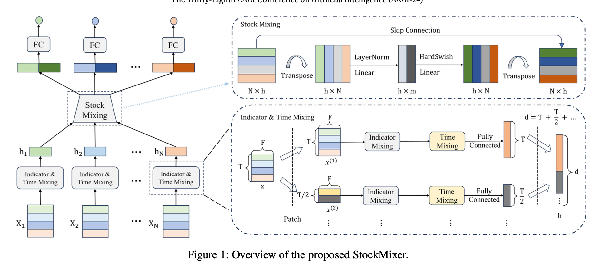

# Deep Learning in Finance

## StockMixer

- [AAAI (2024) StockMixer: A Simple yet Strong MLP-based Architecture for Stock Price Forecasting](https://ojs.aaai.org/index.php/AAAI/article/view/28681)

- [StockMixer: 比LSTM更简单有效的MLP架构的股票价格预测方法](https://mp.weixin.qq.com/s/g5xiAjz1hZF59UvREI2uLg)

  - See page 4 in the paper for full details

    

