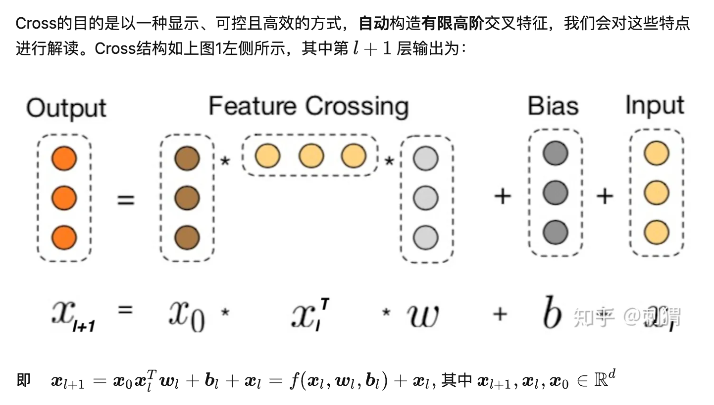

# Feature Interaction

## Deep & Cross

- [Deep & cross network for ad click predictions. (Wang et al., KDD 2017)](https://arxiv.org/pdf/1708.05123.pdf)
- [揭秘 Deep & Cross : 如何自动构造高阶交叉特征](https://zhuanlan.zhihu.com/p/55234968)

Deep and Cross 结构：

- Deep 层正常DNN
- Cross层做interaction
- 将两部分输出拼接起来再过FC+sigmoid
- Cross 层交叉组合特征，再加上一个residual block

Deep & Cross 特点

- 有限高阶：叉乘阶数由网络深度决定，深度 $$L$$ 对应最高 $$L+1$$ 阶的叉乘
- 自动叉乘：Cross输出包含了原始特征从一阶（即本身）到 $$L+1$$ 阶的所有叉乘组合，而模型参数量仅仅随输入维度成线性增长：$$ 2∗d∗L$$
- 参数共享：不同叉乘项对应的权重不同，但并非每个叉乘组合对应独立的权重（指数数量级）， 通过参数共享，Cross有效降低了参数量。此外，参数共享还使得模型有更强的泛化性和鲁棒性。例如，如果独立训练权重，当训练集中$$x_i \neq 0 \cap x_j \neq 0$$ 这个叉乘特征没有出现 ，对应权重肯定是零，而参数共享则不会，类似地，数据集中的一些噪声可以由大部分正常样本来纠正权重参数的学习

## xDeepFM

- [xDeepFM: Combining explicit and implicit feature interactions for recommender systems. (Lian et al., KDD 2018)](https://arxiv.org/pdf/1803.05170.pdf)
- [xDeepFM：名副其实的 ”Deep” Factorization Machine](https://zhuanlan.zhihu.com/p/57162373)

网络结构：

- CIN层的输入来自Embedding层，假设有$$m$$个field，每个field的embedding vector维度为$$d$$，则输入可表示为矩阵 $$X^0\in R^{m \times d}$$. 

- 不同于Deep & Cross (DCN) whose input is a vector in $$R^d$$, xDeepFM can be seen as a generalized version DCN with vector-wise product instead of bit-wise product.

- 令 $$X^k \in \mathbb{R}^{H_k \times d}$$ 表示第 $$k$$ 层的输出, 其中 $$H_k$$ 表示第 $$k$$ 层的vector个数, vecor维度始终为 $$d$$ 保持和输入层一致。具体地, 第 $$k$$ 层每个vector的计算方式为:
  $$
  X_{h, *}^k=\sum_{i=1}^{H_{k-1}} \sum_{j=1}^m W_{i j}^{k, h}\left(X_{i, *}^{k-1} \circ X_{j, *}^0\right) \in \mathbb{R}^{1 \times d}, \text{ for all } 1 \leq h \leq H_k
  $$
  where $$X^k_{h, *}$$ and $$W^{k,h}$$ is the $$h$$-th output vector (weight matrix) in the $$k$$-th layer, and $$\circ$$ is the Hadamard product. 当输入维度 $$d=1$$的时候，xDeepFM化简成DCN。

- 另一点与DCN的不同是，xDeepFM不拟合残差，因此第$$k$$层只能表示$$k+1$$阶组合特征，而DCN表示从1到$$k+1$$阶全部组合特征。相应地，DCN在最后一层输出层输出结果，而xDeepFM在每层都输出中间结果。

## Auto-Int

- [AutoInt: Automatic Feature Interaction Learning via Self-Attentive Neural Networks (Song et al., CIKM 2019)](https://arxiv.org/pdf/1810.11921.pdf)
- [AutoInt：基于Multi-Head Self-Attention构造高阶特征](https://zhuanlan.zhihu.com/p/60185134)

模型结构：

- 类似xDeepFM，input feature 分成 $$m$$ 个field，每个过一个embedding 层得到一个嵌入向量 $$\boldsymbol{e}_k \in R^d, \; \; 1 \leq k \leq m$$. 
- Interacting Layer 进行 multi-head self-attention, 在每个head上，对$$\{\boldsymbol{e}_k\}$$ 进行一次 self-attention. 每个 Attention head 都对应着三个转换矩阵: $$\boldsymbol{W}_{Q u e r y}, \boldsymbol{W}_{\text {Key }}, \boldsymbol{W}_{\text {Value }} \in \mathbb{R}^{d\times d}$$. 对于第 $$\mathrm{h}$$ 个 Attention head, 当第 $$\mathrm{m}$$ 个嵌入向量 $$\boldsymbol{e}_m$$ 作为query时, 其对应输出 $$\tilde{\boldsymbol{e}}_m^{(h)}$$ 为:

$$
\begin{aligned}
&\alpha_{m, k}^{(h)}=\frac{\exp \left(\phi^{(h)}\left(\boldsymbol{e}_m, \boldsymbol{e}_k\right)\right)}{\sum_{l=1}^M \exp \left(\phi^{(h)}\left(\boldsymbol{e}_m, \boldsymbol{e}_l\right)\right)} \\
&\phi^{(h)}\left(\boldsymbol{e}_m, \boldsymbol{e}_k\right)=<\boldsymbol{W}_{\text {Query }}^{(h)} \boldsymbol{e}_m, \boldsymbol{W}_{\text {Key }}^{(h)} \boldsymbol{e}_k>, \\
&\tilde{\boldsymbol{e}}_m^{(h)}=\sum_{k=1}^M \alpha_{m, k}^{(h)}\left(\boldsymbol{W}_{\text {Value }}^{(h)} \boldsymbol{e}_k\right) .
\end{aligned}
$$

- 对第$$m$$个嵌入 $$\boldsymbol{e}_m$$, 作者简单拼接它在 $$H$$ 个Attention head的输出, 然后引入标准的残差连接作为其最终输出 $$\boldsymbol{e}_m^{R e s}$$ :
  $$
  \begin{aligned}
  &\tilde{\boldsymbol{e}}_m=\tilde{\boldsymbol{e}}_m^{(1)} \oplus \tilde{\boldsymbol{e}}_m^{(2)} \oplus \ldots \oplus \tilde{\boldsymbol{e}}_m^{(H)} \in \mathbb{R}^{d H}, \\
  &\boldsymbol{e}_m^{R e s}=\operatorname{Relu}\left(\tilde{\boldsymbol{e}}_m+\boldsymbol{W}_{\text {Res }} * \boldsymbol{e}_m\right), \quad \boldsymbol{W}_{\text {Res }} \in \mathbb{R}^{d H \times d}.
  \end{aligned}
  $$

- 以上方法得到第 $$m$$个嵌入的对其他嵌入的二阶特征组合，以此类推可以叠加多个这样的层，构造更高阶的组合特征。当然，也可以在旁边搭个Deep层一起合作。

- 最终的预测输出为：
  $$
  y =\sigma\left(\boldsymbol{w}^T\left(\boldsymbol{e}_1^{R e s} \oplus \boldsymbol{e}_2^{R e s} \oplus \ldots \oplus \boldsymbol{e}_M^{R e s}\right)+b\right), \; \; \boldsymbol{w} \in \mathbb{R}^{d H M}, \; \sigma(\cdot) \text{ 是 sigmoid 激活函数}.
  $$

## $$S^3$$-Rec

- [S3-Rec: Self-Supervised Learning for Sequential Recommendation with Mutual Information Maximization. (Zhou et al., CIKM 2020)](https://arxiv.org/pdf/2008.07873.pdf)

- [CIKM 2020 | 序列推荐预训练：基于互信息最大化的自监督学习](https://zhuanlan.zhihu.com/p/242187586)

模仿BERT的预训练模式，通过自监督学习构造更好的embedding表达。

