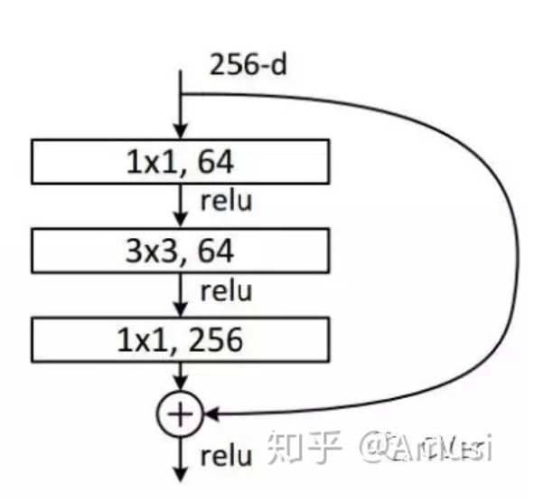

# General Structures and Techniques in Deep Learning

## Conditional Random Field (CRF)

The CRF is a widely-used modeling technique for many NLP tasks. **The vast majority of models are using a BiLSTM-CRF layer (which is essentially a CRF on top of a Bi-LSTM layer) combined with a BERT encoder.**

- [Exploring Conditional Random Fields for NLP Applications](https://hyperscience.com/tech-blog/exploring-crfs-for-nlp-applications/)
- [Lafferty, John, Andrew McCallum, and Fernando CN Pereira. "Conditional random fields: Probabilistic models for segmenting and labeling sequence data." (2001).](https://repository.upenn.edu/cgi/viewcontent.cgi?article=1162&context=cis_papers)
- [HMM and CRF tutorial 1](https://zhuanlan.zhihu.com/p/29989121)
- [CRF tutorial 2](https://zhuanlan.zhihu.com/p/70067113)

## Gated Recurrent Unit (GRU)

The GRU is like a LSTM with a forget gate, but has fewer parameters than LSTM, as it lacks an output gate. GRU's performance on many tasks was found to be similar to that of LSTM and has been shown to exhibit better performance on certain smaller and less frequent datasets.

- [Understanding GRU Networks](https://towardsdatascience.com/understanding-gru-networks-2ef37df6c9be)

## 1x1 Convolution Layer

- [1x1 conv](https://zhuanlan.zhihu.com/p/40050371)

作用：

1. 升维/降维 (在channel维上)

   - ResNet - Bottleneck design，如下图。第一个1x1的卷积把256维channel降到64维，然后在最后通过1x1卷积恢复，整体上用的参数数目：1x1x256x64 + 3x3x64x64 + 1x1x64x256 = 69632，而不使用bottleneck的话就是两个3x3x256的卷积，参数数目: 3x3x256x256x2 = 1179648，差了16.94倍。

     

2. 增加非线性

3. 跨通道信息交互（channal 的变换）