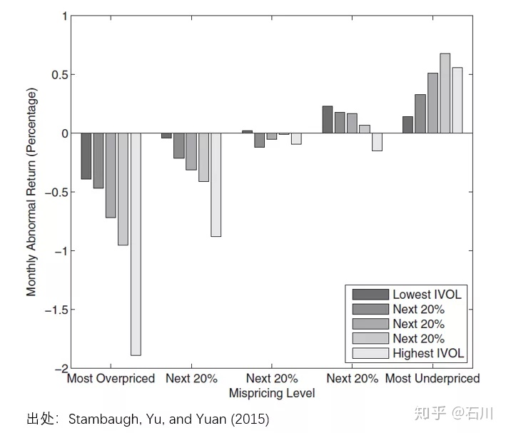
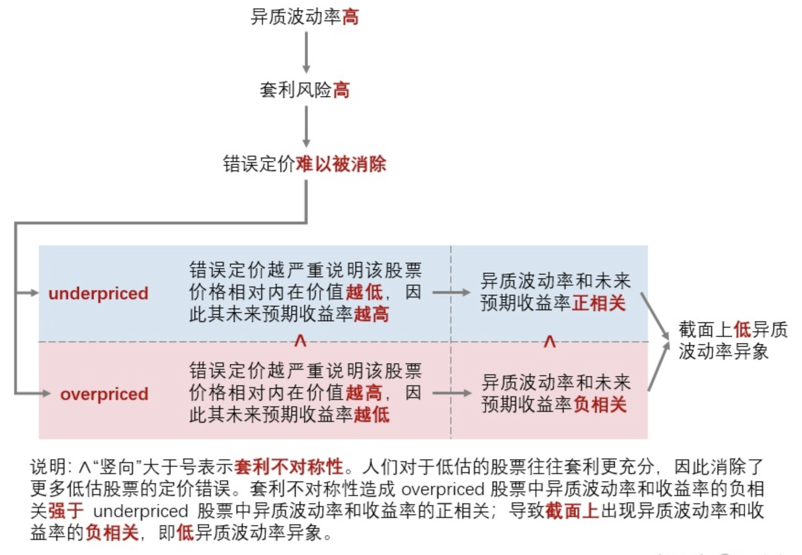

# Idiosyncratic Volatility

- [Stambaugh, Robert F., Jianfeng Yu, and Yu Yuan. "Arbitrage asymmetry and the idiosyncratic volatility puzzle." *The Journal of Finance* 70, no. 5 (2015): 1903-1948.](https://onlinelibrary.wiley.com/doi/full/10.1111/jofi.12286)
- [异质波动率之谜](https://zhuanlan.zhihu.com/p/80443596)

### 低异质波动率现象

在（most）overpriced 组中（下图左侧），异质波动率和收益率（以经 Fama and French 1993 三因子调整后的 α 表示）呈现负相关；在（most）underpriced 组中（下图右侧），异质波动率和收益率呈现正相关。套利不对称性导致市场对 overpriced 股票套利不充分，因此 overpriced 组的负相关强于 underpriced 组的正相关；从截面上来看，异质波动率和收益率呈现负相关，即低异质波动率异象。

异质波动率之谜的两种解释：

- **套利风险：**套利活动常常因为各种原因被阻止；关于套利风险的来源，最常见的便是噪声交易者的行为。套利交易者在价格高估时会卖空股票，但此时噪声交易者可能继续买入，进一步推高价格，甚至最终迫使套利交易者因追加保证金的压力等原因而止损。
- **套利不对称性：**投资者愿意积极买入 underpriced 股票，却对于卖空 overpriced 股票犹豫不决。

### 实证研究

Stambaugh, Yu, and Yuan (2015) 利用 11 个 Fama and French (1993) 三因子模型（下称 FF3）无法解释的经典异象构建了一个综合错误定价指标（mispricing measure）。这 11 个异象包括：

- Failure probability
- Ohlson’s O-score
- Net stock issues
- Composite equity issues
- Total accruals
- Net operating assets
- Momentum
- Gross profit to assets
- Asset growth
- Return on assets
- Investment to assets

假设对于某个异象，按其背后的逻辑排序后，多头组合能获得正的超额收益、空头组合能获得负的超额收益；这意味着越是多头靠前的股票越有可能是 underpriced、越是空头靠前的股票也有可能是 overpriced。具体实施中，Stambaugh, Yu, and Yuan (2015) 使用每个异象对应的指标依次为股票排序：从每个指标的逻辑出发，越是能在未来获得正超额收益的股票排名分越低、越是能在未来获得负超额收益的股票排名分越高。使用全部 11 个异象指标对股票排序后，每支股票就有 11 个分数，把它们取平均就得到综合得分 —— 综合得分越高，未来预期超额收益越低，因此该股票越是 overpriced。
