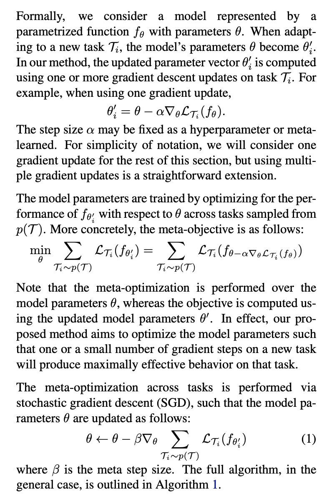

# Meta Learning

- [Model-Agnostic Meta-Learning for Fast Adaptation of Deep Networks. (Abbeel and Levine, ICML 2017)](http://proceedings.mlr.press/v70/finn17a/finn17a.pdf)

- [Model-Agnostic Meta-Learning （MAML）模型介绍及算法详解](https://zhuanlan.zhihu.com/p/57864886)

- In meta-learning, the goal of the trained model is to quickly learn a new task from a small amount of new data, and the model is trained by the meta-learner to be able to learn on a large number of different tasks.

- The key idea underlying this method is to train the model’s initial parameters such that the model has maximal performance on a new task after the parameters have been updated through one or more gradient steps computed with a small amount of data from that new task. (**This is not about training hyperparameters like NAS, but learning a good initial weights.**)

- On each step, for each task, the model parameters take one (or multi) gradient descent update. Then the model parameter takes another gradient update by minimizing the overall performance on the sampled tasks.

  