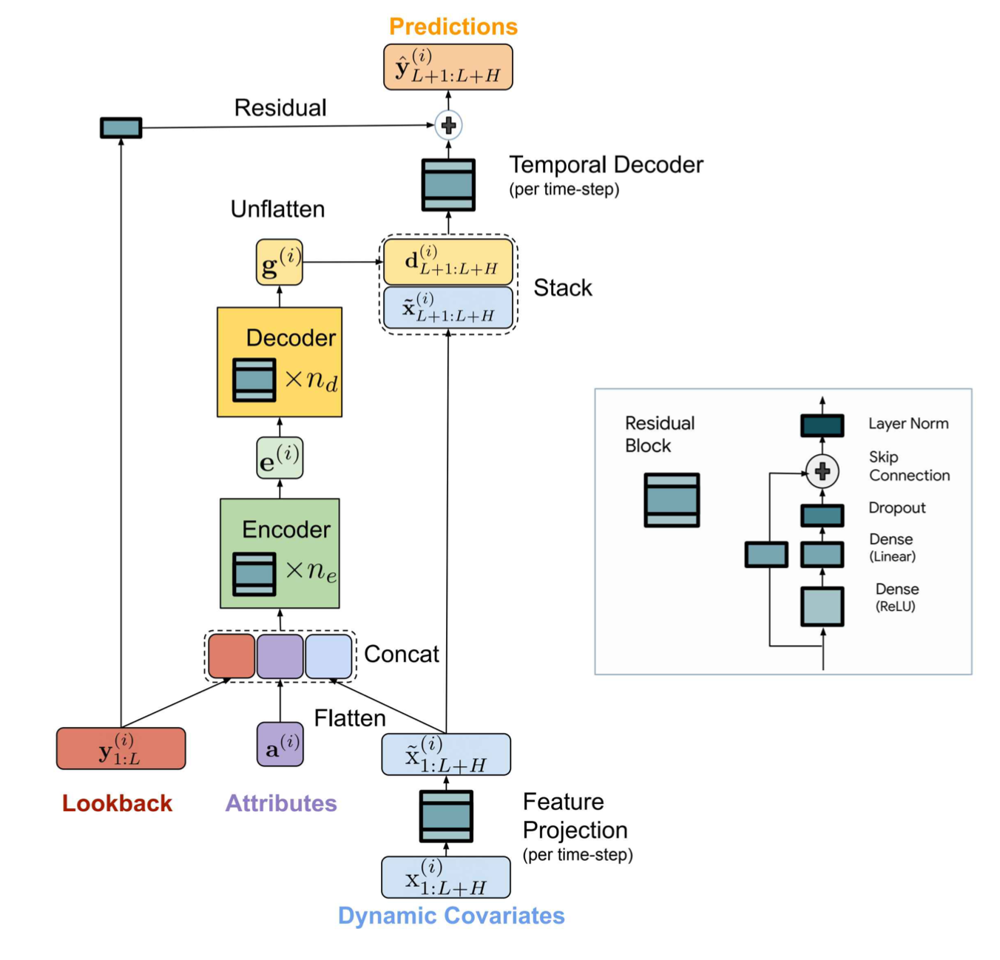

## Time Series Machine Learning

- [Long-term Forecasting with TiDE: Time-series Dense Encoder](https://arxiv.org/pdf/2304.08424v1.pdf)

### Summary

Propose the Time-series Dense Encoder (TiDE) model architecture for long-term time series forecasting. TiDE encodes the past of a time-series along with covariates using dense MLPs and then decodes time-series along with future covariates, again using dense MLPs.

