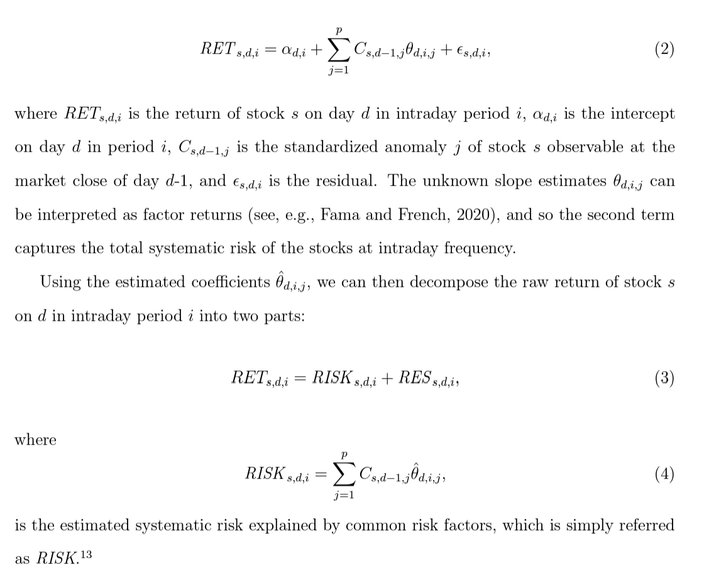
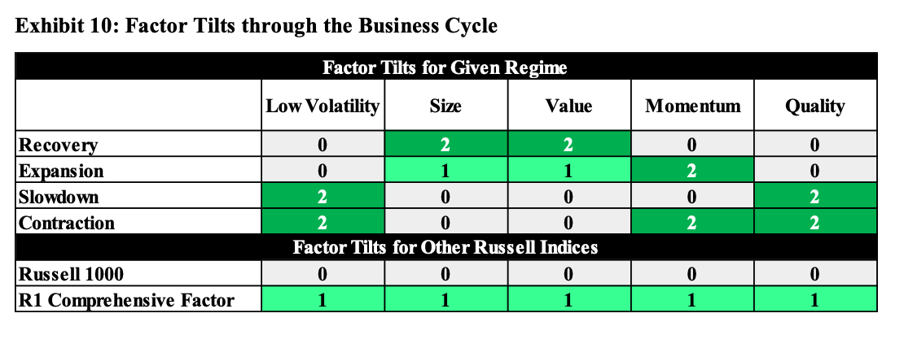

# Momentum

## Introduction to Momentum

- [Momentum](https://zhuanlan.zhihu.com/p/459019458)
- [What predicts momentum？](https://mp.weixin.qq.com/s/tb-tGFdYQ0pwoTiuKZTHjw)
- [残差动量 —— 有理有据还是数据挖掘？](https://zhuanlan.zhihu.com/p/95259084)
- Momentum construction:
  - Use a one-month gap between the end of the ranking period and the start of the holding period to avoid the short-term reversals shown by Jegadeesh (1990) and Lehmann (1990). 
- 动量因子成因
  - 系统性风险敞口：在一个市场状态的初期，动量组合对于当前的市场状态有着负的暴露，从而导致该时期的大幅损失，这意味着动量组合需要获得更高的收益来弥补相关的风险。Daniel and Moskowitz (2016) 将此形象地描述为“动量崩溃”（momentum crashes），并指出这一尾部风险正是动量的风险溢价来源。
  - 投资者行为偏差：投资者对其私有信息的过度自信及有偏的业绩自我归因会造成动量效应。Hur and Singh (2016) 进一步指出反应不足是主要原因。
  - 推定预期偏差：投资者通过将当前数据外推来得到对未来表现的预期，而这一朴素估计是有偏的。
  - 知情交易
  - 市场情绪
- 动量因子改进
  - 波动率管理策略利用过去一段时间的数据估计资产/策略的波动率，进而调整仓位 [Daniel and Moskowitz (2016 JFE) Momentum crashes](https://www.sciencedirect.com/science/article/pii/S0304405X16301490)
  - 残差动量：由个股的残差收益率计算，定义为个股收益率中无法被给定多因子模型解释的部分。[Blitz (2011). Residual momentum.]()
  - 动量缺口（momentum gap）：动量缺口对动量的表现有显著为负的影响。具体而言，动量缺口定义为全部股票 t-12 至 t-2 月累计收益的四分位差（或者 90% 分位数减 10% 分位数，二者高度相关）。实证研究表明，动量缺口对动量的未来表现有着显著为负的影响，且非常稳健。据此，若只在动量缺口不是特别高时执行动量策略，便可显著提升策略表现。[Huang （RFS 2021). "The momentum gap and return predictability.](https://papers.ssrn.com/sol3/papers.cfm?abstract_id=2318858)
  - 价格高点距离：当前最新价与最高点的距离。
  - 加速度动量：价格对时序的期数以及期数的平方项回归，并取平方项的系数为加速度动量指标。[Chen and Yu (2014) Investor Attention, Visual Price Pattern, and Momentum Investing]()
  - Condi on 买方竞争度指标，(condition on crowdness) [Hoberg et al. (RFS 2020). Buy-Side competition and momentum profits.](https://papers.ssrn.com/sol3/papers.cfm?abstract_id=3132378)
  - 左尾动量：投资者对尾部风险或者坏消息往往反应不足，导致尾部动量得以持续
    - [Atilgan et al. (2020 JFE) Left-tail momentum- Underreaction to bad news, costly arbitrage and equity returns](https://papers.ssrn.com/sol3/papers.cfm?abstract_id=3070777)
    - **Rationale**: Investors underestimate the persistence in left-tail risk and overprice stocks with large recent losses. Thus, low returns in the left-tail of the distribution persist into the future causing left-tail return momentum. The left-tail risk anomaly is stronger for stocks that are more likely to be held by retail investors, that receive less investor attention, and that are costlier to arbitrage.
    - **Measure 1**:The first left-tail risk metric is value-at-risk (VaR) that measures how much the value of an investment declines over a given time period with a given probability. VaR is calculated as the 1st (VaR1) or 5th (VaR5) percentile of the daily returns over the past one year (250 trading days) with the restriction that at least 200 non-missing return observations should exist in the past year. 
    - **Measure 1**: Alternative measures of left-tail is Expected shortfall (ES). ES is defined as the conditional expectation of a loss given that the loss is beyond the VaR threshold. We define ES as the average of the observations that are less than or equal to the 1st (ES1) or 5th (ES5) percentile of the daily returns for each stock during the past year (250 trading days) with the restriction that at least 200 non-missing return observations should exist in the past year.
    - **Results**: stocks in the lowest value-at-risk decile outperforms stocks in the highest value-at-risk decile. This relation is driven by the underperformance of stocks with high value-at-risk because the alphas for portfolio 10 are negative and highly significant without exception.

## Momentum Crashes

- [Daniel and Moskowitz (2016 JFE) Momentum crashes](https://www.sciencedirect.com/science/article/pii/S0304405X16301490)

- Momentum crashes: despite their strong positive average returns across numerous asset classes, momentum strategies can experience infrequent and persistent strings of negative returns. 

- Observation from data: Momentum premium falls when the past three-year market return has been negative and that the momentum premium is low when market volatility is high.

- The crash performance is mostly attributable to the short side or the performance of losers, and **the short side beta increases dramatically during crash periods.**

- Solutions:

  - the optimal weight (alpha size) on the risky asset at time $$t-1$$ is
    $$
    w_{t-1} = \frac{1}{2 \lambda} \frac{\mu_{t-1}}{\sigma_{t-1}^2},
    $$
    where $$\mu_{t-1}$$ is the conditional expected return on the (zero-investment) WML portfolio over the coming month, it is estimated using the following regression
    $$
    R_{t} = \left(\alpha_0 + \alpha_{B} I_{B, t-1}\right) + \left(\beta_0 + \beta_{B} I_{B, t-1}\right) R_{m, t} + \epsilon_t
    $$
    where $$I_{B, t-1}$$ is  an ex ante bear market indicator that equals one if the cumulative index return $$R_{m,t}$$ in the past 24 months is negative and is zero otherwise.
    
    The conditional variance is given by GARCH model,
    $$
    \begin{aligned}
    R_t &= \mu + \epsilon_t, \; \; \epsilon_t \sim \mathcal{N}(0, \sigma^2_t), \\
    \sigma_t^2 &= w + \beta \sigma_{t-1}^2 + \left(\alpha + \gamma I (\epsilon_{t-1} < 0)\right) \epsilon_{t-1}^2.
    \end{aligned}
    $$
    

## 寻找高质量动量

- [给你的动量选股策略加点“料”](https://zhuanlan.zhihu.com/p/40468929)
- [Da, Zhi, Umit G. Gurun, and Mitch Warachka. "Frog in the pan: Continuous information and momentum." *The review of financial studies* 27, no. 7 (2014): 2171-2218.](https://academic.oup.com/rfs/article-abstract/27/7/2171/1578455)
- [Bali, Turan G., Nusret Cakici, and Robert F. Whitelaw. "Maxing out: Stocks as lotteries and the cross-section of expected returns." *Journal of financial economics* 99, no. 2 (2011): 427-446.](https://www.sciencedirect.com/science/article/abs/pii/S0304405X1000190X)

1. **寻找依靠价格缓慢增长实现的高动量；**

   - 行为金融学中的温水煮青蛙：人的这种缺陷叫做limited attention（有限注意力）。由于人们的认知资源是有限的，在任何给定的时刻，我们的大脑都偏好去处理那些最显著、最重要的信息，而忽视那些不显著的、经济效应微弱的因素。一系列频繁但微小的变化对于人的吸引力远不如少数却显著的变化；因此投资者对于连续信息造成的股价变化反应不足。

   - 信息离散性（information discreteness，ID）：ID 低（说明信息连续性强）的动量才是高质量动量
     $$
     ID = \text{sign(过去一段时间的收益率) × (这段时间内下跌交易日\% - 这段时间内上涨收益日\%)}
     $$

   - Da et al. (2014) 说明，与传统动量相比，通过 ID 因子删选找到的高质量动量能够获得更高的超额收益，且该收益在样本外的持续性更强（这有助于我们降低调仓频率、减少换手率、节约交易成本）。

2. **避免大波动造成的高动量。**

   - 行为金融学中重要的理论 —— 前景理论 —— 指出，人们对于极小概率事件发生的主观感受存在认知偏差，会高估它们发生的概率。对于小概率事件发生可能性的高估导致投资者会过度追逐具有正偏度分布的股票，造成它们的高动量。
   - Bali et al. (2011) 使用一个称作 MAX 的代理指标研究了这个问题。MAX 是过去 1 个月内日收益率的最大值（美股不设涨跌停板限制，因此更能反映人们对 lottery-like 股票追逐的疯狂程度）。使用 MAX 将股票分成 10 组，MAX 值最高的那一组为 lottery-like 股票，而 MAX 值最低的那一组称为“无聊”股票。数据显示，“无聊”股票能显著跑赢 lottery-like 股票。在挑选高动量股票时，我们可以主动避免那些 lottery-like 股票。

## 加强版反转

- [加强版反转](https://zhuanlan.zhihu.com/p/70129890)
- [寻找股票市场中的预期差](https://zhuanlan.zhihu.com/p/53944793)

- [Da, Liu, and Schaumburg (2013 MS) A Closer Look at the Short-Term Return Reversal](https://pubsonline.informs.org/doi/10.1287/mnsc.2013.1766)
- [Piotroski (2000 JAR) Value Investing: The Use of Historical Financial Statement Information to Separate Winners from Losers](https://www.semanticscholar.org/paper/Value-Investing%3A-The-Use-of-Historical-Financial-to-Piotroski/0559e92e06dae21e77ea79d79417b8a1d40be772)
- [Zhu, Z., L. Sun, and M. Chen (2019). Fundamental strength and short-term return reversal.](https://www.sciencedirect.com/science/article/abs/pii/S0927539819300234#:~:text=Fundamental%20strength%20information%20helps%20better%20identify%20short-term%20return,winners%20with%20weak%20fundamentals%20experience%20stronger%20short-term%20reversals.)
- [Piotroski and So (2012 RFS) Identifying Expectation Errors in Value/Glamour Strategies](https://academic.oup.com/rfs/article-abstract/25/9/2841/1589567)

Da, Liu, and Schaumburg (2013) 将和现金流有关的新息从股票收益率中减去，以此排除基本面变化对于收益率的影响，以期捕捉由于过度反应和流动性冲击造成的非理性下跌。
$$
\mathrm{Residual}_{t+1} = r_{t+1} - CF_{t+1}
$$
其中 CF代表最新的cash flow news, 使用了基于分析师预期修正的计算方法。然而，上述残差计算方法存在两个问题：

1. **股票价格对于基本面消息的吸收是缓慢的，因此仅考虑最新的基本面信息是不够的，还应考虑过去一段时间的；**
2. 分析师并不能覆盖全部股票，因此使用分析师预期修正无法对全市场的股票进行实证分析。

解决第一点：计算过去一段时间窗口内 CF 的变化

解决全部两点：Zhu, Sun, and Chen (2019) 用 Piotroski (2000) 的 F-Score 代替 cash flow news 作为基本面信息的代理变量
$$
\mathrm{Residual}_{t+1} = r_{t+1} - \text{F-score}
$$
其中 F-score 通过 9 个指标给股票的基本面打分，计算方式为以下九个dummy量的和：

- Performance-related Factors:

  - ROA: net income before extraordinary items scaled by beginning-of-the-year total asset. (Take 1 if positive else 0)
  - CFO: cash flow from operations scaled by beginning-of-the-year total asset (Take 1 if positive else 0)
  - $$\Delta$$ ROA: the current year's ROA less the prior year's ROA (Take 1 if positive else 0)
  - ACCRUAL: the current year's net income before extraordinary items less cash flow from operations, scaled by beginning-of-the-year total asset (Take 1 if positive else 0)
  - $$\Delta$$ LEVER: the historical change in the ratio of total long-term debt to average total assets, and view an increase (decrease) in financial leverage as a negative (positive) signal. (Take 1 if positive else 0)
  - $$\Delta$$ LIQUID: the historical change in the firm's current ratio between the current and prior year, where I define the current ratio as the ratio of current assets to current liabilities at fiscal year-end. (Take 1 if positive else 0)
  - EQ-OFFER: equal to one if the firm did not issue common equity in the year preceding portfolio formation, zero otherwise. (Similar to an increase in long-term debt, financially dis- tressed firms that raise external capital could be signaling their inability to generate sufficient internal funds to service future obligation)

  - $$\Delta$$ MARGIN: the firm's current gross margin ratio (gross margin scaled by total sales) less the prior year's gross margin ratio. (Take 1 if positive else 0)

  - $$\Delta$$ TURN as the firm's current year asset turnover ratio (total sales scaled by beginning-of-the-year total assets) less the prior year's asset turnover ratio.  (Take 1 if positive else 0)

Zhu, Sun, and Chen (2019) 将这个剔除了基本面信息的反转异象称为**基本面锚定反转（Fundamental-anchored reversal）**。

类似地，Piotroski and So (2012) 使用P/B 和 F-Score 作为市场和基本面的代理变量，寻找存在预期差的股票；而上述反转策略使用过去短期的涨跌幅替换 P/B，和 F-Score 一起寻找存在预期差的股票。

- 预期差：价格反映了投资者对股票的市场预期，而内在价值反映了股票本身的基本面预期。高、低估说明这两个预期之间存在差异，这个差异为预期差。
- 价值股跑赢成长股的内在逻辑是预期差的修正

## 因子动量和动量因子

- [因子动量和动量因子](https://zhuanlan.zhihu.com/p/606461747)
- [Ehsani and Linnainmaa (2022 JoF). Factor momentum and the momentum factor.](https://onlinelibrary.wiley.com/doi/10.1111/jofi.13131)
- **Q1：**因子收益率是否有时序自相关性？
- **A1：**绝大多数因子的收益率存在自相关性。
- **Q2：**因子满足何种条件时，更容易出现自相关性？
- **A2：**和个股收益率协方差矩阵更相关的因子，自相关性更强。
- **Q3：**利用自相关性、基于因子历史收益率构造的因子动量策略（注意，它类似于 UMD，是以因子组合为 assets 的截面动量策略）和个股截面动量因子（即 UMD）有什么关系？谁是因？谁又是果？
- **A3：**因子动量能够解释个股动量因子（及其各种变化版本），但个股动量（及其各种版本）无法解释因子动量。个股动量效应背后的驱动（之一）是因子动量。
- **Q4：**因子动量能否解释个股残差动量？
- **A4：**残差动量是多因子模型中存在遗漏变量所致，仅仅是被遗漏的因子的动量。一旦不存在模型设定偏误，残差动量消失。
- **Q5：**如何理解个股动量因子和其他因子时序无关的实证现象？
- **A5：**当控制了历史收益率之后，个股动量因子和其他因子有很强的正相关或负相关。个股动量因子和其他因子时变的条件相关性使其看上去和其他因子非条件无关。

## Time Series Momentum

- [因子动物园 - 时序动量真的更好吗？](https://zhuanlan.zhihu.com/p/120835716)
- [刀疤连 - 和趋势做纯纯的朋友](https://zhuanlan.zhihu.com/p/81421085)

**学术上在解释因子的收益来源时，往往从两个角度入手：risk-based 和 mispricing。前者是经典金融学的角度，认为一个异象如果能获得超额收益，肯定是承担了某种讨厌的风险，超额收益是这种风险的补偿；后者从行为金融学的角度，认为要么是某种限制阻碍了异象的消失，要么是投资者认知偏差导致的行为不理性。**

### 时序动量

- [Moskowitz, Tobias J., Yao Hua Ooi, and Lasse Heje Pedersen. "Time series momentum." *Journal of financial economics* 104, no. 2 (2012): 228-250.](https://www.sciencedirect.com/science/article/pii/S0304405X11002613)

1. 时序动量与横截面动量的区别

   - Cross-sectional momentum literature focuses on the relative performance of securities in the cross-section, finding that securities that recently outperformed their peers over the past three to 12 months continue to outperform their peers on average over the next month.
   - Time series momentum focuses purely on a security’s own past return.

2. This positive time series momentum that partially reverse over the long-term may be consistent with initial under-reaction and delayed over-reaction, which theories of sentiment suggest can produce these return patterns

   - 有效市场假说认为，当出现某个重要的新信息时，价格会立即得到反应，以匹配最新的内在价值。然而，行为金融的角度认为，由于投资者认知偏差的纯在，市场并不是完全有效，而是慢慢地吸收新信息的影响。
   - 初始阶段，由于锚点效应 ( Anchoring )、处置效应 ( The disposition effect) 和非盈利操作等，导致价格对信息反应不足。
     - 锚点效应。投资者往往会把自己的观点锚定在最近历史数据上，不愿意很快改变自己的想法，当新消息到来时反应很迟钝，造成价格反应缓慢；
     - 处置效应。投资者往往会过早低卖出盈利股票以兑现收益；相反，对那些亏损的股票迟迟不肯止损。这样的后果是，上涨不会一蹴而就，下跌不会一跌到底，造成价格慢慢的移动；
     - 非盈利操作。一些非盈利操作，也会减缓价格的反应速度，例如中央银行在外汇市场和固定收益市场进行斡旋，以减少汇率和利率的波动。
   - 一旦趋势起来，就进入了第二阶段：趋势持续甚至过度反应，这往往是由于羊群效应 ( Herding ) ，以及确认和代表偏差 ( Confirmation bias 和 representativene)等因素导致的。
     - 羊群效应。羊群效应也叫从众效应，当投资者观点和其他大多数投资者观点不一致时，容易怀疑和改变自己的观点，以使得和群体一致。在价格上涨或下跌开启后，投资会想羊群一样，加入到趋势行情中来；
     - 确认和代表性偏差。行情开启后，投资者会用最近的价格变动来推断未来，选择性地关注最近盈利的方向；不仅如此，一旦确认了自己的观点，便会找各种数据和信息支持自己的看法，这使得价格趋势得以延续。
   - 最后，趋势不会永不眠，价格不会一直朝一个方向走下去。在趋势的末端，价格可能已经过度反应导致严重偏离基本面，因此最终会出现反转趋势宣告结束。

3. We focus on the most liquid instruments to avoid returns being contaminated by illiquidity or stale price issues and to match more closely an implementable strategy at a significant trade size.

4. The ex ante annualized variance 

5. The ex ante annualized variance $$\sigma_{t}^{2}$$ for each instrument is calculated as follows:
   $$
   \sigma_{t}^{2}=261 \sum_{i=0}^{\infty}(1-\delta) \delta^{i}\left(r_{t-1-i}-\bar{r}_{t}\right)^{2}.
   $$
   where the scalar 261 scales the variance to be annual, the weights $$(1-\delta) \delta^{i}$$ add up to one, and $$\bar{r}_{t}$$ is the exponentially weighted average return computed similarly. The parameter $$\delta$$ is chosen so that the center of mass of the weights is $$\sum_{i=0}^{\infty}(1-\delta) \delta^{i} i=\delta /(1-\delta)=60$$ days.

6. The regression is given by
   $$
   r_{t}^{s} / \sigma_{t-1}^{s}=\alpha+\beta_{h} r_{t-h}^{s} / \sigma_{t-h-1}^{s}+\varepsilon_{t}^{s},
   $$
   or
   $$
   r_{t}^{s} / \sigma_{t-1}^{s}=\alpha+\beta_{h} \operatorname{sign}\left(r_{t-h}^{s}\right)+\varepsilon_{t}^{s}.
   $$

7. 交易策略：For each instrument $$s$$ and month $$t$$, we consider whether the excess return over the past $$k$$ months is positive or negative and go long the contract if positive and short if negative, holding the position for $$h$$ months. We set the position size to be inversely proportional to the instrument's ex ante volatility, $$1 / \sigma_{t-1}^{s}$$, each month. 

8. 如果只考虑用过去12个月收益为基准，hold未来一个月的交易策略, the TSMOM return for any instrument $$s$$ and month $$t$$ is therefore:
   $$
   r_{t, t+1}^{T S M O M, s}=\operatorname{sign}\left(r_{t-12, t}^{s}\right) \frac{40 \%}{\sigma_{t}^{s}} r_{t, t+1}^{s}.
   $$

   - If we regress the TSMOM strategy for each security on the strategy of always being long (i.e., replacing ‘‘sign’’ with a 1 in the above equation), then we get a positive alpha in 90% of the cases (of which 26% are statistically significant; none of the few negative ones are significant).

9. The link between time series momentum returns and the positions of speculators and hedgers indicates that speculators profit from time series momen- tum at the expense of hedgers. This evidence is consistent with speculators earning a premium via time series momentum for providing liquidity to hedgers.

### 时序动量的问题

- [Huang, Dashan, Jiangyuan Li, Liyao Wang, and Guofu Zhou. "Time series momentum: Is it there?." *Journal of Financial Economics* 135, no. 3 (2020): 774-794.](https://www.sciencedirect.com/science/article/abs/pii/S0304405X19301953)

1. 不同资产未调整的收益对未来收益的预测能力，并发现只有 8（3）种资产在 10%（5%）的显著性水平下有显著的预测能力。样本外表现则更加糟糕，有 45 种资产的样本外 R 方是负的。

2. 考虑MOP(2012)的回归，

$$
r_{t}^{s} / \sigma_{t-1}^{s}=\alpha+\beta_{h} r_{t-h}^{s} / \sigma_{t-h-1}^{s}+\varepsilon_{t}^{s},
$$

make an implicit assumption that the mean returns of all assets are the same by imposing a common intercept. To highlight fixed effects, a possible specification is
$$
r_{t}^{s} / \sigma_{t-1}^{s}=\alpha+\beta_{h} r_{t-h}^{s} / \sigma_{t-h-1}^{s}+ \mu_s / \sigma_s +\varepsilon_{t}^{s}
$$
where $$\mu_s$$ and $$\sigma_s$$ are the unconditional mean and volatility of asset $$s$$. Hence, the estimate of $$\beta$$ should be
$$
\hat{\beta}=\beta+\frac{\operatorname{Cov}\left(r_{t-h+1}^{s} / \sigma_{t-h}^{s}, \mu_{s} / \sigma_{s}\right)}{\operatorname{Var}\left(r_{t-h+1}^{s} / \sigma_{t-h}^{s}\right)}.
$$
If all assets have the same Sharpe ratio (or mean, if volatilities are the same), the second term is zero ($$\mu_{s} / \sigma_{s}$$ is fixed). Otherwise, it would be significantly positive when the number of assets is large, as the correlation between realized returns and their means is mechanically positive. As a result, the slope estimate of MOP(2012) regression is biased upward.

- Two more reasons:
  - Because volatility varies dramatically across assets, volatility scaling in the pooled regression without controlling for fixed effects can further exacerbate the upward bias.
  - As a predictor, the past 12-month cumulative return is persistent and can generate substantial size distortions. (large sample result when sample size is non-asymptotic, slow non-asymptotic rate).

3. 构建了一个 TSH 策略，which does not require predictability：
   $$
   r_{t+1}^{T S H, s}=\operatorname{sign}\left(r_t^{s}\right) r_{t+1}^{s}.
   $$

   - find that the TSM and TSH strategies perform virtually the same and their differences in average returns, as well as in risk-adjusted ones, are indifferent from zero. We find that the performances of the TSM and TSH strategies mainly stem from their long legs, and their short legs have insignificant average and risk-adjusted returns.
   - Examine the overall predictability of TSM across assets. The slope measures how realized returns are explained by predicted returns. If the past 12-month return perfectly predicts the next one-month return, the slope should have a value of one. We find that for the TSM forecasts the slope has a value close to zero. When regressing the TSM forecasts on the TSH forecasts, the slope is very close to one. This result indicates little difference in predictability between the two forecasts, suggesting, again, no evidence of TSM across the assets.
   - 显然，TSH 的持仓会比较稳定，不太会频繁调仓。某种程度上，TSH 类似买入持有（buy-and-hold），当然，严格来讲，不仅仅是 buy-and-hold ，还有 sell-and-hold 。

### 时序动量与截面动量

- [Goyal, Amit, and Narasimhan Jegadeesh. "Cross-sectional and time-series tests of return predictability: What is the difference?." *The Review of Financial Studies* 31, no. 5 (2018): 1784-1824.](https://academic.oup.com/rfs/article-abstract/31/5/1784/4636242)

1. 考虑到资产总体上会更多上涨而非下跌，做多过去收益率大于 0 的资产而做空过去收益率小于 0 的资产的时序动量平均而言会有净多头寸。相比之下，截面动量是完全对冲的、资金中性多空组合。To make these strategies directly comparable, we add to the CS strategy a time-varying investment in the market (TVM) equal to the dollar value of the difference between the long and short sides of the TS strategy each month.

2. 作者们进一步将净头寸带来的收益拆分为（静态持仓获取的）风险溢价和择时收益：
   $$
   \begin{aligned}
   R_{t}^{T V M}&=\operatorname{NetLong}_{t} \times \bar{R}_{t}=\sum_{i} w_{i t-1}^{T S} \times \bar{R}_{t}, \\
   \overline{R_{t}^{T V M}}&=\underbrace{\overline{\text { NetLong }_{t}} \times \overline{\bar{R}_{t}}}_{\text {Risk Premium }}+\underbrace{\operatorname{cov}\left(\operatorname{NetLong}_{t}, \bar{R}_{t}\right)}_{\text {Market Timing }},
   \end{aligned}
   $$
   where $$\overline{\mathrm{NetLong}_{t}}$$ and $$\overline{\bar{R}}_{t}$$ are the average net long position and the average equalweighted excess return, respectively, over the sample period. Table 7 展示了上述分解的结果，

   - 风险溢价部分无论在经济意义上还是统计上看都非常显著。
   - 择时收益仅在回望期为 1 月时显著，随着回望期变长，择时收益逐渐下降，甚至变为负的。

   - 时序动量的确有显著的净多头暴露，且随着回望期变长，净多头暴露也变得更大。因子时序动量的收益主要来自 buy-and-hold 所提供的风险溢价。The TS strategy benefits from the risk premium component due to large net long position in the market. 高beta

## Momentum with Volatility Scaling

- [Hanauer and Windmüller (2023) Enhanced momentum strategies](https://www.sciencedirect.com/science/article/abs/pii/S0378426622002928)

  - Momentum crash: the risks of momentum is caused by time-varying factor exposures. For instance, after bear markets, the market betas of loser stocks tend to be higher than those of winner stocks. When the market rebounds after a bear market, the overall negative market sensitivity of the winner-minus-loser strategy generates negative strategy returns during the market up-movement.

  - **Constant volatility-scaled momentum (cMOM)** adjuststhe momentum portfolio to a constant target volatility level. $$\hat{\sigma}_t^2$$ is the forecasted expected volatility based on past 126-day realized volatility of momentum return.
    $$
    \begin{aligned}
    &w_{\mathrm{cMOM}, t} = \frac{\sigma_{\text{target}}}{\hat{\sigma}_t}, \; \;  R_{\mathrm{cMOM}, t} = R_{\mathrm{MOM}, t} \cdot w_{\mathrm{cMOM}, t} \\
    &\hat{\sigma}_t^2 = 21 \cdot \sum^{126}_{j=1} \frac{R^2_{MOM, t-j}}{126}
    \end{aligned}
    $$

  - **Constant semi-volatility-scaled momentum (sMOM)** is constructed similarly to cMOM, but the forecast volatility is calculated using 
    $$
    \hat{\sigma}_t^2 = 21 \cdot \sum^{126}_{j=1} \frac{R^2_{MOM, t-j} \mathbb{I}_{R_{MOM, t-j} < 0}}{126}
    $$
    The return of sMOM is the momentum return in month t weighted with the inverse of the realized downside volatility, scaled with a static scalar to the **full sample volatility of momentum** ($$\sigma_{\text{target}}$$). 

  - **Dynamic-scaled momentum (dMOM)** enhances the constant volatility-scaled momentum by additionally incorporating the expected strategy return.
    $$
    w_{d M O M, t}=\left(\frac{1}{2 \lambda}\right) \cdot \frac{\hat{\mu}_t}{\hat{\sigma}_t^2}
    $$
    where $$\hat{\mu}_t=\mathbb{E}_{t-1}\left[\mu_t\right]$$, and $$\hat{\sigma}_t^2=\mathbb{E}_{t-1} \sigma_t^2$$ is the forecasted respective conditional expected return (variance) of momentum, and $$\lambda$$​ is a static scalar scaling the dynamic strategy to the full sample volatility of momentum. The expected variance can be constructed the same as cMOM, and The return of momentum is forecasted with the following time-series regression
    $$
    R_{M O M, t}=\gamma_0+\gamma_{\text {int }} \cdot I_{\text {Bear }, t-1} \cdot \sigma_{R M R F, t-1}^2+\epsilon_t,
    $$
    where $$I_{\text {Bear }, t-1}$$ is a bear-market indicator that equals one if the cumulative past two-year market return is negative (and zero otherwise), $$\sigma_{R M R F, t-1}^2$$​ is the realized variance of RMRF (market factor) over the past 126 days.

  - The enhanced strategies generate statistically significant and positive returns in Asian countries where MOM does not, e.g., Indonesia, Malaysia, South Korea, or Taiwan. However, none of the enhanced strategies for Japan, generate significant premia. 

  - A country-month is classified as a market state continuation (transition) in case the past 12-month and the current month’s market return have the same (a different)

    sign.The momentum returns across time are much higher in market continuations

    than in market transitions.

  - Both MOM and enhanced momentum strategies generate their performance mainly during non-January months.

- [Momentum with Volatility Timing](https://www.sciencegate.app/document/10.2139/ssrn.3417360)

  - **Winners-Only Component**: To address factor underperformance in the post-crisis period, the traditional winners-minus-losers (WML) momentum strategy is replaced with only the winners component. This means that instead of going long on past winners and short on losers, the strategy focuses solely on the winners. (Top 10%)
  - **Threshold Function and Past Volatilities**: The proposed approach replaces constant volatility scaling with a threshold function. Specifically, the strategy exits the momentum trades when the realized volatility exceeds a certain threshold, aiming to avoid periods of high market stress. 

- Yang, Hanlin (2019) On Factor Return Predictability and Factor Momentum

  - WLS-AR: future factor return is predicted by past factor return, weighted by realized vol of factor in the same period.
    $$
    \hat{\beta} = \arg \min_{\beta} \sum_{t=1}^T \left(\frac{r_{t+1} - \beta_0 - \beta_1 r_t}{\sigma_t}\right)^2, \; \; \hat{r}_{t+1} = \frac{\hat{\beta}_0 + \hat{\beta}_1 r_t}{\sigma_t}.
    $$
    where $$r_t$$ is the monthly return of the factor, $$\sigma_t$$ is the realized (rolling/ema) vol of factor return.

  

## Factor Timing

- [JPM (2018) The Promises and Pitfalls of Factor Timing](https://jacobslevycenter.wharton.upenn.edu/wp-content/uploads/2017/08/The-Promises-and-Pitfalls-of-Factor-Timing-2.pdf)

  - The Perils and Pitfalls of Factor Timing 
    - Time-Varying Relationships
    - Cherry-Picking of Indicators Based on Perfect Hindsight
    - Data Revisions 
  -  Main Categories of Factor Predictors
    - Financial Conditions: Corporate credit spread, TED spread, Money Supply Growth 
    - Economic Conditions/Macroeconomic Cycle: GDP growth, Capacity Ratio, Consumer Confidence Index 
    - Sentiment/Risk Sentiment: VIX, ISM PMI 
    - Valuation: CAPE, Dividend Yield, Earnings Yield, Book-to-Price 
    - Trend/Momentum/Persistence: Past performance (1 month, 3 months, 6 months, 1 year, 3 years, 5 years) 
  - Construction:
    - The portfolio is equally weighted across four factor portfolios: Value, Size, Low Volatility, and Quality.  Once a month, stocks are sorted based on the underlying Value, Size, Low Volatility, and Quality metrics and divided into quintiles.  
    - The spread in B/P is calculated as the median B/P of the top quintile minus the median B/P of the bottom quintile.  When this spread is large and positive, the factor is attractively priced (cheap). When the spread is negative, the factor is expensive.  
    - The current spread is compared against an average of the historical spread.  If the former flags a given factor as expensive and it is more than 1 standard deviation outside the historical spread, that factor is removed from the portfolio for 3 years.  The remaining factors are equal-weighted.

- [Risk Momentum: A New Class of Price Patterns](https://papers.ssrn.com/sol3/papers.cfm?abstract_id=4062260)

  - Formula

    

  - We buy stocks in the top decile with high RISK values and short those in the bottom decile with low RISK values. Both risk momentum and the risk-based return momentum hold across different times of the day. The risk-based return momentum hold for daily/weekly and monthly.

  - **We show that the persistence in risk is driven by the positive autocorrelation in individual factors and the positive cross-serial lead-lag among anomaly factors.**

  - We document stronger risk-based return momentum in the morning sessions, during periods with more frequent firm news arrivals, when aggregate idiosyncratic volatility is high, and among stocks with greater risk concentration.

- [Babu, Abhilash, et al. "Trends everywhere." *Journal of Investment Management*, Forthcoming (2018).](https://papers.ssrn.com/sol3/papers.cfm?abstract_id=3386035)

  - Time Series momentum has worked across asset classes and across several trend horizons (look back windows).
  - Construction: for each asset, position = +1 if past 12 months return is positive else -1. Scale each asset by ex-ante annualized volatility (abs position = 40% / $$\sigma^2$$)

- [Gupta, Tarun, and Bryan Kelly. "Factor momentum everywhere." *The Journal of Portfolio Management* 45.3 (2019): 13-36.](https://jpm.pm-research.com/content/45/3/13.full)

  - Time-series momentum and cross-sectional momentum are fundamentally the same phenomenon but that the time-series approach provides a purer measure of expected factor returns than does the cross-sectional method (slightly higher Sharpe, positive alpha when regress time-series MOM on cross-sectional MOM),

  - Consider a factor timing strategy with one-month holding period. The one-month factorreturn is as follows: $$f_{i, t+1}=s_{i, t} \times f_{i, t+1}$$ where $$s_{i, t}=\min \left(\max \left(\frac{1}{\sigma_{i, t}} \sum_{\tau=1}^T f_{i, t-\tau+1},-2\right), 2\right)$$. Here $$f_{i, t+1}$$ is the next month factor $$i$$ return, $$s_{i, t}$$ is the timing factor (position on this factor at time $$t$$) which considers the factor past performance (with lookback window $$\mathrm{T}=12,24,60$$ ) and $$\sigma_{i, t}$$ is the annualized volatility of factor $$i$$.

  - The portfolio combination is as follows,
    $$
    \begin{gathered}
    T S F M_t=T S F M_t^{\text {long }}-T S F M_t^{\text {short }} \\
    T S F M_t^{\text {long }}=\frac{\sum_i 1_{s_{i, t}>0} f_{i, t+1}^{T S F M}}{\sum_i 1_{s_{i, t}>0} s_{i, t}}, T S F M_t^{\text {short }}=\frac{\sum_i 1_{s_{i, t} \leq 0} f_{i, t+1}^{T S F M}}{\sum_i 1_{s_{i, t} \leq 0} s_{i, t}}
    \end{gathered}
    $$

- [Polk, Christopher, Mo Haghbin, and Alessio De Longis. "Time-series variation in factor premia: The influence of the business cycle." *Journal of Financial Investment Management* (2019)](https://papers.ssrn.com/sol3/papers.cfm?abstract_id=3377677)

  - The returns on the market portfolio are comprised of two components. The market may drop in value because **investors receive bad news about future cash flows**, but it may also drop because, all else equal, **investors increase the discount rate that they apply to these expected cash flows going forward**. This distinction naturally follows from recognizing that the market risk premium varies through time.
  - Small stocks and value stocks (size and value) had higher cash-flow betas than their large and growth counterparts.
  - If a signal is positive about future market fundamentals, then tilting towards strategies which are known to have relatively high cash-flow betas is relatively attractive. Alternatively, if a signal is negative about future market fundamentals, then tilting towards strategies which are known to have relatively low cash-flow betas is the more attractive option.
  - Define the following four regimes:
    - **Recovery:** growth below trend and accelerating
    - **Expansion:** growth above trend and accelerating
    - **Slowdown:** growth above trend and decelerating
    - **Contraction:** growth below trend and decelerating

  

## Defensive Factor Timing

- [Fergis, Kristin, Katelyn Gallagher, Philip Hodges, and Ked Hogan. "Defensive Factor Timing." *The Journal of Portfolio Management* 45, no. 3 (2019): 50-68.](https://jpm.pm-research.com/content/45/3/50.short)

- [还在对着一阶矩做因子择时？不妨试试二阶矩](https://zhuanlan.zhihu.com/p/59119233)

- 防御性因子择时的目的是降低风险。与一般的因子择时预测因子收益率不同，DFT 关注的是因子收益率的二阶矩及高阶矩，即风险。当市场整体风险偏好骤降、不同因子之间相关性显著上升、以及单因子变得极度昂贵时，防御性因子择时主动降低因子投资组合的仓位，以此减少资产损失。Fergis et al. (2019) 同时指出，由于防御性因子择时的目的是规避巨大的市场风险，因此它对于因子投资组合仓位的调整也注定是一个低频事件。

- Fergis et al. (2019) 着眼于不同类资产（股票、债券、商品、房地产等）所暴露在的风险因子上。选用宏观经济指标作为这些资产所面对的共同风险因子。这些指标包括：经济增长、实际利率、通胀、信贷、新兴市场以及流动性。使用宏观经济因子的好处是：

  - 宏观经济能够在很大程度上解释大类资产收益率的波动；
  - 长期来看，由于宏观经济因子代表系统性风险，它们都存在风险溢价；
  - 这些因子背后有很强的经济学逻辑。

  然而，使用宏观经济因子必须面对的一个问题是这些因子的风险以及收益是无法直接被观测到的（比如我们没法说 GDP 增长的收益是多少）。为了解决这个难题，就不得不请出因子投资中的一个重要概念：Factor Mimicking Portfolio。当风险因子是诸如宏观经济指标的时候，由于无法直接衡量其波动或者收益，需要使用适当的资产构建出一个多、空对冲的投资组合，使其在该因子上的暴露最纯粹，并利用这个投资组合的收益率和波动来衡量该因子的风险和收益。这个投资组合就称为 factor mimicking portfolio。

- 极端市场风险来自三个方面：

  - 市场风险偏好的骤降；

    - Fergis et al. (2019) 使用前述 14 种资产的波动率和收益率计算秩相关系数（rank correlation coefficient），以此构建了一个 Risk Tolerance Indicator（RTI）。这背后的依据是：市场风险偏好的高、低可以由不同资产的收益率和它的风险水平的一致程度所反应。当风险偏好高时，高风险资产应该比低风险资产有更高的收益率；当风险偏好低时，高风险资产应比低风险资产有更大的跌幅。秩相关系数的优势是考察两个变量（这里是收益率和波动率）的单调相关性，而不假设变量之间的线性或非线性关系。令 $$q(R)$$ 和 $$q(\sigma)$$ 分别代表不同资产收益率和波动率的排序序列，则 RTI 的定义为：
      $$
      \mathrm{RTI}=\operatorname{corr}(q(R), q(\sigma))
      $$

  - 不同因子之间的相关性激增、从而无法实现预期的分散化；

    - 为了监控因子之间相关性激增的风险，Fergis et al. (2019) 使用了Diversification Ratio（DR）这个概念，它是各因子自身波动率按其权重的加权与投资组合波动率之比：
      $$
      \text { Diversification Ratio }=\frac{\sum w_i \sigma_i}{\sigma_p}
      $$
      由定义可知，DR 越大说明因子之间的相关性越低，越能够分散化风险；越小则意味着因子之间的相关性上升。

  - 个别因子变得极度昂贵。
