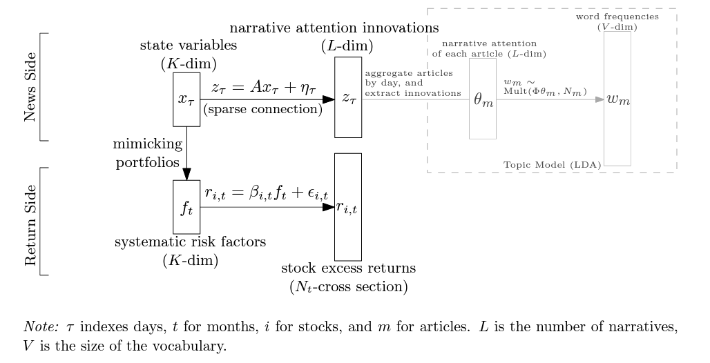

# NLP in Finance

## Asset Pricing

- [Bybee, Leland, Bryan Kelly, and Yinan Su. "Narrative Asset Pricing: Interpretable Systematic Risk Factors from News Text." *The Review of Financial Studies* (2023)](chrome-extension://efaidnbmnnnibpcajpcglclefindmkaj/https://lelandbybee.com/files/narrative_AP.pdf)
  - [新闻叙事、文本分析与资产定价](https://zhuanlan.zhihu.com/p/609597364)
  - Use LDA to extract latent topics from daily news -> link hidden state variable to LDA topic probability vector -> use hidden state variable as latent factor return -> estimate factor loading (Fama-Macbeth)
  - Details: 
    - 因子收益是月频的，而新闻和状态变量则是按日构建的
    - 每天会将不同新闻的注意力加总至一个总体水平。在此基础上，用当天的注意力减去之前 5 天的注意力均值代表当天的注意力变化。
    - LDA 向量维度远大于hidden factor维度，这意味着很多叙事主题可能对应着类似的状态变量或压根与资产定价无关，即新闻叙事与状态变量之间的关联是非常稀疏的。通过这一路径可将新闻叙事注意力的变化与状态变量关联起来。

- [Dim, Chukwuma, Francesco Sangiorgi, and Grigory Vilkov. "Media Narratives and Price Informativeness." *Available at SSRN 4323093* (2023).](https://wwz.unibas.ch/fileadmin/user_upload/wwz/00_Forschungsseminar/2023_FS_PAPER_GVilkov.pdf)

  - [新闻叙事、文本分析与资产定价](https://zhuanlan.zhihu.com/p/609597364)

  - Similar to Bybee, Kelly, and Su (2023), use LDA to extract latent topics from daily news -> regress daily individual stock return on LDA latent vector -> the estimated coefficient as stock exposure to news
  - **股票对新闻叙事注意力变化的暴露程度越高，股票的异质性风险也越大**：这一暴露程度可以解释 82% 的股票异质性风险的截面差异，非常厉害的一个发现。进一步发现，更高的新闻叙事注意力暴露会显著降低股价信息效率，而机制便是股票异质性风险和公共信息相关风险的上升。
- [Wang, Huaixin. "News Link and Predictable Returns." *Available at SSRN 4458612* (2023).](https://papers.ssrn.com/sol3/papers.cfm?abstract_id=4458612)
  - Construct linkage based on news, then construct signals based on peer returns (RNCF).
  - **RNCF predicts future earnings surprises**. We calculate unexpected earnings as the annual change in quarterly earnings. SUE is calculated using unexpected earnings scaled by the standard deviation of unexpected earnings over the eight preceding quarters. We control for the focal firm's lagged earnings surprises.
  - **Information days** (events such as earnings announcements or news releases) can **amplify** the positive predictability of RNCF.
  - RNCF is positively associated with **future analyst forecast revisions** about the focal firm.
  - **The 52-week high price serves as a psychological barrier.** The effect of anchoring on the 52-week high leads to a distortion of belief updating since upward price movements are bounded above in the perspective of investors with such bias. Similarly, these investors also respond to bad news slowly if the price is far from the 52-week high.
  - Small stocks in China are **contaminated by the shell value** because of the strict IPO constraints in China's stock market. To avoid this contamination effect, should eliminate the smallest 30% of stocks before constructing their asset pricing factors.
  - Controlling for alternative **industry momentum** effects. Remove industry lead-lag from RNCF.
- [Allee, Kristian D., and Chuong Do. "How do analysts gather information about the firms they follow?." *Available at SSRN 4295287* (2022).](https://papers.ssrn.com/sol3/papers.cfm?abstract_id=4295287)
  - The order in which the analyst has the opportunity to pose a question during the call could matter
  - When the analysts ask more unique questions relative to their own prior questions and relative to the management prepared narratives and their peer's questions, they are more likely to revise their forecasts immediately after the conference call
  - The accuracy of analyst forecast appears to be associated with their differential data gathering activities on conference calls
  - Manager choose which analysts are invited to participate in the Q&A portion of earnings call, and that they discriminate by choosing the analysts with more favorable recommendations for the firm's stocks as well as the more prestigious analysts
  - Market participants infer negative information about future firm performance when managers appear to adhere to predetermined scripts when responding to questions during the Q&A
- [Fedyk, Anastassia, and James Hodson. "When can the market identify old news?." *Journal of Financial Economics* 149.1 (2023): 92-113.](https://www.sciencedirect.com/science/article/pii/S0304405X23000685)
  - Cognitive limitations make investors difficult to processing recombination news, which translates into sizable overreactions in returns
  - Recombination news overreaction >> reprint news overreaction
- [Chen, Wei, Lili Dai, and Hun‐Tong Tan. "When does analyst reputation matter? Evidence from analysts’ reliance on management guidance." *Journal of Business Finance & Accounting* (2022).](https://onlinelibrary.wiley.com/doi/abs/10.1111/jbfa.12654?casa_token=i3zpGCkHIO0AAAAA:HAaonf9FGUCnfJ7K2g7OPCdDMn7xOXF76mbZNygsCkCj2hUWiWsDyrbt5NYN71qKTHKSLiYXZYjZK18)
  - Reputable analysts tend to rely less on management guidance than less reputable analysts.
  - The effect of analyst reputation on analysts' reliance on management guidance is stronger when uncertainty is higher than when it is lower. (the benefits of expertise are more apparent when there is greater uncertainty in forecasting tasks.)
  - The effect of analyst reputation on analysts' reliance on management guidance is stronger when guidance contains good news than when it contains bad news. (Experts are better able to detect differences in the credibility of information provided and that they consequently rely less an information with low credibility. This implies that differences between expertise levels are more apparent for tasks where the information has less credibility.)
  - Individual analyst's reliance on management guidance is measured as the absolute difference between the Earnings Per Share (EPS) forecast issued by analyst and the management guidance issued by the manager for quarterly earnings.
  - Forecast accuracy is lower when an analyst provides a forecast that relies less on guidance.
  - Control previous consensus deviation
- [New News is Bad News](https://arxiv.org/pdf/2309.05560.pdf)
  - An increase in the novelty of news predicts negative stock market returns. The news novelty is measured by entropy score to the next month's news articles, which reflects the degree to which the text in these articles deviates from the RNN model's conditional word distributions
- [Enhanced Fama-MacBeth Regression](https://mp.weixin.qq.com/s/TZogoW--e7Nz1-1376lXzw)
  - [Bybee, Leland, Bryan T. Kelly, and Yinan Su. "Narrative asset pricing: Interpretable systematic risk factors from news text." *Johns Hopkins Carey Business School Research Paper* 21-09 (2022).](https://papers.ssrn.com/sol3/Delivery.cfm/SSRN_ID4351922_code2678946.pdf?abstractid=3895277&mirid=1)
  - [Bybee, Leland, et al. *Business news and business cycles*. No. w29344. National Bureau of Economic Research, 2021.](https://www.nber.org/system/files/working_papers/w29344/w29344.pdf)

- [Kim, Alex, Maximilian Muhn, and Valeri Nikolaev. "From Transcripts to Insights: Uncovering Corporate Risks Using Generative AI." *arXiv preprint arXiv:2310.17721* (2023).](https://arxiv.org/abs/2310.17721)
  - This paper explores the application of generative AI tools, such as ChatGPT, in assessing and uncovering corporate risks. The authors develop and validate measures of firm-level risk exposure related to political, climate, and AI-related risks using the GPT 3.5 model. They generate risk summaries and assessments from earnings call transcripts to demonstrate that these AI-based measures have significant information content and can predict firm-level volatility and corporate decisions related to investment and innovation more effectively than existing risk measures.

## NLP Application

- [ChatGPT Informed Graph Neural Network for Stock Movement Prediction](https://arxiv.org/pdf/2306.03763)
  - Design prompt for daily news headlines to ask ChatGPT: what companies will be impacted by this news
  - Construct linkage based on co-impact from ChatGPT answer.
  - GNN train: news linkage + market data

- [Breitung, Christian, and Sebastian Müller. "When Firms Open Up: Identifying Value Relevant Textual Disclosure Using simBERT." *Available at SSRN* (2022).](https://www.zbw.eu/econis-archiv/bitstream/11159/525224/1/EBP085841285_0.pdf)
  - Introduce simBERT, a novel semantically sensitive similarity measure for textual data. Use simBERT to compare similarity between companies annual report with previous ones.
  - Construct portfolio that is long in stocks with a low-and short in stocks with a high level of semantically new information.
- [Breitung, Christian, and Sebastian Müller. "Global Business Similarity Networks." *Available at SSRN* (2023).](https://papers.ssrn.com/sol3/papers.cfm?abstract_id=4395079)
  - Use LLM to construct linkage based on similarity calculated by business description of the firm in Bloomberg/Reuters.
  - Threshold linkage matrix by 99% quantile of similarity.
  - **The lead-lag effect may be more pronouced for stocks with a greater number of firms with sufficiently similar business models**. This is because investors may overlook relevant information if there is a large amount available (**limited attention**). 
- [Martineau, Charles, and Marius Zoican. "Measuring information in analyst reports: A machine learning approach." *Rotman School of Management Working Paper* 3925176 (2021).](https://papers.ssrn.com/sol3/papers.cfm?abstract_id=3925176)
  - Use natural language processing to identify topics for over 90,000 analyst reports
    for S&P 500 stocks.
  - Build information contribution (IC) measure as the average cosine distance between the topic distribution for a particular report and any subset of competitor reports.
  - The informational content of reports in "crowded stocks" is 41% lower than for reports in low-coverage stocks.
- [Allee, Kristian D., and Chuong Do. "How do analysts gather information about the firms they follow?." *Available at SSRN 4295287* (2022).](https://papers.ssrn.com/sol3/papers.cfm?abstract_id=4295287)
  - This paper use measures of textual similarity to capture the uniqueness of an individual analyst’s questions on a firm’s quarterly earnings conference call relative to the questions of other analysts on the same call, relative to the analyst on prior firm calls, and relative to the management-prepared narrative.
- [Wang, Saizhuo, et al. "Alpha-GPT: Human-AI Interactive Alpha Mining for Quantitative Investment." *arXiv preprint arXiv:2308.00016* (2023).](https://arxiv.org/abs/2308.00016)
  - Prompt with alpha ideas + some candidate expressions (with detailed explanations) -> LLM -> parser + validation -> evaluation + genetic programming + backtest -> final alpha -> LLM for alpha explanation
- [Zhang, Boyu, et al. "Enhancing financial sentiment analysis via retrieval augmented large language models." *arXiv preprint arXiv:2310.04027* (2023).](https://arxiv.org/pdf/2310.04027.pdf)
  - RAG: information retrieval from other source to assist news context understanding
- [Karolyi, Stephen, Thomas Ruchti, and Phong Truong. "Number Processing Constraints and Earnings News." *Management Science* (2024).](https://pubsonline.informs.org/doi/full/10.1287/mnsc.2023.01722)
  - The study is grounded in neuroscience research indicating that the human brain processes small numbers linearly and large numbers logarithmically, which can lead to an underreaction to larger numbers as their perceived differences become smaller.
  - The research finds that investors indeed react less to earnings news for stocks with high EPS magnitudes.
  - The study finds that the effect of number processing constraints is less pronounced for stocks with a high presence of machines or robotic activity, suggesting that non-human market participants are not subject to the same cognitive limitations.

## NLP Literature

- [Shao, Zhihong, et al. "Synthetic prompting: Generating chain-of-thought demonstrations for large language models." *arXiv preprint arXiv:2302.00618* (2023).](https://arxiv.org/abs/2302.00618)
  - Automatic generating demonstration examples for promt:
    - backward: generating reasoning chain then questions
    - forward: generating fine-tuned reasoning chain given questions
  - in-context clustering: try to diversify demonstrations fed to LLM
- [Contemporary Large Language Models LLMs](https://www.kaggle.com/code/abireltaief/contemporary-large-language-models-llms)
