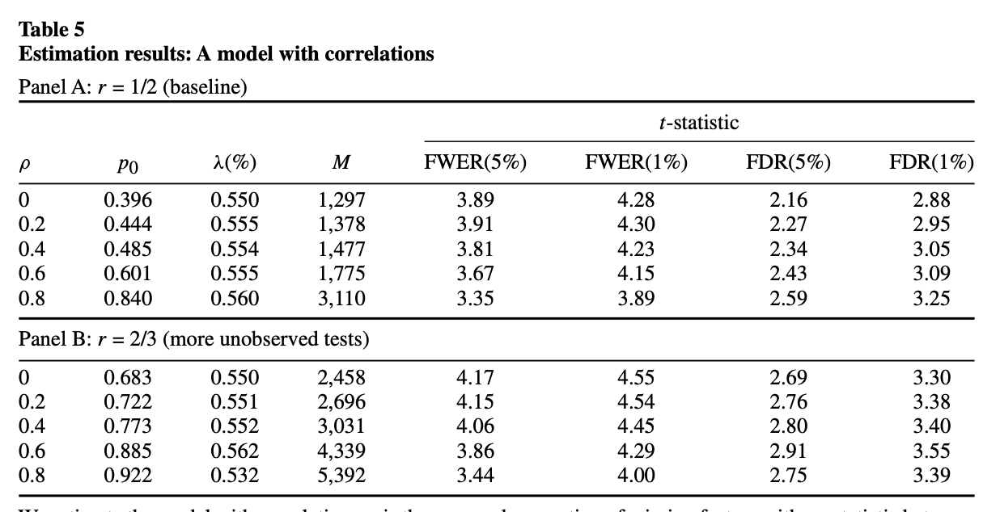

# P-hacking

## Introduction

- [在追逐 p-value 的道路上狂奔，却在科学的道路上渐行渐远](https://zhuanlan.zhihu.com/p/38663777)

- [出色不如走运？](https://mp.weixin.qq.com/s/GTrwXcZ0AbvRLdUS546Kpw)

## Multiple Testing using Bootstrap

- [Harvey, Campbell R., and Yan Liu. "Lucky factors." *Journal of Financial Economics* 141, no. 2 (2021): 413-435.](https://www.sciencedirect.com/science/article/pii/S0304405X21001410)
- [出色不如走运 II](https://zhuanlan.zhihu.com/p/45715632)

基本思路：通过正交化和 Bootstrap 得到了仅靠运气能够得到的显著性的经验分布，再用empirical statistics 来跟经验分布比较。

### Bootstrap on Panel Regression

Consider a time series regression model,
$$
R_{i t}-R_{f t}=a_{i}+\sum_{j=1}^{K} b_{i j} f_{j t}+\epsilon_{i t}, i=1, \ldots, N
$$
where $$N$$ is the number of assets, and factor returns $$\{f_{jt}\}$$ are long-short strategy returns corresponding to zero-cost investments.

考虑我们现在已经有了$$K$$个factor如上式，增加一个新的factor $$f_{K+1 t}$$ 进入模型我们可以得到，
$$
R_{i t}-R_{f t}=a_{i}^+ +\sum_{j=1}^{K+1} b^*_{i j} f_{j t}+\epsilon_{i t}, i=1, \ldots, N
$$
在null hypothesis下，新的factor对于解释asset在cross-section上的return没有任何帮助，因此应该有 $$a_i = a^+_i$$. 我们考虑一个pseudo factor，$$f^\prime_{K+1 t}$$, 为$$f_{K+1 t}$$ 在前面$$f_{1t}, \ldots, f_{Kt}$$ 张成的空间上的投影，即
$$
\begin{aligned}
f_{K+1t} &= \delta_0 +\sum_{j=1}^{K} \delta_{j} f_{j t}+\epsilon_{t}, \\
f^\prime_{K+1t} &= f_{K+1t} - \delta_0  = \sum_{j=1}^{K} \delta_{j} f_{j t}.
\end{aligned}
$$
在这种情况下，用原来的$$K$$个因子和这个pseudo因子对asset return 做回归，得到的结果只会rescale $$b_{ij}$$, 而不会改变$$a_i$$. 

- This adjustment makes economic sense. The adjusted factor, $$f^\prime_{K+1 t}$$, is absorbed by the pre-selected factors $$\{f_{j t}\}_{j=1}^K$$ in the sense that its premium is completely explained by its exposure to the pre-selected factors. When this happens, the adjusted factor has a zero incremental impact on the cross-section of expected returns. 
- In the meantime, it has perfect time series correlation with the original factor in sample and has the same time series correlation with the pre-selected variables as the original factor. Hence, the adjusted factor preserves the time series properties of the original factor aside from the mean.

这种情况下，通过构造pseudo factor $$f^\prime_{K+1 t}$$, 我们得到了与原有factor 保持时间序列上correlation性质，但同时在sample下满足null hypothesis (新的factor对于解释asset在cross-section上的return没有任何帮助) 的因子。

我们通过在时间index上做bootstrap resample，并且重新做以下两个time series regression
$$
\begin{aligned}
R_{i t}-R_{f t}&=a_{i}(R) +\sum_{j=1}^{K} b_{i j}(R) f_{j t}+\epsilon_{i t}, i=1, \ldots, N, \\
R_{i t}-R_{f t}&=a_{i}^+(R) +\sum_{j=1}^{K} b^*_{i j}(R) f_{j t}+ b^*_{i K+1}(R) f^\prime_{K+1t} + \epsilon_{i t}, i=1, \ldots, N.
\end{aligned}
$$
并且通过$$\{(a_i(R), a_i^+(R))\}$$ 计算test statistic，并给出在null hypothesis 下的test statistic 经验分布，来得出原本用$$(a_i, a_i^+)$$ 计算的 test statistic 的p-value. 

几种test statistic的计算方法如下：

- 最naive的

$$
S I_{e w}^{m} \equiv \frac{\frac{1}{N} \sum_{i=1}^{N}\left(\left|a_{i}^{+}\right|-\left|a_{i}\right|\right) / s_{i}}{\frac{1}{N} \sum_{i=1}^{N}\left|a_{i}\right| / s_{i}},
$$

where $$s_i$$ is the standard deviation of $$a_i$$.

- A robust version that calculates the percentage difference in the scaled median absolute intercept

$$
S I_{e w}^{\text {med }} \equiv \frac{\operatorname{med}\left(\left\{\left|a_{i}^{+}\right| / s_{i}\right\}_{i=1}^{N}\right)-\operatorname{med}\left(\left\{\left|a_{i}\right| / s_{i}\right\}_{i=1}^{N}\right)}{\operatorname{med}\left(\left\{\left|a_{i}\right| / s_{i}\right\}_{i=1}^{N}\right)}.
$$

- Value-weighted statistic

$$
S I_{v w}^{m} \equiv \frac{\sum_{t=1}^{T} \sum_{i=1}^{N} \frac{m e_{i, t}}{M E_{t}} \times\left(\left|a_{i}^{+}\right|-\left|a_{i}\right|\right) / s_{i}}{\sum_{t=1}^{T} \sum_{i=1}^{N} \frac{m e_{i, t}}{M E_{t}} \times\left|a_{i}\right| / s_{i}},
$$

where $$\left\{m e_{i, t}\right\}_{t=1}^{T}$$ is the time series of market equity for stock $$i$$, and $$M E_{t}=\sum_{i=1}^{N} m e_{i, t}$$ is the aggregate market equity at time $$t$$.

We have several comments on the test statistics above:

1. The use of the scaled intercept takes the heterogeneity in return volatilities into account.
2. We scale the intercepts of the baseline model and the augmented model by the same standard error, that is, the standard error of the estimate of the intercept under the baseline model. This ensures that our test statistics are exactly zero when the null hypothesis, i.e., the candidate factor has zero incremental contribution to explain the cross-section of expected returns, is forced to exactly hold in sample for our procedure. This might not hold under alternative scaling schemes.
3. For the first factor $$f_{1t}$$, we can subtract the in-sample mean of $$f_{1t}$$ from its time series. In this way, we are projecting $$f_{1t}$$ onto a vector of all ones.

### Bootstrap for predictive regression

假设有因变量 Y 和 100 个解释变量 X 的 500 期样本数据，我们想看看哪个 X 能够预测 Y。多重检验的步骤为：

1. 用每个 X 和 Y 回归（在我们的例子中就是 100 次回归），得到 100 个残差 OX，它们和 Y 正交。这构成了 null hypothesis：所有 OX 对 Y 没有预测性。

2. 以这 500 期的 Y 和正交化得到的 OX 为原始数据（500 × 101 的矩阵，每一行代表一期，第一列为 Y，第二到第 101 列为 100 个 OX 变量），使用**带放回**的 Bootstrap 重采样从这 500 行中不断的随机抽取，构建和原始长度一样的 bootstrapped 数据（也是 500 × 101 矩阵）。**整行抽取保留了这 100 个变量在截面上的相关性。此外 Bootstrap 的好处是不对原始数据中的概率分布做任何假设。**
3. 使用 bootstrapped 数据，用每个 OX 和 Y 回归得到一个检验统计量 (比如是 t-statistic); 找出所有 OX 中该检验统计量最大的那个值，称为 max statistic。如果我们的检验统计量是 t-statistic，那么这个 max statistic 就是 100 个 t-statistic 中最大的。
4. **重复上述第二、第三步 10000 次，**得到 max statistic 的经验分布（empirical distribution），这是纯靠运气（因为 null hypothesis 已经是 OX 对 Y 没有任何预测性了）能够得到的 max statistic 的分布。
5. 比较原始数据 Y 和每个 X 回归得到的 max statistic 和第四步得到的 max statistic 的经验分布：
   - 如果来自真实数据的 max statistic 超过了经验分布中的阈值（比如 95% 显著性水平对应的经验分布中 max statistic 的取值），那么真实数据中 max statistic 对应的解释变量就是真正显著的。假设这个解释变量是 X\_7。
   - 如果来自真实数据的 max statistic 没有超过经验分布中的阈值，则这 100 个解释变量全都是不显著的。本过程结束，无需继续进行。
6. **使用目前为止已被挑出来的全部显著解释变量对 Y 进行正交化，得到残差 OY。**它是原始 Y 中这些变量无法解释的部分。
7. 使用 OY 来正交化剩余的 X（已经选出来显著变量，比如 X\_7，不再参与余下的挑选过程）。
8. 重复上述第三步到第七步：**反复使用已挑出的显著因子来正交化 Y，再用 OY 来正交化剩余解释变量 X；在 Bootstrap 重采样时，使用 OY、k 个已经选出的 X、和剩余 100 - k 个正交化后的 OX 作为原始数据生成 bootstrapped 样本；通过大量的 Bootstrap 实验得到新的 max statistic 的经验分布，并判断剩余解释变量中是否仍然有显著的。**
9. 当剩余解释变量的 max statistic 无法超过 null hypothesis 下 max statistic 的经验分布阈值时，整个过程结束，剩余的解释变量全都是不显著的。

## $$t$$-statistics Threshold using Multiple Testing

- [Harvey, Campbell R., Yan Liu, and Heqing Zhu. "… and the cross-section of expected returns." *The Review of Financial Studies* 29, no. 1 (2016): 5-68.](https://academic.oup.com/rfs/article-abstract/29/1/5/1843824)

### FWER and FDR control methods

A level- $$\alpha$$ test for a single null hypothesis $$H_{0}$$ satisfies, by definition,
$$
\alpha=\operatorname{Pr}\left\{\text { reject true } H_{0}\right\}.
$$
For a collection of $$N$$ null hypotheses $$H_{0 i}$$, the **family-wise error rate (FWER)** is the probability of making even one false rejection,
$$
\mathrm{FWER}=\operatorname{Pr}\left\{\text { reject any true } H_{0 i}\right\}.
$$
**Bonferroni's procedure** controls FWER at level $$\alpha$$ : let $$I_{0}$$ be the indices of the true $$H_{0 i}$$, having say $$N_{0}$$ members. Then Bonferroni's procedure rejects all the $$H_{0i}$$ with $$p$$-value $$\leq \alpha / N$$, the total number of hypothesis.
$$
\mathrm{FWER} =\operatorname{Pr}\left\{\bigcup_{I_{0}}\left(p_{i} \leq \frac{\alpha}{N}\right)\right\} \leq \sum_{I_{0}} \operatorname{Pr}\left\{p_{i} \leq \frac{\alpha}{N}\right\} =N_{0} \frac{\alpha}{N} \leq \alpha.
$$
**Holm’s procedure** offers modest improvement over Bonferroni, goes as follows,

1. Order the observed $$p$$-values from smallest to largest,
   $$
   p_{(1)} \leq p_{(2)} \leq p_{(3)} \leq \ldots \leq p_{(i)} \leq \ldots \leq p_{(N)},
   $$
   
2. Let $$i_{0}$$ be the smallest index $$i$$ such that
   $$
   p_{(i)}>\alpha /(N-i+1),
   $$

3. Reject all null hypotheses $$H_{0i}$$ for $$i < i_0$$ and accept all with $$i \geq i_0$$.

One can find a proof of Holm's procedure here: [Holm–Bonferroni method proof](https://en.wikipedia.org/wiki/Holm%E2%80%93Bonferroni_method#Proof)

The **false discovery proportion (FDP)** is the proportion of type I errors:
$$
\mathrm{FDP}=\left\{\begin{array}{cc}
\frac{N_{0|r}}{R} & \text { if } R>0 \\
0 & \text { if } R=0
\end{array}\right.
$$
Here $$R$$ is the number of rejected null hypothesis and $$N_{0|r}$$ is the number of false discoveries. Therefore, the **false discovery rate (FDR)** is defined as
$$
\mathrm{FDR} = \mathbb{E}[\mathrm{FDP}].
$$
Theoretically, FDR is always bounded above by FWER, to see this,
$$
\begin{aligned}
\mathrm{FDR} &=\mathbb{E}\left[\frac{N_{0 \mid r}}{R} \mid R>0\right] \operatorname{Pr}(R>0) \\
& \leq \mathbb{E}\left[I_{\left(N_{0 \mid r} \geq 1\right)} \mid R>0\right] \operatorname{Pr}(R>0) \\
&=\operatorname{Pr}\left(\left(N_{0 \mid r} \geq 1\right) \cap(R>0)\right) \\
& \leq \operatorname{Pr}\left(N_{0 \mid r} \geq 1\right)=\mathrm{FWER}.
\end{aligned}
$$
**Benjamini, Hochberg, and Yekutieli’s (BHY) adjustment** provides a method that controls the FDR at level $$\alpha$$.

1. Order the observed $$p$$-values from smallest to largest,
   $$
   p_{(1)} \leq p_{(2)} \leq p_{(3)} \leq \ldots \leq p_{(i)} \leq \ldots \leq p_{(N)},
   $$
   and let the corresponding null hypotheses be
   $$
   H_{(1)}, H_{(2)}, \ldots, H_{(N)}.
   $$

2. Let $$k$$ be the maximum index such that 
   $$
   p_{(i)} \leq \frac{i}{N \times c(N)} \alpha, \; \; c(N) = \frac{i=1}{N} \frac{1}{i}.
   $$

3. Reject null hypotheses $$H_{(1)} \cdots H_{(k)}$$, but not $$H_{(k+1)} \cdots H_{(M)}$$.

4. The equivalent adjusted $$p$$-value is defined sequentially as
   $$
   p_{(i)}^{B H Y}=\left\{\begin{array}{cl}
   p_{(N)} & \text { if } i=N, \\
   \min \left[p_{(i+1)}^{B H Y}, \frac{N \times c(N)}{i} p_{(i)}\right] & \text { if } i \leq N-1.
   \end{array}\right.
   $$

### Paper summary

#### *t*-statistics threshold

This paper studies many published factors using three adjustment methods previously introduced to the observed factor tests, under the assumption that the test results of all tried factors are available. They choose to set $$\alpha$$ at $$5\%$$ (Bonferroni, Holm; FWER) and $$\alpha$$ at $$1\%$$ (BHY; FDR) for the main results. 

- For Bonferroni, the benchmark *t*-statistic starts at 1.96 and increases to 3.78 by 2012. It reaches 4.00 in 2032. 
- Holm tracks Bonferroni closely and their differences are small.
- BHY implied benchmarks, on the other hand, are not monotonic. They fluctuate before year 2000 and stabilize at 3.39 (*p*- value = 0.007) after 2010. Intuitively, at any fixed significance level $$\alpha$$, the law of large numbers forces the false discovery rate (FDR) to converge to a constant. 
- If we change the $$\alpha$$ to $$5\%$$ for BHY, the corresponding BHY implied benchmark *t*-statistic is 2.78 (*p*-value = 0.0054) in 2012 and 2.81 (p-value = 0.0005) in 2032, still much higher than the starting value of 1.96.

Notice that the authors assume that the total number of tests equals the total number of discoveries. If there are any unpublished factors, they will only increase the *t*-statistics threshold. Therefore, the above *t*-statistics discussed only gives a lower bound. 

#### Simulation with correlation structure

The authors also considers a simulation framework where the *t*-statistics for the $$i$$-th factor portfolio follows a normal distribution,
$$
\begin{aligned}
T_{i} &=\left(\sum_{t=1}^{N} X_{i, t} / N\right) /(\sigma / \sqrt{N}), \\
T_{i} &\sim N\left(\mu_{i} /(\sigma / \sqrt{N}), 1\right), \\
\mu_{i} &\sim p_{0} I_{\{\mu=0\}}+\left(1-p_{0}\right) \operatorname{Exp}(\lambda).
\end{aligned}
$$
where $$I_{\{\mu=0\}}$$ in the prior distribution of mean $$\mu_i$$ is the distribution that has a point mass at zero. 

They also incorporate cross-sectional correlations among contemporaneous returns. To overcome the missing data problem, they assume that their sample covers a fraction $$r$$ of *t*-statistics in between 1.96 and 2.57 and that all *t*-statistics above 2.57 are covered.

The quantities they choose to match and their values for the baseline sample are given by:
$$
\left\{\begin{array}{l}
\widehat{T}=\text { Total number of discoveries }=353, \\
\widehat{Q}_{1}=\text { The } 20 \text { th percentile of the sample of } t \text {-statistics }=2.39, \\
\widehat{Q}_{2}=\text { The } 50 \text { th percentile of the sample of } t \text {-statistics }=3.16, \\
\widehat{Q}_{3}=\text { The } 90 \text { th percentile of the sample of } t \text {-statistics }=6.34 .
\end{array}\right.
$$
The estimation works by seeking to find the set of parameters that minimizes the following objective function:
$$
D\left(\lambda, p_{0}, M, \rho\right)=w_{0}(T-\widehat{T})^{2}+\sum_{i=1}^{3} w_{i}\left(Q_{i}-\widehat{Q}_{i}\right)^{2}.
$$
Their simulation results is given in the table below.

To conclude, a new factor needs to clear a much higher hurdle, **with a *t*-statistic greater than 3.0.**

## Bayesian Approach

- [在追逐 p-value 的道路上狂奔，却在科学的道路上渐行渐远](https://zhuanlan.zhihu.com/p/38663777)

- [Harvey, Campbell R. "Presidential address: The scientific outlook in financial economics." *The Journal of Finance* 72, no. 4 (2017): 1399-1440.](https://onlinelibrary.wiley.com/doi/abs/10.1111/jofi.12530)

The MBF is the lower bound among all Bayes factors. It occurs when the density of the prior distribution of alternative hypotheses concentrates at the maximum likelihood estimate of the data.

The definition of Bayes factor $$K$$ is given by
$$
\begin{aligned}
K &= \frac{\operatorname{Pr}\left(D \mid H_{0}\right)}{\operatorname{Pr}\left(D \mid H_{1}\right)} \\
&=\frac{\int \operatorname{Pr}\left(\theta_{0} \mid H_{0}\right) \operatorname{Pr}\left(D \mid \theta_{0}, H_{0}\right) d \theta_{0}}{\int \operatorname{Pr}\left(\theta_{1} \mid H_{1}\right) \operatorname{Pr}\left(D \mid \theta_{1}, H_{1}\right) d \theta_{1}} \\
&=\frac{\frac{\operatorname{Pr}\left(H_{0} \mid D\right) \operatorname{Pr}(D)}{\operatorname{Pr}\left(H_{0}\right)}}{\frac{\operatorname{Pr}\left(H_{1} \mid D\right) \operatorname{Pr}(D)}{\operatorname{Pr}\left(H_{1}\right)}} \\
&=\frac{\operatorname{Pr}\left(H_{0} \mid D\right)}{\operatorname{Pr}\left(H_{1} \mid D\right)} \frac{\operatorname{Pr}\left(H_{1}\right)}{\operatorname{Pr}\left(H_{0}\right)}.
\end{aligned}
$$
From the integral expression, the Bayes factor still depends on the prior specification of the alternative hypotheses (the density of $$\theta_1$$ under the alternative). However, we can define the **minimum Bayes factor (MBF)**, which can bypass this problem and the MBF is the lower bound among all Bayes factors. 

The MBF occurs when the density of the prior distribution of alternative hypotheses concentrates at the maximum likelihood estimate of the data. From the above definition and equivalences, we have
$$
K = \frac{\operatorname{Pr}\left(D \mid H_{0}\right)}{\int \operatorname{Pr}\left(\theta_{1} \mid H_{1}\right) \operatorname{Pr}\left(D \mid \theta_{1}, H_{1}\right) d \theta_{1}} \geq \frac{\operatorname{Pr}\left(D \mid H_{0}\right)}{\operatorname{Pr}\left(D \mid \theta_{1}^{\mathrm{MLE}}, H_{1}\right)} = \frac{\operatorname{Pr}\left(D \mid H_{0}\right)}{\mathcal{L}\left(D \mid \theta_{1}^{\mathrm{MLE}}, H_{1}\right)}.
$$
 Here $$\theta_1^{\mathrm{MLE}}$$ is the maximum likelihood estimator under alternative. 

Notice that by Bayes Theorem, the posterior probability is given by
$$
\begin{aligned}
\operatorname{Pr}(H_0 \mid D)
&=\frac{\operatorname{Pr}(D \mid H_0) \operatorname{Pr}(H_0)}{\operatorname{Pr}(D)} \\
&=\frac{\operatorname{Pr}(D \mid H_0) \operatorname{Pr}(H_0)}{\operatorname{Pr}(D \mid H_0) \operatorname{Pr}(H_0) + \operatorname{Pr}(D \mid H_1) \operatorname{Pr}(H_1)} \\
&=\frac{K \frac{\operatorname{Pr}(H_0)}{\operatorname{Pr}(H_1)}}{1 + K \frac{\operatorname{Pr}(H_0)}{\operatorname{Pr}(H_1)}} =\frac{K \frac{\pi_0}{\pi_1}}{1 + K \frac{\pi_0}{\pi_1}}.
\end{aligned}
$$
Here $$\pi_0$$ and $$\pi_1$$ are the prior of null and alternative hypothesis respectively. If we replace the Bayes factor $$K$$ by its lower bound, the minimum Bayes factor (MBF), we obtain an lower bound of the posterior probability, 
$$
\operatorname{Pr}(H_0 \mid D) \geq \frac{MBF \times \frac{\pi_0}{\pi_1}}{1 + MBF \times \frac{\pi_0}{\pi_1}}.
$$

## Empirical Distribution of using Random Factors

- [Novy-Marx, Robert. *Backtesting strategies based on multiple signals*. No. w21329. National Bureau of Economic Research, 2015.](https://www.nber.org/papers/w21329)

- [出色不如走运 III](https://zhuanlan.zhihu.com/p/56154663)

## $$t$$-statistics Threshold using Multiple Testing II

- [Chordia, Tarun, Amit Goyal, and Alessio Saretto. "Anomalies and false rejections." *The Review of Financial Studies* 33, no. 5 (2020): 2134-2179.](https://academic.oup.com/rfs/article-abstract/33/5/2134/5739455)
- [出色不如走运 IV](https://zhuanlan.zhihu.com/p/136733555)

A multiple testing procedure controls FDP at proportion $$\gamma$$ and significance level $$\alpha$$ if
$$
\operatorname{Prob}(\mathrm{FDP} \geq \gamma) \leq \alpha.
$$
One way to control the FDP is the RSW method proposed by Romano and Wolf (2007) and [Romano, Shaikh, and Wolf (2008)](https://link.springer.com/article/10.1007/s11749-008-0126-6). The RSW is meant to control the tail behavior of FDP, it avoids the concerns that controlling FDR exposes a researcher to the possibility that the realized FDP varies significantly across applications. 详细请看[出色不如走运 IV](https://zhuanlan.zhihu.com/p/136733555)全文。

## The Existence of P-hacking

- [Chen, Andrew Y. "The Limits of p‐Hacking: Some Thought Experiments." *The Journal of Finance* 76, no. 5 (2021): 2447-2480.](https://onlinelibrary.wiley.com/doi/full/10.1111/jofi.13036)
- [Harvey, Campbell R., and Yan Liu. "Uncovering the iceberg from its tip: A model of publication bias and p-hacking." *Available at SSRN 3865813* (2021).](https://papers.ssrn.com/sol3/papers.cfm?abstract_id=3865813)
- [出色不如走运 V](https://zhuanlan.zhihu.com/p/386393496)

The core formula in Chen (2021) is the following lower bound:
$$
\mathbb{E}[N] \geq \frac{\mathbb{E}\left[\text { num observed }\left(\left|t_{i}\right|>\bar{t}\right)\right]}{\mathbb{P}(|Z|>\bar{t})}
$$
where $$\bar{t}$$ is any $$t$$-statistic threshold and $$Z$$ is a standard normal random variable. Intuitively, if one makes $$N$$ hacking attempts, one should expect to find $$N \mathbb{P}(|Z|>\bar{t})$$ $$t$$-statistics that exceed $$\bar{t}$$, (only a selected subset of the significant $$t$$-statistics makes it into circulated working papers). 详细请看 [出色不如走运 V](https://zhuanlan.zhihu.com/p/386393496) 第二部分。

In both Chen (2021) and Harvey and Liu (2021), they define the shrinkage factor. Shrinkage is defined as the average percentage reduction of in-sample anomaly (absolute) return required to restore its population value. For example, an in-sample mean return of $$10\%$$ might be subject to a shrinkage of $$20\%$$ to restore its population mean return of $$8\%$$.

Harvey and Liu (2021) 采用了类似于 Harvey and Liu (2020) False (and missed) discoveries in financial economics 一文中的double-bootstrap 方法，假设了bi-modal mean的data generating function，并且通过match target statistics来选择模型中的参数，详细请看 [出色不如走运 V](https://zhuanlan.zhihu.com/p/386393496) 第三部分。

## Controlling the Type I and Type II Error using Double-bootstrap 

- [Harvey, Campbell R., and Yan Liu. "False (and missed) discoveries in financial economics." *The Journal of Finance* 75, no. 5 (2020): 2503-2553.](https://onlinelibrary.wiley.com/doi/full/10.1111/jofi.12951)
- [出色不如走运 (V) ](https://zhuanlan.zhihu.com/p/348966374)

基于**双重 bootstrap** 的多重假设检验框架，同时控制Type I 和 Type II errors. 对任意给定的$$p_0$$, 我们control $$5\%$$的 Type I error，可以得到最优的Type II error 对应的t-statistics。详细请看[出色不如走运 (V) ](https://zhuanlan.zhihu.com/p/348966374)全文。
