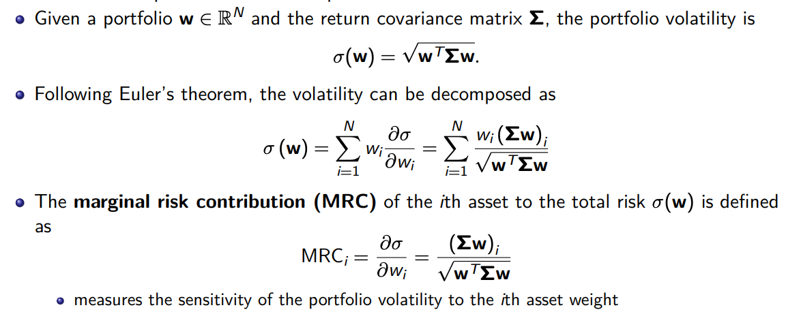
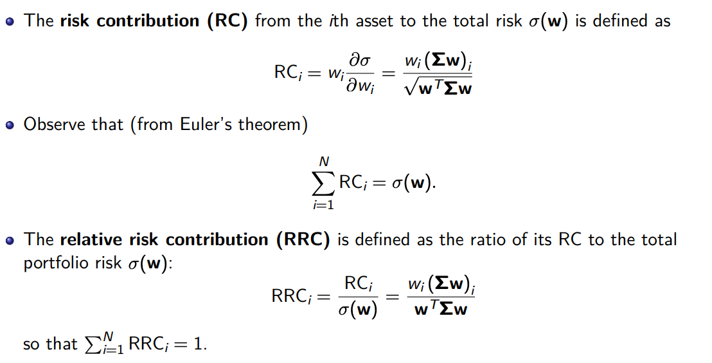
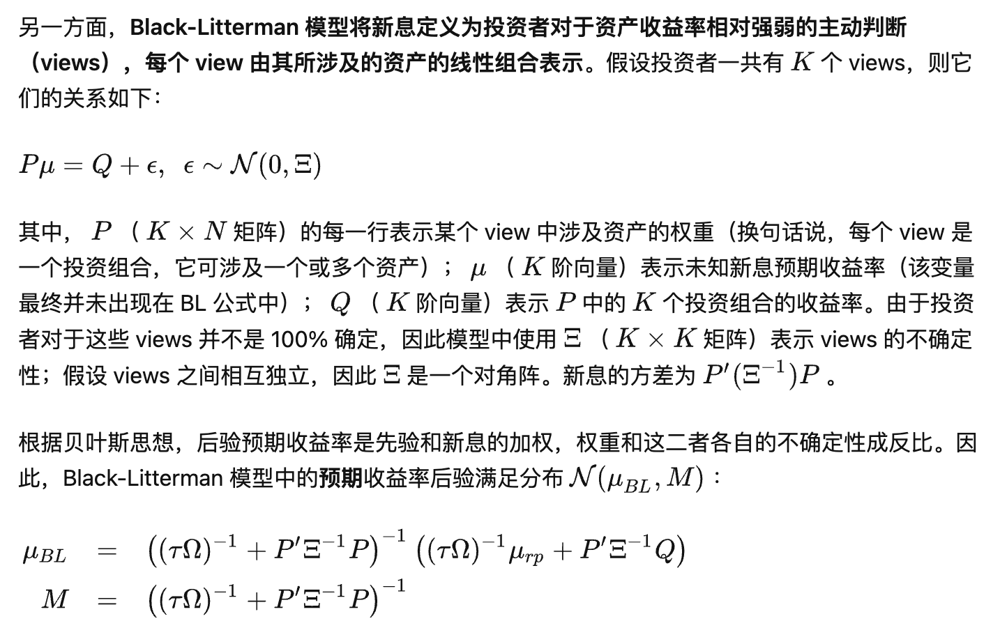

# Risk Parity

## Introduction

- [你真的搞懂了风险平价吗？](https://zhuanlan.zhihu.com/p/38301218)

- Lecture Notes - Risk Parity Portfolio

{% pdf src="/assets/slides_risk_parity_portfolio.pdf", width="100%", height="850" %}

- **Some empirical results: use diagonal covariance matrix in risk parity instead of full covariance matrix of asset return.**

## Black-Litterman + Risk Parity

- [Black-Litterman，贝叶斯框架下的资产配置利器](https://zhuanlan.zhihu.com/p/38282835)
- [基于 Risk Parity + Black-Litterman 的因子择时](https://zhuanlan.zhihu.com/p/62848648)

- Black-Litterman:

  - 在贝叶斯统计中，假设先验后验都是正态分布，可以利用new observation的sample mean和sample covariance 更新后验分布。
    $$
    \mu_p=\left(\Xi^{-1}+(\Sigma / T)^{-1}\right)^{-1}\left(\Xi^{-1} \mu_0+(\Sigma / T)^{-1} \bar{r}\right)
    $$
    其中 $$\mu_0, \quad \mu_p$$ 及 $$\bar{r}$$ 分别表示先验、后验、新息期望收益率向量; $$\Xi$$ 是先验期望收益率的协方差矩阵, $$\Sigma / T$$ 为新息期望收益率的协方差矩阵，$$\Sigma$$ 为收益率的样本协方差矩阵、 $$\mathrm{T}$$ 为样本数

    

- Risk Parity + Black Litterman 步骤

  - 使用 Risk Parity 计算先验权重，以此反推出先验预期收益率分布 $$\mathcal{N}\left(\mu_{r p}, \tau \Omega\right)$$ :
    $$
    \mu_{r p}=\delta \Omega \omega_{r p}
    $$
    其中 $$\delta$$ 是风险厌恶系数, $$\omega_{r p}$$ 代表使用 Risk Parity 配置权重；模型假设预期收益率的协方差矩阵和收益率的协方差矩阵 $$\Omega$$ 有同样的结构, 但是数量级要小很多, 因此用 $$\tau \Omega$$ 表示

  - 使用因子动量作为新息计算 views 的取值（N个因子N个view）

  - 采用标准版及简化版 Black-Litterman 公式计算因子收益率的后验分布（假设view的不确定性为 $$\kappa \Omega$$

  - 将后验分布代入 mean-variance optimization 求出最新一期的因子权重；

  - 每个月最后一个交易日重复上述 1 – 4 步，计算下个月的因子权重并再平衡。

## Tail Risk Parity

- [尾部相关性、尾部风险平价和圣杯分布](https://zhuanlan.zhihu.com/p/51629295)
- [Risk Parity vs Tail Risk Parity](https://zhuanlan.zhihu.com/p/68161130)

### 尾部相关性

- VaR-implied tail correlation：假设资产收益率满足正态分布
  $$
  r = \mu + \sigma Z, \; \; Z \sim \mathcal{N}(0, 1)
  $$
  根据VaR (Value at Risk) 的定义和正态分布的性质我们知道
  $$
  VaR_\alpha = \mu + \sigma VaR(Z)_\alpha
  $$
  假设投资组合P由两种资产构成，那么
  $$
  \sigma_p^2=w_1^2 \sigma_1^2+w_2^2 \sigma_2^2+2 w_1 w_2 \rho \sigma_1 \sigma_2
  $$
  将 VaR 的上述表达式带入到投资组合 P 的风险表达式中，我们可以反推出两种资产的相关性
  $$
  \rho_{\mathrm{VaR}_{, \alpha}}=\frac{\left(\mathrm{VaR}_{P, \alpha}-\mu_P\right)^2-w_1^2\left(\mathrm{VaR}_{1, \alpha}-\mu_1\right)^2-w_2^2\left(\mathrm{VaR}_{2, \alpha}-\mu_2\right)^2}{2 w_1 w_2\left(\operatorname{VaR}_{1, \alpha}-\mu_1\right)\left(\operatorname{VaR}_{2, \alpha}-\mu_2\right)}
  $$
  这就是在假定正态分布的情况下 VaR 推出的资产相关性，类似地，我们用上述式子在估计出投资组合、各资产的 均值、方差后，**可以计算出 VaR-implied tail correlation**

- ES-implied correlation: 将上述 VaR-implied correlation 根据 ES（Expected Shortfall）的定义做一步扩展得到，
  $$
  \rho_{\mathrm{ES}, \alpha}=\frac{\left(\mathrm{ES}_{P, \alpha}-\mu_P\right)^2-w_1^2\left(\mathrm{ES}_{1, \alpha}-\mu_1\right)^2-w_2^2\left(\mathrm{ES}_{2, \alpha}-\mu_2\right)^2}{2 w_1 w_2\left(\mathrm{ES}_{1, \alpha}-\mu_1\right)\left(\mathrm{ES}_{2, \alpha}-\mu_2\right)}
  $$

### 尾部风险平价

- 尾部风险平价的目标是让不同资产或策略对投资组合的尾部风险贡献相同

- 直接把风险平价的概念应用到尾部风险平价中，我们可以让不同资产的权重满足（使用 ES 度量尾部风险）：
  $$
  \frac{\partial \mathrm{ES}_P}{\partial w_i} \times w_i=\frac{\partial \mathrm{ES}_P}{\partial w_j} \times w_j
  $$