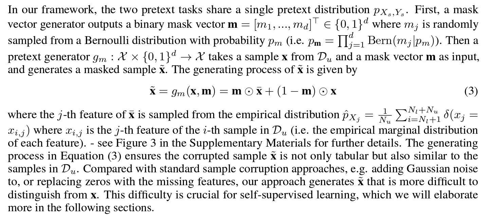
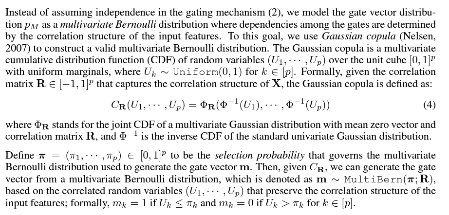
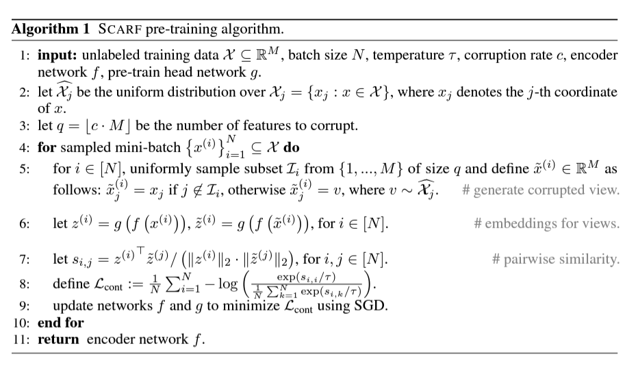

# Self-supervised Learning for Tabular Data

- [NIPS (2020) VIME: Extending the Success of Self- and Semi-supervised Learning to Tabular Domain](https://proceedings.neurips.cc/paper/2020/hash/7d97667a3e056acab9aaf653807b4a03-Abstract.html)

  

  

- [ICLR (2021) Self-Supervision Enhanced Feature Selection with Correlated Gates](https://openreview.net/forum?id=oDFvtxzPOx)

  - Most structure is similar with the above one, one difference is on the distribution of the mask vector (using feature correlation information)

    

  - The correlated gating procedure in the proposed method prevents the pretext tasks from being solved by only exploiting trivial relationships among features by increasing the probability that highly-correlated features are masked simultaneously.

- [CIKM (2022) Local Contrastive Feature Learning for Tabular Data](https://dl.acm.org/doi/abs/10.1145/3511808.3557630?casa_token=rqTqzEf9mqIAAAAA:Cw3UhzLzfnBAlQ8AiSBUpXquAx1PYT7b3Co2zjqp2gUYDjG_46k2fRn-xYWO24qppt2JXZeGStZuew)

  - Our model proposes a new feature reordering using feature-feature correlations and the order of features is determined by a depth-first search
  - Then we applies local feature learning to reordered feature subsets by using CNN + contrastive learning.
  - We apply a data augmentation on sample subsets through masking which randomly generates a binary matrix with a batch of data related to input feature subsets

- [ICLR (2022) SCARF: Self-Supervised Contrastive Learning using Random Feature Corruption](https://arxiv.org/abs/2106.15147)

  