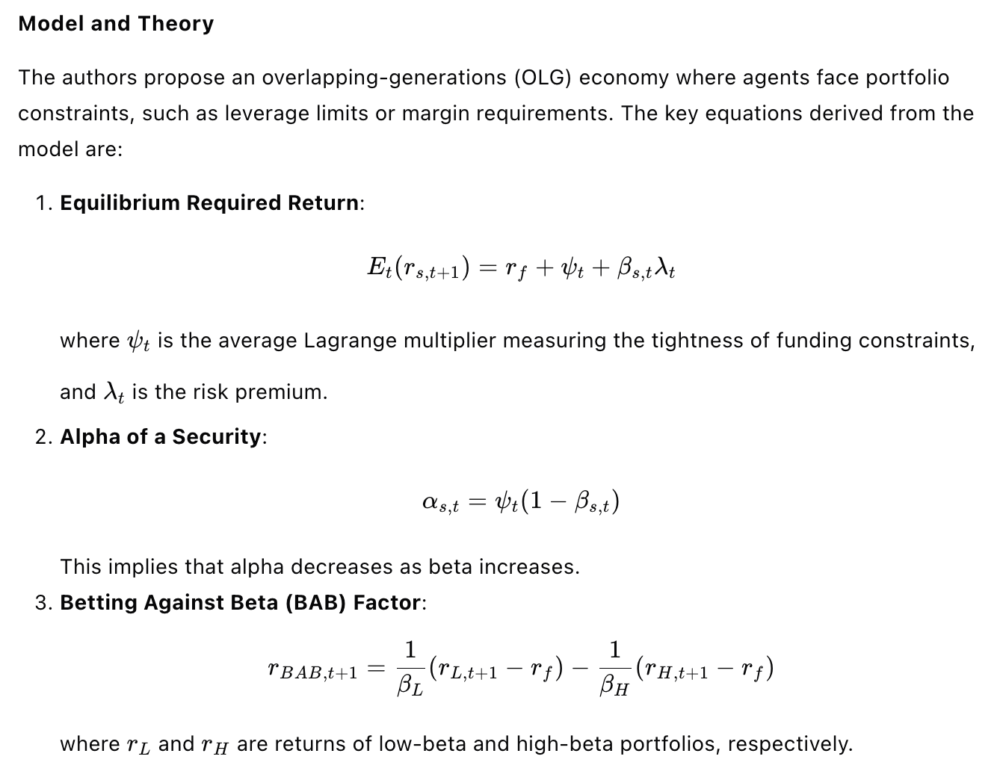
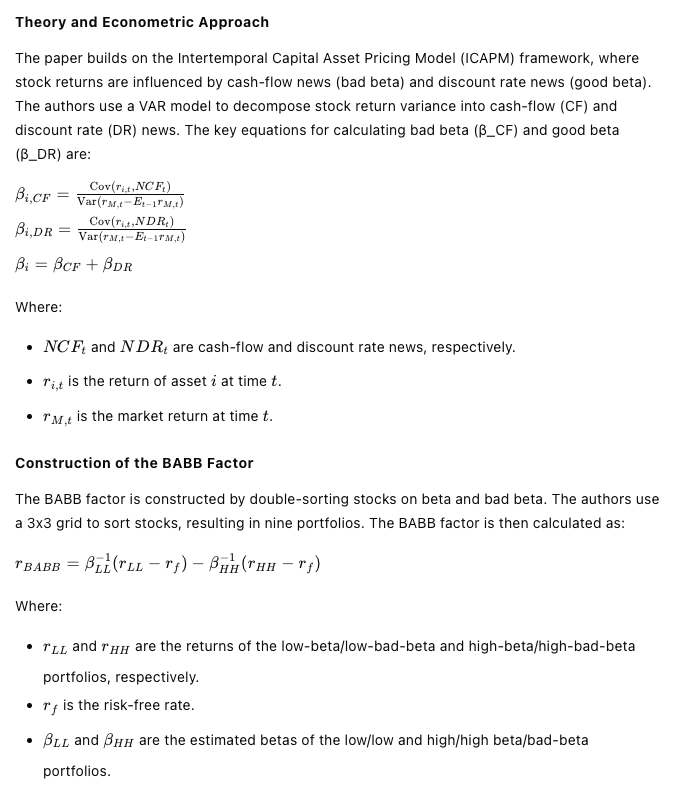

# 25-02-12

## The Use and Usefulness of Big Data in Finance: Evidence from Financial Analysts

The article titled "The Use and Usefulness of Big Data in Finance: Evidence from Financial Analysts" by Feng Chi, Byoung-Hyoun Hwang, and Yaping Zheng, published in Management Science, investigates how financial analysts are adopting alternative data in their analyses and the impact of this adoption on their earnings forecasts and trading commissions.

### Research Background

Sell-side financial analysts play a crucial role in financial markets by gathering and analyzing information about publicly traded companies to provide insights and opinions to investors. The advent of modern information technologies and data analytics has introduced "big data" or "alternative data," which can generate timely, comprehensive, and accurate insights. This study examines whether analysts are adopting alternative data and how this adoption affects their forecasts and the value they provide to investors.

### Methods and Data

The study employs textual analysis of analysts' written reports to determine the extent to which they incorporate alternative data. The researchers used the Investext database to collect analyst reports for companies listed in the Dow Jones Industrial Average (DJI) from June 2009 to May 2019. They identified reports that explicitly reference the use of alternative data by searching for keywords related to in-house data science teams and external alternative data vendors. The final sample included 64,018 reports from 1,002 analysts at 55 brokerage firms.

### Key Findings

1. **Adoption of Alternative Data**: By 2009-2010, 11% of analysts in the sample explicitly referenced the use of alternative data in at least one report, increasing to 28% by 2018-2019. The study identified eight categories of alternative data: app usage, sentiment, employee, geospatial, point of sale, satellite image, web traffic, and others.
2. **Forecast Accuracy**: Analysts who reported using alternative data produced more accurate earnings forecasts. The study used a difference-in-differences specification and found that the adoption of alternative data was associated with a significant improvement in forecast accuracy, equivalent to having covered the corresponding firm for an additional 3.6 years.
3. **Trading Commissions**: Analysts' adoption of alternative data positively correlated with higher trading commissions received by their brokerages. The study used institutional-investor trade data from ANcerno and found that analysts who referenced alternative data received an additional $11,858.82 in trading commissions in the first three months following their report.
4. **Impact on Investors**: The study hypothesized that analysts' use of alternative data could level the playing field between hedge funds and non-hedge-fund investors. By analyzing transaction-based calendar-time portfolios, the researchers found that when analysts incorporated alternative data, the performance gap between hedge funds and non-hedge funds narrowed, with non-hedge funds achieving returns similar to those of hedge funds.

### Additional Analyses

- **Resource Limitations and Intermittent Usefulness**: The study explored why not all analysts adopt alternative data. It found that resource limitations, such as the absence of in-house data science teams, and intermittent usefulness, such as the lack of clear signals from alternative data, were significant factors.
- **Strategic Considerations**: Analysts may strategically avoid disclosing their use of alternative data to prevent imitation by competitors. The study found limited evidence of this, as imitation did not significantly affect the original analyst's trading commissions.
- **Small Firms**: The study extended its analysis to smaller firms and found that analysts less frequently adopted alternative data for these firms, likely due to lower investor interest and potentially lower data quality.

### Conclusions

The study concludes that financial analysts are increasingly adopting alternative data, which enhances the accuracy of their earnings forecasts and the value they provide to investors. This adoption helps level the playing field between different types of investors and highlights the continued importance of human expertise in financial analysis, even in the era of big data. The findings suggest that analysts who adapt to technological advancements can maintain their relevance and utility in financial markets.

## Does Alternative Data Improve Financial Forecasting? The Horizon Effect

This paper, titled "Does Alternative Data Improve Financial Forecasting? The Horizon Effect," published in The Journal of Finance in June 2024, investigates whether the availability of alternative data improves financial forecasting, particularly focusing on the short-term versus long-term effects.

### Research Background

The digitization of information has led to a significant increase in alternative data, such as social media, web traffic, credit card data, and geolocation data. This study explores the impact of such data on financial forecasting, particularly how it affects the informativeness of short-term and long-term forecasts. Existing research suggests that alternative data is more informative for short-term outcomes, but its impact on long-term forecasts is less clear.

### Theoretical Framework

The authors develop a theoretical model where a forecaster (analyst) predicts both short-term and long-term earnings of a firm. The analyst collects two types of information: short-term information relevant to both short- and long-term earnings, and long-term information relevant only to long-term earnings. The analyst faces a multitasking cost, meaning that increasing effort on one task makes effort on the other task more costly. The model predicts that if the cost of obtaining short-term information decreases, the analyst will allocate more effort to short-term information and less to long-term information. This shift can improve the informativeness of short-term forecasts but may reduce the informativeness of long-term forecasts, especially when the correlation between short- and long-term earnings is low or the multitasking cost is high.

### Empirical Analysis

The authors test their theoretical predictions using data from sell-side equity analysts' forecasts from the I/B/E/S database, covering the period from 1983 to 2017. They measure the informativeness of an analyst's forecasts at a given horizon by the R² of a regression of realized earnings on the analyst's forecasts.

#### Key Findings

1. **Long-Run Evolution of Forecast Informativeness**:
   - The study finds that the informativeness of short-term forecasts (less than one year) has improved over time, while the informativeness of long-term forecasts (beyond two years) has declined.
   - The term structure of forecast informativeness (the relationship between R² and forecasting horizon) has steepened over time, particularly since 2005.
2. **Industry-Level Analysis**:
   - The steepening of the term structure is more pronounced in industries where analysts use more alternative data, as measured by references to alternative data in their reports.
3. **StockTwits Data**:
   - The introduction of the social media platform StockTwits in 2009 provides a natural experiment to study the impact of increased exposure to short-term-oriented data.
   - Analysts with greater exposure to StockTwits data show a significant improvement in the informativeness of their short-term forecasts but a decline in the informativeness of their long-term forecasts.
   - The slope of the term structure becomes steeper for analysts with higher exposure to StockTwits data, particularly for those covering more firms (higher multitasking cost) and firms with less autocorrelated earnings.

### Conclusions

The study concludes that the availability of short-term-oriented alternative data can lead to a reallocation of analysts' effort towards short-term information collection, improving the informativeness of short-term forecasts but potentially reducing the informativeness of long-term forecasts. This effect is more pronounced in industries with higher usage of alternative data and for analysts facing higher multitasking costs or covering firms with less autocorrelated earnings. The findings highlight the trade-offs in the allocation of effort between short- and long-term forecasting tasks and suggest that the benefits of alternative data may not uniformly extend to long-term financial forecasting.

## What do measures of real-time corporate sales tell us about earnings surprises and post-announcement returns?

This paper, titled "What do measures of real-time corporate sales tell us about earnings surprises and post-announcement returns?", investigates the relationship between real-time corporate sales data and earnings surprises, as well as post-announcement returns. The authors, Kenneth Froot, Namho Kang, Gideon Ozik, and Ronnie Sadka, use data from approximately 50 million mobile devices to develop real-time proxies for retail corporate sales, capturing both within-quarter and post-quarter information.

### Research Background

The study addresses the information asymmetry around earnings announcements, focusing on how managers' private information affects earnings disclosures and subsequent stock returns. The authors construct real-time sales indexes (WQS and PQS) to measure consumer activity within and after the quarter, respectively. These indexes are derived from big data sources, such as mobile device activity, to provide a timely and accurate reflection of consumer behavior.

### Methodology and Data

The authors use data from MKT MediaStats, LLC, which includes information from approximately 50 million mobile devices, tablets, and desktops. They focus on 50 US retail firms, constructing two indexes: WQS (within-quarter sales activity) and PQS (post-quarter sales activity). These indexes are calculated as the log difference between the number of consumer events aggregated over the quarter and the quarterly average of the number of events over the previous four quarters.

### Key Findings

1. **Predictive Power of WQS:**
   - WQS significantly predicts current-period revenue growth, announcement surprises, and analyst forecast errors. For example, the R² from a regression of quarterly revenue growth on WQS is 39%.
   - The average announcement excess return for stocks in the highest quintile of WQS is 2.14%, while that for the lowest quintile is -1.26%, resulting in a return differential of 3.4% over the five-day period around earnings announcement dates.
2. **Post-Quarter Information (PQS):**
   - PQS is negatively related to announcement returns but positively related to post-announcement returns, suggesting that managers understate positive post-quarter information at the time of earnings announcements.
   - The negative relationship between PQS and announcement returns is stronger when PQS is positive, indicating asymmetric disclosure behavior by managers.
3. **Disclosure Channels:**
   - **Discretionary Accruals:** No significant relationship between discretionary accruals and PQS, suggesting managers do not use accruals to distort PQS.
   - **Management Forecasts (Bundled Forecasts):** Managers issue more pessimistic forecasts when PQS is positive, with a higher likelihood of realized earnings exceeding these forecasts.
   - **Conference Call Tone:** Managerial tone during conference calls is negatively related to PQS, particularly when PQS is positive, indicating managers use tone to understate positive information.
4. **Insider Trading:**
   - The negative relationship between PQS and announcement returns is stronger when insiders subsequently purchase shares, suggesting managers may understate positive information to create buying opportunities.
   - Post-announcement returns are positively predicted by PQS, especially when insiders purchase shares, reinforcing the idea that managers use disclosure distortions for personal gain.

### Conclusions

The study concludes that managers do not fully disclose their private post-quarter information and instead bias their disclosures downward, particularly when the information is positive. This behavior is motivated by personal trading opportunities, as evidenced by the stronger relationship between PQS and announcement returns when insiders subsequently purchase shares. The findings highlight the importance of real-time sales data in understanding earnings surprises and post-announcement returns, as well as the potential for managerial discretion in disclosures to influence market perceptions and stock prices.

## A Good Sketch is Better than A Long Speech: Evaluate Delinquency Risk through Real-Time Video Analysis

This paper, titled "A Good Sketch is Better than A Long Speech: Evaluate Delinquency Risk through Real-Time Video Analysis," explores an innovative method to assess borrowers' creditworthiness in consumer credit markets using machine-learning-based analyses of real-time video data capturing borrowers' behavior during loan applications. The study finds that borrowers' micro-facial expressions of happiness and fear are significantly associated with their future loan delinquency likelihood, providing important implications for fintech lenders and policymakers.

### Research Background

According to the World Bank's Global Financial Development Report, over 2.5 billion adults lack bank accounts, and only 7% of adults in developing countries have credit cards. This lack of creditworthiness information and limited access to financial services can lead to poverty and societal inequality. Evaluating delinquency risk is crucial for the inclusiveness of consumer credit markets. Traditional methods of assessing creditworthiness, such as personal information, credit bureau scores, and digital footprints, can be limited, especially for borrowers without extensive credit histories. This study proposes using real-time video data to capture borrowers' micro-facial expressions as a complementary method to assess credit risk.

### Methods

The study utilizes a proprietary video database from a leading fintech company in China, Shanghai Qiaopan Technology, which records borrowers' behavior during loan application processes. The researchers applied a machine-learning-based video analysis to identify borrowers' micro-facial expressions, focusing on happiness and fear, and evaluated their credit quality by examining the association between these expressions and future loan delinquency.

The video analysis process involves:

1. **Initial Processing**: Dividing video clips into frames, enhancing image quality, and identifying the applicant.
2. **Facial Analysis**: Detecting facial landmarks and recognizing facial action units (AUs) to capture facial muscle activations.
3. **Expression Evaluation**: Evaluating and recognizing expressions such as happiness, sadness, and fear based on the Facial Action Coding System (FACS).

### Key Findings

1. **Happiness and Delinquency**: The study finds that the extent of borrowers' happiness micro-facial expressions is negatively associated with loan delinquency likelihood. This suggests that borrowers who display more happiness during the application process are less likely to default on their loans.
2. **Fear and Delinquency**: Conversely, the degree of fear micro-facial expressions is positively associated with delinquency risk. Borrowers who display more fear are more likely to default on their loans.
3. **Incremental Discriminatory Power**: The study demonstrates that borrowers' micro-facial expressions provide significant and incremental discriminatory power compared to their internal credit scores with the fintech lender. The area under the curve (AUC) for the model using both internal credit scores and micro-expression data is 62.7%, compared to 60.5% for the model using only internal credit scores.

### Additional Analyses

1. **Out-of-Sample Tests**: The results of out-of-sample tests suggest that the discriminatory power of the scoring system is robust and not overstated by overfitting.
2. **Robustness Tests**: The findings remain consistent across different measures of loan delinquency, facial expressions, and sample selections, including analyses based on gender and application time.
3. **Exogenous Factors**: The study controls for exogenous factors such as holidays, air quality, and weather conditions, finding that the effects of facial expressions on delinquency likelihood are not driven by these factors.
4. **Cross-Province Analyses**: The study examines the variation of findings across different provinces in China, finding that the happiness effect is stronger for borrowers with less financial support, and the fear effect is stronger for borrowers with weaker insurance protections.

### Conclusions

The study concludes that real-time video analysis of borrowers' micro-facial expressions can provide valuable information for assessing creditworthiness in consumer credit markets. This method operates through two economic mechanisms related to the adequacy and uncertainty of borrowers' future income. The findings suggest that this innovative credit assessment strategy can help reduce information asymmetries and enhance financial inclusion, particularly in areas where traditional financial services are limited. The study provides practical implications for fintech lenders and policymakers to adopt new financial technologies and innovative data sources to improve credit assessment and expand financial services to underserved populations.

## Real-time revenue and firm disclosure

The article titled "Real-time revenue and firm disclosure" by Elizabeth Blankespoor, Bradley E. Hendricks, Joseph Piotroski, and Christina Synn examines how firms make disclosure decisions when they receive continuous, real-time information about their revenues. The authors use transaction-level credit and debit card sales data for retail firms to construct a weekly measure of abnormal revenue and analyze how firms decide to disclose this information.

### Research Background

The study investigates the disclosure dynamics of firms when they receive real-time revenue information. Managers often face a complex decision-making process regarding what and when to disclose information to the public. This study aims to understand how firms manage the disclosure of real-time revenue data, particularly focusing on the timing and nature of disclosures, and the role of factors such as analyst coverage, institutional ownership, and litigation risk in influencing these decisions.

### Data and Methodology

The authors use a proprietary database of 1.6 billion transaction-level credit and debit card sales from 2012 to early 2016 for a sample of retail firms. This data is used to construct a weekly measure of abnormal revenue for each firm. The abnormal revenue is calculated by comparing the real-time revenue data to the market's expectation of quarterly revenue based on analyst forecasts. The study validates the informativeness of this abnormal revenue measure by examining its correlation with future stock returns, unexpected quarterly revenue, and management forecast news.

### Key Findings

1. **Informativeness of Real-time Revenue**: The study finds that real-time revenue information is informative and can predict future outcomes, but it is not immediately incorporated into stock prices. This suggests that managers have private information that is not fully reflected in market prices.
2. **Disclosure Dynamics**: Firms are less likely to disclose abnormally negative news early in the quarter. As the quarter progresses, firms reduce their withholding of negative news, likely due to the impending earnings announcement disciplining managers to provide negative news. This pattern is more pronounced in firms with high analyst coverage, high institutional ownership, or high litigation risk.
3. **Analyst Coverage and Institutional Ownership**: The study finds that firms with higher analyst coverage and institutional ownership are more likely to disclose negative news as the quarter progresses, suggesting that these factors act as disciplining mechanisms. In contrast, firms with low analyst coverage or institutional ownership show less disclosure of negative news.
4. **Litigation Risk**: Firms with higher litigation risk are also more likely to disclose negative news later in the quarter, indicating that litigation risk plays a role in disciplining managers to disclose negative information.
5. **Insider Trading**: The study also examines insider trading behavior and finds that managers are more likely to sell shares in weeks with abnormally negative revenue news if they do not disclose the information. However, when managers choose to disclose negative news, there is a decrease in insider selling, suggesting that disclosure and insider trading are substitutes.

### Conclusion

The study concludes that real-time revenue information is valuable and that managers exercise discretion in its release. The findings highlight the importance of continuous information flow and the role of disciplining mechanisms such as analyst coverage, institutional ownership, and litigation risk in influencing disclosure decisions. The study contributes to the literature on disclosure dynamics and the use of alternative data sources in financial research. Future research could further explore the impact of real-time information on other aspects of corporate disclosure and governance.

# 25-02-03

## Detecting Misreported Accounting: A Machine Learning Approach using Text Data

面对这个复杂的会计欺诈检测问题，我首先想到的是，传统的财务数据分析可能不足以捕捉到所有欺诈行为的迹象。我需要一种新的方法来处理这个问题，而机器学习似乎是一个有前景的方向。我决定从文本数据入手，因为10-K报告中的文字描述可能包含关于公司财务状况的重要线索。

我开始通过阅读相关文献来了解现有的欺诈检测模型，比如Dechow等人（2011）和Cecchini等人（2010）的工作。这些模型主要依赖于财务比率和传统的统计方法，但我意识到这些方法可能无法充分利用文本数据中的丰富信息。我需要一种能够处理高维数据的方法，这让我想到了机器学习中的文本分类技术。

我首先尝试了逻辑回归模型，这是一个基础但强大的分类工具。我将10-K报告中的文本数据转换为词频向量，然后用这些向量作为特征来训练模型。然而，我很快发现逻辑回归在处理高维数据时可能会遇到过拟合的问题，这让我感到有些沮丧。

接下来，我尝试了Naïve Bayes分类器，它在文本分类中表现不错。我使用了TF-IDF方法来转换文本数据，希望这样能够提高模型的性能。但是，Naïve Bayes的独立性假设在实际应用中可能并不总是成立，这让我对模型的准确性产生了怀疑。

然后，我想到了XGBoost，这是一种基于梯度提升的集成学习方法，它在处理分类问题时表现出色。我决定用XGBoost来尝试解决这个问题。我将文本数据转换为数值向量，然后用这些向量来训练XGBoost模型。在训练过程中，我注意到模型的性能在不断改善，这让我感到非常兴奋。

为了验证XGBoost模型的有效性，我进行了一系列的验证测试。我将模型的预测结果与实际的财务欺诈案例进行了比较，发现XGBoost在预测财务欺诈方面确实有很高的准确性。这让我对模型的性能有了更多的信心。

然而，我并没有就此止步。我知道，为了确保模型的稳健性，我需要进行更多的测试。我尝试了神经网络模型，特别是具有一个隐藏层的NN1，看看它是否能够提供更好的预测结果。经过一系列的调整和优化，我发现NN1模型在某些方面确实优于XGBoost，这让我感到非常惊喜。

在进行了多次尝试和调整后，我最终确定了XGBoost和NN1作为主要的预测模型。我将这两个模型的预测结果进行了比较，发现它们在大多数情况下都能提供一致的预测。这让我对模型的准确性有了更多的信心。

最后，我将模型的预测结果与实际的财务欺诈案例进行了详细的对比分析。我注意到，模型在预测那些具有较高财务欺诈风险的公司时表现得尤为准确。这让我意识到，通过结合文本数据和机器学习技术，我们确实能够提高财务欺诈检测的准确性。

在整个过程中，我经历了多次的探索、尝试、犯错、思路调整、顿悟、实施想法和验证。我的情绪也随之波动，从最初的困惑和沮丧，到后来的兴奋和惊喜，最终达到了满意和自信。通过不懈的努力，我成功地解决了这个问题，这让我感到非常自豪。

This paper, titled "Detecting Misreported Accounting: A Machine Learning Approach using Text Data," presents a novel method for predicting the probability of financial misreporting using machine learning models applied to text data from 10-K reports. The study aims to improve the detection of accounting misreporting, which is a significant issue for shareholders and stakeholders, by leveraging the rich and high-dimensional nature of text data.

### Research Background

Misreporting in accounting is a pervasive problem that can cause substantial damage to shareholders and stakeholders, as seen in cases like Enron, Worldcom, and Luckin Coffee. Traditional models for detecting misreported accounting, such as those by Dechow et al. (2011) and Cecchini et al. (2010), rely on financial data and ratios, which may not provide early warnings of fraud. These models also face limitations due to overfitting and poor predictive performance. This study introduces a new approach using machine learning models applied to text data from 10-K reports to predict the probability of misreporting.

### Methodology

The study uses several machine learning models, including XGBoost, logistic regression, Naïve Bayes classification, and neural networks, to predict the probability of misreporting based on text data from 10-K reports. The key steps include:

1. **Data Collection**: The study collects MD&A sections from 10-K reports from the SEC EDGAR system for the period 1993-2017. Financial and stock data are obtained from Compustat and CRSP, respectively.
2. **Text Preprocessing**: The text data is cleaned by removing punctuation, non-alphabetic words, stop words, and one-letter words. Words are then stemmed using the Snow-Ball stemmer, and the TF-IDF method is used to convert words into numeric factors. Only 10,000 features (words) are kept to avoid model convergence issues.
3. **Model Training**: The models are trained using a sample from 1993 to 2002 and tested on data from 2003 to 2008. The training sample includes firm-year observations with detected misreporting (from SEC AAERs) and a control group of non-misreporting firms.
4. **Performance Metrics**: The Area Under the ROC Curve (AUC) is used as the main out-of-sample performance metric to compare the models.

### Key Results

- **Model Performance**: XGBoost and NN1 (neural network with one hidden layer) outperform the benchmark logistic regression model, with AUC values of 0.7450 and 0.7268, respectively, compared to 0.7213 for logistic regression.
- **Validation Tests**: The study conducts several validation tests to verify the new text-based measures of misreporting:
  - **Earnings Management**: Higher probability of misreporting is positively related to higher discretionary accruals.
  - **Crash Risk**: Firms with higher misreporting probability have higher crash risk.
  - **Cost of Equity**: Misreporting probability is positively related to the cost of equity.
  - **Loan Spreads**: Misreporting probability is positively related to loan spreads.
  - **Stock Volatility**: Misreporting probability is positively related to stock volatility.
  - **Corporate News**: Misreporting probability is negatively related to the amount of positive news.

### Conclusions

The study introduces a novel text-based measure of misreporting probability using machine learning models applied to 10-K reports. The measure is validated through various tests, showing its relevance to accounting and finance contexts. The findings suggest that this measure can be used as an early warning sign for potential financial misreporting, benefiting stakeholders and regulators. Future research can further explore the applications of this measure in different areas of accounting and finance.

## A Unified Framework for Value and Momentum

面对这个复杂的资产定价问题，我最初的想法是尝试从最基本的金融理论出发，寻找一个能够统一解释价值效应和动量效应的框架。我意识到，这两个效应在资产定价中非常重要，但它们之间的关系却鲜有文献能够清晰地解释。

我首先回顾了戈登增长模型（Gordon Growth Model, GGM），这是一个经典的资产定价模型，它将公司的当前价值与其未来现金流的现值联系起来。我注意到，这个模型中，股票的估值比率（如市净率、市盈率等）可能受到预期未来现金流增长率和预期回报率的影响。这让我想到，如果我们能够准确估计这两个因素，或许就能更好地理解价值效应和动量效应。

然而，问题在于预期未来现金流增长率和预期回报率都是不可直接观测的。我尝试通过调整估值比率来估计预期回报率，但很快发现这需要对未来现金流增长率有一个准确的预测。这时，我意识到动量效应可能是一个关键的线索。动量效应描述的是股票过去一段时间内的表现对其未来表现的影响，这似乎与未来现金流增长率有关。

我进一步思考，如果动量效应能够预测未来的现金流增长率，那么它就可以作为未来增长率的一个代理变量。这样，我就可以将动量效应纳入到戈登增长模型中，构建一个统一的框架来解释价值效应和动量效应。我尝试通过回归分析来验证这个想法，将股票的回报率与估值比率和动量效应联系起来。

在进行了一系列的计算和分析后，我发现动量效应确实能够显著预测未来的现金流增长率，而且当我们将动量效应纳入到模型中时，价值效应的预测能力也得到了增强。这让我感到非常兴奋，因为我似乎找到了一个能够同时解释价值效应和动量效应的关键因素。

然而，我也意识到这个模型可能存在一些局限性。例如，动量效应的预测能力可能受到市场情绪和其他非理性因素的影响。为了验证这一点，我进行了更多的敏感性分析，考虑了不同市场条件和时间窗口对模型的影响。

经过一系列的探索和尝试，我最终发现，尽管动量效应在某些情况下可能受到非理性因素的影响，但它仍然是一个强有力的预测变量，能够显著提高价值效应的预测能力。这让我对我的模型更加有信心，也让我对价值效应和动量效应之间的关系有了更深入的理解。

在整个过程中，我经历了多次的思考和调整，从最初的困惑到逐渐的清晰，再到最终的顿悟。我意识到，解决这个问题的关键在于找到一个能够将价值效应和动量效应联系起来的桥梁，而动量效应正是这个桥梁。通过不懈的努力，我最终成功地构建了一个统一的框架，为理解这两个效应提供了新的视角。

The paper "A Unified Framework for Value and Momentum" by Jacob Boudoukh, Tobias Moskowitz, Matthew Richardson, and Lei Xie presents a comprehensive analysis that integrates the value and momentum effects in asset pricing using a present value model. The authors argue that these two factors can be understood within a unified framework, where momentum serves as a proxy for expected future earnings growth, thereby enhancing the predictive power of value metrics.

### Research Background

The value effect and momentum effect are two significant factors that describe the cross-section of expected stock returns. The value effect refers to the tendency of stocks with low valuation ratios (e.g., price-to-book, earnings, or dividends) to outperform those with high ratios. The momentum effect refers to the tendency of stocks that have performed well in the past to continue performing well in the medium term. These effects have been observed globally across various markets and asset classes. However, a unified theoretical framework that explains the co-existence and interaction of these effects has been lacking. This paper aims to provide such a framework using the present value model.

### Unified Framework for Value and Momentum: Theory

#### The Present Value Model

The authors start with the Gordon (1959) growth model, which relates a firm's current value to the present value of its future cash flows, discounted at a constant cost of capital. The model is expressed as:

Pi=λi(Ri−gCFi)CFi

where Pi is the stock price, CFi is the cash flow, λi is a parameter, Ri is the expected return, and gCFi is the expected growth rate of cash flows. The model implies that a stock's price multiple can be high due to high expected growth rates or low expected returns.

#### Omitted Variable Bias and Value’s Relation to Expected Returns

The authors highlight that the present value model requires adjusting valuation ratios for expected future cash flow growth to reliably estimate expected returns. They discuss the omitted variable bias in empirical studies where expected future growth is not accounted for, leading to biased estimates of the relationship between value and expected returns. They provide a detailed econometric analysis showing how measurement errors in expected growth and the correlation between value and growth affect the estimation of coefficients in regression models.

#### The Role of Momentum

The authors propose that momentum can serve as a proxy for expected future earnings growth. They argue that momentum forecasts future earnings growth and, when combined with value metrics, can better explain expected returns. They provide a theoretical framework for understanding the relationship between momentum, value, and expected returns, emphasizing that momentum's role is to help extract expected returns from value metrics by accounting for expected growth.

## Unified Framework for Value and Momentum: Empirical Evidence

#### Data and Methodology

The authors use three datasets covering U.S., global, and Japanese stocks to test their framework. They collect data on stock returns, past stock returns (momentum), analyst forecasts of earnings growth, realized earnings growth, and book-to-market ratios. They run Fama-MacBeth cross-sectional regressions to test the predictive power of value, momentum, and earnings growth on future stock returns.

#### Key Results

1. **Momentum and Future Earnings Growth**: The authors find that price momentum significantly forecasts future earnings growth. For example, in the U.S. Russell 3000 dataset, the coefficient on price momentum in predicting future earnings growth is 0.0016 with a t-statistic of 5.21. This result holds across different datasets and when using analyst forecasts of earnings growth.
2. **Value, Momentum, and Expected Returns**: The authors show that value and momentum together better explain expected returns than either factor alone. For instance, in the U.S. Russell 3000 dataset, the coefficient on value increases from 0.004781 to 0.007317 when momentum is included in the regression, with a corresponding increase in statistical significance. Similarly, the coefficient on momentum becomes significant when combined with value.
3. **Variation in the Value-Momentum Relation**: The authors find that the predictive power of value and momentum is stronger when the correlation between value and momentum is more negative. This finding supports their theoretical framework that momentum helps improve the predictive power of value by accounting for expected growth.
4. **Alternative Measures of Value**: The authors test different measures of value, including R&D-adjusted book-to-market ratios and earnings/price ratios. They find that these alternative measures also support their framework, with R&D-adjusted value showing higher statistical significance in predicting expected returns.
5. **Out of Sample Tests**: The authors extend their analysis to global firms, Japanese firms, and industry portfolios. They find consistent results across these different datasets, showing that their framework holds in various markets and asset classes.

### Asset Pricing Implications for Value and Momentum

The authors construct single-factor models based on growth-adjusted value and compare them to popular multifactor models. They find that their growth-adjusted value factor performs well in explaining the cross-section of expected returns, with alphas comparable to those of the Fama-French 3-factor model and the Carhart 4-factor model. They also show that their growth-adjusted value factor can help explain some of the well-known return anomalies.

### Conclusion

The paper provides a unified framework for understanding the co-existence and interaction of value and momentum effects in asset pricing. The authors demonstrate that momentum serves as a proxy for expected future earnings growth, enhancing the predictive power of value metrics. Their empirical results support this framework across different datasets and markets. The authors suggest that future research can further explore better measures of value and expected growth to improve asset pricing models.

## Predicting Anomalies

面对这个复杂的金融研究论文，我首先得理清它的核心观点和研究方法。我注意到，这篇论文的关键在于探讨股票回报在异常交易信号发布前的可预测性，以及这些信号本身的可预测性。这对我来说是个挑战，因为涉及到金融数据的深入分析和模型预测。

我开始通过问题分解的方法，将研究内容拆分成几个部分：研究背景、数据和方法、关键发现、以及这些发现对市场效率的影响。这样可以帮助我更系统地理解论文。

在研究背景部分，我了解到异常交易信号对股票回报的影响，以及这些信号在财务数据发布后的可预测性。这让我想到，如果市场参与者能够提前预测这些信号，那么他们可能会在信息正式发布前就采取行动，这可能会对股票价格产生影响。

接下来，我深入到数据和方法部分。作者们使用了多种模型来预测异常交易信号，包括自回归模型、机器学习模型和鞅模型。我注意到，鞅模型在预测中表现得特别好，这让我好奇为什么一个简单的模型会比复杂的模型更有效。我开始思考这是否与市场的某些特性有关，比如信息的逐步释放和市场参与者的反应。

在关键发现部分，我看到了作者们通过事件时间分析和预测模型得到的结果。他们发现，在信息发布前，股票回报确实表现出可预测性，而且这种可预测性在信息发布前的几个季度就已经存在。这让我意识到，市场可能对某些信息的反应比我们预期的要早。

为了验证这些发现，我考虑了几个可能的检验方法。首先，我可以检查这些预测模型在不同时间段的表现，看看它们是否在所有时间段都有效。其次，我可以分析这些模型的错误率，看看错误预测是否会导致显著的损失。最后，我可以研究这些预测模型在不同市场条件下的表现，看看它们是否在所有市场条件下都有效。

在思考这些验证方法时，我意识到，这些发现对市场效率的挑战是显著的。如果市场参与者能够提前预测异常交易信号并据此交易，那么这将意味着市场并没有完全反映所有可用信息。这让我想到，市场可能需要更长时间来消化某些信息，或者市场参与者可能对某些信息的反应不够迅速。

经过一系列的思考和验证，我逐渐明白了这篇论文的核心观点：异常交易信号的可预测性对市场效率提出了挑战，而且这种可预测性可能在信息正式发布前就已经存在。这让我对市场如何处理和反映信息有了更深的理解，也让我意识到在金融分析中，简单模型有时可能比复杂模型更有效。通过这个过程，我不仅解决了对论文内容的疑惑，还对市场效率和信息处理有了更深入的认识。

The paper titled "Predicting Anomalies" by Boone Bowles, Adam V. Reed, Matthew C. Ringgenberg, and Jacob R. Thornock, presented in January 2025, investigates the predictability of stock returns and anomaly trading signals before the publication of financial data. The authors demonstrate that stock returns exhibit predictable patterns prior to the release of anomaly trading signals, and these signals themselves are predictable, allowing for trading strategies that capitalize on these patterns.

### Research Background

Asset pricing anomalies are trading signals that predict future abnormal returns, often based on annual financial data. These returns are typically largest immediately after the release of financial statements and decay quickly thereafter. However, the period before the release of anomaly trading signals has been largely overlooked in the literature. This paper addresses this gap by examining whether anomaly returns exhibit predictable patterns before the release of financial data and whether these anomaly signals can be predicted to allow for early trading.

### Methods and Data

The authors use daily stock returns from the Center for Research in Security Prices (CRSP) and financial information from Compustat to calculate anomaly variables. They focus on 28 accounting-based anomalies that rely on information released in earnings announcements or 10-K filings. The study uses a perfect foresight model to assume that an anomaly signal is perfectly predictable one quarter before its release and examines the returns to long-short anomaly portfolios around the release of the anomaly signals.

### Key Findings

1. **Predictable Patterns in Anomaly Returns**:
   - The authors find significant returns to trading early with perfect foresight, earning an additional return of 171 basis points (7.10% annualized) for the average anomaly when trading one quarter before the signal is released.
   - Returns are even higher when trading one month ahead, earning 120 basis points (20.4% annualized).
2. **Predictability of Anomaly Signals**:
   - The authors test four models to predict anomaly signals: a first-order autoregressive model (AR Signals), a first-order autoregressive model for rankings (AR Rankings), a machine learning model (ML), and a martingale model.
   - The martingale model, which assumes that the relative ranking of a stock’s anomaly signal next period is equal to its relative ranking this period, performs surprisingly well, with an average F1 Score of 72% across all anomalies.
   - The machine learning model also performs well, with similar accuracy to the martingale model.
3. **Economic Significance of Prediction Models**:
   - Trading on predicted anomaly signals using the martingale model results in additional abnormal returns of 70 basis points (2.80% annualized) three months before the annual information release.
   - The returns from trading early using the martingale model are less than half of those from the perfect foresight model, primarily due to the costs of incorrect predictions.
4. **Time Trends in Returns**:
   - The returns to trading early have diminished in recent years. During 1990-2006, the perfect foresight model earned 279 basis points, while in 2007-2023, it earned only 92 basis points.
   - The returns from trading early using the martingale and machine learning models have been arbitraged away in recent years, with the martingale model losing 19 basis points and the machine learning model losing 7 basis points in the recent period.
5. **Impact of False Positives and False Negatives**:
   - False positive predictions result in losses, with false negatives earning significantly higher returns. For example, false negatives earn 297 basis points (12.4% annualized) in the three months before annual information releases.
   - The costs of incorrect predictions are particularly high in the week before the information release date, with false negatives earning 108 basis points (74.8% annualized).

### Conclusions

The paper concludes that anomaly signals are highly predictable, and this predictability can be exploited to generate abnormal returns before the public release of financial data. The martingale model, in particular, is a simple yet effective tool for predicting anomaly signals. However, the returns to trading on predicted anomalies have diminished in recent years, likely due to increased arbitrage activity. The findings challenge traditional notions of market efficiency and suggest that investors underreact to the predictability of accounting data used in anomaly portfolio assignment. Future research could explore further the implications of these findings for market efficiency and the economic mechanisms underlying asset pricing anomalies.

## Betting against Beta

面对这个复杂的金融经济模型，我首先得理解它的核心观点和理论基础。文章提出了一个关于投资者杠杆和保证金约束的模型，这个模型预测了高贝塔资产的阿尔法值较低，而低贝塔资产的阿尔法值较高。这个观点与传统的资本资产定价模型（CAPM）有所不同，因为传统模型假设所有投资者都可以自由地使用杠杆。

我开始思考，为什么高贝塔资产的阿尔法值会低呢？这可能是因为受到约束的投资者倾向于投资高风险资产，从而推高了这些资产的价格，导致它们的实际回报降低。这个逻辑听起来合理，但我需要进一步验证。

为了验证这个观点，我决定从文章中提到的五个主要预测入手。第一个预测是高贝塔资产的阿尔法值较低。我回顾了文章中关于美国股票、国际股票市场、国债、公司债券和期货市场的数据，发现确实存在这样的趋势。这让我对模型的第一个预测有了信心。

接下来，我考虑了第二个预测，即“反向贝塔”（BAB）因子会产生显著的正风险调整回报。我尝试理解BAB因子的构建方式，它是一个多空策略，做多低贝塔资产，做空高贝塔资产。我通过模拟这个策略，发现它确实能够在不同市场中产生正回报，这进一步支持了模型的预测。

第三个预测涉及到资金约束收紧时BAB因子的表现。我思考了资金约束如何影响投资者的行为，以及这如何影响BAB因子的回报。通过分析TED利差作为资金约束的代理变量，我发现当TED利差上升时，BAB因子的回报确实会下降，这与模型的预测一致。

第四个预测是关于资金流动性风险增加时贝塔值的压缩。我尝试理解资金流动性风险如何影响资产的贝塔值，并通过分析TED利差的波动性，我发现高波动性时期，资产的贝塔值确实会向1靠拢，这再次验证了模型的预测。

最后，第五个预测涉及到受约束投资者和不受约束投资者的资产组合选择。我通过分析共同基金、个人投资者、杠杆收购基金和伯克希尔·哈撒韦公司的投资组合，发现受约束的投资者确实倾向于持有高贝塔资产，而不受约束的投资者则倾向于持有低贝塔资产。这个发现与模型的预测完全吻合。

在整个探索过程中，我不断地调整自己的思路，尝试从不同角度理解模型的预测，并通过数据分析来验证这些预测。我意识到，这个模型不仅在理论上具有创新性，而且在实际应用中也具有很高的价值。通过这个过程，我不仅解决了问题，还对金融市场的运作有了更深入的理解。

The article "Betting against Beta" by Andrea Frazzini and Lasse Heje Pedersen, published in the Journal of Financial Economics in 2014, presents a model that incorporates leverage and margin constraints to explain asset pricing anomalies, particularly the relationship between beta and expected returns.

### Research Background

The Capital Asset Pricing Model (CAPM) posits that investors optimize their portfolios based on the highest expected excess return per unit of risk (Sharpe ratio) and adjust leverage to suit their risk preferences. However, many investors, such as individuals, pension funds, and mutual funds, face leverage constraints, leading them to overweight risky securities instead of using leverage directly. This behavior suggests that high-beta assets require lower risk-adjusted returns than low-beta assets, which need leverage. The authors explore this phenomenon by developing a dynamic model of leverage constraints and providing empirical evidence across various asset classes.

The model predicts that high-beta assets have lower alphas, and a BAB factor, which is long leveraged low-beta assets and short high-beta assets, should earn positive risk-adjusted returns. Additionally, during times of tighter funding constraints, the BAB factor should realize negative returns.

### Empirical Evidence

#### US Equities

The authors test their model using US equities from 1926 to 2012. They sort stocks into deciles based on beta and compute the alphas and Sharpe ratios for each decile. The results show that alphas and Sharpe ratios decline monotonically with beta. The BAB factor earns a Sharpe ratio of 0.78, with significant risk-adjusted returns even after accounting for market, value, size, momentum, and liquidity factors.

#### International Equities

The model is also tested on 19 international equity markets. The results are consistent with the US findings, showing declining alphas and Sharpe ratios with beta. The BAB factor earns significant risk-adjusted returns across all countries, with an average Sharpe ratio of 0.95.

#### Treasury Bonds

For US Treasury bonds, the authors construct beta-sorted portfolios and find that alphas and Sharpe ratios decline with beta. The BAB factor earns a Sharpe ratio of 0.81, indicating significant risk-adjusted returns.

#### Credit Markets

In credit markets, the authors test the model using corporate bond indices sorted by maturity and credit rating. The results show that the BAB factor earns significant abnormal returns, with Sharpe ratios ranging from 0.51 to 0.82.

#### Other Asset Classes

The model is also tested on equity indices, country bond indices, foreign exchange, and commodities. The BAB factor earns positive returns in each asset class, with an annualized Sharpe ratio ranging from 0.11 to 0.51.

### Time Series Tests

The authors test the model's predictions for the time series of BAB returns using the TED spread as a proxy for funding conditions. They find that higher TED spread levels are associated with lower contemporaneous BAB returns and higher future required returns, consistent with the model's predictions.

### Beta Compression

The authors test the prediction that betas are compressed toward one when funding liquidity risk is high. Using the volatility of the TED spread as a proxy for funding liquidity risk, they find that the cross-sectional dispersion of betas is significantly lower during periods of high TED spread volatility.

### Portfolio Predictions

The authors examine the portfolio choices of different investor groups. They find that mutual funds and individual investors, who are likely to face leverage constraints, hold portfolios with betas above one. In contrast, leveraged buyout funds and Berkshire Hathaway, which have access to leverage, hold portfolios with betas below one, consistent with the model's predictions.

### Conclusions

The study concludes that leverage constraints significantly influence asset pricing, leading to a flatter security market line than predicted by the standard CAPM. The BAB factor earns significant risk-adjusted returns across various asset classes, and the model's predictions are supported by empirical evidence. The findings highlight the importance of considering leverage constraints in asset pricing models and provide insights into the behavior of different investor groups.

## Valuing Stocks With Earnings

面对这个问题，我首先想到的是，要彻底理解这篇文章的核心观点和方法，我需要从文章的背景、目的、方法论、结果和结论几个方面入手。文章讨论的是股票估值问题，特别是如何利用“Street earnings”（街道收益）来更准确地评估股票。我意识到，要掌握文章的精髓，我需要逐步拆解文章的每个部分，深入理解作者的思路。

一开始，我注意到文章提到了“excess volatility puzzle”（过度波动之谜），这是一个关于股票价格波动性超过其基本价值的金融现象。我意识到，这可能是文章研究的动机。为了解决这个问题，作者提出了使用“Street earnings”作为评估工具，而不是传统的GAAP earnings（一般公认会计原则收益）。我决定先从理解这两种收益的区别开始。

我深入研究了GAAP earnings和Street earnings的定义和计算方法。GAAP earnings是根据会计准则计算的，可能包含一些非经常性的项目，而Street earnings则排除了这些项目，更注重公司的核心业务表现。我意识到，这种排除可能使得Street earnings更能反映公司的长期价值。

接下来，我尝试理解文章中提到的Campbell-Shiller identity（坎贝尔-席勒恒等式）。这是一个用于分析股票价格与基本价值关系的数学模型。我注意到，文章中提到了对这个恒等式的分解，特别是对股票价格与收益比率（P/E ratio）的分解。我意识到，这种分解可能是理解股票价格波动的关键。

我开始尝试自己进行这种分解，使用文章中提到的公式。我注意到，文章中提到了对P/E比率的分解，包括未来收益增长、未来回报和未来P/E比率的变化。我尝试用这些因素来解释股票价格的波动，发现这种分解确实能够提供一些洞见。

然后，我注意到文章中提到了对Street earnings的预测能力进行了测试。我意识到，这可能是验证Street earnings作为估值工具有效性的关键。我开始研究文章中的预测模型，包括对短期和长期回报的预测。我注意到，文章中提到了使用Street PE比率进行预测，并且这种预测在样本内和样本外都显示出了显著的效果。

我尝试理解文章中提到的预测模型的统计方法，包括对预测偏差的调整和对预测能力的测试。我意识到，这些方法对于确保预测结果的可靠性至关重要。我开始尝试自己进行这些测试，使用文章中提到的数据和方法。

在进行了一系列的尝试和错误之后，我逐渐理解了文章的核心观点。我意识到，Street earnings作为一种更稳定的收益衡量工具，确实能够提供更准确的股票估值。我注意到，文章中的实证研究结果支持了这一观点，特别是关于Street PE比率在预测股票回报方面的有效性。

最后，我决定验证我的理解。我回顾了文章中的关键数据和分析，确保我理解了作者的思路和方法。我注意到，文章中的结论与我的理解是一致的，这让我对我的理解有了更多的信心。

经过这一系列的探索、尝试、犯错、思路调整、顿悟、实施想法和验证，我最终成功地理解了这篇文章的核心观点和方法。我意识到，Street earnings作为一种更稳定的收益衡量工具，确实能够提供更准确的股票估值，这对于解决过度波动之谜具有重要意义。

This paper, titled "Valuing Stocks With Earnings" by Sebastian Hillenbrand and Odhrain McCarthy, addresses the excess volatility puzzle in stock prices by proposing the use of Street earnings as a more stable and informative measure for stock valuation compared to traditional GAAP earnings.

### Research Background

The central question in finance is whether stock price movements are driven by future fundamentals or returns. Researchers often use the Campbell-Shiller identity, which links variations in valuation ratios (like price-dividend or price-earnings ratios) to future growth in fundamentals and returns. However, the authors highlight a challenge: the results of the Campbell-Shiller decomposition are contingent on the fundamental measure used. When using GAAP earnings, the decomposition shows that most of the variation in the price-earnings ratio is related to future earnings growth, not future returns, which contradicts the excess volatility puzzle.

### Street Earnings as a Solution

The authors propose using Street earnings, which exclude transitory items deemed irrelevant to a firm’s future operations, as a more stable measure of fundamentals. Street earnings are calculated before various transitory items, making them less volatile and more informative about future fundamentals than GAAP earnings.

### Methodology

1. **Data and Construction**:
   - **GAAP Earnings**: Collected from the S&P 500 index, adjusted for extraordinary items.
   - **Street Earnings**: Derived from I/B/E/S, adjusted for special items reported in Compustat.
   - **Special Items**: Include goodwill impairments, asset writedowns, acquisition costs, restructuring expenses, settlement costs, income from discontinued operations, non-recurring income taxes, and commodity depletion.
2. **Variance Decomposition**:
   - The authors apply the Campbell-Shiller decomposition to the price-to-Street earnings (Street PE) ratio to test if it aligns with the excess volatility puzzle.
3. **Return Predictability**:
   - The study tests the predictive power of the Street PE ratio for stock returns, both in-sample and out-of-sample, using various statistical methods to address biases in predictive regressions.

### Key Results

1. **Variance Decomposition**:
   - For the Street PE ratio, future returns explain a significant portion of the variation:
     - 1-year horizon: 12% (1988-2022), 5% (1965-2022)
     - 5-year horizon: 85% (1988-2022), 53% (1965-2022)
   - In contrast, future earnings growth explains only a small portion of the variation.
2. **Return Predictability**:
   - The Street PE ratio shows significant predictive power for stock returns:
     - In-sample results:
       - 1-year: Bias-adjusted coefficient -0.68 (p=0.067)
       - 3-year: -2.43 (p=0.021)
       - 5-year: -4.95 (p=0.005)
     - Out-of-sample results:
       - 1-year: R² OOS 4.2% (1872 start), 5.2% (1927 start)
       - 3-year Street PE: R² OOS 6.8% (1872 start), 9.2% (1927 start)
3. **Subjective Expectations**:
   - The study finds that investors’ expectations of short-term earnings, long-term earnings growth, and returns all contribute to explaining the excess volatility puzzle:
     - 1-year return expectations explain 4% (1-year) and 39% (10-year) of the Street PE variation.
     - Long-term earnings growth expectations explain 18-32% (5-year) and 34-61% (10-year) of the variation.

### Conclusion

The authors conclude that Street earnings are a superior measure for valuing stocks, as they provide a more stable and informative measure of future fundamentals. The Street PE ratio not only reconciles the Campbell-Shiller decomposition with the excess volatility puzzle but also demonstrates significant predictive power for stock returns. This suggests that stock prices are driven by variations in expected returns, aligning with the excess volatility puzzle. The study also highlights the role of investors' subjective expectations in explaining stock price fluctuations. Future research could explore the drivers of excessive movements in stock prices and further validate the use of Street earnings in different contexts.

## Betting Against (Bad) Beta

面对这篇论文，我首先想到的是要彻底理解它的核心观点和研究方法。我注意到这篇论文是关于金融领域的，特别是关于投资策略的，这对我来说是一个全新的领域，所以我需要从基础开始。

我首先尝试去理解论文中的关键词，比如“Betting Against Beta”（BAB）和“Betting Against Bad Beta”（BABB）。我意识到，这两个概念是论文的核心，所以我需要弄清楚它们的含义。我通过阅读论文的摘要和引言部分，了解到BAB是一种投资策略，它基于低beta资产通常被低估，而高beta资产被高估的假设。而BABB则是在BAB的基础上，进一步区分了“好”和“坏”的beta，这让我感到好奇，因为这种区分似乎能提供更精细的投资策略。

接下来，我尝试去理解论文中的理论基础。我注意到论文中提到了CAPM（资本资产定价模型）和ICAPM（跨期资本资产定价模型），这两个模型对我来说比较陌生，所以我需要花时间去研究它们。我通过查阅相关资料，了解到CAPM是用来评估投资风险和预期回报的模型，而ICAPM则是在CAPM的基础上，考虑了投资者对未来现金流的预期变化。

在理解了这些基础概念后，我开始关注论文中的研究方法。我注意到论文中提到了使用VAR（向量自回归）模型来估计beta值，这对我来说是一个挑战，因为我对VAR模型并不熟悉。我通过阅读论文的相关部分，了解到VAR模型是一种用于捕捉多个时间序列之间相互关系的统计模型。我尝试去理解论文中提到的VAR模型的具体应用，包括如何通过模型来估计现金流量新闻和折现率新闻。

在理解了研究方法后，我开始关注论文中的实证结果。我注意到论文中提到了BABB策略的回测结果，包括它的夏普比率和阿尔法值。我意识到这些指标对于评估投资策略的性能至关重要。我通过阅读论文的相关部分，了解到BABB策略在回测中表现出了比BAB策略更高的夏普比率和阿尔法值，这让我感到兴奋，因为这意味着BABB策略可能是一种更有效的投资策略。

然而，我也注意到论文中提到了交易成本对策略性能的影响。我意识到这是一个重要的问题，因为交易成本可能会显著降低策略的净收益。我通过阅读论文的相关部分，了解到作者们是如何通过考虑低频有效价差来估计交易成本的。我尝试去理解这种估计方法的合理性，以及它对策略性能评估的影响。

在对论文的主要内容有了深入的理解后，我开始尝试去总结论文的关键点。我意识到，论文的主要贡献在于提出了BABB策略，并通过实证研究证明了它相对于BAB策略的优势。同时，论文也强调了交易成本在评估投资策略性能时的重要性。

最后，我尝试去思考这篇论文对我的意义。我意识到，这篇论文不仅提供了一种新的投资策略，而且也让我对金融领域的研究方法有了更深的理解。我感到非常兴奋，因为这意味着我可以将这些知识应用到我的研究中，或者在未来的工作中。

在整个过程中，我经历了多次的探索、尝试、犯错、思路调整、顿悟、实施想法、验证的循环。我的情绪也随之波动，从最初的困惑，到逐渐的理解，再到最后的兴奋和满足。我感到非常自豪，因为我通过不懈的努力，成功地解决了这个问题。

This paper, titled "Betting Against (Bad) Beta" by Miguel C. Herculano, proposes an improvement to the Betting Against Beta (BAB) factor introduced by Frazzini and Pedersen (2014) by differentiating between "good" and "bad" beta, aiming to enhance the performance of the BAB strategy.

### Research Background

The Betting Against Beta (BAB) factor, introduced by Frazzini and Pedersen (2014), exploits the low beta anomaly, where low beta stocks earn higher average returns than high beta stocks, contrary to the predictions of the Capital Asset Pricing Model (CAPM). The BAB strategy involves being long in low beta assets and short in high beta assets, driven by investor funding constraints that lead to mispricing of high and low beta assets. However, Campbell and Vuolteenaho (2004) argue that beta can be "good" or "bad," with "bad beta" associated with cash-flow news and "good beta" with discount rate news. This paper proposes a novel Betting Against Bad Beta (BABB) factor, constructed by double-sorting on beta and bad beta, to improve the performance of the BAB strategy.

### Performance Analysis

The BABB factor shows a gross mean annualized return of 15.0% and an annualized volatility of 13.8%, compared to 11.4% and 11.3% for the BAB factor. The Sharpe ratio of the BABB is 1.09, approximately 800 basis points higher than the BAB's Sharpe ratio of 1.01. After accounting for trading costs, the BABB still outperforms the BAB, with a five-factor alpha of 75 bps per month, compared to 51 bps for the BAB.

### Robustness Checks

The paper conducts several robustness checks, including:

1. **Different Beta Calculations**: The authors test six different beta estimation methods and find that the BABB strategy generally outperforms the BAB strategy across these methods.
2. **Leverage and Transaction Costs**: The BABB factor is found to have higher leverage and transaction costs compared to the BAB factor. However, even after accounting for these costs, the BABB still delivers higher returns and alpha.

### Conclusions

The BABB factor improves upon the BAB strategy by distinguishing between good and bad beta, leading to higher Sharpe ratios and alphas. The economic rationale is that high bad beta is associated with permanent valuation shocks, making high bad beta stocks riskier. By shorting high beta/high bad beta stocks and gaining exposure to low beta/low bad beta stocks, the BABB strategy achieves better risk-adjusted returns. The paper emphasizes the importance of transaction cost mitigation strategies to enhance the practical implementation of the BABB factor.

# Linkage

## Style Switching and Asset Pricing

#### **Introduction**
The paper investigates how style-switching behavior in asset allocation impacts asset pricing and market dynamics. Style switching refers to investors reallocating funds between investment styles based on past performance, leading to cross-asset momentum and reversal patterns.

---

#### **Methodology**
1. **Conceptual Framework**:
   - A portfolio choice model integrating **characteristics-based trading** and **extrapolative beliefs**.
   - Identifies **dual styles** (assets negatively correlated in characteristics) and **twin styles** (positively correlated).
   - Examines how demand shifts between dual and twin styles affect price dynamics.

2. **Empirical Strategy**:
   - Dual and twin styles are constructed using **cosine similarity** of firm characteristics (value, profitability, investment, volatility, momentum).
   - Data sources include CRSP and Compustat (1963–2021).

3. **Portfolio Analysis**:
   - Stocks are sorted into quintile portfolios based on dual and twin style signals.
   - Analyzes return spreads and their persistence over different horizons.

4. **Regression Analysis**:
   - Fama-MacBeth regressions test the robustness of the cross-asset momentum and reversal effects.
   - Controls for industry effects, shared analyst coverage, and firm-specific characteristics.

---

#### **Data**
- Sample includes NYSE, NASDAQ, and AMEX stocks (1963–2021).
- Variables: firm characteristics (e.g., book-to-market ratio, profitability, momentum), institutional ownership, and macroeconomic factors.
- Additional data on institutional trading (13F filings) and retail trading (TAQ millisecond tools).

---

#### **Findings**
1. **Cross-Asset Reversals and Momentum**:
   - **Dual styles** exhibit **reversal patterns**: Stocks with high dual-style returns tend to underperform subsequently.
   - **Twin styles** display **momentum patterns**: Stocks with high twin-style returns tend to outperform.

2. **Institutional Trading**:
   - Institutional investors drive style-switching, reallocating funds based on dual/twin performance.
   - Active institutions (e.g., hedge funds) are primary agents of style-based demand shifts.

3. **Short Sellers and Retail Investors**:
   - Short sellers align with style-switching behavior, increasing short interest in high-dual stocks.
   - Retail investors exhibit style-following tendencies, but with less consistent patterns.

4. **Long-Term Effects**:
   - Style strategy returns reverse after 30 months, indicating price deviations due to demand shifts eventually normalize.

5. **Macroeconomic Insensitivity**:
   - Style effects are weakly correlated with macroeconomic conditions, supporting the behavioral rather than systematic risk-driven nature of the findings.

---

#### **Conclusion**
The study identifies style switching as a significant driver of cross-asset return predictability, creating distinct momentum and reversal effects. These findings highlight the role of active institutional trading in shaping market dynamics and offer new insights into the interplay between investor behavior and asset pricing.

# Temp

## Identifying Risk Factor Regimes with Machine Learning: Implications for Tactical Asset Allocation

The paper titled "Identifying Risk Factor Regimes with Machine Learning: Implications for Tactical Asset Allocation" by Sheikh Sadik, dated January 2024, explores the use of machine learning (ML) to model and predict shifts in risk factor regimes and their potential impact on tactical asset allocation. Here's a summary of the key points and findings:

1. **Introduction and Motivation**: The paper starts by discussing the time-varying nature of asset price exposure to underlying risk factors, which can manifest as structural breaks or persistent shocks. Identifying shifts in these regimes can have significant implications for portfolio construction and asset allocation strategies.

2. **Traditional Regime Detection Methods**: The paper critiques traditional methods of regime detection, such as Hidden Markov Models, trend filtering, and rule-based approaches. It points out their limitations, including reliance on a subset of features and data-driven parametric frameworks that may not be realistic.

3. **Machine Learning Approach**: The author proposes a supervised ML approach to model risk factor regimes. ML is beneficial due to its ability to handle a large set of features and mitigate overfitting through hyperparameter tuning.

4. **Shapley Values for Interpretability**: To address the 'black box' nature of ML algorithms, the paper introduces 'Shapley Values' from cooperative game theory. This method provides an intuitive interpretation of the prediction contribution of each feature in the model.

5. **Methodology**: The paper focuses on modeling regimes for the Equity Factor, defined as a basket of seven global equity indices. The author tags historical periods into "Crash" and "Normal" regimes based on market volatility and drawdowns.

6. **Data Description**: The analysis relies on real-time variables from Bloomberg and DataStream, covering a wide range of market variables, surprise indices, and other economic and financial indicators.

7. **Feature Engineering**: The paper describes various feature engineering techniques applied to the initial set of variables, resulting in approximately 501 features after transformations and the creation of new features.

8. **Candidate Models and Estimation Methodology**: The author estimates several supervised classification models, including Logistic Regression, Support Vector Classifier, Extreme Gradient Boosting, Random Forest, and Neural Network. A probit model with principal components is used as a benchmark.

9. **Performance Evaluation**: The paper evaluates the models using various metrics such as ROC AUC, Average Precision Score, Brier Skill Score, Accuracy, F1 Score, and Matthews Correlation. The ensemble of all candidate models performs the best.

10. **Position Sizing Using Regime Probabilities**: The predicted probabilities from the ML models are used to adjust position sizes in a simple trading strategy on the equity factor, demonstrating the potential for improved risk-adjusted returns.

11. **Performance Benchmark Analysis**: The ML model's performance is compared to traditional benchmarks like trend following, VIX-based timing signals, volatility targeting, and Hidden Markov Models. The ML ensemble model outperforms these benchmarks.

12. **Applications in Portfolio Construction**: The paper illustrates how the predicted regime probabilities can be used in portfolio construction for tactical asset allocation, such as rotating between risk-on and risk-off assets and incorporating regimes in risk-based views.

13. **Interpreting the Predicted Regimes**: The paper discusses the use of Shapley Values to interpret the ML model predictions, providing insights into the contribution of each feature to the predicted probabilities.

In conclusion, the paper presents a comprehensive approach to using machine learning for tactical asset allocation by identifying and predicting risk factor regimes. It demonstrates the potential of ML models to improve portfolio construction and risk management through better understanding and utilization of market dynamics.

## Pairs Trading Using a Novel Graphical Matching Approach

The paper titled "Pairs Trading Using a Novel Graphical Matching Approach" by Khizar Qureshi and Tauhid Zaman introduces an innovative method for pairs trading, a popular investment strategy that capitalizes on the price movements of asset pairs driven by similar factors. The authors argue that traditional pairs trading, which often involves selecting highly cointegrated pairs, can inadvertently increase portfolio variance and reduce risk-adjusted returns due to the inclusion of multiple pairs sharing common assets.

To address this issue, the study proposes a new pair selection method that utilizes graphical matchings. The authors model all assets and their cointegration levels with a weighted graph, where edges represent pairs and weights indicate the extent of cointegration. The portfolio of pairs is a subgraph of this graph, and the strategy involves constructing a portfolio that is a maximum weighted matching of this graph. This ensures that pairs with strong cointegration are selected without sharing assets within any pair of pairs, leading to a lower variance in the matching-based portfolio compared to traditional approaches.

Theoretical analysis and empirical testing using data from the S&P 500 between 2017 and 2023 confirm the efficacy of the method. The matching-based strategy demonstrates a significant improvement in risk-adjusted performance, with a gross Sharpe ratio of 1.23, compared to a baseline value of 0.48 and market value of 0.59. Additionally, the approach shows reduced trading costs due to lower turnover and minimized single asset risk due to a more diversified asset base.

Key contributions of the paper include:
1. Identifying the impact of covariance/variance in pairs trading portfolios and proposing a graphical matching-based approach to select pairs.
2. Theoretical analysis providing formulas for analyzing the returns of different portfolio compositions.
3. Empirical testing that validates the theoretical findings and demonstrates the practical value of the proposed strategy.
4. Demonstrating the potential for reduced trading costs and lower single asset risk, contributing to a more diversified and less risky portfolio.

The authors conclude that their graph-theoretical approach to pairs trading could pave the way for numerous innovative modifications to the pairs trading methodology, offering a significant advancement over conventional strategies.

## A Modular Measure of Business Complexity

The paper titled "A Modular Measure of Business Complexity" by Darren Bernard, Elizabeth Blankespoor, Ties de Kok, and Sara Toynbee from the University of Washington and the University of Texas at Austin, respectively, addresses the challenge of measuring business complexity, which is an important but difficult-to-quantify aspect of business operations that can affect decision-making, valuation, and financial reporting.

The authors develop a novel, modular measure of business complexity using a large language model (LLM) fine-tuned on narrative disclosures and inline XBRL (eXtensible Business Reporting Language) tags. Their approach is guided by the definition of complexity as the processing resources required for a decision-maker to understand the economic substance of a business's transactions and financial position.

Key points from the paper include:

1. **Modular Measure Development**: The authors create a measure that reflects the intuition that information frictions from complexity depend on the user's familiarity and experience with a given transaction type. The measure is captured at the fact-level, allowing for complexity to vary across a firm's transactions.
2. **Use of LLM**: A large language model is trained on firms' financial reports to proxy for the knowledge and experience of an external user. The model predicts XBRL tags based on the surrounding narrative text, with the complexity measure being one minus the algorithm's confidence in its predictions.
3. **Validation and Correlation**: The measure is validated through several tests, showing positive correlations with existing measures of complexity, such as financial report length, Fog score, and the number of unique XBRL tags.
4. **Market and Regulatory Implications**: The paper finds that higher business complexity is associated with slower capital market price adjustments to financial reports and a higher likelihood of filing delays. It also shows that more complex transactions receive more regulatory scrutiny.
5. **Corporate Decision-Making**: The authors demonstrate that business complexity correlates with greater cash holdings, which may reflect precautionary motives due to increased uncertainty.
6. **Future Performance**: There is a negative relation between complexity and future performance, suggesting that complex contracts might reduce managers' ability to adapt to changing conditions or fully understand the implications of transactions for firm value.
7. **Methodological Contributions**: The paper contributes to the literature by introducing novel techniques using GPT algorithms for modeling complex narrative disclosure tasks in accounting and finance.
8. **Limitations and Opportunities**: The authors acknowledge limitations, such as potential measurement error from the mechanics of training the model and the difficulty of fully disentangling business complexity from reporting complexity. However, they also highlight opportunities for using the model in other areas of financial reports.

The paper concludes by reinforcing the role of complexity as a friction to decision-making and provides a richer and more flexible measure of complexity for future research. It also discusses the potential for the measure to help standard setters and regulators target efforts to reduce complexity for financial statement users.

## Moving Targets

The paper titled "Moving Targets" by Lauren Cohen from Harvard Business School and NBER, and Quoc Nguyen from DePaul University, explores how managers strategically shift performance targets in their communications with investors and markets. The study uses the complete history of earnings conference call transcripts by U.S. corporations from 2006 to 2020 and employs natural language processing techniques to analyze these calls.

Key findings and themes from the paper include:

1. **Strategic Target Shifting**: Managers are found to strategically shift targets to ensure they meet their own endogenously chosen hurdles. For example, if a company has seen consistent growth in same-store sales, they will emphasize this metric. However, if there is a quarter without growth, they will shift focus to another metric like cost savings or strategic R&D.
2. **Market Reaction**: When managers change the target, it predicts significant negative returns for the firm. In the quarter following a moved target, firms underperform by up to 99 basis points per month in value-weighted monthly abnormal return.
3. **Complexity and Persistence**: The effects are stronger with more complex targets, non-financial targets, and the most persistent targets. The paper suggests that investors may have an easier time digesting financial targets compared to non-financial targets.
4. **Real Activity Measures**: Moving targets predict future earnings, profitability, future news announcements, and the future value of those targets. These predictions appear to be largely unanticipated by the market.
5. **Robustness Checks**: The documented effects are not driven by firm size, time, industry, or firm events. The results suggest that the return patterns are not due to transaction costs or limits to arbitrage.
6. **Investor Inattention**: The paper suggests that investors may be differentially inattentive to non-financial targets compared to financial targets. This inattention could be a reason why the information about target changes is not immediately reflected in stock prices.
7. **Analyst Interaction**: When analysts prompt about dropped targets during conference calls, and CEOs are forced to address them, the moving target effect on returns is considerably reduced.
8. **Broader Implications**: The paper concludes that understanding the subtle ability to move targets and its implications can be critical for predicting future dynamics in financial markets. It suggests that simple insights from tracking performance targets can contain powerful information that is seemingly being ignored by the capital markets.

The paper contributes to the literature on stock price underreaction, investor inattention, textual analysis in finance and accounting, and the information content of firms' disclosure choices. It also provides a novel perspective on how firms can strategically use target setting and communication to influence investor perceptions and market outcomes.

The paper "Moving Targets" by Lauren Cohen and Quoc Nguyen employs natural language processing (NLP) techniques to analyze earnings conference call transcripts. Here's a detailed look at their methodology, particularly how they use a large language model (LLM) for their analysis:

1. **Data Collection**: The researchers obtained conference call transcripts from S&P Capital IQ and Refinitiv StreetEvents, which cover a wide range of global companies and provide verbatim representations of corporate events.

2. **NLP Library**: They utilized spaCy, an open-source library for NLP in Python. spaCy includes pre-trained pipelines that consist of multiple components trained on labeled data, such as a tagger, lemmatizer, parser, and entity recognizer.

3. **Identifying Targets**: The researchers identified targets in the transcripts using two main methods:
   - Named Entity Recognition (NER): They searched for named entities that are categorized as Products, Money, or Percent. For example, product names like "Mac" or "iPhone" were recorded as targets.
   - Part-of-Speech (POS) Tagging: For sentences containing Money or Percent entities, they used POS tagging to identify the related nouns and noun chunks. For instance, if a sentence mentioned "$1.67 billion" as a Money entity, the model would identify the subject related to this amount, such as "Net income," and record it as a target.

4. **Target Analysis**: The researchers analyzed the frequency and changes in the targets mentioned across different conference calls. They examined how often certain financial metrics or non-financial indicators like product sales were discussed and how these discussions evolved over time.

5. **Quantifying Target Movement**: They calculated a measure called "Moving Targets," which quantifies the degree to which firms change their focus from one reporting period to the next. This measure is based on the similarity between the targets discussed in consecutive conference calls.

6. **Statistical Analysis**: The researchers conducted calendar-time portfolio analysis and Fama-MacBeth cross-sectional regressions to examine the implications of target movement on future stock returns. They controlled for various factors known to influence stock returns, such as firm size, book-to-market ratio, past returns, and standardized unexpected earnings (SUE).

7. **Investor Attention and Analyst Interaction**: To explore the mechanism behind their findings, they looked at the complexity of target sets, the persistence of targets, and the distinction between financial and non-financial targets. They also examined how analyst interactions during conference calls, such as questions about dropped targets, might affect the market's reaction to target movement.

8. **Robustness Checks**: The researchers performed several robustness checks to ensure their findings were not driven by firm characteristics, industry effects, or other factors. They also considered the possibility of limits to arbitrage and transaction costs.

By using an LLM and NLP techniques, the researchers were able to systematically analyze a large corpus of unstructured data from earnings conference calls, providing new insights into how changes in the communication of performance targets can affect investor perceptions and market outcomes.

## Influence of Market States on Security Returns

The paper titled "Influence of Market States on Security Returns" by Warren Thomson from Griffith Business School, Griffith University, explores the impact of market conditions on future industry returns. The study investigates whether an industry's past relative performance in a similar market state can predict its future performance and suggests that market states can be utilized to develop profitable dynamic industry rotation strategies.

Key points from the paper include:

1. **Introduction**: The paper examines the theory that investors should consider market states when selecting industries for investment, using industry rotation strategies based on market states.

2. **Literature Review**: Previous research has shown that industry rotation can provide abnormal returns, and studies have explored the interaction between market states and industry performance.

3. **Data and Methodology**: The study uses monthly returns from the Center for Research into Security Prices (CRSP) and other sources, covering a period from January 1950 to December 2011. The author employs a non-parametric method to construct market states, using breakpoints of +20% or -20% market returns to form four distinct states.

4. **Portfolio Formation**: The study sorts industries into portfolios based on their past performance in the same market state, creating long-term winner (LW) and long-term loser (LL) portfolios for different formation periods.

5. **Results**: The results indicate that all formation periods provide significant, risk-adjusted, profitable returns. The study also finds that the strongest profitability is found in extreme market states.

6. **Risk Adjustment**: The paper uses the Fama-French three-factor model to adjust for risk, finding that the profitability of the strategies cannot be explained by these risk factors.

7. **State-Specific Analysis**: The study examines the performance of portfolios in different market states, finding significant profits in positive market states and supporting the theory that certain industries perform better at different stages of the market cycle.

8. **Conclusion**: The paper concludes that market states can predict future security returns and that an industry's performance in the past can predict its future performance in different market states. This has implications for asset selection, allocation, and pricing, and is particularly important for investors looking to understand the changing risk/return profiles of different industries.

The paper provides empirical evidence that supports the use of market states in investment strategies and contributes to the literature on asset allocation and industry performance.

## Breaking Bad Trends

The paper "Breaking Bad Trends" by Christian L. Goulding, Campbell R. Harvey, and Michele G. Mazzoleni, published in the Financial Analysts Journal, investigates the impact of trend breaks (turning points in asset price trajectories) on the performance of standard monthly trend-following strategies across various assets and asset classes. The authors find that there has been an increase in the frequency of trend breaks during the US economic expansion following the 2008 global financial crisis, which correlates with the lower performance of trend-following strategies in that period.

Key findings of the study include:

1. **Impact of Turning Points**: The paper establishes a negative relationship between the number of turning points an asset experiences and the risk-adjusted performance of its 12-month trend-following strategy. More turning points indicate more frequent shifts in trends, which can undermine the performance of trend-following strategies.

2. **Post-Financial Crisis Analysis**: The authors observe that the 11-year expansion period post-2008 global financial crisis (GFC) had an increased number of turning points compared to other years, leading to a decrease in sustained trend periods where trend-following is most effective.

3. **Dynamic Trend-Following Approach**: The paper introduces a dynamic trend-following approach that responds to asset turning points, which are classified into market corrections and rebounds. This approach blends slow and fast momentum strategies based on four-state cycle-conditional information to improve the performance of multi-asset trend strategies, especially after asset turning points.

4. **Practical Implications**: The findings suggest that the frequency of turning points and the dynamic response to them can be used to enhance the profitability of trend-following strategies. This is particularly relevant for investors who use technical analysis and trend-following as part of their investment approach.

5. **Data and Methodology**: The study uses monthly returns data from 43 futures markets across equity indices, bond markets, and commodities. The authors construct binary time-series momentum strategies and define market states based on the agreement or disagreement of slow (longer lookback horizon) and fast (shorter lookback horizon) momentum signals.

6. **Conclusion**: The authors conclude that the increased frequency of trend breaks post-GFC has contributed to the weaker performance of trend-following strategies. They demonstrate that a dynamic approach to trend-following, which adapts to market corrections and rebounds, can recover much of the loss experienced by static-window trend following.

The paper contributes to the literature on trend-following investing by highlighting the importance of adapting strategies to account for changes in market dynamics, particularly the frequency of trend breaks. It offers investors a method to potentially improve the performance of their trend-following strategies in the face of market volatility and turning points.

## Momentum Turning Points

The paper titled "Momentum Turning Points" from the Journal of Financial Economics (2023), authored by Christian L. Goulding, Campbell R. Harvey, and Michele G. Mazzoleni, explores the dynamics of time-series (TS) momentum strategies in the stock market. The authors use slow and fast TS momentum to identify and characterize different market cycles, including Bull, Correction, Bear, and Rebound phases. They develop a model to analyze the performance of these strategies under varying conditions of expected returns and noise levels in realized returns.

Key points from the paper include:

1. **Market Cycles Identification**: The authors distinguish four market cycles based on the agreement or disagreement between slow (12-month) and fast (1-month) momentum indicators. These cycles are:
   - **Bull**: Both slow and fast momentum indicate a positive trend (uptrend).
   - **Bear**: Both indicators suggest a negative trend (downtrend).
   - **Correction**: Slow momentum indicates a positive trend, while fast momentum indicates a negative trend, suggesting a potential turning point from uptrend to downtrend.
   - **Rebound**: Slow momentum indicates a negative trend, while fast momentum indicates a positive trend, signaling a potential turning point from downtrend to uptrend.

2. **Model Analysis**: The paper presents a model that estimates the mean persistence of U.S. stock market returns and the noise level in realized returns. The model suggests that high persistence and high noise are key characteristics of the market, making the combination of slow and fast momentum signals valuable for trend detection and identifying turning points.

3. **Performance of Momentum Strategies**: The authors find that intermediate-speed momentum portfolios, which blend slow and fast strategies, can translate predictive information in market cycles into positive unconditional alpha. They propose a novel decomposition of this alpha into market timing and volatility timing components.

4. **Macroeconomic and Business Cycle Linkages**: The paper documents that the identified market cycles have close connections to macroeconomic conditions and business cycles. For instance, Bear states, which predict negative expected returns, are more frequent early in recessions and coincide with negative macroeconomic news.

5. **Behavioral and Rational Foundations**: The authors discuss how behavioral models of slow information absorption might explain the prevalence of negative expected return states early in recessions and the transition to positive expected return states later in recessions.

6. **Dynamic Speed Selection**: The paper introduces a dynamic momentum strategy that adjusts its speed based on market cycles, aiming to maximize the Sharpe ratio. This strategy is shown to have out-of-sample performance that can efficiently track the best possible state-dependent performance.

7. **International Evidence**: The authors extend their analysis to international equity markets and find that intermediate-speed strategies generally have higher Sharpe ratios than the average of slow and fast strategies across all markets.

8. **Conclusion**: The paper concludes that intermediate-speed momentum strategies offer several advantages over slow and fast strategies in terms of risk-adjusted performance, tail behavior, and alpha generation. The findings are robust across different markets and suggest that dynamic adjustment of momentum speed based on market cycles can improve performance.

The paper contributes to the literature on momentum investing by providing a deeper understanding of how different momentum strategies perform under various market conditions and by highlighting the importance of market timing and volatility timing in momentum strategy performance.

## Factor Timing

The paper titled "Factor Timing" by Valentin Haddad, Serhiy Kozak, and Shrihari Santosh from the NBER Working Paper Series (Number 26708) explores the concept of optimal factor timing in portfolio management and its implications for the stochastic discount factor (SDF). Here's a summary of the key points:

1. **Optimal Factor Timing Portfolio**: The authors propose that the optimal factor timing portfolio is equivalent to the SDF, which is significant for investors looking to maximize returns.

2. **Predictability of Market-Neutral Equity Factors**: The paper finds that market-neutral equity factors are strongly predictable, and exploiting this predictability can significantly improve portfolio performance compared to static factor investing.

3. **Stochastic Discount Factor (SDF)**: The authors develop a method to characterize the SDF empirically, focusing on the predictability of the largest principal components of factors. They find that the variance of the SDF is larger and more variable over time than estimates that ignore predictability.

4. **Economic Implications**: The results challenge existing theories aiming to match the cross-section of stock returns and suggest that the SDF's properties are more volatile and exhibit different cyclical behavior than previously thought.

5. **Factor Investing and Market Timing**: The paper discusses how factor investing strategies can be enhanced by factor timing, which involves adjusting portfolio weights based on the predictability of factor returns.

6. **Data and Methodology**: The authors use fifty standard stock "anomaly" portfolios and impose restrictions on the dynamics of expected returns to construct robust forecasts of factor returns.

7. **Principal Components Analysis (PCA)**: The paper employs PCA to reduce the dimensionality of the factor space and focuses on the first five principal components, which explain a significant portion of the variation in realized returns.

8. **Predictability of Anomaly Portfolios**: The authors find that the largest principal components of anomaly returns are predictable, with the first and fourth PCs showing the strongest predictability.

9. **Investment Benefits**: The paper demonstrates that factor timing strategies can provide substantial investment gains, with a pure factor timing portfolio achieving a high Sharpe ratio.

10. **SDF Variance and Heteroskedasticity**: The benefits from factor timing are found to be strongly time-varying, leading to more heteroskedasticity in the SDF.

11. **Macroeconomic Variables**: The fluctuations in the SDF variance are related to different macroeconomic variables and occur mostly at shorter business-cycle frequencies.

12. **Challenges for Theories**: The paper suggests that current theories may not fully capture the dynamic properties of the cross-section of returns, as the estimated SDF is more volatile and heteroskedastic than what these theories predict.

The paper concludes that factor timing is valuable and has important implications for the understanding of risk premia and the construction of economic models. The findings emphasize the importance of considering time-varying risk premia in asset pricing and portfolio management.

## Estimating General Equilibrium Spillovers of Large-Scale Shocks

The paper titled "Estimating General Equilibrium Spillovers of Large-Scale Shocks" by Kilian Huber, published in The Review of Financial Studies in 2023, discusses the impact of large-scale economic shocks and how they ripple through the economy, affecting various firms and households both directly and indirectly. The author outlines a methodology for researchers to estimate these spillover effects using quasi-experimental or experimental variations and highlights potential biases that can skew these estimates.

**Key Points of the Paper:**

1. **Definition and Importance of Spillovers:**
   - Spillovers refer to the indirect effects that large-scale shocks have on entities not directly impacted by the shock. These can occur through various channels such as financial markets, input-output networks, or regional economies.
   - Understanding spillovers is crucial for formulating economic policies and for constructing accurate macroeconomic models.

2. **Methodology for Estimating Spillovers:**
   - The paper suggests using regression frameworks that incorporate 'leave-out means,' which are the average treatment statuses of other firms or households in a group (like a region or sector) excluding the entity in question.
   - This method allows for the direct comparison of different types of spillovers and provides a standard error for statistical inference.

3. **Challenges in Estimation:**
   - **Mechanical Bias:** The paper identifies and discusses two main sources of mechanical bias in spillover estimates. The first is the presence of multiple spillover types, which can lead to incorrect conclusions if not all types are accounted for in the analysis. The second is the mismeasurement of treatment status due to nonlinear effects or measurement error, which can artificially inflate or deflate spillover estimates.
   - **Practical Solutions:** The author offers guidance on how to detect and correct for these biases. Solutions include testing for heterogeneous effects based on economic theory, using flexible functional forms to capture nonlinearities, and employing instrumental variables to ensure the exogeneity of treatment effects.

4. **Application to Real-World Data:**
   - Huber applies the discussed methods to study the spillover effects of a credit shock caused by Commerzbank during the 2008 financial crisis. The analysis shows that regional spillovers can be significant and that neglecting to account for multiple types of spillovers can lead to incorrect interpretations of the shock's impact.

5. **Policy Implications:**
   - Accurate spillover estimates are essential for policymakers to understand the broader economic impact of their decisions and to calculate multiplier effects accurately.
   - The paper demonstrates how direct and spillover effects can be used to estimate the impact of policy interventions, such as public credit programs, on employment and regional economies.

6. **Conclusion:**
   - The paper concludes that while direct estimation of spillovers is a powerful tool for understanding the general equilibrium effects of large-scale shocks, researchers must be vigilant about potential biases and employ rigorous methods to ensure the accuracy of their estimates.

The paper is a significant contribution to the fields of finance and macroeconomics, providing both theoretical insights and practical guidance for empirical research on the propagation of economic shocks through complex economic systems.

# Temp2

## Ambiguity about volatility and investor behavior

The paper titled "Ambiguity about volatility and investor behavior" from the Journal of Financial Economics (2022) explores the relationship between ambiguity regarding market volatility and individual investor behavior. Here's a summary of the key points:

1. **Study Focus**: The research centers on how variations in aggregate ambiguity about volatility, as measured by the V-VSTOXX index, influence individual investor trading activities.

2. **Data and Methodology**: The authors utilize trading records from over 10,000 individual investors from a large German online brokerage firm between March 2010 and December 2015. They examine the impact of ambiguity on two dimensions of investor activity: logins and trades.

3. **Key Findings**:
   - **Increased Ambiguity and Investor Activity**: The study finds that an increase in ambiguity is associated with heightened investor activity, both in terms of logging into trading platforms and executing trades.
   - **Risk-Taking Behavior**: During periods of high ambiguity, investors tend to reduce their risk exposure by trading out of risky securities, and this behavior is not temporary, persisting over subsequent days.
   - **Ambiguity-Averse Investors**: Investors identified as ambiguity averse through an Ellsberg urn experiment are found to be more sensitive to ambiguity shocks, leading them to decrease their exposure to riskier assets more significantly than average investors.

4. **Theoretical Implications**: The findings support the notion that ambiguity, distinct from risk, plays a crucial role in investor decision-making. The paper also provides evidence that the effect of investor sentiment is more pronounced during periods of high ambiguity, aligning with Hirshleifer's hypothesis.

5. **Robustness Checks**: The results are robust to the inclusion of various control variables and alternative measures of ambiguity, such as economic policy uncertainty and market-based measures like the omega measure.

6. **Conclusion**: The paper concludes that ambiguity about volatility is an important factor that influences individual investor behavior, leading to changes in trading activity and risk-taking strategies.

This study contributes to the literature by providing empirical evidence on how ambiguity, as opposed to just risk, affects the trading decisions of individual investors, highlighting the need for a nuanced understanding of investor behavior under conditions of uncertainty.

## When Smart Beta Meets Machine Learning and Portfolio Optimization

The finance paper titled "When Smart Beta Meets Machine Learning and Portfolio Optimization" by Jason Hsu, Xiaoyang Liu, Vivek Viswanathan, and Yingfan Xia explores the integration of smart beta strategies with machine learning techniques and portfolio optimization. Here's a summary of the key findings and discussions in the paper:

1. **Diversification in Factor Investing**: The authors argue that diversifying into a wide range of factors, rather than focusing on a few popular ones, leads to more consistent outperformance. They use data from 38 developed and emerging market countries to support their claim.

2. **Machine Learning Models**: The paper suggests that machine learning models such as linear ridge and gradient boosting are more effective in predicting a stock's future returns based on its factor exposures compared to traditional methods. This effectiveness is observed to be robust over time and across different countries.

3. **Portfolio Optimization**: The authors propose that a portfolio optimizer focused on tracking error can significantly improve the portfolio's information ratio compared to simple tilting heuristics. This approach is more aligned with the modern portfolio theory that advocates for estimating expected returns and covariances.

4. **Smart Beta Performance**: The paper discusses the underwhelming performance of smart beta products from 2005 to 2022, particularly those focused on common factors like value, low volatility, quality, and small cap. It challenges the notion that most factors are data-mined and without investment merit.

5. **Factor Zoo**: The authors refer to the comprehensive set of factors identified in the academic literature as the "factor zoo" and suggest that diversifying across these factors is prudent.

6. **Data and Methodology**: The paper uses a dataset covering market and financial data for 48 countries from June 1986 to May 2022. It employs various machine learning techniques and optimization methods to analyze the performance of different investment strategies.

7. **Conclusion**: The paper concludes that machine learning models and portfolio optimization techniques can enhance the performance of smart beta strategies, providing evidence against the claim that most documented factors lack investment merit.

The paper provides a comprehensive analysis of how advanced techniques can be applied to traditional investment strategies to improve their effectiveness and performance. It also emphasizes the importance of considering a broad range of factors and using sophisticated methods for portfolio construction.

## Selling Fast and Buying Slow: Heuristics and Trading Performance of Institutional Investors

The finance paper titled "Selling Fast and Buying Slow: Heuristics and Trading Performance of Institutional Investors" by Klakow Akepanidtaworn, Rick Di Mascio, Alex Imas, and Lawrence Schmidt investigates the trading behaviors and performance of institutional investors. Here's a summary of the key points:

1. **Investigative Focus**: The paper focuses on whether market experts, specifically institutional investors, are prone to heuristics in their trading decisions and if such biases transfer between buying and selling activities.

2. **Data and Sample**: The study uses a unique dataset of institutional investors managing portfolios averaging $573 million. The data includes detailed daily holdings and trades from 783 portfolios over the period from 2000 to 2016.

3. **Findings**:
   - **Skill in Buying**: The investors demonstrated clear skill in buying decisions, with purchased assets outperforming both benchmarks and random buying strategies.
   - **Underperformance in Selling**: In contrast, selling decisions significantly underperformed, even when compared to random selling strategies. This underperformance was substantial and consistent across various specifications and robustness checks.

4. **Cognitive Resource Allocation**: The paper suggests that an asymmetric allocation of cognitive resources, such as attention, might explain the discrepancy between buying and selling performance. Investors seem to allocate more attention to buying decisions, which are forward-looking and belief-driven, while selling decisions appear to be more heuristic and driven by limited attention.

5. **Heuristic Process**: The authors propose a two-stage process for selling decisions that involves heuristic thinking. First, limited attention leads to a focus on assets with extreme prior returns. Second, from this narrowed set, investors sell positions where they have the least conviction, which can lead to the sale of potentially viable investment ideas.

6. **Performance on Earnings Announcement Days**: The study finds that selling decisions made on earnings announcement days, which naturally draw investor attention, outperform those made on non-announcement days. This suggests that attention can improve selling performance.

7. **Heterogeneity in Performance**: The underperformance in selling is more pronounced among managers with a fundamental orientation who manage more active and concentrated portfolios.

8. **Implications**: The findings challenge the assumption of unbiased institutional investors and highlight the importance of attention and cognitive resource allocation in investment decision-making. The paper suggests that better reporting standards and decision aids could improve the selling performance of institutional investors.

9. **Conclusion**: The paper concludes that institutional investors display systematic heuristics in their selling decisions, which can be costly, and that these heuristics are linked to the asymmetric allocation of cognitive resources towards buying at the expense of selling.

The paper provides valuable insights into the behavioral biases of expert investors and contributes to the literature on heuristics and biases in financial decision-making.

