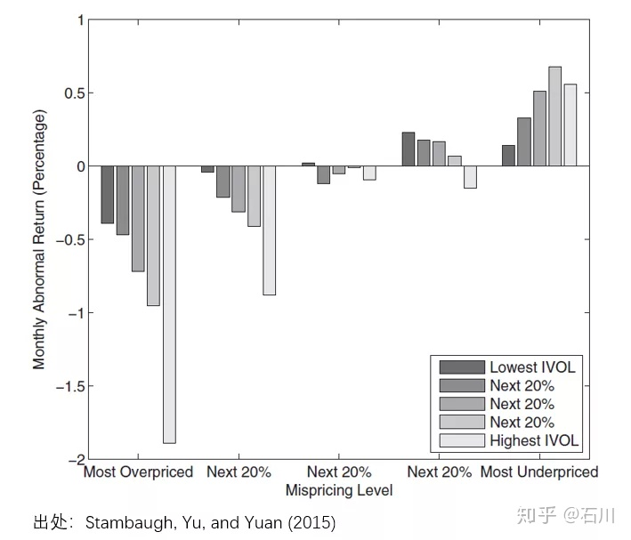

# Volatility

## Idiosyncratic Volatility

- [Stambaugh, Robert F., Jianfeng Yu, and Yu Yuan. "Arbitrage asymmetry and the idiosyncratic volatility puzzle." *The Journal of Finance* 70, no. 5 (2015): 1903-1948.](https://onlinelibrary.wiley.com/doi/full/10.1111/jofi.12286)
- [异质波动率之谜](https://zhuanlan.zhihu.com/p/80443596)

### 低异质波动率现象

在（most）overpriced 组中（下图左侧），异质波动率和收益率（以经 Fama and French 1993 三因子调整后的 α 表示）呈现负相关；在（most）underpriced 组中（下图右侧），异质波动率和收益率呈现正相关。套利不对称性导致市场对 overpriced 股票套利不充分，因此 overpriced 组的负相关强于 underpriced 组的正相关；从截面上来看，异质波动率和收益率呈现负相关，即低异质波动率异象。

异质波动率之谜的两种解释：

- **套利风险：**套利活动常常因为各种原因被阻止；关于套利风险的来源，最常见的便是噪声交易者的行为。套利交易者在价格高估时会卖空股票，但此时噪声交易者可能继续买入，进一步推高价格，甚至最终迫使套利交易者因追加保证金的压力等原因而止损。
- **套利不对称性：**投资者愿意积极买入 underpriced 股票，却对于卖空 overpriced 股票犹豫不决。

### 实证研究

Stambaugh, Yu, and Yuan (2015) 利用 11 个 Fama and French (1993) 三因子模型（下称 FF3）无法解释的经典异象构建了一个综合错误定价指标（mispricing measure）。这 11 个异象包括：

- Failure probability
- Ohlson’s O-score
- Net stock issues
- Composite equity issues
- Total accruals
- Net operating assets
- Momentum
- Gross profit to assets
- Asset growth
- Return on assets
- Investment to assets

假设对于某个异象，按其背后的逻辑排序后，多头组合能获得正的超额收益、空头组合能获得负的超额收益；这意味着越是多头靠前的股票越有可能是 underpriced、越是空头靠前的股票也有可能是 overpriced。具体实施中，Stambaugh, Yu, and Yuan (2015) 使用每个异象对应的指标依次为股票排序：从每个指标的逻辑出发，越是能在未来获得正超额收益的股票排名分越低、越是能在未来获得负超额收益的股票排名分越高。使用全部 11 个异象指标对股票排序后，每支股票就有 11 个分数，把它们取平均就得到综合得分 —— 综合得分越高，未来预期超额收益越低，因此该股票越是 overpriced。

## Expected return, volume, and mispricing

- [Han, Yufeng, Dashan Huang, Dayong Huang and Guofu Zhou, 2022, Expected return, volume, and mispricing, Journal of Financial Economics 143(3), 1295-1315.](https://www.sciencedirect.com/science/article/pii/S0304405X21001963)
- [Atmaz, Adem, and Suleyman Basak. "Belief dispersion in the stock market." *The Journal of Finance* 73, no. 3 (2018): 1225-1279.](https://onlinelibrary.wiley.com/doi/full/10.1111/jofi.12618)

- [预期收益、交易量和错误定价](https://zhuanlan.zhihu.com/p/526639807)

- 结论：预期收益与低估股票的交易量正相关，与高估股票的交易量负相关。因此，交易量放大了错误定价。交易量会影响股票收益，因其与投资者分歧、波动性、流动性、投资者注意力、私人信息等都相关。

- 用 [Stambaugh et al. (2015)](./IdioVol.html) 的错误定价指标(MISP)和1965年7月-2019年12月的交易量数据，进行双重分组，构建5*5投资组合。研究发现，在低估股票中，FF五因子月度alpha随交易量单调递增。而在高估股票中，FF五因子的月度alpha随交易量单调递减。并且低减高(underpriced-minus- overpriced, UMO)投资组合的FF五因子月度alpha在低交易量股票中为0.26%，在高交易量股票中为1.18%，两者差值称为交易量的放大效应，相当于每月0.93%(t值为4.24)。这些结果表明，错误定价影响交易量与收益率之间的关系，并且这种影响集中在高交易量的股票组合中。

- 交易量不同于现有对错误定价有放大效应的其他变量。控制特质波动率(IVOL)、规模、非流动性、机构所有权、偏度和相对浮盈(capital gain overhang)后，交易量的放大效应仍然显著。

- **对于以上现象的解释**：

  - 投资者分歧
    - A trade, in general, is driven by one of the three motives: liquidity needs, private information, and disagreement due to speculation/overconfidence.
    - Trading volume is positively associated with two **economically clean disagreement measures**, analysts’ return forecast dispersion and earnings forecast dispersion.
    - Measure return (earnings) forecast dispersion as the cross-sectional standard deviation of analysts’ return (earnings) forecasts.
    - **Trading volume is a reasonable disagreement measure**, and lends direct support to [Atmaz and Basak (2018)](https://onlinelibrary.wiley.com/doi/full/10.1111/jofi.12618) that **investor disagreement has an amplification effect on investor expectation bias.**

  - 投资者预期偏差
    - Expectation bias in the cross section [Atmaz and Basak (2018)](https://onlinelibrary.wiley.com/doi/full/10.1111/jofi.12618): defined as realized earnings minus the median of analyst forecasts divided by stock price
    - Among the underpriced stocks that are more likely to have experienced negative news, the expectation biases are more likely to be dominated by pessimistic investors. As a result, the ex post analyst forecast errors are expected to be positive, and the higher the trading volume/investor disagreement, the more positive the forecast errors (i.e., the more negative the expectation biases). Similarly, among the overpriced stocks, we expect that the higher the trading volume, the more negative the forecast errors (i.e., the more positive the expectation biases).
    - Expectation bias in time series [Atmaz and Basak (2018)](https://onlinelibrary.wiley.com/doi/full/10.1111/jofi.12618): overpricing is concentrated in high sentiment periods.